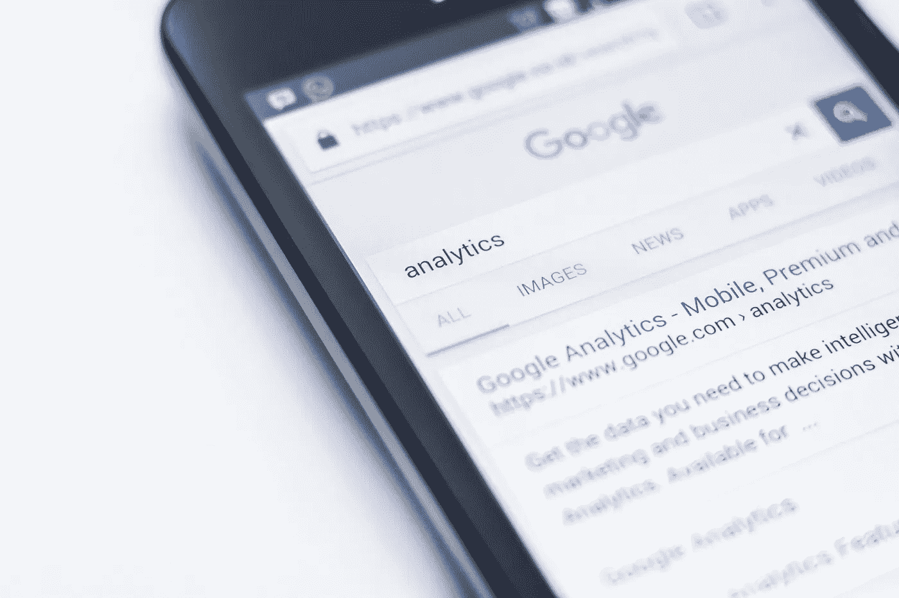

# 在 BigQuery 中使用 Google 趋势

> 原文：<https://medium.com/codex/new-in-analyzing-google-trends-within-bigquery-da17e6b411bd?source=collection_archive---------4----------------------->

## 新功能将如何增强企业决策能力

图片由 [Edho Pratama](https://unsplash.com/@edhoradic?utm_source=unsplash&utm_medium=referral&utm_content=creditCopyText) 在 [Unsplash](https://unsplash.com/s/photos/google-trends?utm_source=unsplash&utm_medium=referral&utm_content=creditCopyText) 上拍摄

有了谷歌趋势，你可以在国际和地区范围内发现营销、销售和其他领域的有趣趋势，并参与和利用它们。但是独立的影响者也可以使用这些数据。现在，BigQuery 已经将这些数据作为…