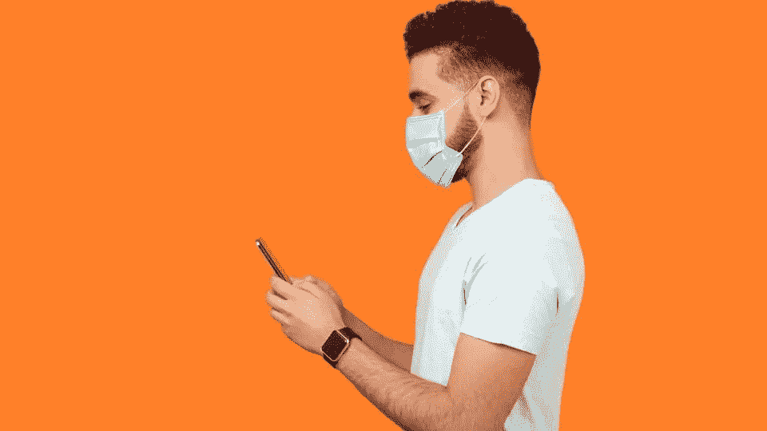

# 新 iPhone 更新——以下是新内容

> 原文：<https://medium.com/codex/new-iphone-update-heres-what-s-new-b5b1b44dc257?source=collection_archive---------4----------------------->

## 大量新的隐私变化，AirTag 支持，以及如何戴着面具解锁 iPhone。

格蒂

苹果最新的 iPhone 软件版本 iOS 14 是在 2020 年 6 月在苹果公园举行的全球开发者大会上正式宣布的，并在 YouTube 和苹果网站上直播。这是苹果在冠状病毒下的第一次活动…