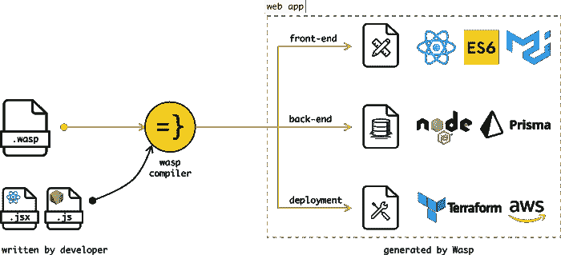
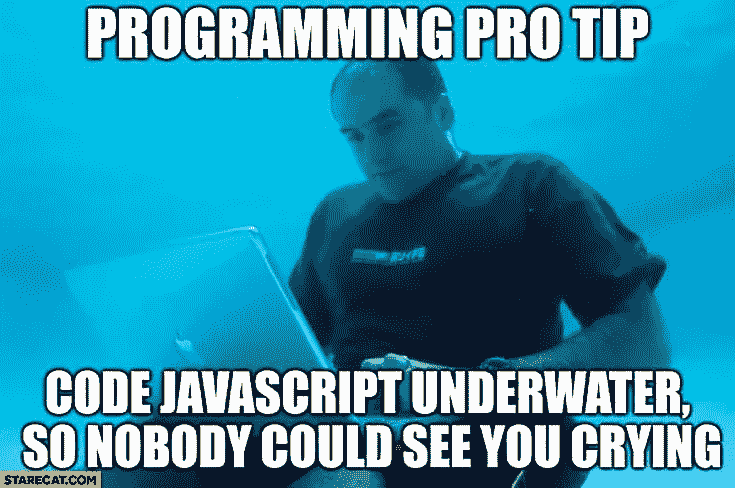
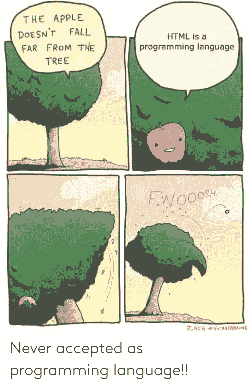
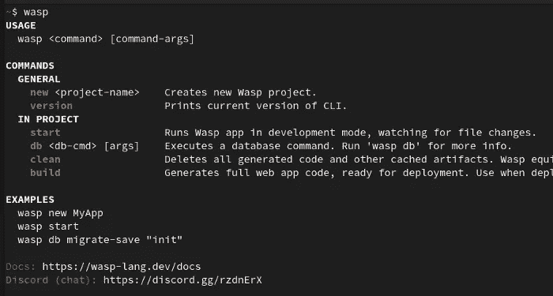

# 用一个配置文件创建全栈应用的新语言——Wasp

> 原文：<https://medium.com/codex/new-language-for-creating-full-stack-apps-with-a-single-config-file-wasp-c65748ed1d6b?source=collection_archive---------4----------------------->



Wasp 是一种新的编程语言，用于开发没有样板文件的全栈 web 应用。它是一种简单的声明性语言，使得开发 web 应用程序变得极其容易。同时仍然允许您使用 React、Node.js 和 Prisma 等最新技术。

我们将与您分享为什么我们相信 Wasp 对 web 开发来说是一件大事，它是如何工作的，我们现在在哪里，以及未来的计划是什么！

# 我们试图解决的是什么？

如果你知道如何使用 React，可以用 HTML/CSS 制作一个 UI，熟悉在后端编写业务逻辑(例如在 Node 中)。但是，当您想要构建一个实际的 web 应用程序并部署它供其他人使用时，您会淹没在所有的细节和额外的工作中—响应的 UI、适当的错误处理、安全性、构建、部署、身份验证、管理客户端上的服务器状态、管理数据库、不同的环境。诸如此类。


六年前，Jose Aguinaga 在他的博客文章[“2016 年学习 JavaScript 的感觉如何”](https://hackernoon.com/how-it-feels-to-learn-javascript-in-2016-d3a717dd577f)中用一种有趣的方式描述了这一点:web 应用开发意想不到的复杂性。

我们正在开发 Wasp，因为尽管我们都是经验丰富的开发人员，并且使用各种技术开发过多个复杂的 web 应用程序(JQuery-> Backbone-> Angular-> React，own scripts/makefile-> Grunt-> Gulp-> web pack，PHP -> Java -> Node.js)。我们仍然觉得构建 web 应用程序比它应该的要难，因为在这个过程中涉及到许多样板文件和重复的工作。

我们的主要见解是，虽然技术不断快速发展，但应用的核心需求大多保持不变(身份验证、路由、数据模型 CRUD、ACL 等)。



这就是为什么大约两年前我们开始考虑将 web 应用规范(它应该做什么)从它的实现(它应该如何做)中分离出来。

这让我们想到了将常见的 web 应用功能和概念提取到一种特殊的规范语言(Wasp)中，而实现细节仍然通过现代堆栈(现在是 React、Node.js、Prisma)来描述。

我们对 Wasp 的愿景是创建一种强大而简单的语言，在这种语言中，您可以尽可能人性化地描述您的 web 应用程序。我们想让上面图片中的冰山顶部尽可能的令人愉快，同时让底部变得更小。

在这种语言中，只需几个词，您就可以指定页面及其路由，指定您想要的身份验证类型，定义基本实体/数据模型，描述基本数据流，选择您想要部署的位置，在 React/Node 中实现特定的细节，并让 Wasp 负责连接、构建和部署所有这些内容。

描述部分简单全栈 web 应用的 wasp 代码示例:

```
app todoApp {
  title: "ToDo App" /* visible in tab */
}route "/" -> page Main
page Main {
  component: import Main from "[@ext/Main](http://twitter.com/ext/Main).js"  /* Import your React code. */
}auth { /* full-stack auth out-of-the-box */
  userEntity: User,
  methods: [ EmailAndPassword ],
}entity User {=psl
  id          Int     [@id](http://twitter.com/id) [@default](http://twitter.com/default)(autoincrement())
  email       String  [@unique](http://twitter.com/unique)
  password    String
psl=}
```

查看[此处](https://github.com/wasp-lang/wasp/blob/main/examples/tutorials/TodoApp/main.wasp)的完整示例。

# 框架不是已经解决这个问题了吗？为什么需要 DSL？

框架(比如 Ruby on Rails 或 Meteor)对我们来说是一个很大的启发。然而，我们想更进一步——通过设计一种专门用于 web 应用领域的语言(一种 [DSL](https://en.wikipedia.org/wiki/Domain-specific_language) ),我们可以摆脱大量的样板文件，提供更干净&更简单的开发者体验。

另一方面，我们并不试图用 Wasp 取代一切，也不认为这有意义——恰恰相反，Wasp 充当 React 和 Node.js 代码之间的“粘合剂”,使您从繁重的工作中解脱出来，同时允许您灵活地编写自己的代码。大部分代码仍然是用 React 和 Node.js 编写的，Wasp 是整个应用程序的主干。



DSL 的另一个好处是，它允许 Wasp 在构建期间理解 web 应用程序的需求，并在生成最终代码之前进行推理，这是我们特别兴奋的地方。

例如，当生成要部署到生产中的代码时，它可以根据对 web 应用程序的理解选择最合适的架构，并将其部署到无服务器或其他类型的架构(甚至是组合)。另一个例子是在 Wasp 中定义一次数据模型逻辑，然后在栈的所有部分重用它。

DSL 开启了优化、静态分析、可扩展性和无与伦比的人体工程学的潜力。

# Wasp 是如何工作的？

Wasp 编译器编译。wasp/React/Node.js 源代码转换成 React/Node.js 目标代码。

目前，Wasp 只支持 Javascript，但我们计划很快添加 Typescript。
技术说明:Wasp 编译器是用 Haskell 实现的。

虽然目前只支持 React 和 Node.js，但我们计划在未来支持多种其他技术。

生成的代码是人类可读的，并且可以很容易地被检查，甚至在 Wasp 变得过于受限时被抛弃。如果没有弹出，您就不需要查看生成的代码——它是由 Wasp 在后台生成的。

Wasp 是通过`wasp` CLI 使用的——要在开发中运行 Wasp 项目，您需要做的就是运行`wasp start`。



# Wasp 现在在哪里，要去哪里？

我们的大愿景是将尽可能多的 web 应用领域知识移植到 Wasp 语言中，赋予 Wasp 更多的能力和灵活性。

最终，由于 Wasp 对 web 应用程序的需求有如此深刻的理解，我们可以在它的基础上生成一个可视化编辑器——允许非开发人员与开发人员一起参与开发。

此外，Wasp 不会局限于特定的技术，而是支持多种技术(React/Angular/…、Node/Go/…**。

Wasp 目前处于 Alpha 阶段，一些功能仍然粗糙或缺失，有些事情我们还没有解决，有些事情可能会随着我们的进展而改变，但您可以尝试一下，并构建和部署 web 应用程序！

# Wasp 目前支持什么:

*   ✅全栈认证(电子邮件和密码)
*   ✅页面和路由
*   ✅模糊了客户机和服务器之间的界限——定义你的服务器动作和查询，并在你的客户机代码(RPC)中直接调用它们！
*   服务器操作和查询的✅智能缓存(自动缓存失效)
*   用 Prisma.io 定义✅实体(数据模型)
*   前端的✅ ACL
*   ✅导入 NPM 依赖项

# 即将到来的是:

*   ⏳后端的 ACL
*   ⏳一键式部署
*   ⏳更多认证方法(谷歌、Linkedin、…*)
*   ⏳实体与其他功能的紧密集成
*   ⏳主题和布局
*   ⏳支持显式定义的服务器 API
*   ⏳内联 JS——混合 JS 代码和 Wasp 代码的能力！
*   ⏳类型脚本支持
*   ⏳服务器端渲染
*   ⏳可视化编辑器
*   ⏳后端对不同语言的支持
*   ⏳更丰富的 wasp 语言和更好的工具

您可以在[https://github.com/wasp-lang/wasp](https://github.com/wasp-lang/wasp)查看我们的回购，并在[https://wasp-lang.dev/docs](https://wasp-lang.dev/docs)->尝试一下。我们一直在寻找关于如何塑造 Wasp 的反馈和建议！


我们在 [Discord](https://discord.com/invite/rzdnErX) 上也有一个社区，我们在那里谈论与 Wasp 相关的事情——加入我们，看看我们在做什么，分享你的观点，或者在你的 Wasp 项目上获得帮助。

[**我们在 Alpha(试用)！**](https://bit.ly/3Mo0Gu6) → [**加入我们的社区**](https://discord.gg/rzdnErX) → [**与我们一起工作**](https://wasp-lang.notion.site/Founding-Engineer-at-Wasp-402274568afa4d7eb7f428f8fa2c0816)

关注我们，订阅我们的更新，见证我们将如何努力改变现代 web 应用程序开发的面貌！