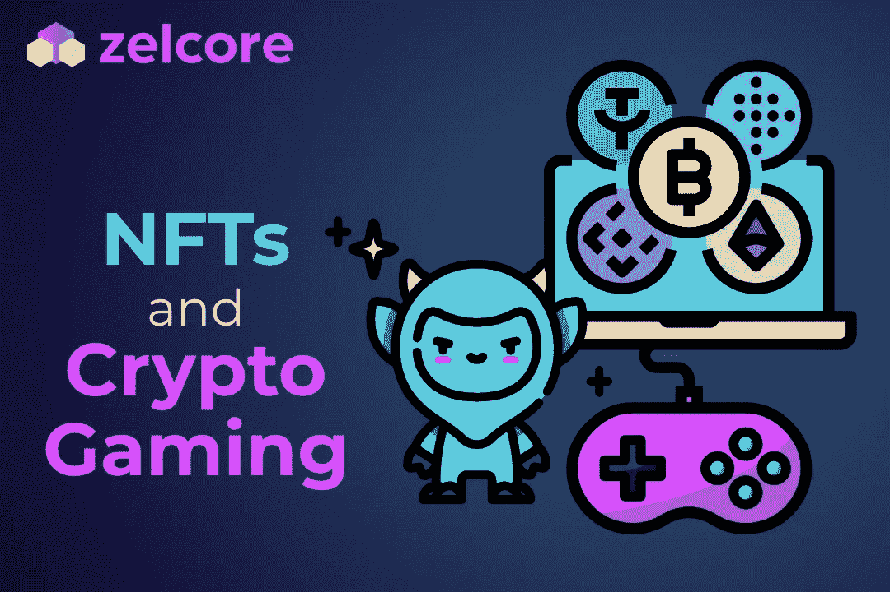

# NFTs 和加密游戏

> 原文：<https://medium.com/codex/nfts-and-crypto-gaming-df1296dc1e34?source=collection_archive---------34----------------------->

在过去的几年里，不可替代令牌(NFT)的流行程度激增。这个创新的加密令牌类使用户能够创建、交易、购买、销售和拥有真正独一无二的可信令牌。

但是真正吸引密码爱好者和渴望交易者的是游戏领域中 NFT 的出现。游戏行业很快认识到了 NFT 的潜力，以及它们可以用来创建完全个性化的游戏体验的方式，在这种体验中，每个玩家都可以创建自己独特的现实，完全独立于其他玩家。

# NFT 博彩热

NFT 游戏公司依靠区块链技术在游戏中实现加密令牌组学。这些游戏不使用传统的集中式封闭网络。相反，NFT 博彩基于区块链网络，其中大多数都有自己的游戏内加密货币，伴随着非功能性交易。

本地可替换代币用于支付这些游戏世界中的各种服务、设备、英雄和其他商品，通常称为元游戏。硬币通常是通过完成不同的任务、使命和游戏关卡来获得的，而用游戏内硬币购买的商品都是 NFT，这为密码游戏增加了一个重要的特殊性。一个游戏中的许多 NFT 可能看起来相似，但总有一个转折使它们每个都完全真实，最重要的是，你总是可以通过在区块链上验证它并检查它的确切地址来证明特定的 NFT 确实是你的。

# CryptoKitties 和 Axie Infinity

CryptoKitties 是市场上 NFT 游戏的第一个主要例子。该项目于 2017 年在区块链以太坊(ETH)启动，实际上打开了 NFT 奥运会的大门。这款游戏实际上没有像大多数最新项目那样的游戏界面，相反，CryptoKitties 专注于繁殖、交易、购买和出售特殊的动画小猫，这些小猫根据它们在社区中的稀有程度和价值具有数千种不同的特征。

Axie Infinity (AXS)在 2018 年推出仅一年后，由于流畅的用户界面和令人上瘾的游戏体验，用户可以创建名为 Axie 的 NFT 生物团队，在不同的景观中相互战斗，因此人气飙升。这款游戏从玩到赚的特点让它非常受欢迎，因为用户可以像 CryptoKitties 一样通过交易 Axies 赚取高额现金。

# 分散土地和沙盒

分散之地(MANA)和沙盒(SAND)是 NFT 游戏的两个下一级类型，它们真正说明了由于区块链技术，加密游戏可以走多远。这两个游戏都是非常受欢迎的元宇宙游戏项目，设置在巨大的虚拟世界中，用户通过他们定制设计的化身参与其中。用户有充分的自由来定制他们的头像，购买，出售，甚至创建特定的设备和游戏中的对象，可以在市场上作为真实的 NFT 进行交易。

法力和沙子代币用于促进游戏内的交易，也可以在游戏外作为加密货币用于市场交易。用户可以在这些游戏中做任何事情，从社交，聚会，在元宇宙商店购物，购买土地，创建自己的虚拟房地产，以及解决社区其他人设计的定制任务。

# 一号玩家准备好了

NFTs 和区块链技术引入了一个全新的、创新的游戏维度，将玩家放在了首要位置，因为玩家可以完全定制他们的游戏体验，创建内容，从交易 NFTs 中赚钱，甚至获得在 crypto 中支付报酬的元宇宙工作。

不要等着加入游戏。Zelcore 使用户能够轻松访问 NFT 游戏，并将 Web3 元宇宙平台融入他们的日常生活。点击“开始”,加入快速发展的 NFT 游戏玩家和创新者社区。