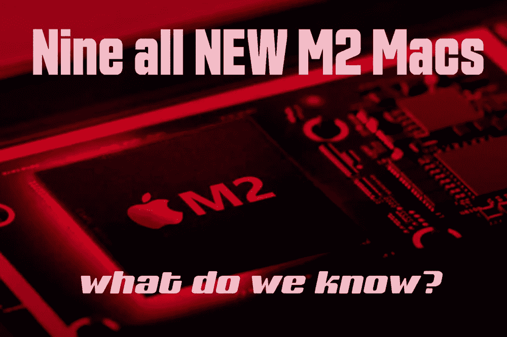

# 九台新的 M2 苹果电脑

> 原文：<https://medium.com/codex/nine-new-m2-macs-1415cfa37ac5?source=collection_archive---------14----------------------->

## 和四种不同版本的 M2 芯片。是时候让我们看看了！

M2 苹果机准备好了，马上就来

上周，马克·古尔曼彭博社报道称，在苹果总部内部，大量的苹果电脑正在接受测试，可能是为运行期待已久的 M2 芯片的 WWDC 做准备。看起来，其中两台 MAC 已经完全开发完成，并准备好立即向 T2 发货。其中之一对苹果来说至关重要，因为这是他们在 T4 最大的 Mac 或笔记本电脑销售市场。

全新的 M2 芯片

## M2 薯片

古尔曼的文章基于第三方应用开发者的信息，是可信的。苹果正在用这些第三方应用测试 M2 芯片，这些应用会在运行它们的 MAC 电脑上记录日志。传递给古尔曼的信息也得到了苹果内部员工的证实。我只是把它放在上下文中，因为我认为这意味着我们拥有的相当全面的信息是可信的。

目前，有四种不同版本的 M2 芯片正在接受测试。在 **MacBook Air** 中，有一颗代号为 *J413* 的芯片。这款 Mac 将拥有 8 个 CPU 核心和 10 个图形核心(*目前的 Air 只有 8 个图形核心*)。接下来是一款采用 M2 芯片的**Mac Mini**(*J473*)。这款手机采用了与 MacBook Air 相同的芯片，*但*也将推出 **M2 Pro** 版本( *J4740* )。另一台与 MacBook Air 规格相同的 Mac 是 *J493* 芯片，这是该项目的代号，该项目将*最终*成为入门级 **MacBook Pro** 。

14 英寸 **MacBook Pro** 将有两种选择，即第一次看到的 **M2 Pro** 和 **M2 Max** 芯片。Max 芯片将有 12 个 CPU 核心和 38 个图形核心。这代表了从现有的 10 个 CPU 核心和 32 个图形核心的显著提升。它还将配备高达 64 GB 的统一内存。当然，还会有一款 **16 英寸 MacBook Pro** 上市，代号为 *J416* 。规格将按照 14 英寸。

最后，在最近的 **Mac 工作室**中首次出现的芯片的继任者，Ultra，正在测试中。J180 将成为新的 **Mac Pro** 。简而言之，我认为可以有把握地假设，在这次泄露事件之后，从现在开始发布的任何 MAC 电脑都会内置 M2 芯片。

负十六播客

性能对于 M2 系列至关重要

## 表演

由于更快的时钟速度，所有 M2 芯片都将更快。这意味着每个芯片的单核和多核性能都将显著提高。但是，当我们仔细观察 M2 Pro 芯片时，我们可以看到 CPU 和 GPU 的实际内核数量都有很大的增长。结合我刚才提到的时钟速度的提高，我认为这种高端 M2 芯片将会快得惊人。至于 M2 Max & Ultra，他们将会有更多的内核，Ultra 可能会配备 24 核 CPU 和 76 核 GPU。*我有一个在错误的时间购买的诀窍！我正在等待我的 M1 Max 16 英寸 MacBook Pro 的交付。当我最终收到它时，它会是一个缓慢的芯片，还是现在是一个收益递减的情况？我看到的每份报告都告诉我，我做出了正确的选择，但请为我祈祷。技术总是在同步发展。我想，总会有下一个最好的迭代。*

就在几周前，我们不要忘记，所有人都在赞美 Mac Studio 的速度和才华。然而现在，这突然成了昨日的新闻。男孩，这是一个残酷的世界！古尔曼告诉我们，尽管如此，上述所有测试中的 MAC 电脑中，只有 ***两款*** 准备发货。

新款彩色 M2 MacBook Air

## 我们首先应该期待什么？

最重要的 Mac 一定是全新外观的 **MacBook Air** 。现在看来，它很可能将于 6 月在 WWDC 首次亮相。然而，新的 Mac Pro 最让我兴奋。为了满足 Pro 市场，苹果将不得不使 Pro 模块化和可扩展。怎么做的，没有人知道，至于这个设计，你我都猜得出来。我想它仍然会是某种类型和尺寸的塔，但鉴于我们目前知道的苹果硅的限制，他们最终如何使这台机器可升级，将是有趣的学习。我热切希望这能在今年晚些时候的 WWDC 发布会上展示。

新款 Mac Pro 将采用什么外形？

回到他们的畅销书, **MacBook Air** ,我们似乎对这款 Mac 了解更多。这个最受欢迎的产品的最后一次更新实际上只归功于视网膜显示屏和最终的 M1 芯片。然而，它保留了历史上的泪珠形、楔形设计，但将它缠绕到 2022 年，现在我们可以期待，一个方形、平面设计，也充满了色彩。想象一下 24 英寸的 iMac，但是是笔记本电脑的形式。这将是迄今为止最薄的 MacBook Air，仅重 12 磅。 *IO* 将是两个 USB-C 口和 MagSafe 充电。总的来说，这将是我们所见过的最大的一次空中大修。

它将会更薄，有白色的边框和键盘，还是和 iMac 一样。他们会在白色机身的 Mac 上加入凹口设计吗？我想我们很快就会知道了。屏幕将会更大，从目前的 13.3 英寸增加到 13.6 英寸。他们的目标不是单纯地制造更大的屏幕，而是尽可能大的显示屏，同时保留当前 MacBook Air 的足迹。遗憾的是，它不会配备迷你 LED 面板，*但*它的另一面是，它将把成本降低到 1000 英镑左右。

 [## iPhone 15 泄露，手表&推特

### 苹果视图综述

medium.com](/codex/iphone-15-leaks-watches-twitter-883352275393) 

新款 M2 MacBook Air 色彩丰富

## 有效性

看起来苹果一直很忙，而且比计划提前了很多。我一直认为空气将在秋季看到，但鉴于我们从古尔曼那里了解到的情况，这似乎很有可能将在 WWDC 展出，并在年底前上市。成为畅销书，首先推出新的 M2，从各方面来看都是有道理的。因此，在 WWDC 发布的另一台机器看起来可能是新的**M2**T4Mac Mini，并立即上市，而 **Mac Pro** 只是为了开发者的目的而展示。

新款 M2 Mac Mini 即将上市吗？

## 今年会很忙

无论六月发生什么，今年都将令人疯狂兴奋。有如此多的硬件等待着我们，这可能会成为这家总部位于库比蒂诺的巨头迄今为止最繁忙的一年。

*但是，你最期待的是什么？你今年想换苹果电脑吗？你还在等什么？*

## 在你走之前

我只是高端博客网站 Medium 的众多作者之一。这是如此好的价值，你可以加入这里[https://medium.com/membership](https://medium.com/membership)

[加入我的幕后邮件列表](https://www.talkingtechandaudio.com)

最初发表于 2022 年 4 月 18 日 https://www.talkingtechandaudio.com/blog。