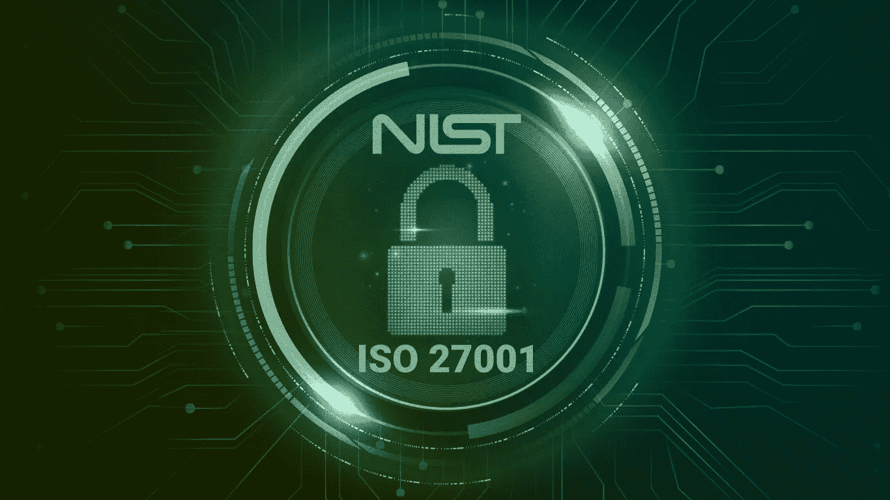

# NIST 网络安全框架:ISO 27001 的工作原理和差异

> 原文：<https://medium.com/codex/nist-cybersecurity-framework-what-works-and-differences-with-iso-27001-a1411483a9a7?source=collection_archive---------10----------------------->

在全球社会中，数字化已经与商业成功联系在一起。但是数字化的代价和危险是什么？

通过将劳动密集型的手工程序转换为数字程序，企业可以保持竞争力并找到新的发展前景。因此，大多数企业正在通过实施云计算、大数据和物联网(IoT)等尖端 ICT 解决方案来加快数字化转型。技术的巨大发展鼓励组织对其流程进行大规模改进，从手工流程转变为全自动流程。在取得巨大进步的地方，商业环境的潜在风险也加倍了。

根据 2022 年全球威胁情报报告，新冠肺炎和数字化转型是威胁格局发生重大转变的主要原因。许多组织在技术、电信、运输和分销部门面临地缘政治紧张局势和网络攻击。

考虑到实施成熟网络安全计划的成本，组织如何在实施网络安全措施的费用和随着威胁面扩大而增加的网络攻击危险之间达成妥协？

**越快越好！**

事实证明，早期预防胜于后期保护。企业在开发创新和工作环境时，应考虑网络安全。产品生命周期中的早期安全考虑比后期修复更具成本效益。安全专业人员应该在产品的整个生命周期中执行威胁和风险评估，以识别和降低潜在风险。

**什么是 NIST？**

组织可以开始利用网络安全计划，并在 NIST 网络安全框架的帮助下改进其流程。NIST 是一套规则和最佳实践，旨在帮助企业发展和增强其网络安全态势。该框架提供了一套标准和建议，帮助公司更好地识别和阻止网络攻击。它还提供了关于如何响应、阻止网络灾难以及从网络灾难中恢复的说明。

NIST 被描述为适用于所有关键基础设施部门的网络安全计划、目标和有用资源的集合。NIST 的核心包括行业标准、法规和最佳实践，能够实现从执行层面到高层实施和操作的网络安全活动和任务目标的跨组织沟通。NIST 网络安全框架类别或基本功能有助于建立坚实的商业基础，并确定网络安全的法律和监管要求。

在成功管理包括数据、系统和资产在内的多个层面的新兴网络安全威胁之前，组织必须首先对其当前环境有一个完整的了解。NIST 网络安全框架可用于确定组织中的风险。NIST 网络安全提供 5(五)个主要领域，以指导组织开始建立全面的网络安全流程，并评估其组织工作流程的当前状况。

根据 NIST 的说法，建立强大的网络安全需要 5 个主要领域:

**1。识别**

该领域有助于组织全面了解网络安全风险，包括访问敏感数据的员工的角色和职责，以及防范攻击和在事件发生时限制损失所需的措施。

**2。保护**

该领域定义了必要的安全措施，以确保网络安全战略和实施的质量。保护领域侧重于应对网络威胁影响的几个关键保护类别，包括访问控制、培训和意识、数据安全、信息保护程序和流程以及保护技术。

**3。检测**

该领域定义了需要制定和应用特定活动的早期检测功能的基本部分。该领域主要关注进行持续监控和威胁搜寻，以识别任何异常活动或异常情况，以便组织可以立即采取必须采取的措施。

**4。回应**

该域定义了在检测到威胁时需要采取的关键程序。一旦发现威胁或异常情况，必须建立特定的反应来解决它们。通过这种方式，可以在威胁之前和之后评估网络活动，以获得详细的报告，这些报告必须在以后进行。

**5。恢复**

该领域管理修复和保护因违规或攻击而受损或丢失的数据的战略计划。各组织需要确保相应地实施恢复规划程序，以恢复系统并根据现有战略的经验教训进行改进。

这 5 个主要领域的目标是为企业提供战略性网络安全规划，使其像对待金融、运营、工业和其他风险一样认真对待网络安全风险。建立一个强大的网络安全框架是一个持续的过程，各组织需要给予足够的重视，使其可持续发展。

**NIST 网络安全与 ISO 27001 有什么不同？**

在网络安全方面，组织需要成熟的标准来衡量行业最佳实践。《NIST 网络安全框架》和《ISO 27001》经常被用作合规框架，以帮助确定网络安全实施的优先次序、提供指导和改进网络安全实施。

但是，为了实施这些框架，组织需要理解所实施的网络安全的目的，并了解它在组织结构中是如何工作的。此外，实施的网络安全框架应该能够支持组织的主要业务目标和绩效。

NIST 网络安全框架是一个非监管的网络安全框架，专门用于帮助组织开发和管理其网络安全框架，而 ISO 27001 是国际公认的信息安全管理标准(ISMS)方法，支持组织建立全面的信息安全计划。

差异如下所示:

*   1.NIST 网络安全框架包括**五个领域**以定制网络安全控制，ISO 27001 包括**十个条款**以指导组织实施其 ISMS。
*   2.NIST 网络安全框架由实现整体功能的**三个关键组件**(核心、实现层和概要文件)组成，而 ISO 27001 的技术含量**较低**，更侧重于**基于风险的管理**以改进 ISMS。
*   3.NIST 网络安全框架适用于处于开发网络安全框架第一阶段的组织，ISO 27001 适用于寻求认证以规范其 ISMS 实施的成熟组织。
*   4.NIST 网络安全框架**免费提供**且不需要认证，而 ISO 27001 通过第三方审计提供**全球认证**，这可以提高组织的声誉并建立利益相关方的信任。

**NIST CSF 与 ISO 27001:哪一个更适合我的组织？**

这两个框架在增强网络安全框架方面互为补充，然而，实施还依赖于特定的管理、成熟度和组织想要实现的目标。首先，实施 NIST 网络安全框架可以概述组织获得 ISO 27001 认证所需的网络安全措施。

基于 NIST 网络安全框架维护网络安全可能会很困难。不管有多困难，都是值得的。该框架使公司能够建立在坚实的基础上，并在必要时增加基础，以确保符合新出现的要求，因为它是基于结果而不是具体的控制措施。识别、保护、检测、响应和恢复的基本任务有助于企业快速识别、管理和响应网络安全事件。NIST 控制框架将促进技术和业务方面的利益相关方之间的沟通，并实现持续合规。

您还可以在此了解如何整合 NIST CSF 和 ISO 27001 以获得最佳性能！