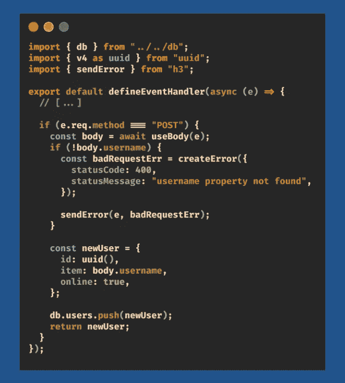

# 使用 Nuxt3 的 Nitro 服务器

> 原文：<https://medium.com/codex/nitro-server-with-nuxt3-ac043052929f?source=collection_archive---------0----------------------->


Nuxt3 硝基

**不**——这不是在 Nuxt3 上克隆 *Discord Nitro* 的教程😜。尽管将来某一天这将是一个伟大的项目🤔。在本文中，我们将在 Nuxt3 上编写一些后端服务器代码。

> 什么？😱但是 Nuxt3 不是前端框架吗？我将如何以及为什么在我的前端写我的后端代码？

要创建一个全栈应用，我们需要一个服务器端代码和一个客户端代码。传统的框架捆绑了它们的代码，每当用户在你的服务器上发出一个`GET '/'`请求时，这个文件就会被发送。我们可以用一个前端细长的烧瓶后端来做这件事。在试图将这两种技术结合起来时可能会出现问题。

> 如果我告诉你我们可以在同一个代码库上做这件事呢？

**是的** — Nuxt3 引入了 **Nitro 服务器**，在这里你可以在你的项目中编写你的服务器端代码并部署它！

# 入门指南

像 Nuxt3 提供的其他特性一样，我们需要在项目的根文件夹中创建一个`server/`目录。其中的任何代码都将由后端的 **Nitro 服务器**呈现。让我们创建 4 个不同的路线，将说明每个概念需要知道硝基的基础知识。

1.`GET '/api/users/’`——这条路线将获取我们已经注册的所有用户。

2.`POST '/api/users/'` —此路由将创建一个用户名为的新用户。

3.`PUT '/api/users/{id}'` —此路线将改变用户的在线状态。

4.`DELETE '/api/users/{id}'` —这条路线会删除用户，这是显而易见的。

# 创建我们的假数据库

这里我们不会处理任何本地或云数据库，所以让我们在`server/`目录`db/`中创建一个文件夹和一个名为`index.ts`的类型脚本文件


服务器/数据库/索引. ts

# 创建我们的服务器路由

基于上面列出的 4 条路线，我们必须创建一个类似的结构。在 Nuxt3 项目中，维护目录结构非常重要。

```
|- server/
|  |- api/
|  |  |- users/
|  |  |  |- [id].ts
|  |  |  |- index.ts
|  |- db/
|  |  |- index.ts
|- app.vue
|- nuxt.config.ts
|- package.json
|- package-lock.json
|- README.md
|- tsconfig.json
```

`db/`路线是为了我们拥有的假数据库。其他文件夹稍微简单明了。使用`server/api/users/[id].ts`时`server/api/users/index.ts`调用任何与`/api/users`关联的路径，其中是路径参数`/api/users/{id}`。

## #1 —获取'/API/用户'

对于第一条路径，我们将代码放在`/api/users/index.ts`文件中，因为它不接受任何路径参数。我们必须默认导出一个名为`defineEventHandler`的函数，它将根据目录结构处理任何传入的路由。我们有一个匿名函数，将事件作为参数传递。此事件参数包含关于传入请求的所有必需细节。


服务器/API/用户/索引. ts

`e.req.method`获取传入的 HTTP 方法的名称，我们可以据此操作，即返回用户。

## #2 —发布'/api/users/'

现在，由于请求的 URL 是相同的，我们将处理相同的`index.ts`文件路径。

**先决条件:**您需要运行以下命令:

`npm i uuid @types/uuid`。



服务器/API/用户/索引. ts

如果对该 URL 的传入请求是 POST 请求，我们可以通过传递事件对象的`await`函数提取主体。代码的其余部分不言自明。username 属性被断言，被推送到我们的模拟数据库，并返回用户对象。**注意**发送错误的代码。

## # 3—PUT“/API/users/{ id }”

这需要一个路径参数，因此会转到`[id].ts`文件。我们可以从创建一个函数开始，该函数将尝试从数据库中找到用户，并返回该对象以及该对象在数组中的索引。如果没有通过 ID 找到用户，我们可以简单地抛出一个 404 HTTP 错误。


服务器/API/用户/[id]。分时（同 timesharing）

这一次，我可以使用一个开关盒而不是两个`if`来编写我的代码。


服务器/API/用户/[id]。分时（同 timesharing）

如果传入的请求是一个 PUT 方法，我将使用`e.context.params`从事件对象中提取 ID。用这个特定的 ID，我用我们上面写的函数从数据库中搜索用户。*返回给我们的用户对象永远不会是* `null` *或者* `undefined` *。*我们改变在线状态的值并返回更新后的用户对象。

## #4 —删除“/api/users/{id}”

在同一个文件中，在`case "DELETE"`下，我们可以编写从模拟数据库中删除用户的逻辑。


服务器/API/用户/[id]。分时（同 timesharing）

基于我们之前所做的，这段代码太简单了。我们找到所需用户的索引，并将其从`db`对象的数组中拼接出来。

我们已经完成了我们的服务器代码！🎉

**如何在前端使用这个？** *简单的* —我们可以在您的前端使用`useFetch('/api/users')`或`$fetch('/api/users')`向这些路由发出服务器请求。

# 结论

将服务器代码和客户机代码放在同一个代码基上可以最大限度地减少将两者连接起来的任何努力，并消除在部署期间 Nuxt3 捆绑服务器时可能出现的任何问题。目录结构提供了一个非常系统的方法，在团队工作中非常容易阅读和理解。

跟着我的 Nuxt3 教程列表，掌握使用 Nuxt3 的基础。谢谢你，我希望你喜欢并学到了一些东西。✌️


[尼尚·安贾尼·贾兰](/@cybercoder.naj?source=post_page-----ac043052929f--------------------------------)

## Nuxt3 教程

[View list](/@cybercoder.naj/list/nuxt3-tutorial-8af9304349ba?source=post_page-----ac043052929f--------------------------------)8 stories