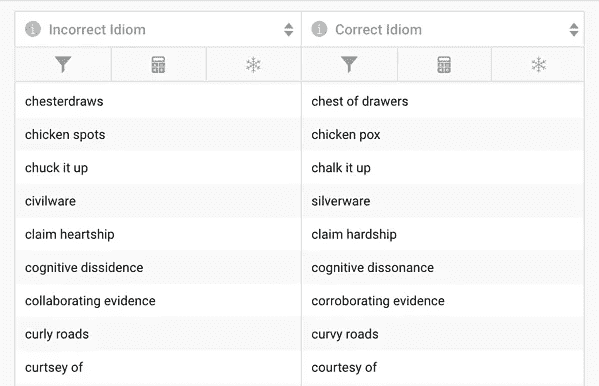
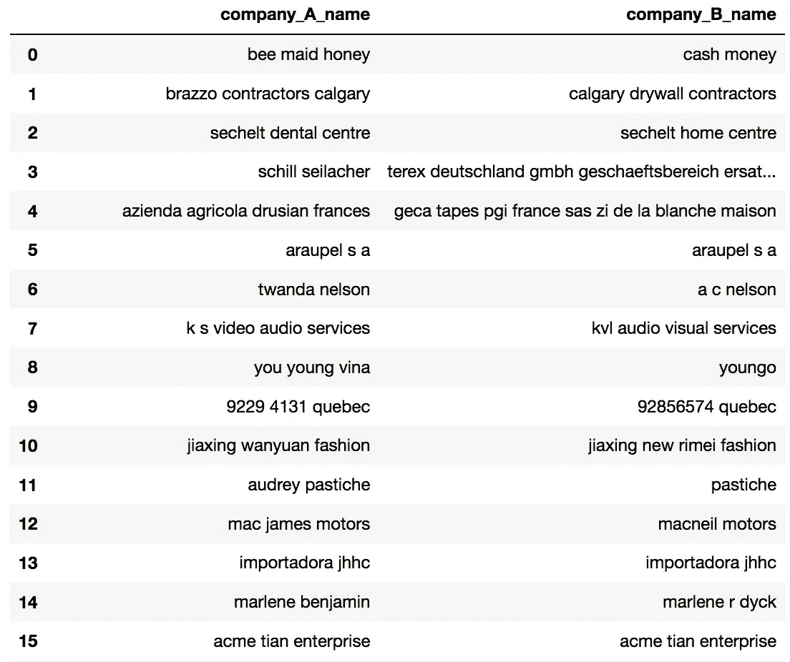
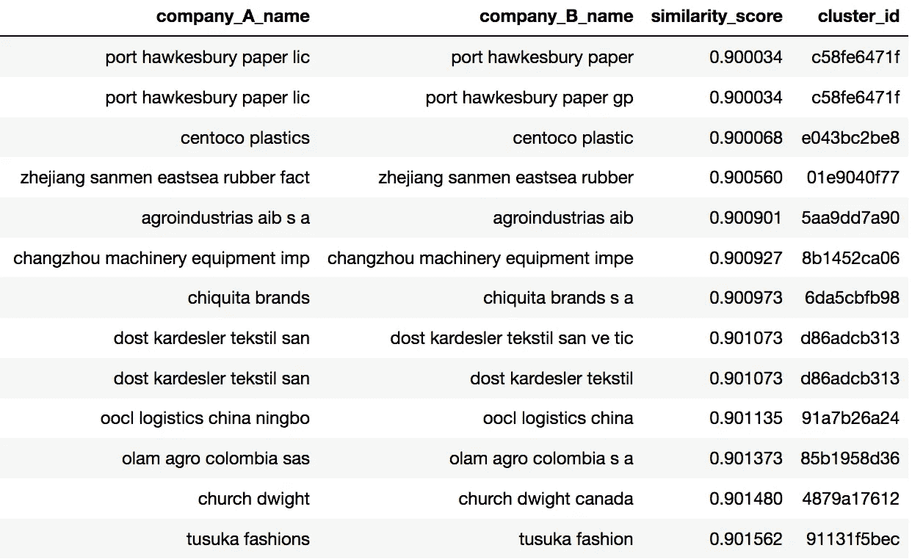

# NLP 和 ML 来中和数据中的人为错误

> 原文：<https://medium.com/codex/nlp-and-ml-to-neutralize-human-error-in-data-d2d4a340ef59?source=collection_archive---------18----------------------->

我最近看了一篇《脸书邮报》，它捕捉到了完美的日落，但标题并不完美，上面写着“当尘埃落下”而不是“当黄昏降临”当我浏览脸书的时候，我经常会读到一些不太对的东西。当一个短语用正确的词代替发音相似但通常没有意义的词时，它被称为 eggcorn。

这个词是语言学家马克·利伯曼在 2003 年听到一个故事后创造的，这个故事是关于一个女人如何错误地将“橡子”称为“鸡蛋”由于这个错误的短语没有特定的词，eggcorn 在转喻传统中被选为“ [mondegreen](https://en.wikipedia.org/wiki/Mondegreen) ”这使得鸡蛋玉米这个术语本身就是鸡蛋玉米！

通过复制单词或短语的原始声音的某种意义，Eggcorns 可以被称为:

*   所有强化目的(所有意图和目的)
*   在你的召唤下(在你的召唤下)
*   这个时代(这个时代)
*   有进取心的人
*   纠结需要两个人(探戈需要两个人)

## 炒鸡蛋(玉米)

最近，我们想调查我们实体解析能力的一个独特用例，发现了一段绝对的火车残骸:

我坚决同意，但请允许我在这里打一会儿双打倡导者。从各方面来看，我认为你错了。在这个时代，虚假的道德是钻石打，真正的美德是天上的祝福。我们经常把我们的虚假道德像一堆圣母像一样放在花瓣凳上，但你们似乎都把非常有价值的东西当成了花岗岩。所以我要求你尽你所能，因为外面是一个狗狗的世界…

这种情况持续了一段时间，疼痛并没有减轻。

## 我们该如何处理这个烂摊子？

我们的目标是找到一种方法来纠正这一段中所有的鸡眼。作为一点背景知识，实体解析(通常称为模糊匹配)是识别和解析单个实体的多次出现以揭示数据中更清晰的信息画面的过程，即使这些实体的记录方式存在差异。

为了匹配段落，我们需要一个数据集来连接。方便的是，我们已经有一个数据集[托管在 Namara](https://app.namara.io/#/data_sets/977e8623-91c9-4b6e-b867-04b0a98a498b) 上，它包含了不正确的习语和鸡眼到它们正确对应物的映射。

现在，我们想要使用我们的实体解析系统和这个习语地图数据集来纠正我们在原始段落中发现的所有问题。因为我们的实体解析是为处理数据集而设计的，所以需要一些额外的代码来处理句子。现在，让我们只关注前三句话。

1.  我坚决同意，但请允许我在这里打一会儿双打倡导者。
2.  从各方面来看，我认为你错了。
3.  在这个时代，虚假的道德是一打钻石，真正的美德是天上的祝福

我数了 5 个鸡眼；一个很好的实验样本。

我们的策略是在每个句子上创建一个滑动窗口，将 4 个单词的组与习语地图中的条目进行比较，以进行纠正。我们在这里使用四个单词的组，因为根据我们的数据集，这是不正确的鸡蛋玉米的最大长度。规范化后，这个滑动窗口如下所示:

*   我很难同意
*   孔很难同意，但
*   勉强同意但允许
*   同意，但请允许我…

对于每个句子中的每个窗口，我们可以运行实体解析来将该片段与不正确习语的数据集进行比较。如果找到匹配，我们可以简单地用正确的习语替换它。让我们来看看前三个句子是如何工作的:

*   我完全同意，但请允许我在这里打一会儿魔鬼代言人。
*   实际上，我认为你错了。
*   在一个虚假道德随处可见的时代，许多真正的美德是因祸得福。

这个管用！

## 解析实体

让我们将我们的 de-eggcorning 脚本应用于整个段落，并查看结果(注意，在规范化步骤中，所有标点都被删除)。

我完全同意，但请允许我在这里打一会儿魔鬼代言人。实际上，我认为你错了。在一个虚假道德随处可见的时代，许多真正的美德是因祸得福。我们经常像一群自命不凡的人一样，把我们错误的道德放在一个基座上，但你们似乎都把一些非常有价值的东西视为理所当然。所以我要求你尽你所能，因为这是一个狗咬狗的世界…

现在你有了它，在大约 50 行代码中使用实体解析修复了一个段落中不正确的短语。你可以在 这里找到整个剧本 [**。**](https://gist.github.com/fantods/5ef6ed5bbf6bf9baff3602f2eae440e7)

## 实体解析的业务案例

这很有趣，但是我们的电话没有响个不停，因为我们可以解决不好的习惯用法。让我们看一个更传统的企业名称解析的例子。

例如，有两个数据库存储格式略有不同的企业名称。两个数据库之间存在重复项，但它们永远不会完全匹配。这两个数据库需要进行重复数据删除，并结合在一起，以开发一个主数据管理系统。在提取和数据清理之后，数据如下所示:

使用我们的工具**、**合并这两个数据集很简单。我们描述了数据集的位置以及我们想要在它们之间链接哪些列。从计算上来说，这是很昂贵的:第一个数据集包含 16，562 个条目，第二个包含 46，209 个条目。由于实体解析的算法以二次方的规模增长，并且我们正在执行 627712 次比较，也就是将近 40 亿次运算！尽管如此，我们的系统仍然能够通过使用分布式计算(使用 Apache [**Spark**](https://spark.apache.org/) )在 17 秒内完成这个任务。结果输出如下所示:

数据有着巨大的价值，但从数据中学习的关键是将数据联系起来。然而，连接数据的任务并不简单，而且非常耗时(尽管上面两个例子看起来很容易)。我们的实体解析功能为数据专业人员提供了一个自动化的解决方案，可以在数据点之间创建链接，从而获得更深入的见解。数据科学家花在准备和处理上的时间越少，他们就可以花更多的时间在实际的数据科学上，这对任何组织都是双赢的。

想了解更多关于[数据丰富](https://www.thinkdataworks.com/products/data-enrichment)？

*最初发表于*[*https://blog.thinkdataworks.com*](https://blog.thinkdataworks.com/using-natural-language-processing-to-neutralize-human-error-in-data)*。*