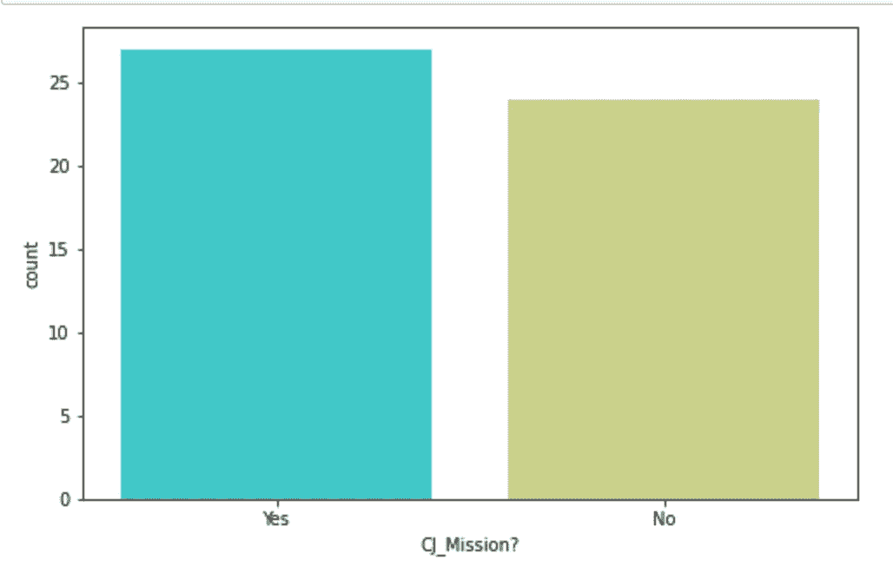
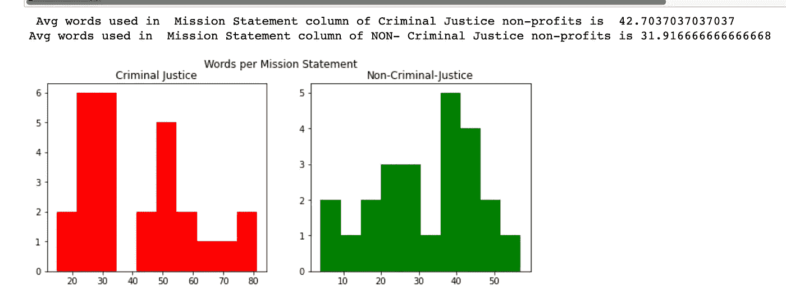
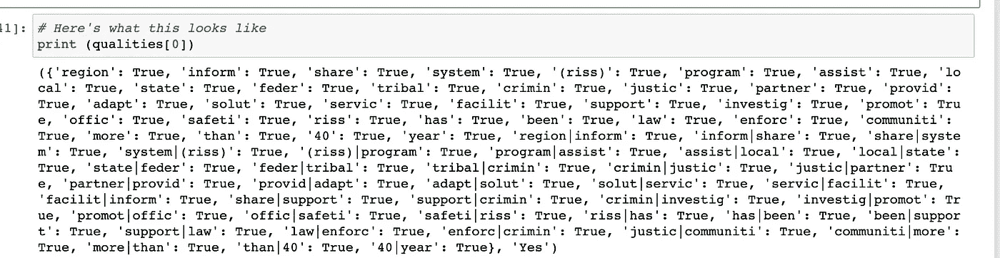
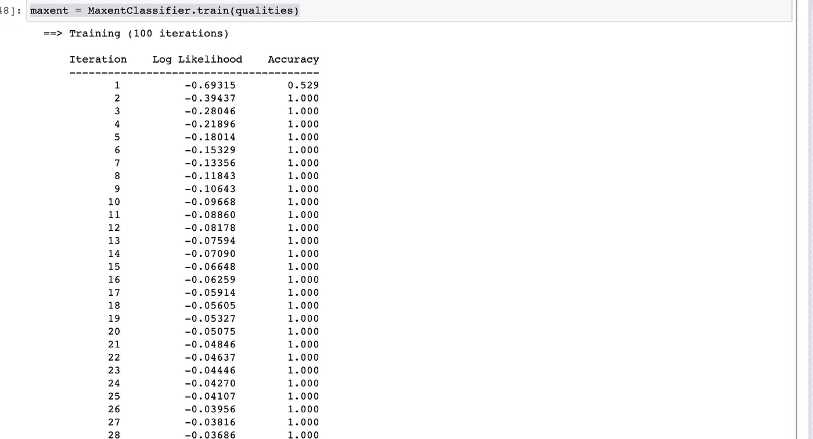
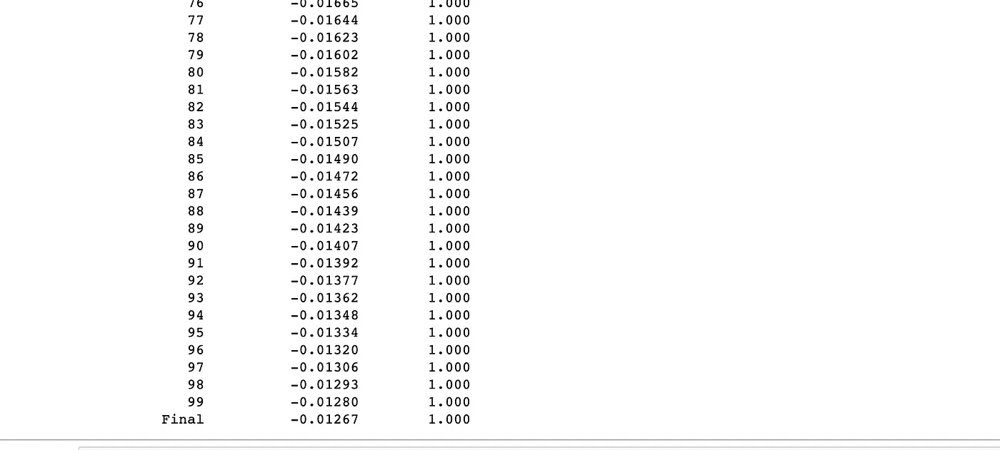
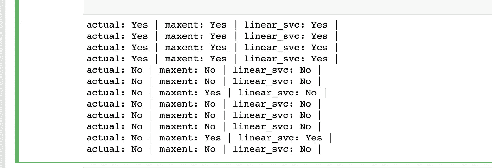
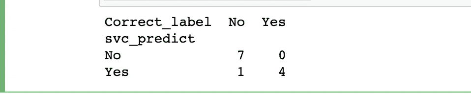
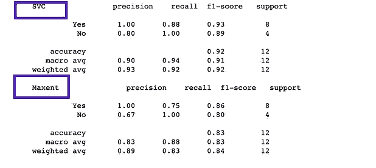
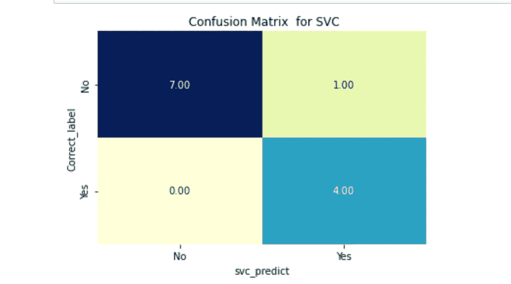

# NLP-初学者分类指南 4 个步骤

> 原文：<https://medium.com/codex/nlp-beginners-guide-to-classification-in-4-steps-18bbf5a24b50?source=collection_archive---------7----------------------->


机器学习和“自然语言处理”(NLP)都可以揭示这些数据集中以前看不见的模式，但也可以自动化某些任务，解放人们去做机器不能做的更高价值、更具创造性的工作。在本文中，我将尝试用简单的语言简洁地解释 NLP，并展示它如何用于帮助非营利组织。

# 数据问——“我们以前见过这样的文字。”:分类

我们来看看让机器学习如此成功的经典而普遍的任务:*分类*。分类采用一组输入特征并产生一个输出分类，通常是二进制的是/否。

我从美国各种非盈利网站上搜集信息(我将在另一篇文章中讨论网络搜集)。我的起点是一个大的 excel 文件，包含了所有美国的非营利组织。问题是

1.  从所有内容中提取电子邮件和电话号码
2.  如果列“CJ_Mission？”正确识别了那些与刑事司法有关的非营利组织。简单！

过滤电子邮件和电话号码→考虑到时间限制，Python 中的这两行代码可以做得很好。

**Github 链接**:这里是 [GitHub](https://github.com/abhinayasridharrajaram/NLP_Simplified-Classfication) 链接，看看数据是什么样子的:

```
 df[‘Phone’] = df[‘Content’].str.extract(r’((?:\(\d{3}\)|\d{3})(?:\s|\s?-\s?)?\d{3}(?:\s|\s?-\s?)?\d{4})’,expand= True)df[‘E-mail’] = df[‘Content’].str.extract(r’([a-zA-Z][a-zA-Z0–9._%+-]+@[a-zA-Z0–9.-]+\.[a-zA-Z]+)’)
```

**问题陈述**:很简单。弄清楚非营利组织是否在刑事司法领域运作。数据中已经有一栏是实习生输入的关于非营利组织是否在刑事司法领域运作的信息(是，否)。要求是快速交叉检查所有这些。

## EDA 上的数据

我将使用实际数据的一个很小的子集来演示工作方式&我还删除了原始报告中多余的数据列。

看这里:



可以看到目标变量“CJ_Mission？”“是”和“不是”的程度几乎相等。很好。

刑事司法非营利组织似乎更罗嗦，因为平均来说它包含更多的单词。见下文。

```
data['word_count'] = data['Mission Statement'].apply(lambda x: len(str(x).split()))
print(' Avg words used in  Mission Statement column of Criminal Justice non-profits is ',data[data['CJ_Mission?']=='Yes']['word_count'].mean()) #Disaster tweets
print('Avg words used in  Mission Statement column of NON- Criminal Justice non-profits is',data[data['CJ_Mission?']=='No']['word_count'].mean())
# PLOTTING WORD-COUNT
fig,(ax1,ax2)=plt.subplots(1,2,figsize=(10,4))
train_words=data[data['CJ_Mission?']== 'Yes']['word_count']
ax1.hist(train_words,color='red')
ax1.set_title('Criminal Justice')
train_words=data[data['CJ_Mission?']== 'No']['word_count']
ax2.hist(train_words,color='green')
ax2.set_title('Non-Criminal-Justice')
fig.suptitle('Words per Mission Statement')
plt.show()
```



# 总体方法:

一种结合两个机器学习分类器的算法。每个分类者都会阅读非营利组织“使命陈述”一栏的简要描述，然后决定它是否与刑事司法有关。

## 关于文本预处理你需要知道的事情

数据预处理是准备原始数据以使其适合机器学习模型的阶段。对于 NLP，这包括文本清理、停用词移除、词干提取和词汇化。

> 什么是停用词？-停用词是任何语言中的**词**，它不会给句子增加太多意义。它们可以被安全地忽略，而不会牺牲句子的意义。对于一些搜索引擎，这些是一些最常见的短功能词，如，是，在，这，等等。
> 
> **什么时候去掉停用词？-** 如果我们的任务是文本分类或情感分析，那么我们应该删除停用词，因为它们不会为我们的模型提供任何信息，即**将不需要的词排除在我们的语料库之外。对于何时删除停用字词，没有硬性规定。**
> 
> **如何删除停用词** -我们将使用一种称为雪球词干分析器的词干算法，也称为 Porter2 词干算法。
> 
> **什么是词干？-** 简单来说，词干化就是把一个词简化为它的基本词或词干，使同类的词位于一个共同的词干之下。例如——care、cared 和 care 这几个词都在 care 这个词干下。
> 
> **文本清理**步骤因数据类型和所需任务而异。通常，字符串被转换成小写，标点符号在文本被标记化之前被删除。**记号化**是将一个字符串拆分成一系列字符串(或“记号”)的过程。

# 实现这一目标的步骤:

# 步骤 1:创建一个停用词列表

因此，首先，我们将对单词进行词干处理，以减少单词的词根，从而限制基于时态或它们是以复数还是所有格形式出现的差异。然后，我们将剥离出一个**自定义的停用词列表。**

## 自定义停用词

你可能会想，**为什么要自定义停用词**？虽然使用一组已发布的停用词相当容易，但在许多情况下(比如这次),使用这样的停用词对于某些应用程序来说是完全不够的。例如，在临床文本中，像“mcg”、“dr”和“patient”这样的术语几乎出现在你遇到的每个文档中。因此，这些术语可以被视为临床文本挖掘和检索的潜在停用词。让我们找到自己的。有 3 种方法可以做到这一点，我将选择前两种方法的组合。

> 1.作为停用词的最常用术语
> 
> 你可以把前 N 项作为你的停用词。您还可以在排序之前消除常见的英语单词(使用发布停用词列表),以确保您的目标是特定于领域的停用词。
> 
> 2.作为停用词的最不常用术语
> 
> 极不常用的术语也可能对文本挖掘和检索没有用处。然而，尽管所有的标准化，如果术语仍然有一个术语频率计数，你可以删除它。这可能会大大减少您的整体功能空间。
> 
> 3.低 IDF 术语作为停用词
> 
> [逆文档频率(IDF)](http://kavita-ganesan.com/text-mining-cheat-sheet/#.W1olu9hKids) 基本上是指您的集合中包含特定术语 ti 的文档的逆分数。假设您有 N 个文档。并且术语 ti 出现在 N 个文档中的 M 个文档中。因此，ti 的 IDF 计算如下:
> 
> IDF(ti)=对数 N/M
> 
> 所以 ti 出现的文档越多，IDF 得分越低。这意味着出现在每个文档中的术语的 IDF 值为 0。如果您按照 IDF 分数降序排列集合中的每个 ti，您可以将 IDF 分数最低的 K 个术语视为停用词。

```
# Define a standard snowball stemmer
STEM = SnowballStemmer('english')
# Make a list of stopwords, including the stemmed versions
# These are words that have no impact on the classification, and
# can even occasionally mess up the classifier.STOP = ['in',
    'non profit',
    'from',
    'the',
    'and',
    'their', 
    'after',
    'for',
    'in',
    'that',
    'our',
    'we',
    'that',
    'mission',
    'our',
    'in ',
    'of',
    'to',
    'a', 'people', 'IN', 'social', 'community' 'BY', 'OF', 'IN',
    'and',
    'to',
    'the',
    'of ',
    'AND',
    'the',
    'THE',
    'and',
    'in ',
    'as',
    'is',
    'by',
    'of',
    'to',
    'a', 'CIVIL', 'organization'
]STOP += [STEM.stem(i) for i in STOP]
print(STOP)
STOP = list(set(STOP))
print(STOP)
```

注:我只是想出了我自己的一些手动调谐，检查和调整的基础上。对这个小的子集运行这个会让你知道什么是重要的，什么是不重要的，单词的频率等等。

```
from collections import Counter
Counter(" ".join(df3["Mission Statement"]).split()).most_common(100)
```

# 第二步:标记化

这是一个函数，我们将一个描述分解成单个的“特征”,我们将使用这些特征对其进行分类。我们将描述分成单个的单词，然后对它们进行词干处理，去掉无用的单词。从那里，我们列出单个单词，然后将它们组合成[二元模型](https://en.wikipedia.org/wiki/Bigram)。

```
def tokenize(desc):
    """
    Takes description text, strips out unwanted words and text,
    and prepares it for the trainer.
    """
    # first lower case and strip leading/trailing whitespace
    desc = desc.lower().strip()
    # kill the 'do-'s and any stray punctuation
    desc = desc.replace('do-', '').replace('.', '').replace(',', '')
    # make a list of words by splitting on whitespace
    words = desc.split(' ')
    # Make sure each "word" is a real string / account for odd whitespace
    words = [STEM.stem(i) for i in words if i]

    words = [i for i in words if i not in STOP]
    # let's see if adding bigrams improves the accuracy
    bigrams = ngrams(words, 2)
    bigrams = ["%s|%s" % (i[0], i[1]) for i in bigrams]
    # bigrams = [i for i in bigrams if STEMMED_BIGRAMS.get(i)]
    # set up a dict
    output = dict([(i, True) for i in words + bigrams])
    # The NLTK trainer expects data in a certain format
    return output
```

# 步骤 3:提取特征

```
# open our sample file and use the CSV module to parse it
f = open('NP_CJ_train_.csv', 'rU')
data = list(csv.DictReader(f))# Make an empty list for our processed data
qualities  = []
# Loop through all the lines in the CSV
for i in data:
    desc = i.get('Mission Statement')
    classify = i.get('CJ_Mission?')
    feats = tokenize(desc)
    qualities.append((feats, classify))f.close()
```



# 步骤 4:训练分类器

在这个分析中，我们使用了两个机器学习分类器。第一个是来自 [scikit-learn Python 库](http://scikit-learn.org/stable/modules/generated/sklearn.svm.LinearSVC.html)的线性[支持向量机](http://nlp.stanford.edu/IR-book/html/htmledition/support-vector-machines-the-linearly-separable-case-1.html)。第二个是最大熵分类器。

```
# Train our classifiers. Let's start with Linear SVC
# Make a data prep pipeline
pipeline = Pipeline([
    ('tfidf', TfidfTransformer()),
    ('linearsvc', LinearSVC()),
])
# make the classifier
linear_svc = SklearnClassifier(pipeline)
# Train it
linear_svc.train(qualities)
```

现在 les 做最大熵

```
maxent = MaxentClassifier.train(qualities)
```



# 测试分类器

现在让我们来测试一下！对于这个例子，我们只使用了几个非营利组织的训练样本。对于官方分析，我使用了更多数据点的训练样本。我们还选择使用两个分类器，因为尽管他们在绝大多数刑事司法主题上意见一致，但有时对于边缘案件，一个分类器会做得更好。让我们检查结果。

```
test_data = list(csv.DictReader(open('NP_CJ_test_.csv', 'rU')))
d =[]
for i in test_data:
    desc = i.get('Mission Statement')

    classify = i.get('CJ_Mission?')

    tokenized = tokenize(desc)

    # now grab the results of our classifiers
    maxent_class = maxent.classify(tokenized)

    svc_class = linear_svc.classify(tokenized)
    # Generate result using pandas
    print('actual: %s | maxent: %s | linear_svc: %s |' % (classify, maxent_class, svc_class))

    d.append(( classify,maxent_class, svc_class))

    #print(d[-1])
```



# 快速检查结果

对于 SVC，这里只有一个错误的预测项。

```
#print(d)
df2 = pd.DataFrame(d)
df2.columns = ['Correct_label', 'maxent_predict', 'svc_predict']
#print (df2)
contingency_matrix = pd.crosstab(df2['svc_predict'], df2['Correct_label'])print(contingency_matrix)from sklearn import metrics
target_names = ['Yes', 'No']import matplotlib.pyplot as plt
import seaborn as snplt.clf()ax = fig.add_subplot(111)ax.set_aspect(1)res = sn.heatmap(contingency_matrix.T, annot=True, fmt='.2f', cmap="YlGnBu", cbar=False)plt.savefig("crosstab_pandas.png", bbox_inches='tight', dpi=100)
plt.title(' Confusion Matrix  for SVC')
plt.show()print("SVC", classification_report(df2.Correct_label,df2.svc_predict , target_names=target_names))
print("Maxent", classification_report(df2.Correct_label,df2.maxent_predict , target_names=target_names))
```



# **结论**

本文展示了**如何使用 NLP 分析文本数据，并为机器学习模型**提取特征。当然，这只是一个开始，还有很多事情可以做来改进这个模型，但我希望它为 ML 有志者提供了一个良好的起点。