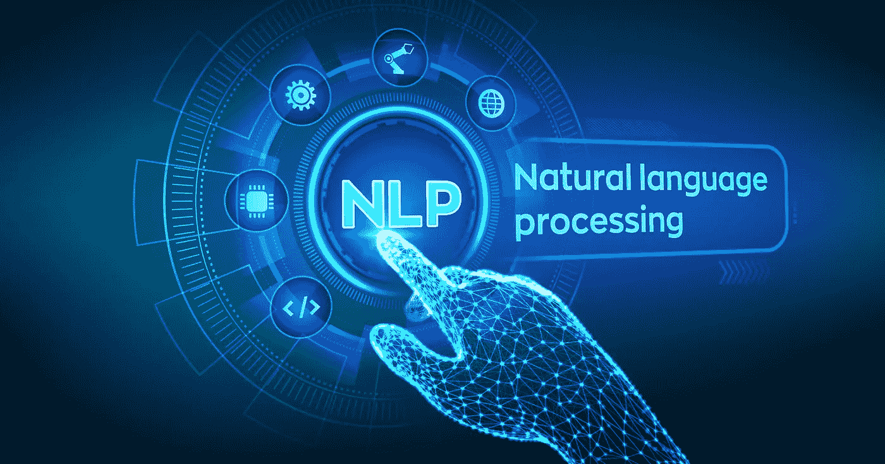
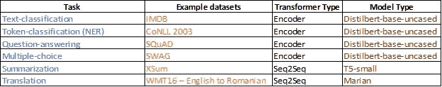

# 使用 Pytorch Lightning 对下游任务进行 NLP 深度学习培训—简介—第 1 部分，共 7 部分

> 原文：<https://medium.com/codex/nlp-deep-learning-training-on-downstream-tasks-using-pytorch-lightning-intro-part-1-of-6-c338a05f86e6?source=collection_archive---------7----------------------->



基于大型转换器的语言模型，如伯特、GPT、玛丽安、T5 等。被开发和训练以对他们被训练的语言/文本语料库具有统计理解。它们以自我监督的方式(没有人为的数据标记)被训练，使用诸如屏蔽记号预测、下一句预测等技术。这些模型对于特定的实际 NLP 任务不是很有用，直到它们经历了一个叫做迁移学习的过程。在迁移学习过程中，这些模型通过添加一个 Head(由几个神经层组成，如 linear、dropout、Relu 等)以监督的方式对给定的任务进行微调。)添加到特定的预训练语言模型(不确定为什么他们称其为头部而不是尾部，因为监督层被添加到预训练模型的底部)。本系列是关于使用 Pytorch Lightning 框架来微调不同 NLP 特定任务的语言模型。

所有预训练 NLP 模型的主要维护者，如 HuggingFace、FastAI、SparkNLP 等，都有训练器 API 来使用发布的数据集或您自己的标记数据集微调语言模型。HuggingFace 中用于在 IMDB 数据集上微调 Bert 的示例训练器 API 如下所示:

```
python run_glue.py \
  --model_name_or_path bert-base-cased \
  --dataset_name imdb  \
  --do_train \
  --do_predict \
  --max_seq_length 128 \
  --per_device_train_batch_size 32 \
  --learning_rate 2e-5 \
  --num_train_epochs 3 \
  --output_dir /tmp/imdb/
```

虽然 API 通过提供带有配置细节的一行命令似乎可以轻松地微调特定任务的语言模型，但您放弃了一些微调控制，如改变语言模型头部的架构(如添加另一个丢弃层或另一个密集层)、使用不同的学习速率调度程序、使用不同的损失函数(可能是不平衡数据的加权损失函数)、使用不同的度量来测量模型性能等。理论上，您可以对 python API 脚本文件进行修改以满足您的需求，但这并不容易。这些 python 脚本文件中的大部分注释都很糟糕。撰写本系列的动机是展示一种更好的方法，以一种有组织的方式使用 Pytorch Lightning 框架来微调语言模型。本系列文章显然是面向那些希望更好地控制 NLP 训练过程的高级实践者、研究人员和学生的。

该系列将展示以下下游任务的微调:



下游任务和用于该任务的预训练模型

所有 Pytorch Lightning Colab 笔记本都按照如下所示的方式组织成不同的部分。每个系列中的帖子将围绕与培训的特定任务相关的每个部分做出适当的评论。在这个系列的每一部分都会重复某些评论，以使每一部分在完整性方面独立存在。

1.  **下载并导入库**
2.  **下载数据**
3.  **定义预训练模型**
4.  **定义预处理函数或数据集类**
5.  **定义数据模块类**
6.  **定义模型类**
7.  **定义 Pytorch Lightning 模块类**
8.  **定义训练器参数**
9.  **训练模型**
10.  **评估模型性能**
11.  **对训练好的模型进行推理**
12.  **打开张量板日志**

Pytorch Lightning framework 提供了一种更易于管理的方法来组织围绕训练或微调预训练模型的代码。它混淆了许多围绕设置训练、验证循环、将模型/数据转移到 Cuda 等的垃圾工作，并允许 ML 数据科学家专注于训练或微调模型的重要方面。将代码组织成单独的类/节使其更具可读性和可理解性。Pytorch Lightning 在过去 12 个月中也进行了大量更新，使其更加灵活——例如，要使用在每个训练步骤中改变学习率的调度程序，您必须在 training_step 和 training_epoch_end 函数中放置调度程序特定的代码，但现在不再需要了。

转到本系列的第二部分[我们将微调一个 DistilBert 模型来对 IMDB 电影评论数据进行二进制分类。不同的部分可以在这里访问:](https://knswamy.medium.com/nlp-deep-learning-training-on-downstream-tasks-using-pytorch-lightning-imdb-classification-cbb6c62789c3)

1.  第二部分— [IMDB 电影评论二进制分类](https://knswamy.medium.com/nlp-deep-learning-training-on-downstream-tasks-using-pytorch-lightning-imdb-classification-cbb6c62789c3)
2.  第 3 部分—[CoNLL 2003](https://knswamy.medium.com/nlp-deep-learning-training-on-downstream-tasks-using-pytorch-lightning-ner-on-conll-data-part-fe1512ae4183)数据上的命名实体或令牌识别
3.  第 4 部分— [关于 Swag](https://knswamy.medium.com/nlp-deep-learning-training-on-downstream-tasks-using-pytorch-lightning-multiple-choice-on-swag-eb6a50498307) 数据的多项选择答案
4.  第 5 部分— [关于 1.1 班](https://knswamy.medium.com/nlp-deep-learning-training-on-downstream-tasks-using-pytorch-lightning-question-answering-on-17d2a0965733)数据的问题回答
5.  第 6 部分—[XSum](https://knswamy.medium.com/nlp-deep-learning-training-on-downstream-tasks-using-pytorch-lightning-summarization-on-xsum-3b4ffd5db91d)数据汇总
6.  第 7 部分—[wmt 16 英语到罗马尼亚语数据的翻译](https://knswamy.medium.com/nlp-deep-learning-training-on-downstream-tasks-using-pytorch-lightning-translation-on-english-to-ab90af97b9c2)

需要注意的一点是，本系列中显示的所有代码示例都在 Colab 笔记本上，因为 GPU 在那里是免费的。出于演示目的，这是可以的。在 Colab 笔记本上运行研究实验或生产培训是不实际的，因为 NLP 任务肯定需要多个 GPU 来使用更大的 Transformer 模型。我将很快把代码转换成可以在 AWS Sagemaker 或 Azure ML 上运行的 Python 脚本，并在完成后更新这个介绍。