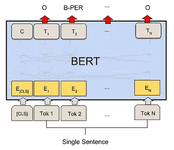

# 使用 Pytorch Lightning 对下游任务进行 NLP 深度学习培训 CONLL 数据上的 NER—第 3 部分，共 7 部分

> 原文：<https://medium.com/codex/nlp-deep-learning-training-on-downstream-tasks-using-pytorch-lightning-ner-on-conll-data-part-fe1512ae4183?source=collection_archive---------4----------------------->



这是第 3 部分，也是本系列的继续。请点击这里的[介绍文章](https://knswamy.medium.com/nlp-deep-learning-training-on-downstream-tasks-using-pytorch-lightning-intro-part-1-of-6-c338a05f86e6)了解这个系列的动机。我们将在 [Colab 笔记本](https://github.com/kswamy15/NLP_Tasks_PyLightning/blob/main/Bert_NLP_NER_Pytorch_Conll_v3.ipynb)中查看关于 CoNLL 公共数据的命名实体识别(NER)培训的各个部分，并对每个部分做出适当的评论。

*   **下载并导入库**——安装了一个名为 [seqeva](https://pypi.org/project/seqeval/) l 的库——这是计算 NER 预测指标所需要的。除此之外，安装并导入了常规的 Pytorch 和 Pytorch Lightning 库。
*   **下载数据**—CoNLL 数据集经过预处理，可从变压器数据集库中下载。但是出于演示的目的，笔记本从公共存储库中下载数据，并以对培训有用的格式准备数据。有 14039 个训练数据，3250 个验证数据和 3453 个测试数据。每行都有一个单词标记列表以及每个单词标记的相关标签，如下所示。有关标记方案的详细信息，请参见本文[的第 2 页。有 9 种不同的 NER 标签。](https://aclanthology.org/W03-0419.pdf)

```
sentences = ['Germany', "'s", 'representative', 'to', 'the', 'European', 'Union', "'s", 'veterinary', 'committee', 'Werner', 'Zwingmann', 'said', 'on', 'Wednesday', 'consumers', 'should', 'buy', 'sheepmeat', 'from', 'countries', 'other', 'than', 'Britain', 'until', 'the', 'scientific', 'advice', 'was', 'clearer', '.']tags = ['B-LOC', 'O', 'O', 'O', 'O', 'B-ORG', 'I-ORG', 'O', 'O', 'O', 'B-PER', 'I-PER', 'O', 'O', 'O', 'O', 'O', 'O', 'O', 'O', 'O', 'O', 'O', 'B-LOC', 'O', 'O', 'O', 'O', 'O', 'O', 'O']
```

*   **定义预训练模型** —这里使用的预训练模型是基于蒸馏的模型。它是 BERT 的精华版本，速度快 60%，内存轻 40%，但仍保留了 BERT 97%的性能。一旦您成功地完成了这方面的训练，就可以通过更改 model_checkpoint 变量来尝试其他预训练的模型。
*   **定义预处理函数或数据集类** —此处我们定义 Pytorch 数据集继承类 NERDataset，它将以数据加载器所需的数据集格式创建训练、val 和测试数据。Pytorch 使用 DataLoader 类将数据构建成小批。在这个类中，使用预先训练的标记器对数据进行标记。使用 LabelEncoder 将标记的标签转换成数字。这里需要注意的一点是，transformer tokenizer 可能会将一个单词分解成多个单词，因此必须注意将标签正确地添加到被分解的单词中。此外，像 CLS、SEP 这样的特殊令牌被赋予-100 标签，以便在损失函数的计算中可以忽略它们。

*   **定义数据模块类** —这是一个 Pytorch Lightning 定义的类，包含使用数据加载器准备小批量数据所需的所有代码。在训练开始时，训练器类将首先调用*准备 _ 数据*和*设置*功能。这里有一个 *collate* 函数来填充小批量。Bert 类模型要求小批量的所有输入数据长度相同。collate 函数不是将输入数据填充到整个数据集的最大长度，而是帮助将小批量的输入数据填充到该小批量中最大长度的数据。这提供了更快的训练和更少的内存使用。需要特别注意填充 target_tags。tokenizer.pad 函数将只填充 input_ids、attention_mask 列。包含每个单词标记的 NER 标记的 target_tags 必须单独填充，如下所示。

*   **定义模型类**—DL 模型的正向功能在此定义。可以看出，来自最后一个隐藏层的输出(其形状为批量大小、令牌数 768)取自 Bert 模型，并在通过具有 9 个输出(等于 9 个不同的目标标签)的线性层发送之前通过丢弃层发送。最终的输出将是这样的——批量大小，令牌数，9。
*   传统的 NER 训练是在前贝尔特时代使用双 LSTM 完成的。手套嵌入被用作单词令牌嵌入的起点，并且这些嵌入通过用于 NER 预测的双向 LSTM 发送。这里有一篇[论文](/analytics-vidhya/ner-tensorflow-2-2-0-9f10dcf5a0a)展示了 Tensorflow 中的一个 BiLSTM 模型。Glover 嵌入没有上下文，因此需要 LSTM 来构建上下文，但是 Bert 模型嵌入识别句子中单词的上下文。SparkNLP、Spacy 等现在确实有从 Bert 嵌入开始并使用 BiLSTM 进行 NER 预测的模型，这可能是因为与微调大型 Bert 模型相比，训练 BiLSTM 会更快。

*   **定义 Pytorch Lightning 模块类别** —这是定义培训、验证和测试步骤功能的地方。在阶跃函数中计算模型损耗和精度。优化器和调度器也在这里定义。这里需要注意的一点是，CrossEntropyLoss 不应该在每个数据的填充标记上计算。对于所有填充的标记，注意屏蔽将为零，因此可以用于识别填充的标记。Pytorch [CrossEntropyLoss](https://pytorch.org/docs/stable/generated/torch.nn.CrossEntropyLoss.html) 类的默认 ignore_index 为-100——所以从技术上讲，我们不需要使用 np.where 语句来用 ignore 索引替换填充标记，因为填充标记一开始就已经标记为-100。但是为了将来的目的仍然值得知道这一点，其中填充的令牌可能具有不同的数目。

*   计算度量函数用于计算各种目标标签的精确度、召回率、f1 和准确度。

*   **定义训练器参数** —所有需要的训练器参数和训练器回调都在这里定义。我们定义了 3 种不同的回调——提前停止、学习速率监控和检查点。最新的 Pytorch Lightning 更新允许使用. yaml 文件定义参数，而不是使用 argparse 来定义参数。yaml 文件可以作为一个参数提供给 python。py 文件。这样，教练参数可以与训练代码分开维护。因为我们使用 Colab 笔记本进行演示，所以我们坚持使用 argparse 方法。
*   **训练模型** —这是使用 Trainer.fit()方法完成的。可以在训练器参数中定义一个分析器，以提供有关训练运行时间的更多信息。
*   **评估模型性能** —经过 3 个时期的训练，我们得到了以下测试数据结果:

```
Overall results:
{‘test_accuracy’: 0.9712, ‘test_f1’: 0.8669, ‘test_loss’: 0.1460, ‘test_precision’: 0.8618}per tag result of :{'LOC': {'f1': 0.95455,   'number': 2618,   'precision': 0.94264,   'recall': 0.9667},  
'MISC': {'f1': 0.83842,   'number': 1231,   'precision': 0.81987,   'recall': 0.8578},  
'ORG': {'f1': 0.89782,   'number': 2056,   'precision': 0.90024,   'recall': 0.89542},  
'PER': {'f1': 0.97329,   'number': 3034,   'precision': 0.97361,   'recall': 0.9729},
```

*   正如我们所看到的，标签是不平衡的(见数字键值)，损失函数可以通过增加权重来帮助它。F1 测试 86.18 分远低于 SOTA[94.6 分。这肯定是蒸馏模型所期望的。SOTA 网站上列出的模型中很少使用 BERT。在 2018 年，有慢性肾功能衰竭的 BiLSTM 有大约 91 分的好成绩。2018 年，BERT base 的 F 值为 92.4，BERT large 的 F 值为 92.8。现在我们已经使用 Pytorch Lightning 对 DL 模型的架构有了更多的控制，可以使用其他架构进行实验。](https://paperswithcode.com/sota/named-entity-recognition-ner-on-conll-2003)
*   **对训练好的模型运行推理** —向模型发送示例批处理文本，以从训练好的模型获得预测。这可以用于构建 ML 推理管道。
*   **TensorBoard 日志数据** —这将在 Colab 笔记本中打开 TensorBoard，让您查看各种 TensorBoard 日志。Pytorch Lightning 日志默认为 TensorBoard，这可以使用 Logger 回调来更改。

接下来我们将看看本系列[第四部分](https://knswamy.medium.com/nlp-deep-learning-training-on-downstream-tasks-using-pytorch-lightning-multiple-choice-on-swag-eb6a50498307)中的多项选择任务训练。