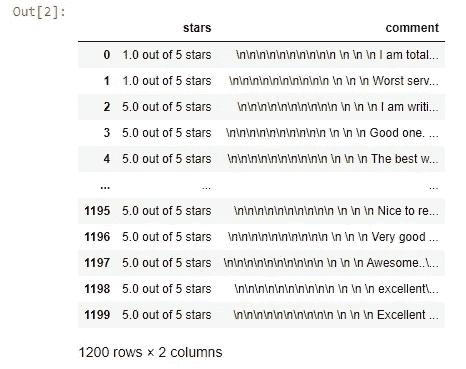
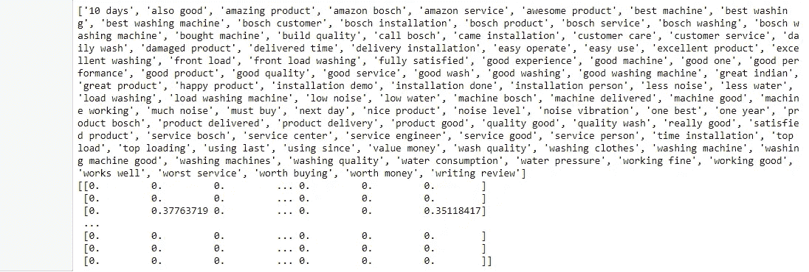

# 自然语言处理:亚马逊产品评论的情感分析或情感挖掘-第一部分

> 原文：<https://medium.com/codex/nlp-sentiment-analysis-or-emotion-mining-on-amazon-product-reviews-part-1-428d43112027?source=collection_archive---------0----------------------->

太棒了。既然您已经成功地从 Amazon 网站中挖掘了文本语料库，那么让我们学习 NLP 技术来对从 Amazon 中提取的产品评论执行情感分析或情感挖掘。

如果你还在纠结如何进行文本挖掘，请参考我之前的文章[文本挖掘:如何使用 Scrapy](/codex/text-mining-how-to-extract-amazon-reviews-using-scrapy-5bd709cb826c) 提取亚马逊评论，以一种非常简单的方式解释。

那么，我们开始吧。这是自然语言处理的系统方法，用于执行情感分析或情感挖掘。本文分为两部分。第一部分包括文本预处理和特征提取，第二部分包括文本语料库上的情感分析或情感挖掘。

# **导入库和数据集**

首先，我们从使用 python 导入 NLP 所需的所有库开始。

关于 NLP 非常重要的库是[字符串](https://docs.python.org/3/library/string.html)和[空间](https://spacy.io/usage/spacy-101)。两者在文本处理中都发挥着巨大的作用。

python 中的字符串是一个序列或有序的字符集。它是一种派生的数据类型，一旦定义就不能更改。然而，使用 replace()、join()、strip()或 split()命令可以进行各种字符串修改，但是它们不会更改原始字符串，而是修改该字符串的副本并返回值。

Spacy 用于 python 中的高级 NLP。它旨在精确处理和理解大量文本，包括信息提取、自然语言理解(NLU)或深度学习的预处理文本。它具有许多语言机器学习功能，如标记化、词性(POS)标注、词汇化、命名实体识别(NER)、文本分类等。

现在，您已经对这些库有了一些背景知识，让我们继续前进，导入我们已经从亚马逊网站为[博世洗衣机前置](https://www.amazon.in/Bosch-Inverter-Control-Automatic-Loading/product-reviews/B08SR372S7/ref=cm_cr_arp_d_paging_btm_next_2?ie=UTF8&reviewerType=all_reviews&pageNumber=)提取的亚马逊评论数据集，如下所示:

输出如下所示:

# **文本预处理**

起点是在将文本数据输入模型或用于分析目的之前，清理和准备文本数据。文本预处理有助于去除数据中以评论、评论或推文形式出现的噪音。它有助于执行文本分析，通过转换所有字符为小写，删除标点符号，删除停用词，错别字等。

1.  我们首先删除前导字符和尾随字符，并删除空字符串

2.接下来，将前面的输出列表合并成一个字符串/文本

3.从字符串或文本中删除标点符号

4.使用 NLTK 库执行文本标记化

5.从文本标记中删除停用词(频繁出现的意义较小的通用词)

# **文本规范化**

对文本进行预处理后，下一步是文本规范化，即将文本转换为所有小写字母。这样做是为了减少随机性和消除偏见，将其转换成标准格式，以提高计算机处理不同类型信息的效率。

文本规范化的目标也是导出单词的词根或基本形式。这可以通过两种方法来实现:词干化或词汇化。

## **词干**

在这里，每个单词的最后几个字符都被删除了，并且经常有不正确的拼写和意思。例如:浪费->浪费

## 词汇化

它比词干法要好，因为它考虑了单词的上下文，并将其转换为正确的拼写和含义。例如:浪费->浪费

# 特征抽出

在文本标准化并导出其基本形式后，下一步是特征提取。它侧重于分析不同信息或文本之间的相似性。NLP 算法或模型不能处理原始文本，因此需要特征提取来提取特征并将文本转换成矩阵或向量格式。最流行的两种方法是 BOW 和 TFIDF。

## 1.BOW:字数统计矢量器

单词包创建文本语料库中存在的唯一单词的词汇表，并执行文本矢量化。BOW count 矢量器通过为每个单词分配单独的列来创建特征矩阵，每行对应一个评论文本。矩阵中的值表示该评论中唯一单词的存在(1)或不存在(0)。

## 使用 N-gram 的 BOW CV

BOW count 矢量器的主要缺点是单词出现的顺序丢失了，因为标记的矢量是以随机顺序创建的。因此，文本失去了它的语境。这个问题可以通过使用保持单词局部顺序的 N 元语法来解决。N-grams 可以是单个 grams(单个单词，如“happy”)、双元 grams(两个单词放在一起，如“完全失望”)和三元 Grams(三个单词放在一起，如“没有服务，不完整”)。

然而，当词汇量很大时，使用 N-gram 和 BOW 会产生巨大的稀疏矩阵(大量的 0)。因此，我们需要删除高频 n 元语法(即停用词)和低频 n 元语法(即错别字)。理想情况下，中频 n-grams 效果最佳。我们还可以限制矩阵中使用的特征数量。

## 2.使用 N-gram 的 TFIDF 计数矢量器

使用 n-gram 的 BOW count 矢量器的另一个缺点是，它忽略了在语料库中很少出现但可能具有重要价值的 n-gram，如“无演示调用”。虽然这个 n-gram 很少出现在语料库中，但它突出了需要注意的主要问题。TFIDF 矢量器拯救了它。

TFIDF 是术语频率逆文档频率的缩写，是术语频率和逆文档频率的乘积。TFIDF 值与单词在文档或评论中出现的次数成比例地增加，而与包含该单词的语料库中的文档数成反比地减少。 **TFIDF =TF x IDF**

TFIDF 强调了很少出现但非常重要的特定 n-grams。当 n-gram 在文档中具有高频率而在语料库中具有低文档频率时，TFIDF 得分高。对于在语料库中具有高文档频率的 n 元语法，IDF 值和最终的 TFIDF 值接近于 0。当 TF 和 IDF 值都很高时，TFIDF 值也很高，即 n-gram 很少但存在于文档中，并且在语料库中具有低文档频率。

现在，我们难以被计算机理解的文本数据被转换成易于计算机处理的数字数据。此后，您可以继续构建合适的预测模型，并找到业务问题的答案。

由于本文的目的不是建立模型，而是分析文本背后的情感，所以让我们继续深入。

# 词云

文本语料库中使用的高频词的非常好的可视化可以通过生成词云来实现。在词云中，每个词的大小表明其频率或重要性。只要看一看，你就可以判断你的客户对你的产品有什么评价。

这里，我们完成了如何执行文本预处理和特征提取。要进一步了解如何进行情感分析和情感挖掘，请参考即将发布的文章 NLP:亚马逊产品评论的情感分析或情感挖掘-第二部分。

我将在下一篇文章中写更多关于如何执行自然语言处理文本挖掘的内容，包括文本预处理、特征提取、命名实体识别和情感挖掘或对亚马逊上产品评论的情感分析。所以请关注我在[媒体](/subscribe/@vaitybharati)上的帖子😃快乐学习！

请关注我的 [GitHub](https://github.com/vaitybharati) 有 170 多个这样的库。

另外，请告诉我，你对这篇文章有什么看法。如果你真的觉得这篇文章有用，请鼓掌。