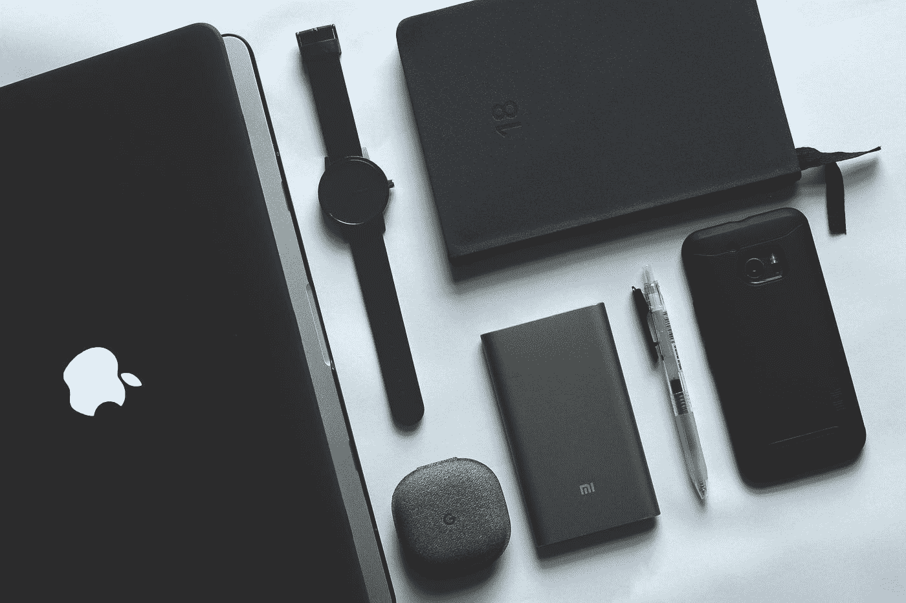

# 不，苹果不关心你的隐私

> 原文：<https://medium.com/codex/no-apple-does-not-care-about-your-privacy-4bd68669f791?source=collection_archive---------0----------------------->

我看了苹果的真实隐私政策，意识到苹果和苹果的高管都是伪君子。

马修·邝在 [Unsplash](https://unsplash.com?utm_source=medium&utm_medium=referral) 上的照片

# 介绍

2020 年，苹果在科技行业取得了重大成就。根据这篇[文章](https://9to5mac.com/2020/01/28/apple-hits-1-5-billion-active-devices-with-80-of-recent-iphones-and-ipads-running-ios-13/)，苹果在全球的活跃设备超过了 15 亿台。很多人买苹果产品是为了‘更高的地位’，对于 iMessage 来说，‘买个 iPhone 就是方便’等等。但有些人购买苹果产品的原因只有一个:隐私。自从社交媒体的诞生和脸书-剑桥分析数据[丑闻](https://en.wikipedia.org/wiki/Facebook%E2%80%93Cambridge_Analytica_data_scandal)以来，隐私已经成为最相关的话题之一。苹果现在已经成为隐私的象征。《华尔街日报》甚至上传了许多关于苹果在隐私问题上的立场以及新的 14.5 iOS 更新将如何摧毁脸书这样的社交媒体公司的视频。不幸的是，在现实中，苹果并不关心用户的隐私。用户的数据对任何公司来说都是一笔宝贵的资产，没有公司会离开这个绝佳的机会去垄断和利用，包括苹果。

在这篇文章中，我将解释:

1.  苹果真正的隐私政策
2.  苹果公司收集的数据
3.  关于标识符的事情
4.  违约的权力
5.  苹果的双重生活
6.  尽管是一家硬件公司，为什么苹果公司仍在收集你的数据？
7.  结论

# 苹果真正的隐私政策

如果你访问 apple.com/privacy，你会发现苹果公司致力于保护你的数据和隐私。但事实并非如此。那个网站只不过是一个巨大的公关噱头。他们真正的隐私政策是 apple.com/legal/privacy/data。该网站是一份法律文件，当您打开第一批 Apple 产品的包装时，会向您显示该文件。第一个网站对用户或 Apple 没有任何意义，因为当您第一次安装 Apple 产品时，您已经同意了合法的在线文档。正因为如此，如果你发现苹果未经你的允许收集你的数据，你不能起诉他们没有保护用户的隐私，正如他们的公关网站上所说的那样。既然我们知道了苹果真正的隐私政策，我们现在可以继续阅读和讨论用户同意的内容。

# **苹果公司收集的数据**

苹果从用户那里收集了他们能做的每一条数据。苹果收集你的年龄、健康信息、位置和“非个人数据”。而这只是冰山一角。

> 苹果与我们的地图合作伙伴共享移动数据、兴趣点数据和聚合用户分析。但是，只有在满足某些最低阈值的情况下才会共享数据，以防止这些合作伙伴将这些信息关联回任何特定的地图用户。【点击此处查看[来源](https://support.apple.com/en-gb/HT212039)

苹果模糊的描述让他们可以使用你的数据，并与第三方分享，而不会惹上麻烦。在这里，苹果没有提到数据使用的标准。什么是‘最低门槛’，苹果？

> 因为您的位置会泄露您的身份，所以我们在存储之前会将精确位置转换为不太精确的位置。我们在 24 小时内将此应用于当前设备位置和您路线的起点。[点击此处查看[来源](https://support.apple.com/en-gb/HT212039)

再问一次，什么是“不太精确的位置”？为什么要 24 小时保存我的位置？

苹果还收集你如何使用苹果新闻的数据，存储你与 Siri 和听写的互动记录，并审查这些记录，询问 Siri 和听写的历史记录通过标识符存储 6 个月，苹果还记录和存储一些与你使用 iMessage 和 FaceTime 有关的信息，苹果还收集你与朋友进行 facetime 的数据 30 天，苹果还存储电话号码和电子邮件地址长达 30 天。

苹果收集你的位置数据是为了“提供更相关的推荐”。苹果还会收集你的 IP 地址，以显示“相关的地理搜索结果和新闻”。在苹果地图上报告问题时，苹果会收集你的家庭和工作地址，这是你最近一次搜索的结果！当你 Siri 的时候就更糟了。

【来源: [Siri &听写](https://support.apple.com/en-gb/HT210657)， [iMessage](https://support.apple.com/en-gb/HT209110)

苹果保存联系号码，昵称，关系，你下载的应用程序，标签列表，如照片和录音中的人名！苹果甚至用你的 IP 地址来投放“相关广告”。如果您的位置服务已打开，那么 Apple 会收集并使用您的位置信息来提供“更相关的建议”。这也适用于第三方，但需要注意的最重要的一点是，定位服务在默认情况下已经打开。正因为如此，苹果收集和使用你的位置信息，你永远不会知道。

[来源:[位置服务&隐私](https://support.apple.com/en-gb/HT207056)

许多人使用 Safari 作为他们的主要网络浏览器，因为用户认为 Safari 是最安全的浏览器之一，因为它阻止了第三方追踪器。但仅仅因为它屏蔽了追踪器和 cookies，并不意味着苹果不会使用你的网络搜索数据。苹果使用你的信息，通知，分析如何使用你的设备和应用程序，电子邮件，浏览历史，甚至联系人！更不用说安装在你设备上的应用程序发送给苹果的数据了。苹果公司表示，发送到苹果服务器的信息是非个人/不识别用户身份的信息。但是下一行说苹果设备可能会把我的信息发送给苹果。我的位置是个人数据，任何公司都可以通过这些数据识别我的身份。

【来源: [Safari 搜索&隐私](https://support.apple.com/en-gb/HT212189)

从上面的截图中，你还可以看到你的苹果设备将你喜欢的话题、你在网络上搜索过的东西、你选择的建议以及你最常用的应用程序等信息发送到苹果服务器。

你也可以清楚地看到苹果对“不能识别你身份的信息”的模糊定义。

【来源: [Safari 搜索&隐私](https://support.apple.com/en-gb/HT212189)

# 关于标识符的事情

现在，苹果粉丝可能会攻击我，说苹果没有将收集的数据与你的苹果 ID/电话号码/电子邮件地址联系起来——他们是对的。苹果在他们的隐私政策中提到了很多，但问题是苹果仍然可以将你的数据链接到一个不是你的 Apple ID 的标识符。苹果可以创建更多的标识符来链接你的数据。这就是问题所在。苹果从来没有提到他们永远不会把你的数据和标识符联系起来。苹果很少提到他们不会保留你的信息，比如健康记录。所以你应该担心你的隐私。苹果可能会展示自己是唯一一家具有良好道德和伦理的好公司，但在内心深处，苹果与脸书、Twitter 或任何科技公司并无不同。

# 违约的权力

如果苹果真的关心你的隐私，他们一百万年后也不会收集数据。即使他们想尊重你的隐私，他们也会在收集你的数据前征得你的同意。但由于这些“服务”是默认开启的，普通公众对此一无所知。人们大多数时候保持默认设置不变，因为这样很不方便。谁愿意花半个小时改变设置？没有人。从字面上看，没有人想那样做。正因为如此，包括苹果公司在内的许多科技公司在设置默认设置时，都尽可能多地收集信息。

# 苹果的双重生活

在外面，苹果能够展示自己是唯一一家关心你隐私的好公司。他们能够说服每个人购买 iPhones 和其他苹果产品，因为他们说“隐私”。那是 iPhone。”或者“iPhone 中发生的事情，留在 iPhone 中。”【苹果公司也应该因为关于隐私的误导性广告而被叫出来。].但苹果并不针对那些真正保护自己在线隐私的人，因为他们知道没有一家科技公司是可信的。苹果瞄准了对网络隐私和科技公司如何收集数据一无所知的人。不幸的是，大多数普通大众。

正因为如此，苹果在隐私方面的名声并不坏。苹果公司应该因为误导隐私的广告而受到指责。就连 WallStreatJournal 也邀请了克雷格·弗雷德里奇(Craig Fredrigi)来解释苹果新的 iOS 更新是如何“关心用户隐私”的。WallStreatJournal 应该在邀请苹果的一位高管告诉人们苹果有多棒之前做更多的研究——就像那将是一个真正无偏见的视频一样。不管怎样，因为这个隐私图片，苹果公司能够逃脱窃取你的数据。Nypost 发布了一篇关于 iPhones 如何偷窥你胸部的文章。如果脸书做了这样的事情，那么每个人都会谈论它。新闻频道，你和你的朋友，你的邻居，几乎任何人都会谈论这件事。但是因为它是苹果，他们能够摆脱这一点。

# 尽管是一家硬件公司，为什么苹果公司仍在收集你的数据？

[自 2015 年](https://www.businessofapps.com/data/apple-statistics/)以来，iPhone 销量停滞不前。随着手机变得越来越好，人们购买的 iPhones 越来越少。人们从来不需要每年更换他们的 iPhones。为了应对这种情况/实现利润最大化，苹果慢慢提高了新 iPhones 的价格。但是，收入并没有增加。收入图表保持平稳。苹果意识到，它不能仅仅通过销售 iPhones 和其他苹果产品来取悦投资者。他们需要人们每月/每年都会购买的东西。他们需要提供各种服务来获得他们无法从 iPhone 销售中获得的收入。这就是苹果需要用户购买这些服务的原因。苹果可以花很多钱在广告上，向你展示他们提供的服务(更不用说苹果也向你展示的第三方公司的广告)(以及向战略合作伙伴共享“非个人数据”)，但他们如何才能更有效地做到这一点？嗯，通过收集你的数据来了解更多关于你的信息，并向你展示关于你最有可能购买的苹果服务的广告。而且这样一来，苹果花在广告上的钱少了很多，从你刚刚购买的服务中获得了很多收入。

此外，当我们谈论广告时，苹果几乎没有阻止定向广告。用户必须进入“设置”>“隐私”>“苹果广告”,点击“查看广告定位信息”,才能看到哪些信息被公司用来给你定位广告。苹果公司没有开发出防止这种情况的软件。

# 结论

归根结底，如果你喜欢“苹果生态系统”，你就应该购买苹果设备。但是你千万不要仅仅因为隐私的原因去买 iPhone。如果你有任何苹果设备，关闭所有设置，如个性化广告、Siri 建议等。不要备份您的文件、照片等。在 iCloud 上。请不要这样做。因为文件、消息等的加密。在 iCloud 上备份就不起作用了【Google Drive 也一样】。我推荐一个很棒的[播放列表](https://www.youtube.com/watch?v=m_SN1CB3Kts&list=PLR_ghQEN2SgBNJDv00OGvqnZpMNhbYt4F)，作者是[最讨厌的那个](https://www.youtube.com/channel/UCjr2bPAyPV7t35MvcgT3W8Q)，关于保护你的隐私。此外，苹果应该为虚假广告和欺骗用户负责。CNN、美国消费者新闻与商业频道、福克斯新闻频道、华尔街日报、纽约时报、福布斯等新闻公司也应该为没有揭露大型科技公司的谎言负责。见鬼，福布斯甚至发表了一篇[文章](https://www.forbes.com/sites/kateoflahertyuk/2019/03/26/heres-the-real-reason-apple-claims-to-care-about-your-privacy/?sh=6db35e8c30f8)称赞苹果“关心用户隐私”。就连 WallStreatJournal 都邀请 Craig Frederigi 来解释苹果的新隐私功能，甚至没有做任何研究。

苹果没有任何保护你隐私的动机——没有一家公司有。这就是为什么非常有必要制定一部法律，让公司保护你的隐私，不出于私利使用你的数据。

推特:[@ the critical 16](https://twitter.com/TheCriticalTh16)