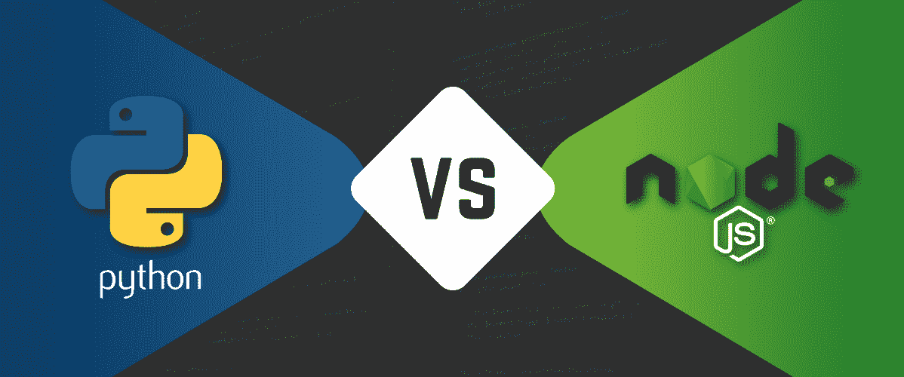

# Node.js 与 Python:为您的网站选择最佳技术

> 原文：<https://medium.com/codex/node-js-vs-python-choose-the-best-technology-for-your-web-dd2a56925254?source=collection_archive---------18----------------------->

两个最好的后端编程平台是 Node.js 和 Python。每当谈到英国的 web 开发时，在 Node.js 和 Python 之间做出选择可能会很困难。两者也各有利弊。为你的项目选择正确的技术平台至关重要。它将计算您的项目部署的成本和时间，以及它将有多容易…