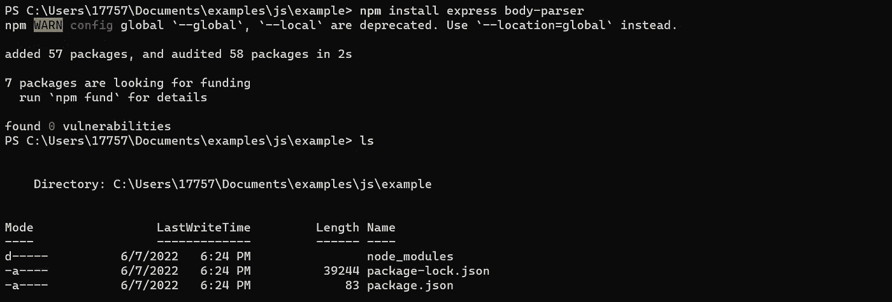
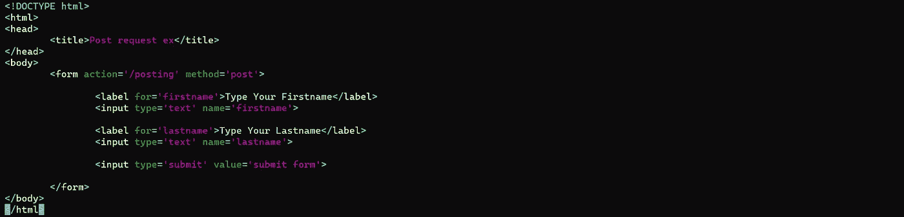
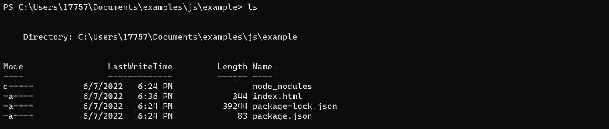
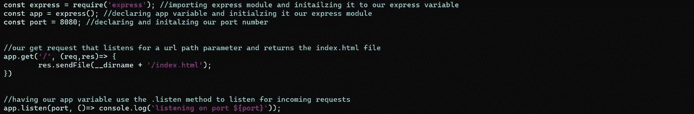
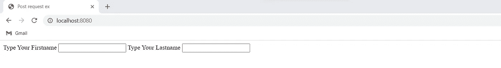
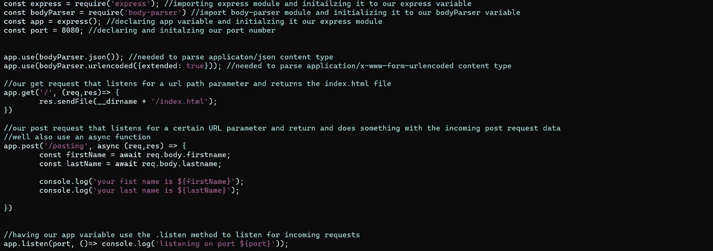
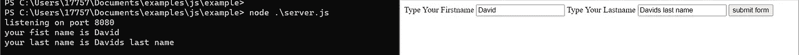

# 处理 POST 请求的节点。

> 原文：<https://medium.com/codex/nodejs-handling-post-requests-3d38f1e7e059?source=collection_archive---------36----------------------->

# 前言。

在上一篇文章中，我谈到了客户机/服务器模型，以及如何使用 GET 请求将数据从客户机发送到服务器，再返回到客户机。虽然 get 请求为互联网提供了动力(您发出 GET 请求只是为了查看本文)，但有时客户端可能希望向服务器发送额外的信息(您已经为用户名和密码或者向数据库添加了一些内容)。例如在 html 表单或 URL 查询中。我们将通过使用 POST 请求来探究这一点。

# 对于读者来说

在这篇文章中，我想深入探讨客户端如何向服务器发送更多数据。这称为 POST 请求。POST 请求是指**额外的**数据可以被发送到服务器，并被后端解析和使用。我将使用 NodeJS(其他编程语言也提供 http 请求的使用，以及 post 请求的 http 主体解析)。本文假设您对 POST 请求一无所知，您可以一步一步地阅读本文。

# 发布请求是如何工作的？

POST 请求是 HTTP 协议支持的请求方法。这种类型的请求将数据包含在 HTTP 请求体中。相比之下，GET 请求不在 HTTP 请求体中包含数据，主要用于从服务器请求特定的资源(例如获取维基百科的页面)。POST 请求通常与数据库结合使用，以将数据存储到数据库中，验证用户名和密码，或者任何其他需要更多数据而不仅仅是 URL 路径的任务。

# 让我们首先确保安装了 NPM。

首先确保 NodeJS 安装在您的机器上(这对于 Linux、mac 和 window 机器可能是不同的。更多信息请参见 NodeJS 文档)。为此，让我们用命令`node -v`进行检查

您应该收到您当前的 NodeJS 版本作为输出(例如，我目前使用的版本是 8.11.0)。如果您没有收到这样的输出，请参考 NPM 文档。

# 现在让我们创建目录并安装所需的模块。

现在让我们创建我们的目录来保存我们所有的文件和依赖项。

下次使用`npm install express body-parser`。Express 是我们处理 HTTP 请求的后端框架(这在上一篇文章中讨论过), body-parser 是处理 POST 请求数据的 NPM 模块。

您的终端应该看起来像这样。

# 让我们用表单创建一个 HTML 页面，我们将使用该表单发出 POST 请求。

为此，我将创建另一个名为 index.html 的文件(在现实世界中，您可能会将该文件放在静态、路由或页面目录中，在本例中，我只是将它添加到根目录中。).此外，HTML 文件中的文本应该像这样，应该包括我们的输入字段，和我们的提交按钮。

您的根目录现在应该是这样的。

# 现在让我们进入后端，我们将从处理主页获取请求开始。

最后，现在我们可以创建接收 POST 请求数据的逻辑，但是首先我们需要处理服务我们的主页。为此，我们在根目录下创建一个 server.js 文件。这个文件将存放表单的后端逻辑，并返回一些内容，以及对主页和路径参数的 get 请求。

让我们创建一个 server.js 文件(通常称为 app.js 文件)并让它返回一个主页，然后我们可以向它添加更多的代码并让它处理 post 请求。server.js 文件应该如下所示。

到目前为止，我们的 server.js 文件(我们的 express 文件)可以处理对/ URL 参数的 GET 请求，返回我们的主页。我们可以通过从终端运行`node server.js`来检查这一点，然后进入我们的网络浏览器(在我的例子中，我使用的是谷歌浏览器)并进入 **localhost:8080** 你应该会看到你之前创建的 HTML 文件，看起来应该是这样的。

# 现在让我们添加 POST 请求的逻辑。

现在让我们将 POST 请求逻辑添加到 server.js 文件中。还记得我们用 NPM 下载的主体解析器模块吗？这就是我们在这里用来处理 POST 请求表单数据的东西。

首先您将导入 body-parser 模块(就像我们对 express 所做的那样)，然后确保我们的 body-parser 变量使用 json 来处理数据。然后再加一个 app 方法来处理一切。总而言之，它应该是这样的。另外，请务必阅读此处的图片，以查看更具描述性的示例，了解一切是如何工作的。

现在使用`node server.js`运行 server.js 文件，并输入 index.html(位于 localhost:8080)表单。您的数据和 server.js 应该接收传入的请求并处理它！总而言之，它应该是这样的。请注意，我们的 server.js 文件已经用 console.log 记录了我们的传入数据！

# 您已经正式处理了帖子请求数据！

你做到了！您已经使用 Express 和 body-parser 处理了 POST 请求！现在，您可以接受来自任何 HTML 表单的表单数据，并对其进行处理。比如向数据库添加内容，对数据做一些事情，认证，或者让用户知道表单已经发送出去了！您还可以探索 Fetch 或 Axios 之类的东西，以便更好地处理 POST 请求。

# 感谢您的阅读！

感谢阅读。我希望你觉得这篇文章很有趣，并在这个过程中学到了一些东西。如果你觉得我遗漏了什么，请在下面评论，或者直接给我发消息。如果你觉得这篇文章内容丰富，也留下你的关注吧！:)

# 我最近在忙什么。

我的名字大卫和我已经从事软件 web 开发大约两年了。大多是自由职业者的工作。我知道 Python，JavaScript，Bash，CSS，HTML，PostgreSQL，MongoDB，还有很多其他的技术。如果你想联系我，请到 davidesquerra.com 来找我。在这个网站上，你可以直接给我发短信或电子邮件。就像我上面说的感谢阅读:)。