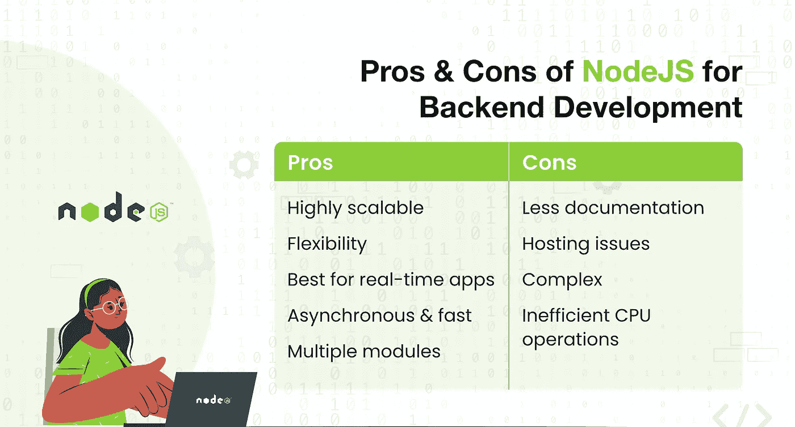
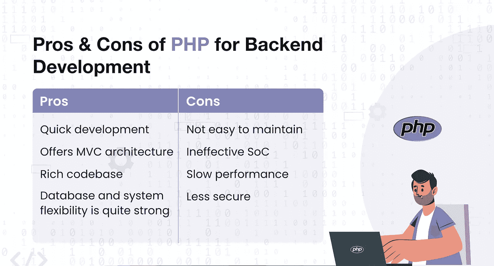
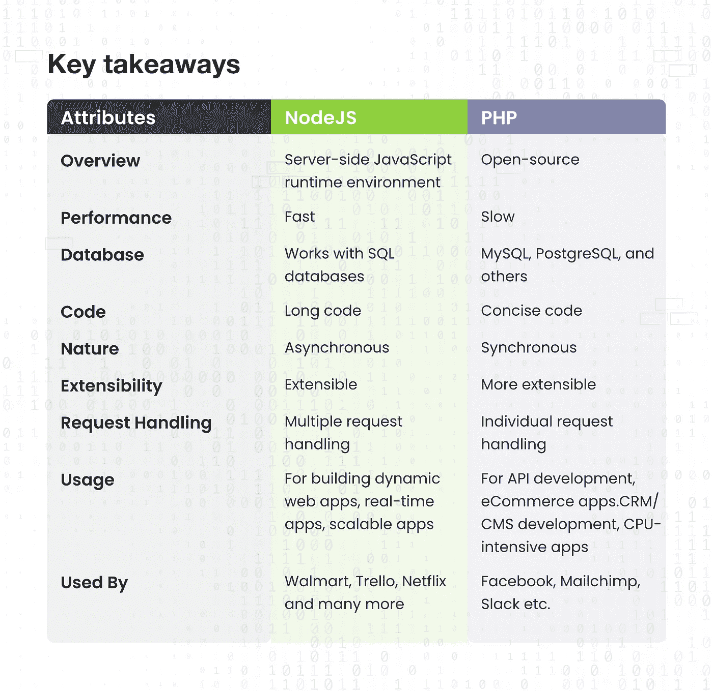

# NodeJS 与 PHP 的后端开发:企业应该选择哪一个？

> 原文：<https://medium.com/codex/nodejs-vs-php-for-backend-development-which-one-businesses-should-pick-98ac9ca808c7?source=collection_archive---------1----------------------->

现在，最流行的两个服务器端平台是 PHP 和 NodeJS。这两种领先的后端技术各有优缺点，尽管在开发人员中同样受欢迎。

在这篇博客中，我们试图澄清这两种领导之间的一些重要区别。在这篇博客中，我们将讨论如何使用一种特定的技术进行后端开发可能会给你带来最大的好处。

# NodeJS:什么&为什么？

开源运行时环境 Node.js 构建于 JavaScript 之上，用于前端和后端开发。它是一个跨平台的框架，可以处理 Windows、Linux 服务器、Unix 和 macOS。对于创建实时 web 应用和仪表板，这种运行时技术是理想的。

由于 Node.js 使用了事件驱动的非阻塞 I/O 方法，所以它更有效，可以处理巨大的负载。大型应用和流媒体网站可以从中受益匪浅。

接下来，我们来谈谈，

# NodeJS 用于后端开发的利与弊

让我们检查一下 NodeJS 在后端开发方面的优缺点

## NodeJS 的优点

*   高度可扩展
*   灵活性
*   最适合实时应用
*   异步和快速
*   多个模块

## 节点的缺点

*   较少的文档
*   不容易找到专业的 NodeJS 开发者
*   低效的 CPU 操作
*   托管问题
*   复杂的

## 使用 NodeJS 构建的热门应用

*   网飞
*   贝宝
*   特雷罗
*   沃尔玛
*   戈达迪·易贝

我们已经在 NodeJS 上讨论了很多，现在让我们继续讨论，

# PHP:什么&为什么？

超文本预处理器被称为 PHP。它是一种流行的用于后端开发的开源编程语言。PHP 是另一种最值得信赖的后端编程语言。

大多数操作系统都与 PHP 兼容，这使它成为服务器端编程的理想选择(Linux、Windows、macOS、RISC OS 等)。).它可以作为一个模块或 CGI 处理器运行，并与许多 web 服务器兼容。它支持一系列数据库，是一种易于使用的语言。

接下来，我们来谈谈，

# PHP 用于后端开发的利弊

让我们检查一下 PHP 在后端开发方面的优缺点

## PHP 的优点

*   快出子
*   提供 MVC 架构
*   丰富的代码库
*   数据库和系统灵活性相当强

## PHP 的缺点

*   不容易维护
*   缺乏管理大量应用程序的能力
*   无效 SoC
*   缓慢的性能
*   不太安全
*   不适合大型应用程序

## 使用 PHP 构建的顶级应用

*   脸谱网
*   维基百科(一个基于 wiki 技术的多语言的百科全书协作计划ˌ也是一部用不同语言写成的网络百科全书ˌ 其目标及宗旨是为全人类提供自由的百科全书)ˌ开放性的百科全书
*   Tumblr
*   MailChimp
*   松弛的

在我们对这两种技术进行了广泛的讨论之后，让我们通过关注几个不同的因素来对 PHP 和 NodeJS 进行比较。

# NodeJS vs PHP:哪个最适合后端开发？

为了理解 PHP 和 NodeJS 之间的区别，需要解释几个类别。所以，我们开始吧！

## #1.NodeJS 与 PHP:性能

高性能技术提供了卓越的结果，并显著改善了 UX。这是剧本写作的标准，也是它如何影响各种关键绩效指标的标准。PHP 和 NodeJS 都利用了它。

由于 NodeJS 是事件驱动和异步的，它执行应用程序的速度更快，启动也更快。由于并发，开始和结束时间仍然略有不同。相比之下，PHP 会限制并发性，并且加载速度很慢。

## #2.节点 JS 与 PHP:数据库使用

PHP 通常支持 MySQL、MariaDB 和 PostgreSQL 等关系数据库。然而，在一些耗时且困难的解决方案中使用了 NoSQL 数据库。

NodeJS 与 NoSQL 数据库如 MongoDB、Redis 和弹性搜索以及 SQL 数据库如 MySQL 无缝集成。此外，它还支持 Neo4j 风格的图形数据库系统。

因此，NodeJS 是开发偶尔访问关系或非关系数据库的可伸缩 web 应用程序的理想选择。

## #3.节点 JS 与 PHP:速度

与其他语言相比，NodeJS 的特点是异步开发环境。人们不必等待后续模块加载，因为它是异步的。毕竟，几个模块同时运行。

反过来，用户体验得到了改善，因为执行时间大大减少了。像大多数其他技术一样，PHP 是同步的，这意味着每个模块都以特定的顺序运行。如果一个函数不能运行，后续的函数在第一次执行完成后才会开始。

## #4.节点 JS 与 PHP:开发成本

有许多变量会影响开发成本，但是现在，我们只关注其中一个:开发平台。从印度雇佣 NodeJS 开发人员对你有好处。

核心小组可以完成任务，因为 JavaScript 可以用于项目的前端和后端。在这种情况下，开发成本因此更低。

与 NodeJS 相比，PHP 是一种后端特定的编程语言。为了完成一个 PHP 项目，您将需要一个包括顶级前端开发人员和后端开发人员的团队。

## #5.NodeJS 与 PHP:请求处理

技术管理客户端请求的程度取决于请求的处理方式。这就是 PHP 和 NodeJS 彼此不同的地方。

PHP 一次只处理一个请求，这有时比较慢。它也使用了大量的计算资源。从好的方面来说，它能准确处理请求。

NodeJS 同时管理大量请求，通常使用较少的计算资源。但是，如果单个请求有未固定的问题，则可能会导致数据不准确。

## #6.NodeJS 与 PHP:用法

NodeJS 和 PHP 的实现方式有很大的不同。NodeJS 适合于生成高度可扩展的服务器端解决方案和构建移动友好的 web 应用程序，而 PHP 则是开发 CPU 密集型应用程序的理想之选，并用于 LAMP 堆栈 API 开发。

如你所见不同之处。现在，是讨论的时候了，

# 什么时候选择 NodeJS？

如果性能和易开发性是必不可少的因素，推荐 Node.js。此外，您必须 [**雇佣 Node JS 开发人员印度**](https://www.quytech.com/hire-node-js-developers.php) 进行:

*   用于动态 web 应用程序开发
*   实时应用程序开发
*   用于建造水疗中心

# 什么时候选择 PHP？

在您的技术堆栈中，如果您需要开发:

*   电子商务网络应用
*   CPU 密集型应用
*   最适合灯组项目
*   CRM 和 CMS 开发

## **关键要点**

# 结论

在 Node.js 和 PHP 之间进行选择时，需要考虑许多因素。这两个平台都是开发的绝佳选择。

NodeJS 比 PHP 有很大的优势，这要归功于它更加灵活和模块化的方法。最后，明智地做出决定并选择最符合您需求的平台完全取决于您。

如果你正在寻找构建任何网络应用程序来实现更清晰的交流和更优质的网络开发，请在印度雇佣程序员。