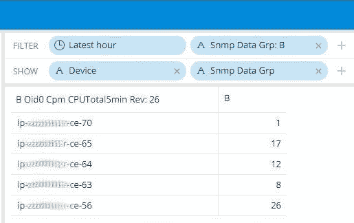

# 非特定流数据管道

> 原文：<https://medium.com/codex/nonspecific-streaming-data-pipelines-71d8ff2227ed?source=collection_archive---------16----------------------->

我想与大家分享的主题是关于多用途流数据管道的配置。其背后的主要思想是将现有的“*nix”核心组件与第三方应用程序有效集成，以创建一个可靠且易于维护的数据收集和处理基础架构。

## 高级架构:逻辑块

下图从左至右显示了与流数据管道相关的通用功能。


流式数据管道

让我们简单地放大一下它们:

*   **查询**:这是指从特定来源收集信息的实际行为。通常，会涉及 SNMP 或 IPFIX/Netflow 等标准化协议，并且会采用数据轮询或数据推送策略(或两者都采用)。然而，我想指出的是，将数据传送到收集站点的动作也可以通过多种其他方式实现(有时是非传统的):例如让 [rsync](https://man.openbsd.org/openrsync.1) 定期将数据转储到收集站点的预定义文件夹中。
*   **格式化**:为了便于以后的数据处理，以结构化的方式对即将到来的信息进行格式化是非常有效的。(最终添加一些像时间戳这样的关键字段)。
*   **操作**(可选):可能需要根据特定的需求来操作字段值的选择。例如，您可能希望对传输信息应用一些数学函数。
*   **排队/存储**:流式数据按照其语义进行消费和分类，并根据您的数据保留要求准备存储。
*   **可视化**:最后但同样重要的是，你现在可以定义你的**K**ey**P**performance**I**indicators 并可视化地表示它们。

## 深入的特定用例描述

主要出于稳定性原因，我应该能够持续监控超过 30K MPLS CPEs 的 CPU 和内存水平，主要是 CISCO IOS 和 IOS-XE 设备。下面我将描述我是如何将上述[通用函数](#header1)应用到这个特定用例中的。我将包括对所用工具及其主要配置的简短描述。

*为了完整起见，我想强调的是，下面的配置只是示例，不一定 100%符合特定的使用情形。*

## SNMP(v3)轮询器

由于规模原因，串行收集性能指标不是一个可行的选择，这就是为什么我决定使用 [pysnmp 的 API](https://pysnmp.readthedocs.io/en/latest/index.html)&[asyncio 框架](https://docs.python.org/3.7/library/asyncio.html)来开发一个并发的 [snmp-poller](https://github.com/scuzzilla/snmp-poller) 。

SNMP(v3)轮询器基本上是在[‘查询’](#querying)通用函数中完成的。它的使用非常简单，它的帮助在某种程度上是自我注释的:

```
SHELL$./snmp-poller.py -h
usage: snmp-poller.py [-h] -s <SNMPv3 parameters> -l <hostname/IPv4 list> -o SNMP oid list

SNMP Poller

optional arguments:
  -h, --help            show this help message and exit

mandatory arguments:
  -s <SNMPv3 parameters>
                        load the SNMPv3 required parameters from the selected file (YAML format)
  -l <hostname/IPv4 list>
                        load the hosts from the selected file (CSV format)
  -o SNMP oid list      load the oid list from the selected file (YAML format)
```

应该提供三个强制输入:

*   YAML 文件包含 SNMPv3 的验证/加密参数以及发起轮询请求的 IP 地址。

```
---
userName: nix
authKey: nix1234567
privKey: nix1234567
localAddress: 192.168.122.1
```

*   要轮询的 SNMP oid 列表(最终关联到特定的主机组)。

```
---
GRP_A:
  - oid0: 1.3.6.1.4.1.9.9.109.1.1.1.1.8.1
  - oid1: 1.3.6.1.4.1.9.9.48.1.1.1.6.1
GRP_B:
  - oid0: 1.3.6.1.4.1.9.9.109.1.1.1.1.8.7
  - oid1: 1.3.6.1.4.1.9.9.221.1.1.1.1.20.7000.1
  - oid2: 1.3.6.1.4.1.9.9.109.1.1.1.1.19.7
```

*   要轮询的主机列表(最终按组划分)。

```
host1,A,
host2,A,
host3,B,
host4,A,
```

SNMP(v3)轮询器可以根据特定的轮询要求作为 cron 作业方便地执行。

```
SHELL$ crontab -l

SHELL=/bin/sh
*/1 * * * * . /snmp-poll/bin/activate && /snmp-poll/snmp-poll.py -s /snmp-poll/data/nix_snmp_data.yml -l /snmp-poll/csv/nix_records.csv -o /snmp-poll/data/nix_oids_data.yml >> /snmp-poll/logs/snmp-poll-app.log 2>&1
```

## Rsyslog

默认情况下，SNMP(v3)轮询器将收集的指标发送到 [syslog](https://datatracker.ietf.org/doc/html/rfc5424) 工具 **local1** 。

对于每一个相关的组，接收到的信息包括过去五分钟内 CPU 的整体繁忙百分比和仍然可用的内存量，以及其他一些信息字段。

```
# --- code snippet from snmp-poller.py --- #

json_structure = {
   "device":                     str(host),
   "snmp_data_grp":              str(records[host]),
   "poller_instance":            str("snmp-poll-mpls-cpe"),
   "a_oid0_cpmCPUTotal5minRev":  None,
   "a_oid1_ciscoMemoryPoolFree": None,
   "b_oid0_cpmCPUTotal5minRev":  None,
   "b_oid1_cpmCPUMemoryHCFree":  None,
   "b_oid2_cempMemPoolHCFree":   None
}

if len(varBinds) == MAX_OIDS_GRP_A:
    json_structure['a_oid0_cpmCPUTotal5minRev'] = int(varBinds[0][1])
    json_structure['a_oid1_ciscoMemoryPoolFree'] = int(varBinds[1][1])
elif len(varBinds) == MAX_OIDS_GRP_B:
    json_structure['b_oid0_cpmCPUTotal5minRev'] = int(varBinds[0][1])
    json_structure['b_oid1_cpmCPUMemoryHCFree'] = int(varBinds[1][1])
    json_structure['b_oid2_cempMemPoolHCFree'] = int(varBinds[2][1])

syslog.openlog(facility=syslog.LOG_LOCAL1)
syslog.syslog(json.dumps(json_structure, indent=2))
```

此时，我们已经免除了[‘Formatting’](#formatting)通用函数:流数据现在用 JSON 结构进行整形。然而，在流出到[“操纵”](#manipulating)逻辑块之前，我想执行数据浓缩，以完全符合 syslog 标准格式。

Rsyslog 是一个非常强大的工具，它允许定义模板，这些模板可以用来改进我们的数据流。正如您可以验证的那样，定义的模板保留了 JSON 格式，并添加了一些其他重要的字段，包括时间戳。

```
root@collector:/etc/rsyslog.d# cat 01-syslog-facilities.conf 

template(name="json-syslog-facilities"
  type="list") {
    constant(value="{")
      constant(value="\"timestamp\":\"")      property(name="timereported" dateFormat="unixtimestamp")
      constant(value="\",\"message\":\"")     property(name="msg" format="json")
      constant(value="\",\"sysloghost\":\"")  property(name="hostname")
      constant(value="\",\"severity\":\"")    property(name="syslogseverity-text")
      constant(value="\",\"facility\":\"")    property(name="syslogfacility-text")
      constant(value="\",\"programname\":\"") property(name="programname")
      constant(value="\",\"procid\":\"")      property(name="procid")
    constant(value="\"}\n")
}
```

丰富的数据可以传送到 [logstash](https://www.elastic.co/logstash/) ，它正在 UDP 端口 10515 监听传入的连接。

```
root@collector:/etc/rsyslog.d# cat 20-snmp-poll.conf 

local1.* @127.0.0.1:10515;json-syslog-facilities
```

## Logstash

logstash 配置在逻辑上可以分为三个部分:输入、过滤和输出。

*   **输入** : logstash 正在监听 127.0.0.1:10515 (UDP)的传入连接，接收到的数据用 JSON 编码&并用“snmp”标签标记。如你所料，标签是用来唯一识别数据流的。

```
input {
  udp {
   host => "127.0.0.1"
   port => 10515
   codec => "json"
   type => "snmp"
  }
}
```

*   **过滤器**:实际的[【操纵】](#manipulating)通用函数在这里发生。由于之前添加的标签，我可以很容易地选择我想要执行一些特定操作的数据流。Logstash 提供了大量现成的过滤函数，但是对于非常特殊的用例，您最终可以使用 [Ruby](https://www.ruby-lang.org/en/) 编程语言编写自己的函数。

```
filter {
  if [type] == "snmp" {
    mutate { 
      gsub => [ "message", '#012', '' ]
      convert => { "timestamp" => "integer" }
    }   
    json {
      source => "message"
      remove_field => "message"
    }   
  }
}
```

*   **输出**:选择的数据现在被输出到 Kafka。因为信息是 AVRO 编码的，所以作为第一步，我必须首先注册相关的 AVRO 模式。目前，标准的 [Logstash 的 AVRO 编解码器](https://www.elastic.co/guide/en/logstash/current/plugins-codecs-avro.html)不包含任何将模式注册到远程模式注册表的选项。幸运的是，这个函数包含在一个名为[Logstash Codec-Avro Schema Registry](https://github.com/revpoint/logstash-codec-avro_schema_registry)的第三方插件中。

```
output {
  if [type] == "snmp" {
    kafka {
      topic_id => "lab.dev.snmp-avro"
      codec => avro_schema_registry {
        endpoint => "https://schema-registry.net:443"
        schema_uri => "/etc/logstash/kafka/avsc/collectors_snmp.avsc"
        subject_name => "lab.dev.snmp-avro-value"
        register_schema => true
      }   
      bootstrap_servers => "lab.kafka.net:9093"
      security_protocol => SSL 
      ssl_keystore_location => "/etc/logstash/kafka/snmp-poll-keystore.jks"
      ssl_keystore_password => "kafka123"
      ssl_truststore_location => "/etc/logstash/kafka/snmp-poll-truststore.jks"
      ssl_truststore_password => "kafka123"

      value_serializer => "org.apache.kafka.common.serialization.ByteArraySerializer"
    }
  }
  stdout { codec => rubydebug }
}
```

## 卡夫卡/德鲁伊

此时，数据流已准备好接受[“排队&存储”](#queuing_storing)通用函数的“处理”。

在不深入 Kafka/Druid 技术细节的情况下，我能说的是数据流被转发到 Kafka 的集群中配置的**主题**。使用卡夫卡的术语，我们可以把 Logstash 定义为生产者，而德鲁伊是消费者，T21。

定义的 AVRO 模式隐式地执行一种数据验证，因为每个字段的数据类型都是严格编码的。

```
{
  "name": "CollectorsSNMP",
  "type": "record",
  "namespace": "org.alfanetti.datapipelines",
  "fields": [
    {
      "name": "device",
      "type": "string"
    },
    {
      "name": "snmp_data_grp",
      "type": "string"
    },
    {
      "name": "poller_instance",
      "type": "string"
    },
    {
      "name": "timestamp",
      "type": "long"
    },
    {
      "name": "a_oid0_cpmCPUTotal5minRev",
      "type": ["int", "null"]
    },
    {
      "name": "a_oid1_ciscoMemoryPoolFree",
      "type": ["long", "null"]
    },
    {
      "name": "b_oid0_cpmCPUTotal5minRev",
      "type": ["int", "null"]
    },
    {
      "name": "b_oid1_cpmCPUMemoryHCFree",
      "type": ["long", "null"]
    },
    {
      "name": "b_oid2_cempMemPoolHCFree",
      "type": ["long", "null"]
    }
  ]
}
```

潜在地，在这个阶段，我们还可以在 Kafka 级别执行额外的在途数据操作，实现特定的处理作业。然而，在这个特定的用例中，这是不必要的。

## 在枢轴上转动

Pivot 由 [Imply](https://imply.io/) 开发，这是一家在数据分析领域极具前景的科技公司。有了 Pivot，我可以轻松地使用不同的图形表示来“可视化”我的数据，其中包括表格、折线图和直方图。

为了清楚起见，我决定使用所谓的“网格”格式来可视化 MPLS CPEs 的 CPU 级别。根据 CPE 所属的组来可视化数据。在这种情况下，分类的主要驱动因素是 CPE 的操作系统和硬件模型。

*   CPU 级别—属于 A 组的 CPE:


CPU 级别—属于 A 组的 CPE

*   CPU 级别—属于 B 组的 CPE:



CPU 级别—属于 B 组的 CPE

正如你可以想象的那样，对于记忆水平，完全相同的可视化可以很容易地创建。

## 参考资料和资源

## 克隆和测试

*   [SNMP(v3)轮询器](https://github.com/scuzzilla/snmp-poller)

## 证明文件

*   [Rsyslog](https://www.rsyslog.com/doc/v8-stable/)
*   [Logstash](https://www.elastic.co/guide/en/logstash/current/index.html)
*   [日志存储编解码器 AVRO(模式注册表)](https://github.com/revpoint/logstash-codec-avro_schema_registry)
*   [卡夫卡](https://kafka.apache.org/documentation/)
*   [Avro 模式定义](https://avro.apache.org/docs/current/)
*   [德鲁伊](https://druid.apache.org/docs/latest/design/index.html)
*   [枢轴](https://docs.imply.io/latest/pivot-overview/)