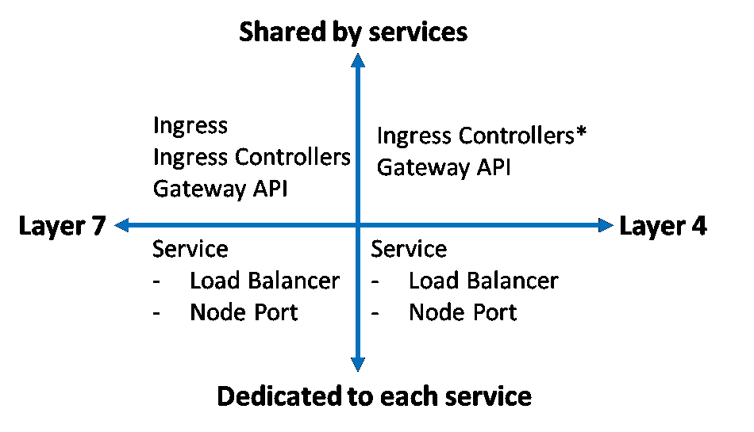

# 在 Kubernetes 集群之外公开非 HTTP 服务的可能性有多大？

> 原文：<https://medium.com/codex/north-south-communication-in-kubernetes-exposing-non-http-services-to-the-outside-world-4ebba4217443?source=collection_archive---------4----------------------->

## 虽然 Ingress 规范只关心 HTTP(S)流量，但是 Ingress 控制器&新的网关 API 也支持非 HTTP 服务。本文试图阐明这些概念。

公开 K8s 集群外部服务的构造。图片由作者创作，灵感来自[https://github . com/Huang-Wei/shared-load balancer/blob/master/readme . MD](https://github.com/Huang-Wei/shared-loadbalancer/blob/master/README.md)

按照 [OSI 模型](https://en.wikipedia.org/wiki/OSI_model)，应用层是最顶层， **HTTP 请求-响应工作在这一层——第 7 层**。TCP 和 UDP 等传输层协议位于 OSI 模型的第 4 层。

当我们公开具有 HTTP 端点(如 REST)的服务时，它可以通过上图中的任何结构作为其第 7 层公开。然而，当我们想要公开一个服务时，比如一个在 TCP 端口 9092/9093 上工作的托管 Kafka 服务，那么我们需要使用第 4 层构造。

上图中需要注意的另一点是**入口资源或网关 API 由几个服务**共享，而**节点端口或负载均衡器服务专门公开服务**。

# 进入

根据 [kubernetes.io](https://kubernetes.io/docs/concepts/services-networking/ingress/) ，入口将 HTTP(S)服务暴露给外部世界(集群外部)。

入口控制器。客户端连接到负载平衡器，负载平衡器将请求转发到入口资源。然后，入口根据配置的路由将其转发给服务。图片来源[https://kubernetes . io/docs/concepts/services-networking/ingress/](https://kubernetes.io/docs/concepts/services-networking/ingress/)

> 什么是 Ingress？
> 
> [入口](https://kubernetes.io/docs/reference/generated/kubernetes-api/v1.25/#ingress-v1-networking-k8s-io)将来自集群外部的 HTTP 和 HTTPS 路由暴露给集群内部的[服务](https://kubernetes.io/docs/concepts/services-networking/service/)。流量路由由入口资源上定义的规则控制。
> 
> 入口不会暴露任意端口或协议。向互联网公开除 HTTP 和 HTTPS 之外的服务通常使用类型为 [Service 的服务。类型=节点端口](https://kubernetes.io/docs/concepts/services-networking/service/#type-nodeport)或[服务。Type =负载平衡器](https://kubernetes.io/docs/concepts/services-networking/service/#loadbalancer)。
> 
> 来源:[https://kubernetes . io/docs/concepts/services-networking/ingress/](https://kubernetes.io/docs/concepts/services-networking/ingress/)

看一下上面的描述，很明显 ingress 不能用于公开 TCP 或 UDP 服务，而是需要使用负载平衡器或节点端口服务，前者需要云供应商的支持，后者需要额外的端口管理。(在之前的[文章](https://betterprogramming.pub/north-south-communication-in-kubernetes-how-does-a-client-talk-to-a-service-inside-a-cluster-8af8b27dbb9)中，我讨论了 Kubernetes 中一般南北通信的可能性，并写了关于负载平衡器服务、节点端口服务&入口的文章)。

幸运的是，除了我们上面看到的，还有更多的入口。我们在上面看到的是 Kubernetes 的入口规范，它是一个厂商中立的规范，用于定义从外部对服务的访问。然而，这个规范的实现可以有额外的特性。

## 入口控制器

该规范由几个第三方入口控制器实现，如这里的[和](https://kubernetes.io/docs/concepts/services-networking/ingress-controllers/)所列。虽然**原始规范仅描述了 HTTP(s)** **流量**，但根据供应商特定的入口控制器，它可能**支持额外的功能，包括支持公开非 HTTP 流量。**

下面是 Kong Ingress Controller 通过其[TCP press](https://docs.konghq.com/kubernetes-ingress-controller/latest/guides/using-tcpingress/)&[UDP press](https://docs.konghq.com/kubernetes-ingress-controller/latest/guides/using-udpingress/)自定义资源公开非 HTTP 服务的几个例子。

# 网关 API

除了 Ingress 规范之外，还有一个正在开发的新规范(目前处于测试阶段)— Kubernetes Gateway API(不与 API Gateway 混合)。

> Gateway API 是官方的 Kubernetes API，类似于[入口](https://kubernetes.io/docs/concepts/services-networking/ingress/)。网关 API 代表入口功能的超集，支持更高级的概念。与 Ingress 类似，Kubernetes 没有内置网关 API 的默认实现。相反，有许多不同的[实现](https://gateway-api.sigs.k8s.io/implementations/)可用，在底层技术方面提供了重要的选择，同时提供了一致和可移植的体验。
> 
> 最初被认为是众所周知的[入口](https://kubernetes.io/docs/reference/kubernetes-api/service-resources/ingress-v1/) API 的后继者，网关 API 的好处包括(但不限于)对许多常用网络协议(例如`HTTP`、`TLS`、`TCP`、`UDP`)的明确支持。
> 
> 来源-[https://kubernetes . io/blog/2022/07/13/gateway-API-graduates-to-beta/](https://kubernetes.io/blog/2022/07/13/gateway-api-graduates-to-beta/)

# 负载平衡器服务

当存在多个公开的服务时，负载平衡器服务可能会变得昂贵/低效，因为每个服务都需要一个专用的负载平衡器。

我希望这篇短文对你有用。

我在 Kubernetes 上的其他文章

[Kubernetes 中的南北沟通——客户机如何与集群内部的服务对话？](https://betterprogramming.pub/north-south-communication-in-kubernetes-how-does-a-client-talk-to-a-service-inside-a-cluster-8af8b27dbb9)

[集群内的服务如何通信？](/codex/east-west-communication-in-kubernetes-how-do-services-communicate-within-a-cluster-310e9dc9dd53)

[为什么我们需要多容器箱？](/codex/communication-inside-a-kubernetes-pod-why-do-we-need-multi-container-pods-3d8d0d64c2c9)

[什么是服务网格？为什么我们需要它而不是 Kubernetes？](/codex/east-west-service-to-service-communication-what-is-service-mesh-4e56f94bc89c)