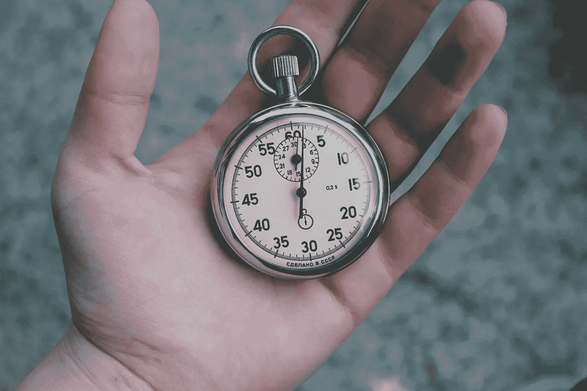

# 不仅仅是另一个倒计时器

> 原文：<https://medium.com/codex/not-just-another-countdown-timer-2b5500d981de?source=collection_archive---------7----------------------->

在 [Unsplash](https://unsplash.com/?utm_source=unsplash&utm_medium=referral&utm_content=creditCopyText) 上由 [Veri Ivanova](https://unsplash.com/@veri_ivanova?utm_source=unsplash&utm_medium=referral&utm_content=creditCopyText) 拍摄的照片

最近，我有机会改进我公司应用程序的一个主要 UI 组件，名为倒计时定时器。它用于显示时间敏感型营销活动的持续时间。在做这个改进的时候，我想起了我的一个面试问题，也是为了建立一个简单的倒计时器。当时，我的回答是这样的: