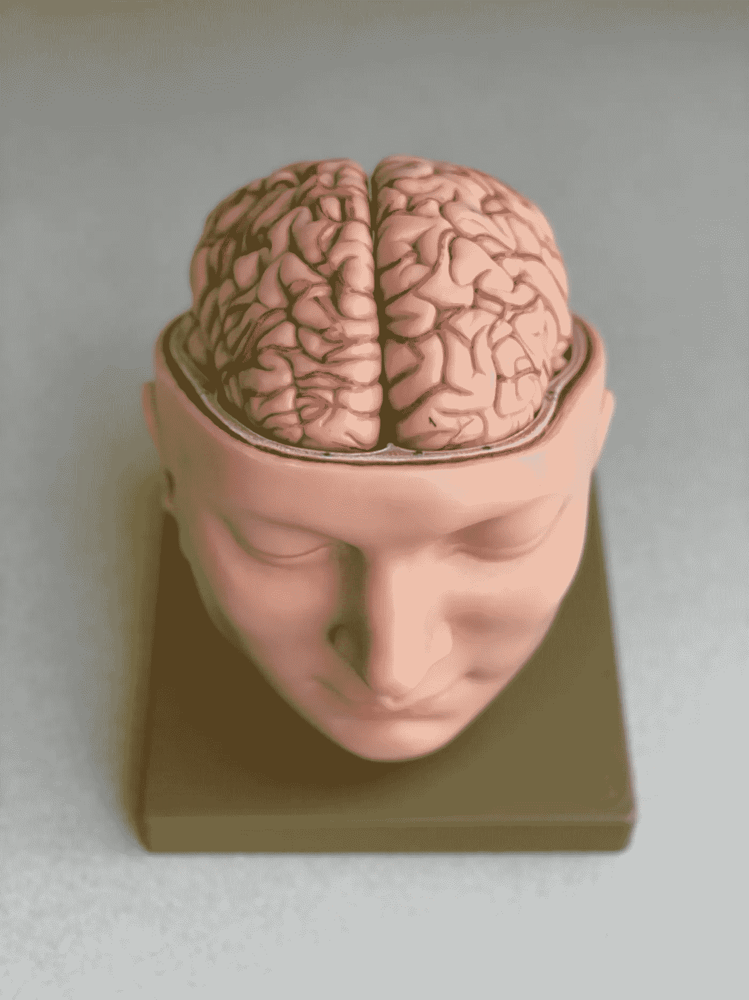

# 不仅仅是另一种新的智力理论

> 原文：<https://medium.com/codex/not-just-another-new-theory-of-intelligence-b3aa5553ceb8?source=collection_archive---------15----------------------->

## 杰夫·霍金斯的《一千个大脑》评论

作者拍摄的医学模型照片

我们如何思考？我们如何在世界上航行？什么是智能？我的大脑是如何工作的？如果你问过自己这些问题，杰夫·霍金斯有一些革命性但直截了当的答案。**他 2021 年出版的书的第一部分，*一千个大脑*是我读过的关于这个话题的最好的 100 页。他的作品是…**