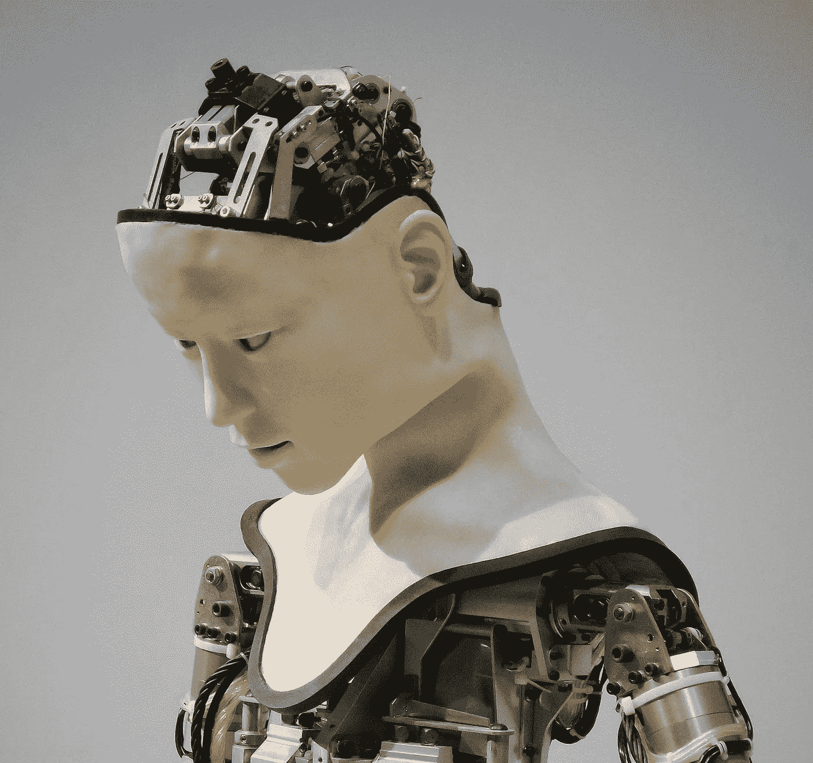

# 不仅仅是另一种智力理论——第二部分

> 原文：<https://medium.com/codex/not-just-another-theory-of-intelligence-part-2-f4f43476f0f2?source=collection_archive---------19----------------------->

[附身摄影](https://unsplash.com/@possessedphotography?utm_source=unsplash&utm_medium=referral&utm_content=creditCopyText)在 [Unsplash](https://unsplash.com/s/photos/robot?utm_source=unsplash&utm_medium=referral&utm_content=creditCopyText) 上拍照

# 《一千个大脑》回顾

未来的智能机器人会怎么想？超常智力可能吗？智能机器人会对人类好，还是试图毁灭我们？如果你问过自己这些问题，杰夫·霍金斯 2021 年出版的书《T4:一千个大脑》会给你答案。在我之前的文章中，我提到他的书**第一部分**的第一部分…