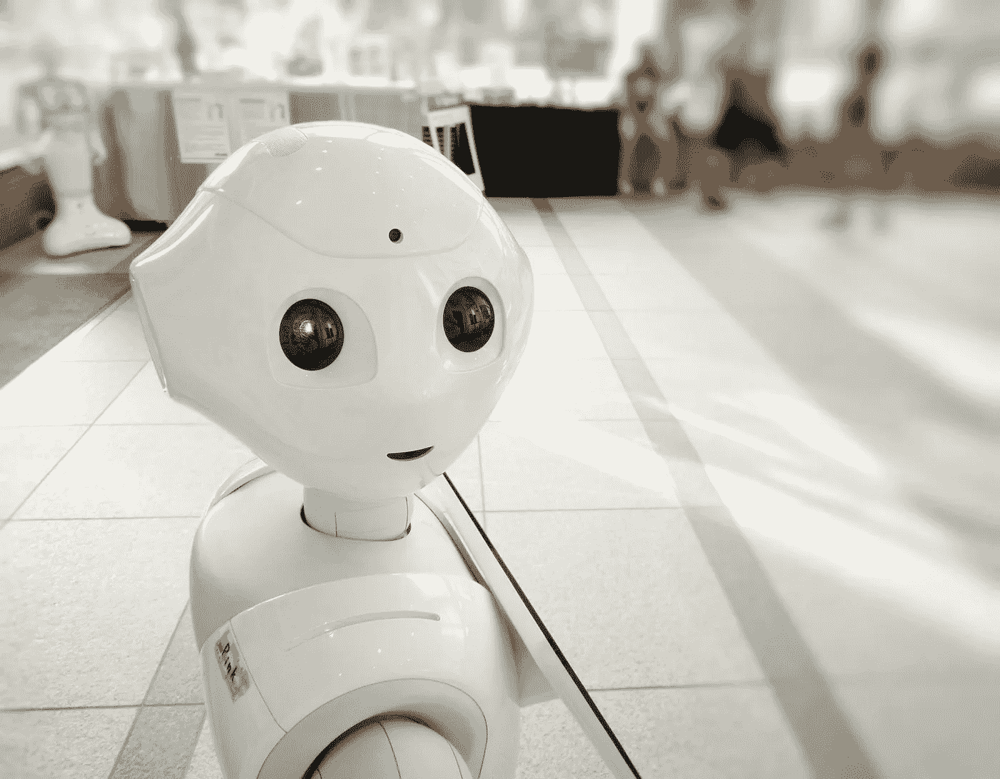

# 没那么可怕的机器人

> 原文：<https://medium.com/codex/not-so-scary-robots-b7fce2dfc41e?source=collection_archive---------13----------------------->

[附身摄影](https://unsplash.com/@possessedphotography?utm_source=unsplash&utm_medium=referral&utm_content=creditCopyText)在 [Unsplash](https://unsplash.com/s/photos/artificial-intelligence?utm_source=unsplash&utm_medium=referral&utm_content=creditCopyText) 上拍照

## 我仍然担心机器人。科学家给了我放松一点的理由。

几个月前，我偶然在一些媒体上看到了关于人工智能可能比人类更强大的文章和视频。我看到埃隆·马斯克(Elon Musk)向我们发出了关于人工智能力量的可怕警告。我看见他叫我们慢下来。去思考…