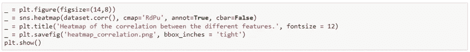

# 不那么简单的线性回归:多元线性回归

> 原文：<https://medium.com/codex/not-so-simple-linear-regression-multiple-linear-regression-2140146f1706?source=collection_archive---------15----------------------->

当我们对一个自变量如何影响因变量感兴趣时，简单线性回归非常有用，但是当我们有多个自变量时，我们该怎么办呢？假设我们对房价感兴趣，那么有相当多的不同特征可能在决定其价值方面发挥作用:优越的地理位置、一定数量的卧室、社区的富裕程度、离学校的距离等等。它们都可能与房价有线性关系，我们可能希望所有这些特征在我们的回归模型中发挥作用。这就是多元线性回归的伟大之处。

多元线性回归有很多优点。如果我们有一个分类问题，那么我们不能真正使用线性回归模型在我们的数据集上得出结论，但是如果我们计划使用机器学习算法，我们可以使用多元线性回归来查看一个或多个特征是否彼此高度相关。如果是的话，在我们将数据输入分类算法之前，我们总是可以丢弃其中的一个。

还值得注意的是，热图是一种简单的可视化方法，可以了解我们的特征和目标变量之间的关系，甚至不同特征之间的关系。

尝试使用 cmap，看看哪种调色板最适合您的数据。我发现热图很容易理解，尤其是带有注释的相关性。对于这篇文章，看一看最后一列或最后一行。颜色越接近紫色，该特征与房价的相关性就越高。

现在，我们想制作一个模型，想出一个可以预测房价的方程。在上一篇文章中，我讨论了使用 Statsmodel 和 Scikit Learn 进行简单线性回归的区别。

让我们看看同一个数据集，看看多元线性回归能做什么。数据集是干净的，由连续的数据组成，地址字段除外。由于回归分析只能在连续的数字数据上进行，所以我删除了地址字段。因此，我们可以预期一个模型有 5 个自变量，房价(“价格”)是我们的因变量。这意味着我们可以期望我们的线性回归模型采取以下形式:

系数 a1，..a5 描述了各个自变量和因变量之间的关联。它们的符号，正或负，表明这两个变量之间的正或负关联。

请考虑以下情况:

我们可以认为，随着平均地区收入的增加，平均房价也趋于增加。讨论这些系数实际上代表什么很重要:如果自变量中有**个单位增加**，那么在这种情况下平均地区收入增加**个单位，**那么平均房价将增加 a1 美元。这是在保持其他特征的影响不变的情况下计算的。因此，这实质上意味着系数可以帮助确定自变量和因变量之间的**唯一**关联。

正如我在这篇文章的[中提到的，Statsmodel 非常擅长提供对数据集的洞察，所以我使用 Statsmodel 创建了一个多元线性回归模型。](/codex/linear-regression-pythonic-approaches-to-simple-linear-regression-93a75e70c520)

这里要问一个问题:我们的模型的线性回归线应该经过原点吗？这里没有正确或错误的答案，它真的取决于你在建模什么。我假设即使是最不理想的房子也不会是自由的，所以不，我们的模型不会通过原点。

所以，我们需要确保我们有所有必要的进口，然后我们准备好了！

我将使用[这篇文章](/codex/linear-regression-pythonic-approaches-to-simple-linear-regression-93a75e70c520)中的培训和测试集，并随时查看[笔记本](https://github.com/iban121/Linear-Regression-/blob/main/Regression%20Analysis.ipynb)。X_train 由 80%的数据集组成，包含所有数字特征，而 y_train 集合是相应的房价。

接下来，我们需要确保将 y 轴截距添加到我们的模型中，因为 Statsmodel 默认将截距设置为(0，0)。然后，我们输入训练数据。

的。summary()方法非常有助于我们深入了解回归模型。

这里有很多拆包！首先，让我们看看“coef”列。第一个条目“const”代表 y 轴截距。同一列中的其余项代表每个独立变量的系数:例如，如果一所房子的房间数量的平均面积增加**一个单位，那么我们的模型表明价格预计将增加 **$120，500** 。汇总表没有任何负系数，这意味着当我们的所有功能增加一个单位时，平均房价也会增加。**

现在，我们必须问，我们应该有多确信我们的模型？换句话说，在我们的数据集中，我们是否一直看到价格的上涨？这就是第二列发挥作用的地方:“std err”是标准误差。标准误差实质上是对相应系数的标准偏差的估计:我们在这里有 4000 个数据点用于训练集，因此可以将标准误差想象为在这 4000 个数据点中系数变化程度的度量。标准误差越低，模型越好。

那么，我们的模式是什么？我们的模型本质上是一个等式:

我已经将所有内容四舍五入到四位有效数字，但是如果您仔细观察，您会发现这些特性都乘以了我们的汇总表中的系数。

我们有一个多元线性回归模型，描述了随着其他特征的变化，平均房价的变化。现在怎么办？我们已经看到，标准误差有助于评估我们使用的 4000 个数据点中系数的可变性，这告诉我们该模型并不完全完美。在这篇文章中，我提到了判断线性回归的常用分析工具:我们的 Statsmodel。summary()方法实际上为这些返回了值，甚至给了我们更多要考虑的东西！

首先，我们可以看到 R 平方值为 0.917。这告诉我们，我们的数据集中 91.7%的可变性可以用我们的模型来解释。那其实挺好的。然而，就像你不会在一个糟糕的测试结果后开始严重的医疗治疗一样，我们不能使用一个评估指标，如决定系数，R 平方值，来得出我们的模型非常可靠的结论。正如我之前提到的，Statsmodel 非常擅长提供对数据的洞察，因此它为我们提供了更多的指标。当我讨论 p 值以及如何解释它们时，我会在另一篇文章中讨论其中的许多内容，但现在，尝试一下您自己的多元线性回归！