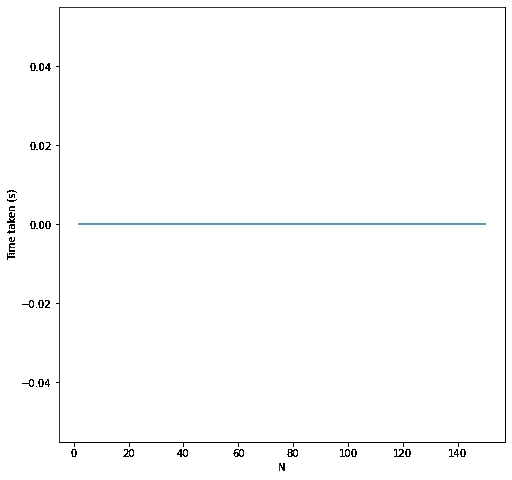

# 关于递归的注记

> 原文：<https://medium.com/codex/notes-on-recursion-53f90d4ed7be?source=collection_archive---------11----------------------->

## 这个博客旨在简化和可视化递归概念及其工作


米卡·鲍梅斯特在 [Unsplash](https://unsplash.com?utm_source=medium&utm_medium=referral) 上的照片

**递归**是一种编程概念，通过将复杂的问题分解成更小的子问题来解决它。

运行时调用自身的函数是**递归函数**。例如，在 Linux 系统中，我们使用命令“ls -R ”,它告诉系统递归地显示目录的所有内容，或者进入每个文件夹，依次进入子文件夹并打印内容。

## 堆栈溢出问题

递归函数的主要缺点是**堆栈溢出**问题。

当 Python 程序运行时，变量(变量指向的堆栈中的地址或引用)与函数调用的返回地址一起被加载到堆栈内存中。然而堆栈内存是静态的，这意味着我们可以进行有限次数的函数调用。此外，堆栈是临时的，因为一旦 Python 解释器执行了函数调用并返回到下一行，地址就会弹出堆栈。[这篇](https://towardsdatascience.com/python-memory-and-objects-e7bec4a2845#:~:text=Code%20%28also%20called%20Text%20or%20Instructions%29%20section%20of,in%20the%20Stack%20Memory%20%28also%20called%20the%20Stack%29.)博客更详细地解释了 Python 中的内存管理。

因为递归函数调用自己，所以下一行代码的返回地址在函数第一次调用自己时就存储在堆栈中。随后，随着函数不断调用自身，返回地址被存储在堆栈中，当由于堆栈内存耗尽而没有更多空间来存储另一个地址时，这可能导致堆栈溢出。

## 迭代、递归、动态规划

编写递归解决方案包括以下内容:

1.  **识别基本情况**:基本情况是指代码的停止条件，一旦满足基本情况，Python 解释器弹出返回地址

2.**识别递归情况**:函数需要调用自身或递归关系的情况，递归关系将调用函数来解决比原始复杂问题更小的相似子问题([分治](https://www.tutorialspoint.com/data_structures_algorithms/divide_and_conquer.htm)方法)

3.**越来越接近基础案例**:当我们经历递归案例时，在某一点上我们应该到达基础案例

```
def fibonacci(n):

 if n <= 1: return n # base case

 return fibonacci(n-1) + fibonacci(n-2) # recursive case 
```

函数 fibonacci 是一个递归函数，其中第一行是基本情况；一旦我们计算了 Fibonacci(1 ), Python 解释器返回 n 或 1。对于任何大于 1 的 n，满足递归情况，调用 fibonacci。

**递归与迭代:**

虽然递归遵循 [DRY](https://en.wikipedia.org/wiki/Don%27t_repeat_yourself) (不要重复自己)原则保持代码简单，但它也有很大的内存占用(一个大的调用栈)；因此，当我们**知道我们想要通过**多少次迭代时，迭代可能是有用的。

当我们不知道迭代次数以及处理像树和链表这样的数据结构时，递归是有用的。使用深度优先搜索遍历二叉树的所有节点的过程非常简单。

让我们分析编码斐波纳契数列的堆栈和递归所用的时间。

```
import inspect
import timenum_calls_list = []def fibonacci(n):
 num_calls = 0

 if n <= 1: return n

 num_calls_list.append(len(inspect.stack())) # Return a list of the frames pushed onto stack for executing the current line of code

 return fibonacci(n-1) + fibonacci(n-2)
```

我们使用`inspect.stack()`来查看 Python 调用栈。我们这样得到一个命名的元组

`FrameInfo(frame, filename, lineno, function, code_context, index)`

num_calls_list 存储每次递归调用时的`len(inspect.stack())`。对于 n = 2，我们得到`len(num_calls_list), num_calls_list`:

```
1 [29]
```

*   1 次对函数递归的调用，29 代表从函数递归到最后一次对所用库的堆栈调用的堆栈调用次数(因为这是在 Anaconda 上运行的，所以我们也将 Anaconda 帧添加到堆栈中)。

打印`inspect.stack()`返回的列表的第一个元素

```
FrameInfo(frame=<frame at 0x0000027E131DECF0, file '<ipython-input-12-89cd151ff95a>', line 6, code fibonacci>, filename='<ipython-input-12-89cd151ff95a>', lineno=5, function='fibonacci', code_context=['    for ind, i in enumerate(inspect.stack()):\n'], index=0)
```

第一个字段`frame`具有帧信息，例如地址、包含它的文件名、调用函数`<frame at 0x0000027E131DECF0, file ‘<ipython-input-12–89cd151ff95a>’, line 6, code fibonacci>`；`filename`具有调用 `‘<ipython-input-12–89cd151ff95a>'`函数的文件名；从`lineno`中调用的行；在`function`中调用`‘fibonacci’`的功能；并且`code context` 给出了检查该帧的代码行列表；而`index`表示列表中代码上下文的索引。

对于 n = 3:

```
2 [29, 30]
```

*   对于 n = 3，我们有:


计算 N = 3 的斐波那契数列的递归树

1#纤维(3) =纤维(2) +纤维(1) = >纤维(2) + 1

2# fib(2) = fib(1) + fib(0) => 1 + 0

*   2 个函数调用，其中第二个函数调用在堆栈空间中堆叠了 30 个地址(比第一个多 1 个，因为递归函数调用用于计算 fibonacci 值 2)

类似地，对于 n = 5:

```
7 [29, 30, 31, 32, 31, 30, 31]
```

对于 n = 8:

```
33 [29, 30, 31, 32, 33, 34, 35, 34, 33, 34, 32, 33, 34, 33, 31, 32, 33, 34, 33, 32, 33, 30, 31, 32, 33, 34, 33, 32, 33, 31, 32, 33, 32]
```

对于 n = 15:

```
986 [29, 30, 31, 32, 33, 34, 35, 36, 37, 38, 39, 40, 41, 42, 41, 40, 41, 39, 40, 41, 40, 38, 39, 40, 41, 40, 39, 40, 37, 38, 39, 40, 41, 40, 39, 40, 38, 39, 40, 39, 36, 37, 38, 39, 40, 41, 40, 39, 40, 38, 39, 40, 39, 37, 38, 39, 40, 39, 38, 39, 35, 36, 37, 38, 39, 40, 41, 40, 39, 40, 38, 39, 40, 39, 37, 38, 39, 40, 39, 38, 39, 36, 37, 38, 39, 40, 39, 38, 39, 37, 38, 39, 38, 34, 35, 36, 37, 38, 39, 40, 41, 40, 39, 40, 38, 39, 40, 39, 37, 38, 39, 40, 39, 38, 39, 36, 37, 38, 39, 40, 39, 38, 39, 37, 38, 39, 38, 35, 36, 37, 38, 39, 40, 39, 38, 39, 37, 38, 39, 38, 36, 37, 38, 39, 38, 37, 38, 33, 34, 35, 36, 37, 38, 39, 40, 41, 40, 39, 40, 38, 39, 40, 39, 37, 38, 39, 40, 39, 38, 39, 36, 37, 38, 39, 40, 39, 38, 39, 37, 38, 39, 38, 35, 36, 37, 38, 39, 40, 39, 38, 39, 37, 38, 39, 38, 36, 37, 38, 39, 38, 37, 38, 34, 35, 36, 37, 38, 39, 40, 39, 38, 39, 37, 38, 39, 38, 36, 37, 38, 39, 38, 37, 38, 35, 36, 37, 38, 39, 38, 37, 38, 36, 37, 38, 37, 32, 33, 34, 35, 36, 37, 38, 39, 40, 41, 40, 39, 40, 38, 39, 40, 39, 37, 38, 39, 40, 39, 38, 39, 36, 37, 38, 39, 40, 39, 38, 39, 37, 38, 39, 38, 35, 36, 37, 38, 39, 40, 39, 38, 39, 37, 38, 39, 38, 36, 37, 38, 39, 38, 37, 38, 34, 35, 36, 37, 38, 39, 40, 39, 38, 39, 37, 38, 39, 38, 36, 37, 38, 39, 38, 37, 38, 35, 36, 37, 38, 39, 38, 37, 38, 36, 37, 38, 37, 33, 34, 35, 36, 37, 38, 39, 40, 39, 38, 39, 37, 38, 39, 38, 36, 37, 38, 39, 38, 37, 38, 35, 36, 37, 38, 39, 38, 37, 38, 36, 37, 38, 37, 34, 35, 36, 37, 38, 39, 38, 37, 38, 36, 37, 38, 37, 35, 36, 37, 38, 37, 36, 37, 31, 32, 33, 34, 35, 36, 37, 38, 39, 40, 41, 40, 39, 40, 38, 39, 40, 39, 37, 38, 39, 40, 39, 38, 39, 36, 37, 38, 39, 40, 39, 38, 39, 37, 38, 39, 38, 35, 36, 37, 38, 39, 40, 39, 38, 39, 37, 38, 39, 38, 36, 37, 38, 39, 38, 37, 38, 34, 35, 36, 37, 38, 39, 40, 39, 38, 39, 37, 38, 39, 38, 36, 37, 38, 39, 38, 37, 38, 35, 36, 37, 38, 39, 38, 37, 38, 36, 37, 38, 37, 33, 34, 35, 36, 37, 38, 39, 40, 39, 38, 39, 37, 38, 39, 38, 36, 37, 38, 39, 38, 37, 38, 35, 36, 37, 38, 39, 38, 37, 38, 36, 37, 38, 37, 34, 35, 36, 37, 38, 39, 38, 37, 38, 36, 37, 38, 37, 35, 36, 37, 38, 37, 36, 37, 32, 33, 34, 35, 36, 37, 38, 39, 40, 39, 38, 39, 37, 38, 39, 38, 36, 37, 38, 39, 38, 37, 38, 35, 36, 37, 38, 39, 38, 37, 38, 36, 37, 38, 37, 34, 35, 36, 37, 38, 39, 38, 37, 38, 36, 37, 38, 37, 35, 36, 37, 38, 37, 36, 37, 33, 34, 35, 36, 37, 38, 39, 38, 37, 38, 36, 37, 38, 37, 35, 36, 37, 38, 37, 36, 37, 34, 35, 36, 37, 38, 37, 36, 37, 35, 36, 37, 36, 30, 31, 32, 33, 34, 35, 36, 37, 38, 39, 40, 41, 40, 39, 40, 38, 39, 40, 39, 37, 38, 39, 40, 39, 38, 39, 36, 37, 38, 39, 40, 39, 38, 39, 37, 38, 39, 38, 35, 36, 37, 38, 39, 40, 39, 38, 39, 37, 38, 39, 38, 36, 37, 38, 39, 38, 37, 38, 34, 35, 36, 37, 38, 39, 40, 39, 38, 39, 37, 38, 39, 38, 36, 37, 38, 39, 38, 37, 38, 35, 36, 37, 38, 39, 38, 37, 38, 36, 37, 38, 37, 33, 34, 35, 36, 37, 38, 39, 40, 39, 38, 39, 37, 38, 39, 38, 36, 37, 38, 39, 38, 37, 38, 35, 36, 37, 38, 39, 38, 37, 38, 36, 37, 38, 37, 34, 35, 36, 37, 38, 39, 38, 37, 38, 36, 37, 38, 37, 35, 36, 37, 38, 37, 36, 37, 32, 33, 34, 35, 36, 37, 38, 39, 40, 39, 38, 39, 37, 38, 39, 38, 36, 37, 38, 39, 38, 37, 38, 35, 36, 37, 38, 39, 38, 37, 38, 36, 37, 38, 37, 34, 35, 36, 37, 38, 39, 38, 37, 38, 36, 37, 38, 37, 35, 36, 37, 38, 37, 36, 37, 33, 34, 35, 36, 37, 38, 39, 38, 37, 38, 36, 37, 38, 37, 35, 36, 37, 38, 37, 36, 37, 34, 35, 36, 37, 38, 37, 36, 37, 35, 36, 37, 36, 31, 32, 33, 34, 35, 36, 37, 38, 39, 40, 39, 38, 39, 37, 38, 39, 38, 36, 37, 38, 39, 38, 37, 38, 35, 36, 37, 38, 39, 38, 37, 38, 36, 37, 38, 37, 34, 35, 36, 37, 38, 39, 38, 37, 38, 36, 37, 38, 37, 35, 36, 37, 38, 37, 36, 37, 33, 34, 35, 36, 37, 38, 39, 38, 37, 38, 36, 37, 38, 37, 35, 36, 37, 38, 37, 36, 37, 34, 35, 36, 37, 38, 37, 36, 37, 35, 36, 37, 36, 32, 33, 34, 35, 36, 37, 38, 39, 38, 37, 38, 36, 37, 38, 37, 35, 36, 37, 38, 37, 36, 37, 34, 35, 36, 37, 38, 37, 36, 37, 35, 36, 37, 36, 33, 34, 35, 36, 37, 38, 37, 36, 37, 35, 36, 37, 36, 34, 35, 36, 37, 36, 35, 36]
```

总结..


随着 N 的增加，我们看到所用的时间、总的函数调用和总的堆栈空间呈指数增长。因此，如果我们知道输入 N 可以变化到一个非常大的数，递归被认为不是一个非常有效的解决方案。

另一方面，**迭代解**不使用额外的堆栈空间，并且在线性时间内找到解。

**动态编程**将通过存储已经计算出的斐波那契数列来帮助节省时间，这样我们就不必在每次迭代中执行多余的计算。

对于这个问题，下面的方法比递归更有效。

```
def fibonacci(n):
    fib, fib_list = 0 , [] # array to store the fibonacci values
    for i in range(0,n):
        if i <= 1 : 
            fib_list.append(i)
        else:
            fib_list.append(sum(fib_list))
            fib_list = fib_list[1:]  # Use a window to only store the nessecary fibonacci series values to calculate the next

    return fib_list[-1]+fib_list[-2]
```

随着 N 的增加，所用的时间几乎是一个常数。我们还可以看到，对于 N= 150，我们得到的时间与 N= 0 几乎相同。



## 二叉树上的深度优先搜索

编写一个递归程序来打印二叉树的前序遍历(根->左->右) :

```
def get_node(node):

    if node == None: # base case
        return

    num_calls_list.append(len(inspect.stack())) node_list.append(node.data) # Append to node_list

    #print('left', node.data)
    a = get_node(node.left) # Traverse left node  ## Recursive case

    # print('right', node.data)
    b = get_node(node.right) # Traverse right node ## Recursive case

    return
```

这个解决方案非常容易理解:

1.  基本情况:如果当前节点为 None，则返回到调用函数
2.  递归情况:如果节点不为 None，则查找左侧节点，直到基本情况返回 None；之后，寻找正确的节点，直到没有返回。

我们得到以下输出:

```
'1-> 2-> 5-> 4-> 6'
```

原始树:


树 1

我们考虑另外两棵树，深度为 4 和 8 的树 2 和树 3:


tree2


tree3

打印花费的时间和我们得到的堆栈空间:


虽然代码非常**简单易懂**，但是我们看到随着树深度的增加，花费的时间和使用的堆栈空间都有所增加。

另一方面，如果我们使用迭代解决方案:

```
def print_node(linked_list):
    node = linked_list.head
    stack, preorder_traversal = [], [] # stack to store the previous node to pop ; preorder_traversal stores the order of nodes while True:

        if node != None: # keep finding the left node and store the root node in stack

            preorder_traversal.append(node.data)

            stack.append(node)
            # print('Appending ', node.data, 'to stack ..', stack)

            node = node.left

        elif stack: # Once left node returns null, we pop the stack and find the right nodes

            node = stack.pop()
            node = node.right

        else:
            break

    return preorder_traversal #print("-> ".join(preorder_traversal))
```

我们得到了一个常数时间解，尽管代码不像递归解那样容易理解。


*感谢阅读！*

另外，如果有任何改进这篇文章的建议，请告诉我！

[这里的](https://github.com/aishani691/Recursion/blob/main/recursion_1.ipynb)是参考代码的链接。

## 参考资料:

[https://towardsdatascience . com/python-memory-and-objects-E7 bec 4a 2845 #:~:text = Code % 20(也称为% 20Text % 20or 或% 20 instructions)% 20 section % 20 of，在%20Stack%20Memory%20(也称为%20the%20Stack)中。](https://towardsdatascience.com/python-memory-and-objects-e7bec4a2845#:~:text=Code%20(also%20called%20Text%20or%20Instructions)%20section%20of,in%20the%20Stack%20Memory%20(also%20called%20the%20Stack).)

 [## 深入 Python 调用堆栈(PyGotham 2018)

### 我在 PyGotham 2018 上做了一个关于 Python 如何实现堆栈框架以及 Dropbox 如何利用它来改善崩溃的演讲…

nikhilism.com](https://nikhilism.com/post/2018/python-call-stack/) 

[https://medium . com/forward-data-science/python-stack-frames-and-tail-call-optimization-4d 0 ea 55 b 0542](/towards-data-science/python-stack-frames-and-tail-call-optimization-4d0ea55b0542)

[https://www . udemy . com/course/master-the-coding-interview-data-structures-algorithms/？ran mid = 39197&rane aid = frpllyicu 8 o&ranSiteID = frpllyicu 8 o-KUTgZT。extsaduvc 9 VM hew&lsn pubid = frpllyicu 8 o&UTM _ source = aff-campaign&UTM _ medium = udemyads](https://www.udemy.com/course/master-the-coding-interview-data-structures-algorithms/?ranMID=39197&ranEAID=fRpllyICu8o&ranSiteID=fRpllyICu8o-KUTgZT.ExtsAdUVC9vMHew&LSNPUBID=fRpllyICu8o&utm_source=aff-campaign&utm_medium=udemyads)

【https://www.coursera.org/learn/algorithmic-toolbox 