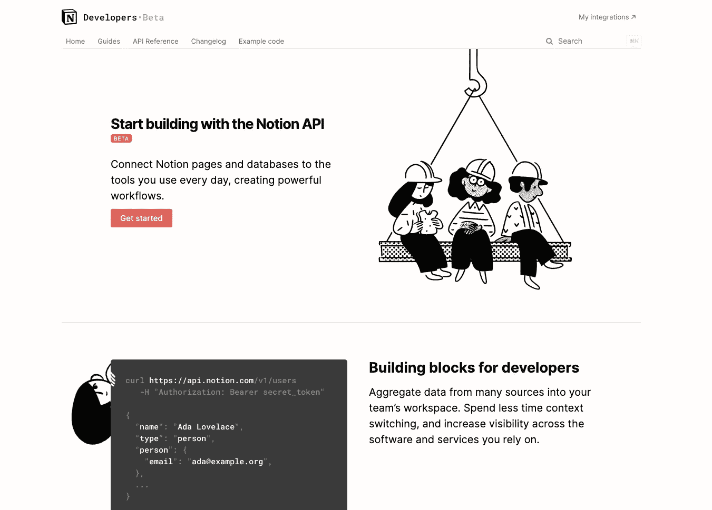

# 概念 API

> 原文：<https://medium.com/codex/notion-api-5724f5f071a5?source=collection_archive---------15----------------------->

概念 API 简介

概念开发者网站截图

## 在后台

我们计划在[自定义回购](http://ihatereading.in/customrepo)中引入一个新的部分。我们计划将它命名为 API。顾名思义，它将提供关于第三方软件和模块的介绍性日志和存储库。

在今天的故事中，我们将对概念 API 进行概述。这个概念就是在工作场所写下你的…