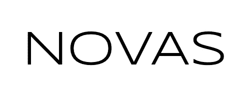
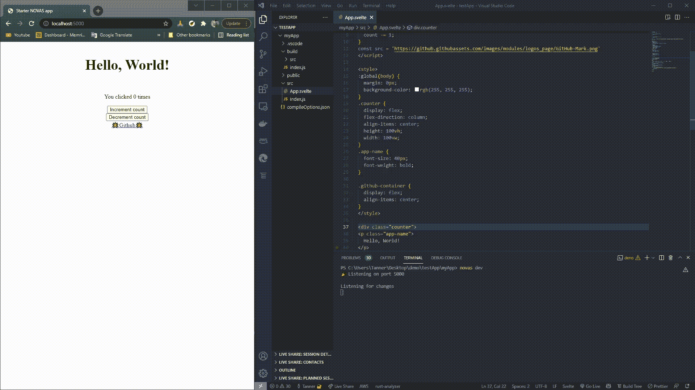

# NOVAS:加速 Svelte 和 Deno 应用程序的生成。

> 原文：<https://medium.com/codex/novas-accelerating-svelte-and-deno-application-generation-3371c395461a?source=collection_archive---------3----------------------->


图片由 [NASA](https://www.nasa.gov/mission_pages/chandra/mini-supernova-explosion-could-have-big-impact.html) 提供

# **💡简介**

从头开始配置应用程序可能是开发中最耗时和最麻烦的障碍之一——尤其是当想要尝试新技术时。如果您想在新的框架和运行时中快速开始编程，而不需要进行设置，该怎么办呢？也许你已经听说过这个比 React 和 Vue.js 更有性能的框架，你有兴趣使用它。也许还有具有默认安全性和与 TypeScript 兼容的 Node.js 运行时选项？这些技术在开箱即用的情况下彼此兼容吗？



[你好，新星](https://novas.land/)

# **👋遇见新星**

NOVAS 是一个全面的构建工具，使所有经验水平的开发人员能够在 Deno 运行时有效地设置苗条的应用程序。开发人员可以使用最受欢迎和最令人满意的 web 框架创建高性能的站点，同时利用 Deno 的安全性和类型脚本支持特性。NOVAS 消除了令人头痛的初始文件配置设置、依赖项导入和样板文件，允许开发人员专注于编写业务逻辑。

它的轻量级和简洁的命令行界面(CLI)为开发人员提供了一种在快速开发环境中创建、编译和捆绑新的细长单文件组件的方法，通过使用热/实时重新加载来获得出色的用户体验。

NOVAS 弥合了实现和集成 Svelte 的控制论框架到现代 Deno 运行时的差距，因此开发人员可以用更少的工作创造更多。

# **🎬入门**

```
deno install --allow-net --allow-read --allow-write --unstable https://deno.land/x/novas/cli.ts
```

只需使用指定的权限从命令行安装 NOVAS，并按照我们的 [Github](https://github.com/NOVASland/NOVAS) 上的说明创建您的第一个 NOVAS 应用程序。

*   要**创建**一个项目，请键入:

```
 novas create [project name]
```

*   为了**编译**，首先将目录切换到项目的根目录( **cd【项目名称】**)，然后键入:

```
novas build
```

*   要开始**开发**，请键入:

```
novas dev
```

# 🔧工作原理

总之，NOVAS 提供了一个简单直观的 CLI 解决方案来克服苗条和 Deno 不兼容。NOVAS 只利用标准的 Deno 库，优先考虑小的包大小和有限的依赖方法。

创建应用程序时，NOVAS 会为您的新项目初始化默认目录和文件结构。为开发人员提供了一个标准的 build、public 和 src 文件夹。

当提供到根 App.svelte 组件的路径时，NOVAS 识别并修改所有的。苗条的文件是浏览器兼容的。成功构建应用程序后，构建文件夹将填充相应的。js 文件。服务器启动后，可以在 [http://localhost:3000](http://localhost:5000) 上查看初始静态站点。

完整的说明可以在 NOVAS [的自述](https://github.com/NOVASland/NOVAS#how-to-install-novas)中找到。

## **🔎实时预览您的代码**

当你在开发过程中修改你的瘦组件时，JavaScript 会实时动态生成，所以你可以立即在浏览器上看到你的修改。这个特性是通过 NOVAS 的 WebSockets 实现的，它在幕后监听 src 文件夹中修改或删除的文件更改。保存任何更改后，将再次编译苗条代码，浏览器将重新加载以反映这些更改。



自其生产级别发布以来，Deno 一直作为 Node.js 的一个显著替代方案而受到技术界的关注。凭借其默认安全的教学方法，以及作为单个可执行文件无依赖性发布的能力，Deno 显然旨在对其前身进行改进。类似地，自从 Svelte 推出以来，越来越多的开发人员开始对其灵活的风格、编译时编译方法、反应式声明的使用等感兴趣。

我们构建 NOVAS 来帮助降低学习这些迷人技术的门槛，以简化配置和创建一个快速、轻量级的工具来跟上开发人员的理念为指导。我们希望 NOVAS 在您的编码工作中为您服务！

# **💻如何投稿**

我们一直在寻求为开源社区更好地改进 NOVAS。请继续关注，因为我们希望尽快纳入更多的功能！

如果您想做出贡献或有任何意见、要求的功能或评论，请访问我们的 [Github](https://github.com/NOVASland/NOVAS) 产品页面进行联系，或访问[novas . land](https://novas.land/)/[https://deno.land/x/novas](https://deno.land/x/novas)了解更多信息。

***连接新星团队:***

**克里斯蒂·赫林**@[LinkedIn](https://www.linkedin.com/in/christie-herring-3b1044ba/)|[Github](https://github.com/clherring)

**加勒特·希克曼**@[LinkedIn](http://www.linkedin.com/in/garrettrhickman)|[Github](https://github.com/grhhhh)

**刘静仪**@[LinkedIn](https://www.linkedin.com/in/liusylvia949/)|[Github](https://github.com/liusylvia)

**坦纳·彼得森**@[LinkedIn](https://www.linkedin.com/in/tanner-peterson/)|[Github](https://github.com/tanpeterson)