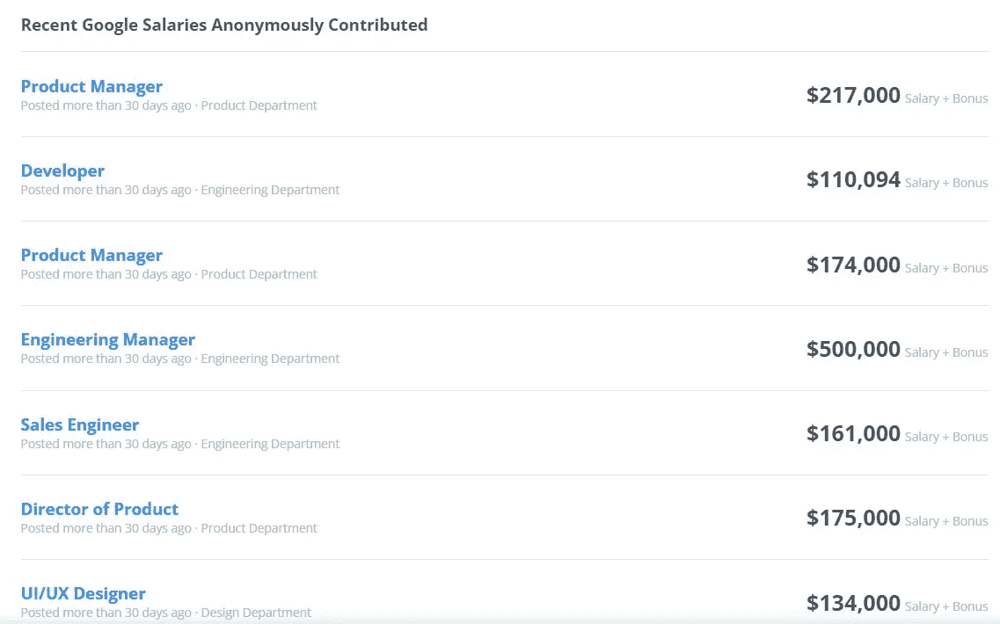
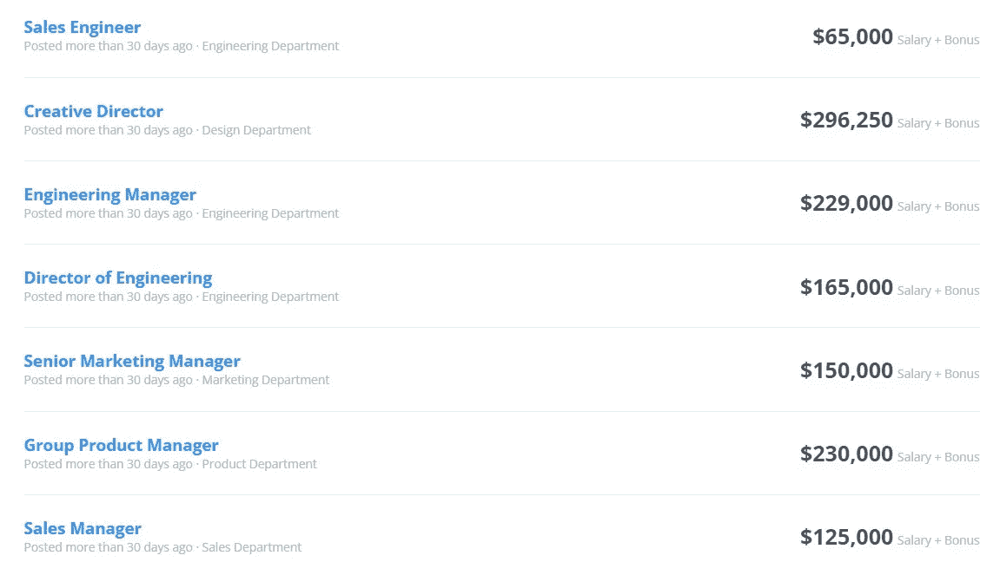

# 现在是为谷歌工作的最好时机！🤴

> 原文：<https://medium.com/codex/now-is-the-best-time-to-work-for-google-71db9f4a4702?source=collection_archive---------5----------------------->

## 为谷歌工作的 8 个理由

# 介绍

2014 年，谷歌在 Glassdoor 的 50 个最佳工作环境年度榜单中排名第一，远远超过了《财富》杂志的 100 个最佳工作场所年度榜单。

有大量的理由说明为什么谷歌是一个值得工作的体面组织，以及该组织如何具有吸引人的谷歌代表优势，使其代表在不影响谷歌组织价值观的情况下呆得更久。

请允许我们在这里从上到下地审视一下为什么为谷歌工作，为什么它能有效地让员工愉快地工作。

照片由[米切尔罗](https://unsplash.com/@mitchel3uo?utm_source=medium&utm_medium=referral)在 [Unsplash](https://unsplash.com?utm_source=medium&utm_medium=referral)

# 为谷歌工作的 8 个理由是

# 1)金钱&巨大的财政支持

我们作为一个整体知道主要的解释，毕竟谁能说现金是个人为什么需要为谷歌工作的基本动机之一。

在谷歌，薪酬最高的工作是财务总监，年薪 60 万美元，最低的是秘书，年薪 37305 美元。谷歌按部门划分的正常薪酬包括:IT 部门 157，433 美元，通信部门 135，051 美元，人力资源部门 85，556 美元，财务部门 104，014 美元。谷歌的大部分薪酬都在 134386 美元以上。

谷歌代表提供的薪酬包括工程总监、工程经理、开发人员和销售工程师等头衔。类似地，information 有 682 条来自谷歌员工的薪酬记录。

来源:https://www.comparably.com/

他们还提供个人财务援助，以确保员工有坚实的财务基础。他们的财务顾问可以帮助解决债务、税收和投资等问题。

# 2) 20%规则

谷歌的“20%时间”规则，这个想法在谷歌 2004 年上市时就已经广为人知。

> 发起者谢尔盖·布林和拉里·佩奇说:“我们支持我们的代表，尽管他们的任务很普通，但投入 20%的精力处理他们的思维过程对谷歌最有帮助。”

实话实说:代表们可以要求每周抽出一整天的时间来处理他们认为重要的、可以帮助谷歌的项目。

照片由 [Rajeshwar Bachu](https://unsplash.com/@rajeshwerbatchu7?utm_source=medium&utm_medium=referral) 在 [Unsplash](https://unsplash.com?utm_source=medium&utm_medium=referral) 拍摄

这场运动被证明具有非凡的价值——谷歌最著名的产品中的一部分，例如 AdSense、谷歌地图和 Gmail，都是因为这次运动而诞生的。谷歌承认每个员工都有提出突破性想法的发言权。

# 3)聪明引来精明

世界上最聪明的人需要相互合作。该组织吸引了这个星球上绝对最优秀的能力和最优秀的个人一起工作。该组织可以对他们招募的人非常挑剔。

在 [Unsplash](https://unsplash.com?utm_source=medium&utm_medium=referral) 上由 [Austin Distel](https://unsplash.com/@austindistel?utm_source=medium&utm_medium=referral) 拍摄的照片

如果候选人想进入谷歌，他们必须通过 5 个阶段:

**第一步:**通过简历筛选

**第二步:**通过电话筛选(1-2 轮)

**第三步:**通过现场面试(4-5 轮)

第四步:通过招聘委员会的审核

**第五步:**通过管理层评审，获得聘用

他们组建了一个顶尖的挑选小组，这个小组承担了继续能力魅力的重要部分。

# 4)友好的气候

为了支持每个部门的代表之间的合作和联系，谷歌小酒馆或宽敞的自助餐厅被放置在长桌面上，以将所有代表团结在一个舞台上，特别是在类似场所工作的人。

微型厨房布置得很好，代表们可以进来，聚在一起，坐下来检查他们的任何想法；他们的快乐时光，任何困难(假设他们面临任何困难)，他们与业务相关的谈话，以及他们休息时的快乐或痛苦部分。它有助于让他们专业地、实际地彼此靠近。

照片由 [Abhishek Revis](https://unsplash.com/@abhishekrevis?utm_source=medium&utm_medium=referral) 在 [Unsplash](https://unsplash.com?utm_source=medium&utm_medium=referral) 上拍摄

# 4)娱乐设施的数量

谷歌努力让他们的组织成为员工欣赏的地方。这包括提供免费早餐、午餐、晚餐、小吃和其他食物、电脑游戏站、谷歌滑梯、乒乓球和桌上足球等桌上游戏，甚至休息单元。工作场所的各种便利设施包括游泳池、健身中心、美容院、清洁、背部按摩、基本健康和牙科检查，旨在让代表们满意。Glassdoor 将谷歌评为美国第七大最佳工作环境。谷歌需要让员工的生活平静下来，他们不断寻找增强自信的方法。

养宠物也是可以理解的，所以养宠物的人(谷歌代表)基本上可以专注于工作。他们可以在休息时间带他们出去，让他们的宠物和其他员工认识。

拉杰什瓦尔·巴楚在 [Unsplash](https://unsplash.com?utm_source=medium&utm_medium=referral) 上的照片

# 5)公司内部的工作流动性

这种开放的氛围为员工提供了一定程度的独立性，他们在不同的组织中可能没有这种独立性。代表们并不局限于他们的工作领域。他们可以在豆袋座椅、休闲区、自助餐厅或任何他们觉得有用的地方工作。

照片由[你好我是 Nik](https://unsplash.com/@helloimnik?utm_source=medium&utm_medium=referral) 上 [Unsplash](https://unsplash.com?utm_source=medium&utm_medium=referral)

# 6)转让后支持

谷歌甚至为离职员工的家属提供离职福利。

如果谷歌代表随时去世，他/她的公众伴侣将在员工去世后的 10 年里一直获得员工薪酬的一半。令人震惊的是，这种优势没有居住的必要。

此外，通过共犯可以高兴地在每一个左工人的投资机会马上受到称赞。

已故代表的后代每月从谷歌获得大约 1000 美元，直到他们长到 19 岁，假设他们是不停上学的孩子。

# 7)家庭福利

在谷歌工作的新父亲和新父母现在可以要求长达 12 周的带薪陪产假，而母亲可以持续 22 周，当谷歌发现女性的回头率更高时，他们看了一眼信息，发现大多数是新妈妈，这促使了自由产假策略的执行。谷歌维护了如此大量的关于没有经验的父母的信息，以至于它向所有最近成为母亲的人提供一对一的对话，以确定他们对儿童保育前景的预订，比如他们可以在儿童保育期获得 500 美元左右的花费，以及关于儿童保育的重点是其目的地之一。

谷歌的一名员工在 Glassdoor 上写道:“这种策略并不完全是自由的，然而谷歌的氛围是这样的，你可以休全假，而不会影响你的假期。”。

[Alekon pictures](https://unsplash.com/@alekonpictures?utm_source=medium&utm_medium=referral) 在 [Unsplash](https://unsplash.com?utm_source=medium&utm_medium=referral) 上拍摄的照片

# 8)帮助推进教育

谷歌同样为每个需要去类似国家或其他国家参加额外高等考试的代表提供全球学校假期计划。

他们允许每一位代表请假或不上班，以便有特殊的机会寻求最先进的辅导。

他们有一个高水平的培训项目，代表们可以从中放松下来，避免向大学支付更高的设计费用。

最重要的是，最耐人寻味的是，保证继续上学的费用全部由谷歌自己承担。

事实上，谷歌承担了审查费用，以寻求硕士教育，以获得更多可能对协会有用的学术商业信息。

[瓦西里·科洛达](https://unsplash.com/@napr0tiv?utm_source=medium&utm_medium=referral)在 [Unsplash](https://unsplash.com?utm_source=medium&utm_medium=referral) 上的照片

# 结论

> *我希望这篇文章对你来说是有益的，有趣的。这是我最近的一些文章。(如果你喜欢我的文章，我希望有像你这样的读者，这有助于我鼓励你做出像这样的精彩文章，所以如果你关注我继续获得我的最新文章，我将不胜感激，*这里是我的网站的链接[*https://infoyl.com/blog/*](https://infoyl.com/blog/)

 [## JAVA 死了吗？(撕😢JAVA)

### JAVA 会被 KOTLIN 取代吗？

medium.com](/codex/is-java-dead-rip-java-2d91aa663ddd)  [## Web 4.0 会是下一个大事件吗？

### 虽然仍然有点“地下”的想法，让我们看看 Web 4.0 可能会是什么样子。

javascript.plainenglish.io](https://javascript.plainenglish.io/will-web-4-0-be-the-next-big-thing-8332bc1165e)  [## 软件开发和 Web 开发的 10 个主要区别

### 软件开发和 web 开发的区别。

javascript.plainenglish.io](https://javascript.plainenglish.io/10-key-differences-between-software-development-web-development-94daac26e02f)  [## PYTHON 是未来吗？🤖

### python 是未来的 9 个理由

medium.com](/codex/why-python-is-so-overpowered-2dc747cf28dc)