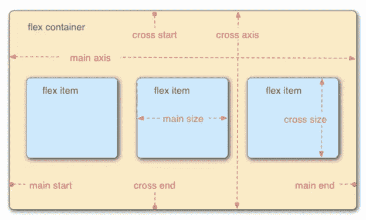

# 这是一个弯曲的盒子

> 原文：<https://medium.com/codex/now-thats-a-flex-box-f36aee55b52b?source=collection_archive---------24----------------------->

网页上的所有东西本质上都是盒中盒。这就是 flexbox 成为如此强大的布局工具的原因。它解决了表列的大小和位置问题，并创建了多个大小相等的列，然后可以修改这些列以满足设计需要。Flex 用于定义父元素和子元素之间的关系。

下图展示了 flexbox 在 CSS 样式中的解释。flex 容器是父元素，它解释子元素或 flex 项目是如何显示的。伸缩项沿主轴和横轴排列。这些轴的起点和终点被称为主/交叉起点和终点。这些属性可以在以后用于样式化。

# 父元素的属性又名*伸缩容器*

## 。容器{

## 显示:flex | | inline-flex；

这决定了 flex 容器如何与页面上的其他元素一起布局。如果它是简单的 flex，它将像块显示一样显示，一个元素在页面上上下叠放。如果是 inline-flex，容器将与它范围内的其他元素对齐。例如，如果有一个 div，其容器包含一个 inline-flex 类、一个 h1 和一个 p 标签，所有这些都在该 div 中，inline-flex 将在一行中对所有三个元素进行样式化，这三个元素彼此相邻。但是即使容器显示了 inline-flex，它的子元素在默认情况下也是 flex 块元素。

## flex-direction:行||行-反向||列||列-反向；

这决定了主轴上伸缩项的起始方向。默认情况下，伸缩项从左到右显示在一行中。行反转从右到左显示项目。列将项目从上到下堆叠在一起。列反转基于源代码从下到上堆叠它们。

## flex-wrap:nowrap | | wrap | | wrap-reverse；

这决定了 flex 项目的内容在给定其属性的情况下将如何表现。默认情况下，内容没有换行，将继续内联。这可能会导致内容溢出并落到行外。使用 wrap 属性，内容将符合项目的条款，并在到达定义的结尾时从上到下开始新的一行。Wrap-reverse 将导致内容在必要时从下到上使用新行。

## 柔性流动:柔性方向柔性缠绕；

这是伸缩方向和伸缩缠绕属性的简写，描述了其与主轴和横轴的关系。默认情况下，flex-flow 是行 nowrap。

## justify-content:flex-start | | flex-end | | center | | space-around | | space-between | | space-equally；

这决定了每个伸缩项如何在主轴上相互定位。Flex-start 在 Flex 容器的开头将每个项目一个接一个地对齐。Flex-end 在容器的末端对齐每个项目。居中将项目与容器的中心对齐。Space-around 将每个项目平均分隔，并在项目周围留有空格。但是，最靠近容器边缘的项目与下一个项目的空间相比有一个单位的空间。Space-between 平均分隔每个项目，第一个项目从起始行开始，最后一个项目从结束行开始。空间均匀分隔项目，包括最靠近容器边缘的项目的空间。最安全的值是弹性起点、弹性终点和中心。

## align-items:stretch | | flex-start | | flex-end | | center | | baseline；

这决定了每个项目如何在横轴上垂直布局。使用此属性将沿横轴上下移动每个项目。默认情况下，根据最小宽度/最大宽度拉伸项目以填充容器。Flex-start 在顶部显示项目，位于横轴的起点。Flex-end 在底部显示项目，位于横轴的末端。居中在横轴的中心显示项目。基线显示项目，使它们的基线彼此对齐。

## align-content:flex-start | | flex-end | | center | | stretch | | space-between | | space-around；

这决定了当横轴上的容器内有额外空间时，伸缩项沿横轴的行为。默认情况下，显示的项要么有自己的值，要么没有值，所以要么内联，要么分块显示。Flex-start 在 Flex 容器的开头对齐项目。Flex-end 在容器的末端对齐项目。居中将项目对齐容器的中心。Space-between 通过容器均匀地对齐项目，第一个项目位于横轴的起点，最后一个项目位于横轴的终点。环绕空格以每行相等的间距均匀分隔每个项目。拉伸通过占据容器中的剩余空间来对齐项目。

## }

# 子元素的属性，也称为弹性项目

## 。项目{

## 顺序:(数字)；

这决定了项目在屏幕上的显示顺序。默认情况下，所有项的顺序值为 0，并根据源代码的顺序显示。根据需要重新订购的数量，任何应该放在最后的项目的订单值应该为 1、2、3 或 100。也可以使用负数将某个项目放在所有默认项目之前。

## flex-grow:(数字)；

这决定了一个项目相对于所有其他项目如何占据容器中的剩余空间。每一行在页面上最多有十二列。如果所有项目都将 flex-grow 设置为 1，则每个项目在容器中按比例占据相同的空间。但是，如果项目 X 设置为 flex-grow 为 2，而其他两个项目的 flex-grow 设置为 1，则项目 X 将占用两倍的空间，剩余空间将在其他两个项目之间平均分配。

## 伸缩:(数字)；

这决定了浏览器收缩的速率以及伸缩项如何按比例反应。数字越大，它相对于其他项目收缩得越多。

## flex-basis:(数字)；

这决定了在应用伸缩增长和伸缩收缩之前伸缩项目的初始测量。例如，如果每个项目都设置了弹性基础，并被赋予相同的增长和收缩率，它们最终仍会有不同的度量。

## flex:flex-grow flex-shrink flex-basis；

这是 flex-grow、flex-shrink 和 flex-basis 在一行中的简写，建议不要单独写出每个属性。

## 自对齐:自动|伸缩开始|伸缩结束|居中|基线|拉伸；

这将用于覆盖单个弹性项目的默认值。

## }

感谢阅读！我很乐意和你联系。

通过 [Linkedin](https://www.linkedin.com/in/cassandra-parisi/) ||查看我的 [Github](https://www.github.com/cparisi1290) ||查看我的[作品集](https://cassandraparisi.netlify.app/)