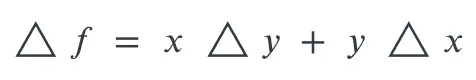

# 号码(第一部分)

> 原文：<https://medium.com/codex/number-part-1-c98313903714?source=collection_archive---------7----------------------->


在 [Unsplash](https://unsplash.com?utm_source=medium&utm_medium=referral) 上[科学高清](https://unsplash.com/@scienceinhd?utm_source=medium&utm_medium=referral)拍摄的照片

当我刚开始编程的时候(60 年代后期)，我想知道为什么科学/数学计算经常出错。在那些日子里，我们没有双精度数字，所以实际误差可能会增加。另一方面，我们能够把人送上月球，所以显然有些人知道如何处理这个问题。但是我不知道有什么通用的方法来跟踪数字计算中可能出现的错误。好像少了点什么。我想我迟早会解决这个问题。大约在 2002 年，我确实开始开发一套 Java 库来跟踪错误*和*单元。但是 Java 有足够多的问题和限制，尽管它运行得很好，我还是停止了对它的改进。

我第一次听说 Scala 的时候，似乎我可以修复一些 Java 的问题，因为有了增强的类型系统。事实上这是真的。所以，这篇文章(第一部分)是关于*数字*的模糊性。我们如何使一个类型模糊？嗯， *Fuzzy[X]* 是赋予类型 *X* 模糊性的特征。因为它是一个类型类，我们不必拥有 *X* ，甚至不必在本地的任何地方拥有它的源。这是 Scala 支持这类事情的最重要的特性之一。

那么，举个例子怎么样？假设有一个 case 类叫做 *Color* 。你不是自己写的，但它看起来像这样:

```
case class Color(r: Short, g: Short, b: Short) {
  def difference(x: Color): Color = *Color*(math.*abs*(r - x.r), math.*abs*(g - x.g), math.*abs*(b - x.b))

  def whiteness: Double = math.*sqrt*(r * r + g * g + b * b) / 255
}
```

我们可以通过计算两种颜色的差值，然后得出结果的白度，来了解这两种颜色有多接近。如果是零，那么我们两个颜色是一样的。但是如果我们甚至不能感知颜色的微小差异呢？让我们添加模糊性。但是，首先我们最好定义一下我们的模糊特征:

```
*/**
  * Type class which adds fuzzy behavior to a type X.
  *
  ** ***@tparam X*** *the type to be made fuzzy.
  */* trait Fuzzy[X] {

  */**
    * Method to determine if x1 and x2 can be considered the same with a probability of p.
    *
    ** ***@param p*** *a probability between 0 and 1 -- 0 would always result in true; 1 will result in false unless x1 actually is x2.
    ** ***@param x1*** *a value of X.
    ** ***@param x2*** *a value of X.
    ** ***@return*** *true if x1 and x2 are considered equal with probability p.
    */* def same(p: Double)(x1: X, x2: X): Boolean
}
```

如你所见，这里只有一种方法。它被称为 *same* ，它采用两个参数集: *p* (一个 *Double* 表示概率)和一对 *X* s，得到的 *Boolean* 表示 *x1* 和 *x2* 是否应该被视为相同。这就是这个最普遍的情况。当我们有数值时，我们会发现模糊性更有用，但我们稍后会谈到。

现在，让我们看看如何给*颜色*添加一些模糊:

```
object Color {
  def apply(r: Int, g: Int, b: Int): Color = *Color*(r.toShort, g.toShort, b.toShort)

  trait FuzzyColor extends Fuzzy[Color] {
    def same(p: Double)(x1: Color, x2: Color): Boolean = -math.*log*(x1.difference(x2).whiteness) / 3 > p
  }

  implicit object FuzzyColor extends FuzzyColor
}
```

正如你所看到的，如果两种颜色的白度差值的(负)对数的三分之一大于 *p* ，我们就武断地认为这两种颜色是相同的。使用这个定义，颜色(255，255，255)和颜色(242，242，242)被认为是相同的，有 80%的置信度。如果我们需要 100%的置信度( *p* = 1)，那么只有完全相同的颜色才被认为是相同的。对于 0%的置信度，所有颜色都是一样的。这个相当人工的例子到此为止。现在，让我们看看它是如何考虑数字的。

除了数字的名义值，我们还存储了一些(可选的)模糊性。当没有模糊时，我们的数字是精确的。只有当两个精确的数字实际上相等时，它们才能被认为相等。但模糊数可以根据它们的不同而“相等”:既有标称值，也有概率分布函数(pdf)。

在不深入研究这些 pdf 的数学的情况下，我们注意到，如果一个名义值在 pdf 的范围内，那么这个值就有可能是真实值。假设 pdf 是一个阶跃函数。它从零开始(对于非常负的值)；当它到达某个值时，概率密度变成 1/ *a* (其中 *a* 是可能值的范围，也称为“容差”)；这沿着数值轴继续一段距离*a*；此后(对于更大的正值)再次以零概率。我称这个 pdf 为“盒子”当然，这是一个假设的 pdf。但是它可能来自于例如形成随机长度(具有均匀分布)的钢钉的过程。超出公差的钉子(太短或太长)被丢弃并熔化。出现的钉子将会有一个他们的长度的 pdf，像上面描述的盒子。


当两个模糊数( *x +- a* 和 *y +- b* )相减(或相加)时，得到的 pdf 如下所示:


有些武断的是，*号*没有使用这样的梯形 pdf。相反，如果我们将两个数字相加，我们将它们的 pdf 近似为高斯(“正态”)分布。那是因为组合这样的分布是非常容易的:平均值是平均值的和(或者差，如果我们减去的话)；方差是方差的总和。

另一方面，如果我们将两个具有箱式模糊的数字相乘(或相除),如果 pdf 是相对于标称值的，而不是绝对的，则结果具有类似箱式的分布(宽度由输入框宽度之和给出)。这是根据简单的微积分得出的。

如你所见，我们有四种类型的数字模糊性:绝对的或相对的；箱形或高斯形。一般来说，一旦我们将模糊数组合在一起，它们的 pdf 通常是高斯形式。此外，物理常数也以高斯 pdf 开始，例如，引力常数 *G:*


“15”周围的括号表示最后两位小数为高斯分布，平均值为 30，标准偏差为 15。我将在下面描述如何输入模糊数字。在*常量*类型中定义了包括 *G* 在内的多个常量。其定义如下:*编号(" 6.67430(15)E-11")* ，即使用*应用*方法之一。

对于二元运算(特别是乘法和乘幂)，相对 pdf 是最方便的。对于一元运算(例如自然对数)或加法，绝对 pdf 更方便。但是，当然，所有的转换和卷积都由*号*代码自动处理。

那么，我们如何实现上述的*相同的*方法呢？我们取两个标称值的差，并确定该数字( *x* )是否可以被认为是零，给出结果 pdf。对于一个框型 pdf(通常，只有当一个模糊数与一个精确数比较时才会产生)，我们基本上忽略了 *p* 值(除非它是 0 或 1 ),如果数字 *x* 在框内，则简单地返回 true(即相同)。对于高斯分布，我们使用“逆 erf”函数(我们将互补概率，即 1- *p* ，传递给该函数)。这有效地将高斯 pdf 转换成一个盒子。

看待这个行列式的另一种方式是， *p* 对应于零属于**模糊集**(如洛特菲·扎德的“[模糊逻辑](https://en.wikipedia.org/wiki/Fuzzy_logic)”)的概率，模糊集包含所有可能的模糊数。

正如我将在第 2 部分中描述的，一个数的名义值要么是整数，要么是有理数(基于一个 *BigInt* 除以一个 *BigInt* )，要么是双精度值。如果我们必须将一个整数或有理数转换成一个双精度数，我们会在现有的模糊性上添加少量的(相对)模糊性:(1.6E-16)。

那么，我们如何处理在计算中引入模糊性呢？嗯，首先，我们不随意添加模糊性。一个数字，比如黄金分割率 *phi* ，是这样定义的:Number(“1.618033988749894”)。结果具有值为 0.5E-15 的盒子形状的绝对模糊度。这是根据定义中给出的 15 位小数得出的。按照惯例，只有一两位小数的字符串被认为是精确的(就像是美元和美分一样)。但是，您可以简单地通过在字符串后面加上“*”或“…”来否决这种约定。此外，如果你有一个实际上精确的数的十进制表示，那么把它表示成一个负指数的整数(至少现在，我们必须在“E”前面加一个小数点)。或者，更简单地说，只需在字符串末尾加上“00”。

您可以通过在十进制字符串后加上“[x]”或“[xx]”来使盒形模糊显式化，其中 *x* 或 *xx* 代表任何一个方向上的最大可能偏差。类似地，对于高斯模糊性(正如我们在上面用常数 G 展示的那样)，我们在十进制字符串后面加上“(x)”或“(xx)”在这种情况下, *x* 或 *xx* 代表所示数字中可能差异的标准偏差。顺便说一下，模糊性必须先于任何指数。

我下次会解释，数字π和 *e* 是精确的。所以，比如你计算 *atan(tan(π))* ，结果会正好是π。同样的，如果你计算*e^(ln(e)】*结果会正好是 e，然而√2 这种更一般的无理数是无法精确表示的。但是，正如我在文章 **Composable Matchers** 中提到的，如果你计算√2 √2，或者你将确切地返回 2，但是这是通过一个叫做 **ExpressionMatchers** 的机制实现的，它不在这里描述的低级别数字上操作。稍后，在第 2 部分中会有更多的介绍。

那么，这一切有什么意义呢？在最简单的层面上，假设你有一个钟摆，比如[福柯的钟摆](https://en.wikipedia.org/wiki/Foucault_pendulum)。它非常高，测量它的长度会非常困难。然而，你可以很容易地用秒表测量周期。确定摆锤长度 *l* 的公式为:


其中 *g* 是摆所在位置的重力加速度。到小数点后两位， *g* = 9.81 米/秒。

在第一个场景中，我们有一个精确的秒表，但是我们忽略了百分之一秒。我们的代码如下所示:

```
import com.phasmidsoftware.number.core.{Expression, Number}
import Number._

val g = *Number*("9.81*")
val t = *Number*("16.5*")
val length: Number = g * ((t / *twoPi*) ^ 2)
```

我们需要输入带星号的字符串，因为它们有一个和两个小数位，否则会被解释为精确的。我们得到的长度结果是 67.65[44]。这意味着我们对前两个有效数字(67)几乎有把握，但实际值可能在 67.21 和 68.09 之间。让我们看看如何从 *g* 和 *t* 的不确定性中计算贡献。

首先，让我们看看两个不确定量相乘的误差界的一般公式，其中 *f = x y* (这直接来自于对 *f* 的求导):



如果我们将两边除以 f，我们得到:


这意味着我们简单地将 *x* 和 *y* 的相对误差界限相加，以获得 *f* 的相对误差界限。在我们上面的例子中，我们有三项: *g* 和 *t* (因为它是平方的所以是两次)。 *g* 的相对误差约为 0.0005， *t* 的相对误差约为 0.003。因此 *l* 的相对误差约为 0.0065。

一个更现实的情况是，当我们记录下钟摆摆动 1000 次，然后计算平均值和标准差。假设平均值为 16.487，标准差为 0.041 秒。我们把这个量写成 16.487(41)。我们现在得到的结果是 67.54(35)，也就是说我们有 68%的把握真实长度在 67.19 到 67.89 米之间。

这个**号**包正在开发中。这里描述的是 1.0.10 版本。你可以在 https://github.com/rchillyard/Number 找到它。在第二部分中，我将描述惰性求值机制，该机制旨在尽可能避免不必要的精度损失，例如在表达式(√3+1)(√3–1)的情况下，我们知道该表达式的精确值为 2。