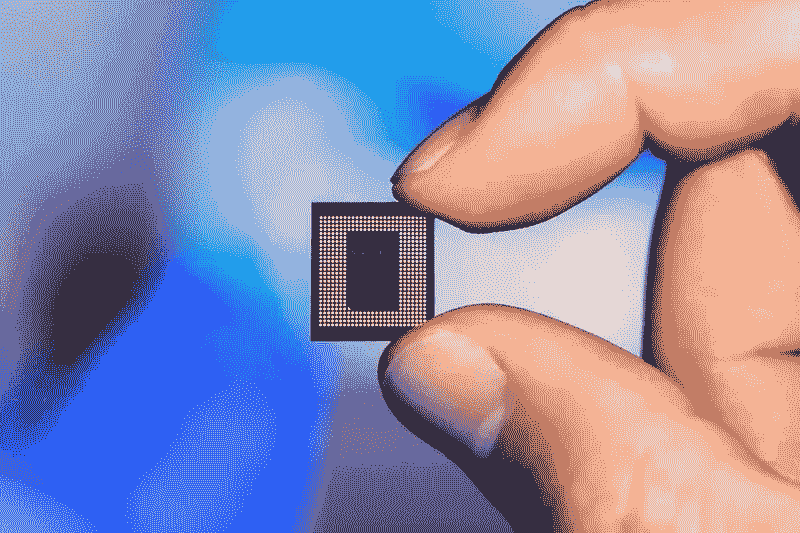

# 高通证实电脑中的 Nuvia 芯片

> 原文：<https://medium.com/codex/nuvia-chips-in-pcs-confirms-qualcomm-f008555dc86b?source=collection_archive---------8----------------------->

## 苹果的 M 系列竞争对手 Nuvia ARM 芯片将于 2023 年应用于个人电脑，更多信息请见本周的新闻简报

资料来源:高通

这是 CrunchX 的第十四版，这里是我们认为值得花时间的故事和资源。

# 1.今天我们了解到的关于埃隆·马斯克接管 Twitter 计划的所有荒谬的事情

在 440 亿美元收购 Twitter 的背后，隐藏着一张脱节和不确定的网络。边缘调查。由理查德·劳勒撰写，安东尼·特伦斯编辑。点击此处阅读文章:

[https://www . the verge . com/2022/4/29/23049172/elon-musk-buys-Twitter-Thiel-farts-jack-dorsey](https://www.theverge.com/2022/4/29/23049172/elon-musk-buys-twitter-thiel-farts-jack-dorsey)

# 2.高通证实 Nuvia Arm 芯片将于 2023 年底应用于个人电脑

高通对苹果 M1 芯片的回应预计将在 2023 年末到来。它的 Nuvia 芯片有可能与苹果的 ARM 驱动的消费设备展开较量。由迈克·泰森在《汤姆的硬件》上撰写，由[安东尼·特伦斯](https://medium.com/u/e178959c822?source=post_page-----f008555dc86b--------------------------------)编辑选择。阅读文章:

[https://www . toms hardware . com/news/Qualcomm-confirms-nu via-arm-chips-late-2023](https://www.tomshardware.com/news/qualcomm-confirms-nuvia-arm-chips-late-2023)

# 3.很难共事。

如何处理表现不佳的员工？这是大多数开发人员需要答案的问题。我喜欢威尔处理这个问题的方式，那就是以建设为先导，忽略表现不佳者。这是任何开发者都应该遵循的好建议。由 Will Larson 撰写并出版，由 Milo ivko VI 编辑选择。点击此处阅读文章:

[https://lethain.com/hard-to-work-with/](https://lethain.com/hard-to-work-with/)

# 4.软件进化的机制

将特性需求作为下一代系统架构的温床。Kislay 解释了为什么特性请求很重要，以及如何利用它们。由基斯莱·维尔马撰写和出版，由[米洛舍维奇](https://medium.com/u/3ee57b082bb?source=post_page-----f008555dc86b--------------------------------)编辑选择。点击此处阅读文章:

[https://kislayverma . com/software-architecture/the-mechanics-of-software-evolution/](https://kislayverma.com/software-architecture/the-mechanics-of-software-evolution/)

# 5.什么是行为数据，为什么企业应该使用它？

本文讨论了行为数据的确切定义，以及使用行为数据的目的和应该使用行为数据的人。总的来说，人们可以说所有的行为数据只是简单地描述了人和机器在做什么，因为当今生活的几乎每一项任务都是数字连接的。一个可能受益于使用行为数据的群体是例如电子商务市场，因为他们可以使用行为数据来更好地了解他们的目标群体。由 Yaali Sassoon 在 Datanami 撰写，由 [Christianlauer](https://medium.com/u/2696f801a31a?source=post_page-----f008555dc86b--------------------------------) 编辑选择。点击此处阅读文章:

[https://www . datanami . com/2022/04/25/what-is-behavioral-data-and-why-should-business-use-it/](https://www.datanami.com/2022/04/25/what-is-behavioral-data-and-why-should-businesses-use-it/)

# 6.对 2022 年商业至关重要的人工智能技术趋势

如今，人工智能开发几乎已经渗透到了各种形式和规模的每一家公司。因此，重要的是要看看今年可能会产生重大影响的人工智能趋势。这篇文章描述了人工智能世界中的十个可能趋势，自然学习和增强现实是其中的两个方面。由 Nishanth PK 在 Datafloq 上撰写，由 [Christianlauer](https://medium.com/u/2696f801a31a?source=post_page-----f008555dc86b--------------------------------) 编辑选择。点击此处阅读文章:

[https://data floq . com/read/artificial-intelligence-technology-trends-matter-business-2022/](https://datafloq.com/read/artificial-intelligence-technology-trends-matter-business-2022/)

# 7.人工智能、人工智能和大数据如何促进时尚行业的创新？

越来越多的时尚公司正在利用人工智能、人工智能和大数据等技术，将其纳入服装生产供应链。结果，可以向用户提供更个性化的客户体验。由大数据撰写关于大数据分析的新闻和编辑选择由 [Christianlauer](https://medium.com/u/2696f801a31a?source=post_page-----f008555dc86b--------------------------------) 撰写。点击此处阅读文章:

[https://bigdatanalyticsnews . com/ai-ml-big-data-facilitating-innovation-in-fashion-industry/](https://bigdataanalyticsnews.com/ai-ml-big-data-facilitating-innovation-in-fashion-industry/)

# 8.R 大书

我以前几次提到过 R，因为它是一种令人印象深刻的数据操作和统计分析语言，但很少有人愿意去学习它，因为它有一个相当陡峭的学习曲线。
Oscar Baruffa 有一个很好的网站“R 大书”,里面有太多 R 相关的资源难以描述——从数据科学到金融到地理空间分析。我相信你会在这里找到对你以后的旅程有帮助的东西。由 Oscar Baruffa 撰写并出版，由 Stuart Woolley 博士编辑选择。在这里阅读这本书:

[https://www.bigbookofr.com/](https://www.bigbookofr.com/)

# 9.地理国家大学讲座

同样，我也可以推荐 Michael Pyrcz 的 YouTube 频道“GeostatsGuy 讲座”，它不仅涵盖了一般的数据科学主题，还涵盖了机器学习和建模，所有这些都主要使用 Python 语言来完成各种计算任务。这是我经常去的地方，因为我不是 Python 专家，但是知道其他人在做什么是很好的！斯图尔特·伍利博士的编辑选择。点击此处访问 YouTube 频道:

[https://www.youtube.com/channel/UCLqEr-xV-ceHdXXXrTId5ig](https://www.youtube.com/channel/UCLqEr-xV-ceHdXXXrTId5ig)

# 10.5 仪表板设计最佳实践

如果您像我一样，在日常工作中四处走动并处理大量数据，那么您很可能对仪表板感兴趣——或者用于监控、捕捉异常和触发警报，或者仅仅用于向非技术用户提供概述。我经常使用 InfluxDB，也经常使用 Grafana，并且发现 Influx Data 的资源非常有用。他们的技术营销作家查尔斯马勒有一个很好的概述，你应该寻找描绘，以及你应该如何描绘它在仪表板上的最大效果。查尔斯·马勒在《新书库》上撰文，斯图尔特·伍利博士编辑精选。点击此处阅读文章:

[https://thenewstack.io/5-dashboard-design-best-practices/](https://thenewstack.io/5-dashboard-design-best-practices/)

# 结束语

这是我们本周的精选。希望你发现了一些新的、鼓舞人心的、惊人的、疯狂的科技新闻。非常感谢您花时间阅读本版 CrunchX。下周请留意下一期。

## 问候，

法典小组