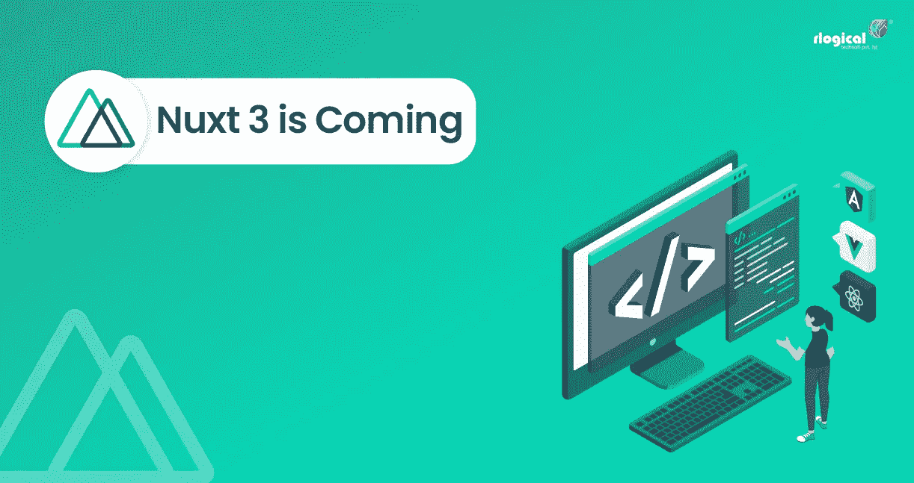
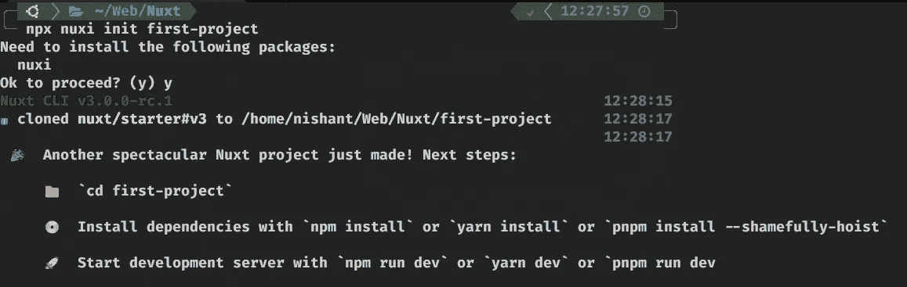
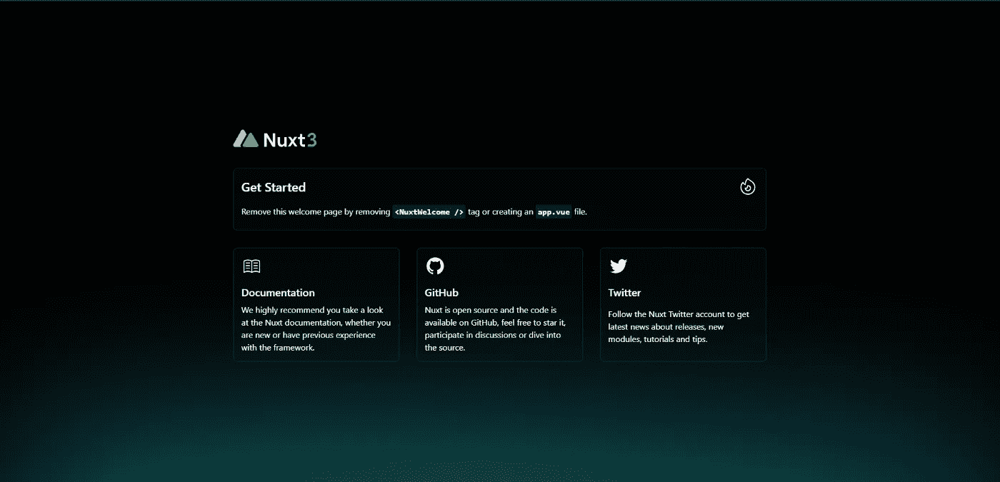

# 面向 Vue.js Web 开发者的 Nuxt3

> 原文：<https://medium.com/codex/nuxt3-for-vue-js-web-developers-9bb2530a57b8?source=collection_archive---------1----------------------->

## 元框架正在形成。



Nuxt3 上周公布了其发布候选 [](#fb41) (Nuxt 3.0.0-rc02)。这是一个期待已久的框架，因为 Nuxt2 获得了巨大的人气。随着越来越多的用户使用 Vue.js 框架开发网站，学习 Nuxt.js 不仅对你的技能有很大好处，对行业也有好处。

# Nuxt3 比 Vue3 有什么好处？

对于大中型应用，使用 Nuxt3 优于 Vue3 有很多好处:

1.**组合 API**——如果你以前在 Vue3 中写过代码，你应该知道组合 API。Nuxt2 不支持它，相反，Nuxt2 开发者继续使用 Options API。

2.**自动导入**—Nuxt3 的一个主要变化是，如果你正确地构建了你的项目目录，nuxt 3 将理解你需要的文件，并在编译时自动导入它们。您不需要显式导入文件。

3.**基于目录的路由【the Nuxt2 本身的一个特性。网站上的路由是根据您如何用文件夹和文件构建项目来完成的。在普通的 Vue 应用程序中，您必须显式定义要呈现的路线和组件。**

4.Nitro 服务器——你现在甚至可以在一个 Nuxt 项目中创建你的服务器代码。以前，要为一个项目构建一个服务器，它必须在一个单独的代码库中；但现在不是了！

5.**通用渲染**—nuxt 3 的核心特性之一就是通用渲染的引入。通用渲染意味着当第一次向网站发出请求时，服务器会发回一个包含所有元素的 Html 页面(更适合 SEO ),但是这个页面还不是交互式的。然后，它发送 JavaScript 文件，使页面具有交互性。它在性能方面也非常出色；但是，这个过程会占用更多的服务器。

# Nuxt3 入门

创建 Nuxt3 项目需要一些先决条件。

1.**节点** —您需要在您的机器上安装节点。

2.**文本编辑器** —使用您最喜欢的文本编辑器或 IDE 进行开发。

3.Git 是一个版本控制系统。

现在，您可以打开终端并导航到您希望项目所在的目录。运行以下命令，用项目名称替换`<app-name>`。`npx nuxi init <app-name>`将为您创建一个 Nuxt3 项目。在文本编辑器/IDE 中打开项目。



您现在可以将`cd`放入项目中，并使用`npm`、`yarn`或`pnpm`安装依赖项。要在浏览器中查看启动代码，运行命令`npm start dev`，您将看到以下内容:



Nuxt3 启动器组件。

## 瞧啊。您已经创建了您的第一个 Nuxt3 项目！

# #1 —合成 API

Nuxt3 的组合 API 是开发者社区高度要求的特性，它终于稳定了。

`<script setup lang="ts" />`标签极大地简化了开发，并支持 TypeScript 和顶级 wait 开箱即用。

**没有进口报表！没有出口声明！Nuxt3 正在走向网站发展的未来。**

# #2 —汽车进口

您有一个目录结构如下的 Nuxt3 项目:

```
|- components/
|  |- styled/
|  |  |- Button.vue
|  |- Checkbox.vue
|- node_modules/
|- .gitignore
|- README.md
|- app.vue
|- nuxt.config.ts
|- package-lock.json
|- package.json
|- tsconfig.json
```

在您的`app.vue`文件中，您现在可以自由使用这些组件而无需导入！在捆绑代码时，Nuxt 足够聪明，能够理解文件在哪里，并为您添加导入。

不需要导入。

# #3 —基于目录的路由

基于你想要的网站路径，你必须用适当的拼写来安排你的目录。如果您的项目结构如下所示:

```
|- node_modules/
|- pages/
|- |- new.vue
|- |- profile/
|- | |- index.vue
|- | |- [username].vue
|- |- index.vue
|- .gitigore
|- README.md
|- nuxt.config.ts
|- package.json
|- package-lock.json
|- tsconfig.json
```

*   在`pages/`内部，`index.vue`文件会有`/`路径。
*   在`pages/`内部，`new.vue`文件将有`/new`路径
*   在`pages/profile`内部，`index.vue`文件会有`/profile`路径。
*   在`pages/profile`中，`[username].vue`文件会有`/profile/{username}`路径，其中`username`是路径参数。

你可以从这里了解更多关于 Nuxt3 路由的信息:

[](/@cybercoder.naj/nuxt3-routing-78a5c1372102) [## Nuxt3 路由

### Nuxt3 革新了 Web 应用程序中的路由。Nuxt3 的这一特性真正证明了他们的愿景:专注于…

medium.com](/@cybercoder.naj/nuxt3-routing-78a5c1372102) 

# #4 — Nuxt Nitro 服务器

要创建一个全栈应用，我们需要一个服务器端代码和一个客户端代码。传统的框架将它们的代码捆绑在一起，每当用户在您的服务器上发出一个`GET '/'`请求时，就会发送这个文件。我们可以用一个前端细长的烧瓶后端来做这件事。在试图将这两种技术结合起来时可能会出现问题。

> 如果我告诉你我们可以在同一个代码库上做这件事，会怎么样？

**是的** — Nuxt3 引入了 **Nitro 服务器**，在这里你可以在你的项目中编写你的服务器端代码并部署它！

我有一篇专门的文章，可以帮助你在同一个项目和相同的代码库中用 Nuxt3 构建你的后端服务器和前端服务器:

[](/codex/nitro-server-with-nuxt3-ac043052929f) [## 使用 Nuxt3 的 Nitro 服务器

### 不——这不是一个在 Nuxt3 上克隆 Discord Nitro 的教程😜。尽管将来某一天这将是一个伟大的项目…

medium.com](/codex/nitro-server-with-nuxt3-ac043052929f) 

# 结论

> Nuxt3 的创建者旨在创建一个促进开发而非配置的框架。

Nuxt3 利用目录结构，以开发人员无法想象的方式简化了代码。不再讨厌 30 行 import 语句，不再讨厌全栈应用程序有两个独立的代码库。

> 对于所有的 Vue.js 开发者来说，Nuxt3 即将到来，而且它很大。

我希望你喜欢我的文章。谢谢大家！✌️


[尼尚特·安贾尼路](/@cybercoder.naj?source=post_page-----9bb2530a57b8--------------------------------)

## Nuxt3 教程

[View list](/@cybercoder.naj/list/nuxt3-tutorial-8af9304349ba?source=post_page-----9bb2530a57b8--------------------------------)8 stories

```
**Want to connect?**My [GitHub](https://github.com/cybercoder-naj) page
My [LinkedIn](https://www.linkedin.com/in/nishant-a-jalan) profile
```

[ **1** ]:候选发布是测试版和稳定版之间的中间步骤。