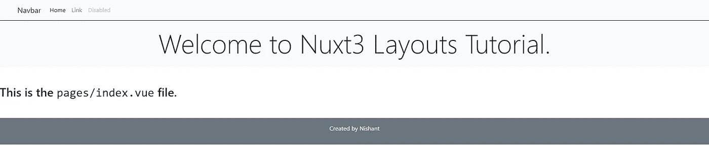

# Nuxt3 布局

> 原文：<https://medium.com/codex/nuxt3-layouts-276ed64a4a1c?source=collection_archive---------3----------------------->

[](/@cybercoder.naj/nuxt3-reaction-timer-game-7d3ae05674b7) [## Nuxt3 反应计时器游戏

### 用最新的 Nuxt3 框架构建一个简单的应用程序游戏

medium.com](/@cybercoder.naj/nuxt3-reaction-timer-game-7d3ae05674b7) 

了解 Nuxt3 的基础知识对于理解 Nuxt3 布局至关重要。

> 我们是懒惰的程序员。我们不希望在不同的文件中反复编写相同的代码。因此，如果复制的代码有变化，修改每个文件可能是一件麻烦的事，还会产生麻烦的 bug。Nuxt3 引入了布局的概念，使得这项任务变得更加容易。

# 布局入门

作为一个 web 开发人员，你必须知道一个网站最常见的东西就是导航栏。您还可以根据您的使用情况向您的应用程序添加自定义页眉和页脚。

首先在根目录下创建一个`layouts/`文件夹。注意:名字要准确，否则 Nuxt 就搞不清楚了。对于一个你希望在每一页上默认看到**的布局，比如页眉和页脚，你必须使用文件`layouts/default.vue`。**

```
<template>
  <div>
    <Header />
    <slot />
    <Footer />
  </div>
</template>
```

在构建 Nuxt3 布局时，`<slot />`组件是**超级重要的**。`<slot />`标识为我们输入的代码的占位符。在我们创建的每一页上，我们会看到页眉在顶部，页脚在底部，在中间，也就是`<slot />`出现的地方，你会看到你所在的特定页面的布局。

你开始在`pages/index.vue`文件中输入任何内容，然后在浏览器中运行应用程序，你会发现页眉、页脚以及它们之间的页面内容。



# 带有默认插槽的命名布局

您可能还希望某些布局只出现在某些页面上，而不出现在其他页面上。您可以通过在`layouts/`目录中命名您的文件并在您希望包含它们的文件中引用它们来做到这一点。

在一个非常基本的例子中，让我们创建一个`layouts/border.vue`，用一种边框包围下面的代码。

```
<template>
  <div class="border-content">
    <slot />
  </div>
</template><style scoped>
  .border-content {
    padding: 0.5rem;
    border: 2px solid gray;
  }
</style>
```

为了在布局中使用它，你需要用标签`<NuxtLayout />`包围代码，给出属性`name`作为布局的文件名。

```
<!-- index.vue -->
<template>
  <NuxtLayout name="border">
    <h2>This is the <span>pages/index.vue</span> file.</h2>
  </NuxtLayout>
</template><style scoped>
span {
  font-family: monospace;
}
</style>
```

`NuxtLayout`的子组件嵌入`layouts/border.vue`的插槽内。

# 带有命名插槽的命名布局

布局中只有一个插槽可能会很麻烦。您需要一个可以修改布局中多个项目的布局。您可以通过命名插槽并使用确切的名称来告诉 Nuxt3 哪个代码是整个布局的哪个部分来做到这一点。

让我们创建一个`layouts/sidebar.vue`文件:

```
<template>
  <div class="container-fluid" style="max-width: 1200px;">
    <div class="col-12 col-md-6">
      <slot name="list" />
    </div>
    <div class="col-12 col-md-6">
      <slot name="content" />
    </div>
  </div>
</template>
```

我在这个项目中使用 Bootstrap，因此这些类对我是可用的。这里，我们不是使用一个插槽，而是使用**两个插槽**。为了区分这两者，我们将它们命名为“列表”和“内容”。

让我们定制`pages/index.vue`文件如下:

```
<template>
  <NuxtLayout name="sidebar"> <template #list>
      <ol>
        <li>Topic 1</li>
        <li>Topic 2
          <ol type="a">
            <li>Subtopic 2.1</li>
            <li>Subtopic 2.2</li>
          </ol>
        </li>
        <li>Topic 3</li>
      </ol>
    </template> <template #content>
      This is the main content of <span>pages/index.vue</span> with the custom side bar.
    </template> </NuxtLayout>
</template><style scoped>
span {
  font-family: monospace;
}
</style>
```

起初，我们更改了`<NuxtLayout />`的名称并删除了内容。我们定义了两个`<template />`标签，分别对应于我们创建的每个插槽。我们用#前缀将插槽的名称附加到各自的模板标签上。这样，我们可以定义一个布局的不同部分，并尽可能保持代码的通用性和可读性。

你可以在 Github 上查看我的完整代码。

[](https://github.com/cybercoder-naj/nuxt3-layouts) [## GitHub -网络代码-naj/nux T3-布局

### 查看中等文章，查看该项目的教程。将代码克隆或下载到您的本地机器上…

github.com](https://github.com/cybercoder-naj/nuxt3-layouts)