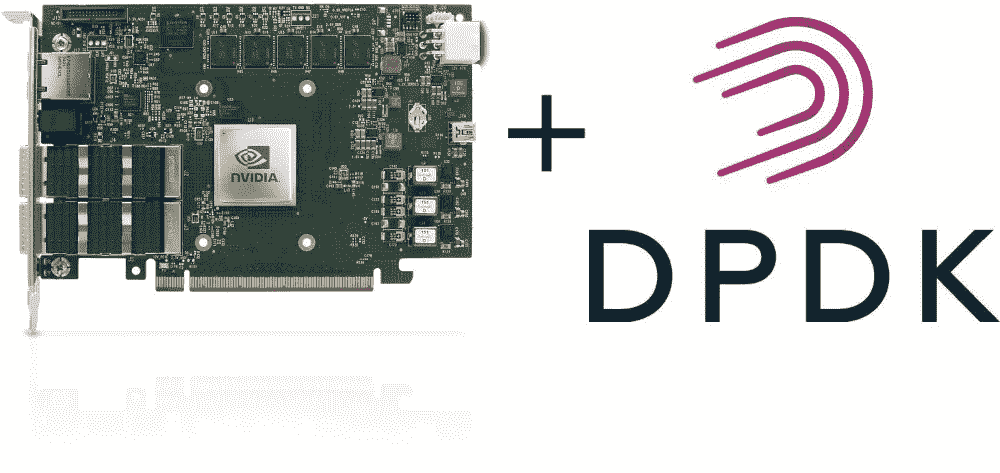

# NVIDIA mellan ox blue field-2 smart NIC 实践教程:“潜水装备”——第二部分:更改操作模式并安装 DPDK。

> 原文：<https://medium.com/codex/nvidia-mellanox-bluefield-2-smartnic-dpdk-rig-for-dive-part-ii-change-mode-of-operation-a994f0f0e543?source=collection_archive---------0----------------------->

在 [Cloudlab](https://www.cloudlab.us) 中启动了一个实验，并用 [Bluefield-2](https://www.nvidia.com/en-sg/networking/products/data-processing-unit/) 弄脏了我们的手之后，我们继续我们的旅程，详细说明不同的操作模式，并在 Bluefield-2 上安装 [DPDK](https://www.dpdk.org/) 。

我们将在蓝田-2 DPU 上安装和配置最新的 DPDK