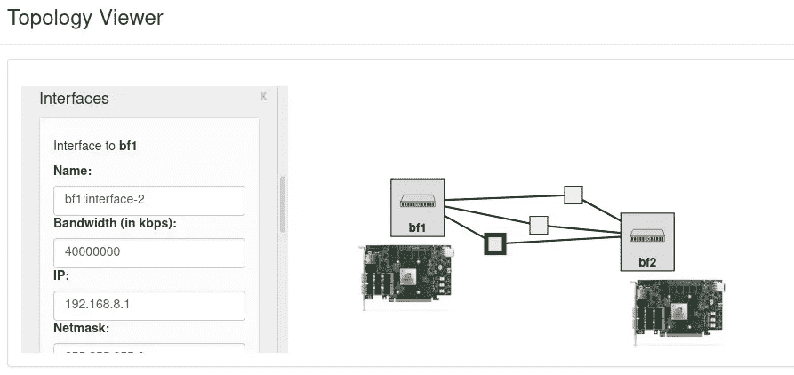

# NVIDIA mellan ox blue field-2 smart NIC 实践教程:“潜水装备”——第三部分:终极云实验室设置

> 原文：<https://medium.com/codex/nvidia-mellanox-bluefield-2-smartnic-dpdk-rig-for-dive-part-iii-ultimate-cloudlab-setup-7efd8b47a480?source=collection_archive---------4----------------------->

在本教程中，我们将介绍在克莱姆森大学的 Cloudlab 设施中使用两个背靠背连接的 blue field-2 smart NIC 配置和启动实验的所有必要步骤。

# NVIDIA / Mellanox Bluefield-2 实验的终极 Cloudlab 设置

Cloudlab 的 Bluefield-2 局域网设置。