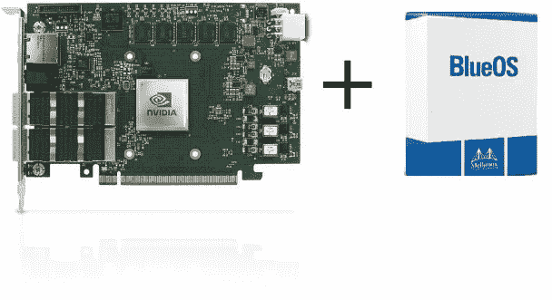

# NVIDIA mellan ox Bluefield-2 smart NIC 实践教程:“潜水装备”——第五部分:使用 DPDK 和 DOCA 安装最新的 blue field 操作系统

> 原文：<https://medium.com/codex/nvidia-mellanox-bluefield-2-smartnic-hands-on-tutorial-rig-for-dive-65a6b7278b23?source=collection_archive---------2----------------------->

在这一集中，我们将从头开始在 Bluefield-2 DPU 上安装最新的 Bluefield 操作系统。因此，我们将获得一个预装了 DPDK 和 DOCA 的全新系统。

我们将在 Bluefield-2 SmartNIC 上从头开始安装 BlueOS

# 序文