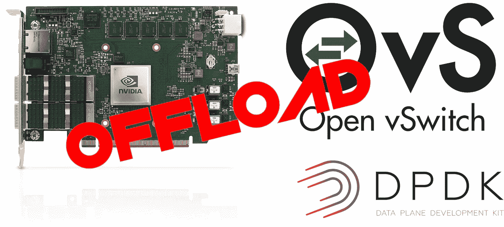

# NVIDIA mellan ox blue field-2 smart NIC 实践教程:“潜水装备”——第七部分/A:卸载还是不卸载？

> 原文：<https://medium.com/codex/nvidia-mellanox-bluefield-2-smartnic-hands-on-tutorial-rig-for-dive-part-vii-1417e2e625bf?source=collection_archive---------0----------------------->

将 OvS 数据路径卸载到硬件有好处吗？内核或 DPDK 数据路径是否卸载有关系吗？在这一集里，我将更深入地探讨 OvS 卸载问题，并解释如何使用运行在 SmartNIC 上的 OvS 来处理数据包。

