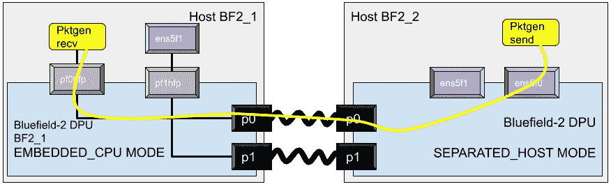

# NVIDIA mellan ox blue field-2 smart NIC 实践教程:“潜水装备”——第七部分/B:卸载还是不卸载？继续的

> 原文：<https://medium.com/codex/nvidia-mellanox-bluefield-2-smartnic-hands-on-tutorial-rig-for-dive-part-vii-b-contd-afaffce7af4f?source=collection_archive---------0----------------------->

我们继续探索卸载主题([第七部分/A](/codex/nvidia-mellanox-bluefield-2-smartnic-hands-on-tutorial-rig-for-dive-part-vii-1417e2e625bf) )，并使用 *pktgen* 调查数据包处理性能。

# 体系结构

为了度量，我准备了机器来实现下面描述的架构。

本测量研究中使用的架构