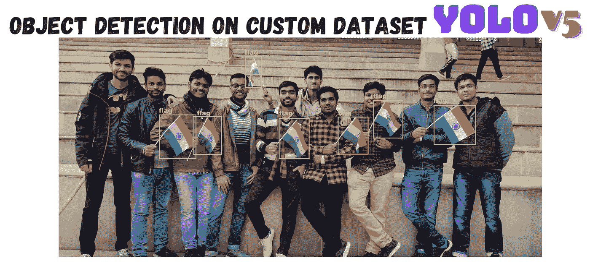

# 使用 YOLOv5 通过 3 个简单的步骤对自定义数据集进行对象检测

> 原文：<https://medium.com/codex/object-detection-on-custom-dataset-in-3-simple-steps-using-yolov5-e9d4940df16e?source=collection_archive---------2----------------------->

## 本文介绍了一个具有高性能指标的自定义标记数据的对象检测框架。



本文将不提供关于对象检测和所有相关术语的细节。我希望你知道物体检测的理论以及它是如何工作的。在本文中，我将跳到实现部分，这是本文的主要目标。文章分为三个部分。

1.  **数据集创建:**我将讨论我们输入数据的格式。
2.  **培训:**培训步骤、所需的依赖项和代码。
3.  **测试:**在给定的一组图像上测试训练好的模型。

# A.数据集创建

首先，我们需要一个带标签的数据集来创建对象检测模型。我们可以使用 RoboFlow [1]或 LabelImg [2]等在线工具手动注释数据集。有必要以 YOLO 格式保存对应于每个图像的标签。在 YOLO，我们有四个值来确定边界框***【x _ center，y_center，width，height】，*** 其中***'****x _ center '*和 *'y_center'* 是边界框中心的归一化(在 0 和 1 之间)坐标。边界框的'*高度'*和'*宽度'*也在 0 和 1 之间标准化。

目录结构如下所示。图像名称应该与标签名称相同。换句话说，如果我们在*'****train/images’***文件夹中有一个图像***' 0001 . jpg’***，那么我们在***' train/labels’***文件夹中也必须有***' 0001 . txt’***文件。

```
# *dataset folder structure*dataset
  |--- train
  |      |--- images
  |      |--- labels
  |
  |--- valid
  |      |--- images
  |      |--- labels
```

# **B .培训**

## 1.创建一个. yaml 文件

首先，我们将创建一个 ***data.yaml*** 文件，包含数据集的路径和要检测的类的详细信息。该文件将如下所示。

```
train: dataset/train/images
val: dataset/valid/imagesnc: 1
names: ['flag']
```

其中，在第一行，我们将指定训练图像的路径。在第二行，我们将提到验证图像的路径。之后，我们将在一个列表中添加类的数量，后跟类标签。

## 2.指定模型架构

我们现在将定义 YOLOv5 模型架构和参数。为此，我们将创建一个 **custom_yolo.yaml** 文件，该文件包含以下元素。

```
# parameters
nc: 1  # number of classes
depth_multiple: 0.33  # model depth multiple
width_multiple: 0.50  # layer channel multiple# anchors
anchors:
  - [10,13, 16,30, 33,23]  # P3/8
  - [30,61, 62,45, 59,119]  # P4/16
  - [116,90, 156,198, 373,326]  # P5/32# YOLOv5 backbone
backbone:
  # [from, number, module, args]
  [[-1, 1, Focus, [64, 3]],  # 0-P1/2
   [-1, 1, Conv, [128, 3, 2]],  # 1-P2/4
   [-1, 3, BottleneckCSP, [128]],
   [-1, 1, Conv, [256, 3, 2]],  # 3-P3/8
   [-1, 9, BottleneckCSP, [256]],
   [-1, 1, Conv, [512, 3, 2]],  # 5-P4/16
   [-1, 9, BottleneckCSP, [512]],
   [-1, 1, Conv, [1024, 3, 2]],  # 7-P5/32
   [-1, 1, SPP, [1024, [5, 9, 13]]],
   [-1, 3, BottleneckCSP, [1024, False]],  # 9
  ]# YOLOv5 head
head:
  [[-1, 1, Conv, [512, 1, 1]],
   [-1, 1, nn.Upsample, [None, 2, 'nearest']],
   [[-1, 6], 1, Concat, [1]],  # cat backbone P4
   [-1, 3, BottleneckCSP, [512, False]],  # 13[-1, 1, Conv, [256, 1, 1]],
   [-1, 1, nn.Upsample, [None, 2, 'nearest']],
   [[-1, 4], 1, Concat, [1]],  # cat backbone P3
   [-1, 3, BottleneckCSP, [256, False]],  # 17 (P3/8-small)[-1, 1, Conv, [256, 3, 2]],
   [[-1, 14], 1, Concat, [1]],  # cat head P4
   [-1, 3, BottleneckCSP, [512, False]],  # 20 (P4/16-medium)[-1, 1, Conv, [512, 3, 2]],
   [[-1, 10], 1, Concat, [1]],  # cat head P5
   [-1, 3, BottleneckCSP, [1024, False]],  # 23 (P5/32-large)[[17, 20, 23], 1, Detect, [nc, anchors]],  # Detect(P3, P4, P5)
  ]
```

## 3.从 GitHub 下载代码。

我们将从 GitHub 克隆 YOLOv5 repo，然后在虚拟环境中安装依赖项[3]。步骤如下。

```
git clone [https://github.com/ultralytics/yolov5](https://github.com/ultralytics/yolov5)
cd yolov5
pip install requirements.txt
```

## 4.开始训练

完成代码和所需库的设置后，我们就可以运行培训部分了。为此，我们需要转到 train.py 所在的路径，然后运行以下命令。

```
**python** **train.py** **--img** 416 **--batch** 32 **--epochs** 10 **--data** <path to data.yaml file> **--cfg** <path to custom_yolo.yaml file> **--name** <give name to your run>
```

训练完成后，体重将存储在***‘yolov 5/runs/train/<您的跑步名称>/weights/best . py’***中

# C.测试

使用保存的权重，我们可以对测试数据集进行推断。为此，我们需要在终端中运行以下命令。

```
**python** **detect.py** **--weights** <best model weights> **--data** <path to data.yaml file> **--image** 416 **--conf** 0.5 **--source** <test images path>
```

测试过程完成后，输出将存储在***【yolov 5/runs/detect/exp/】***中

# 结论

本文展示了一种使用 YOLOv5 方法训练自定义对象检测模型的快速而简单的方法。

# 参考

[](https://roboflow.com/#annotate) [## 1.Roboflow:让你的软件能够看到图像和视频中的物体

### 标签使用任何操作系统，无需下载任何软件。使用最流行的注释格式，包括…

roboflow.com](https://roboflow.com/#annotate) [](https://github.com/tzutalin/labelImg) [## 2.github-Tzu talin/labelimg:🖍️labelimg 是一个图形化的图像注释工具和标签对象…

### LabelImg 是一个图形化的图像注释工具。它是用 Python 写的，使用 Qt 作为它的图形界面…

github.com](https://github.com/tzutalin/labelImg) [](https://github.com/ultralytics/yolov5) [## 3.GitHub-ultralytics/yolov 5:yolov 5🚀在 PyTorch > ONNX > CoreML > TFLite 中

### YOLOv5🚀是在 COCO 数据集上预先训练的一系列对象检测体系结构和模型，表示…

github.com](https://github.com/ultralytics/yolov5)