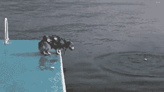
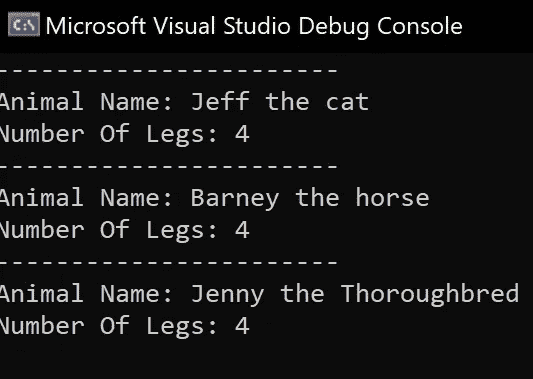

# 解释面向对象的原则

> 原文：<https://medium.com/codex/object-oriented-principles-explained-2d1d4bdd3be7?source=collection_archive---------12----------------------->

奥斯卡·伊尔迪兹在 [Unsplash](https://unsplash.com?utm_source=medium&utm_medium=referral) 上拍摄的照片

*我第一次接触面向对象编程是在大学。我在第一学期开始学习如何做基本编程。我正在研究非常基础的东西:数据类型、变量和循环。我们接到了第一个任务的简报。目标是在 windows 窗体应用程序中构建一个测验。*

其中一个要求是将一个分数作为 int 值传递给一个结果表单。我正在寻找这样做的方法，无意中发现了一些东西。在我满足于这个解决方案并实现它之前，我从未使用过一个对象。最后，我坐着向我的讲师演示我的应用程序，实际上由于不正确地使用对象而失去了分数。然后不是传递一个 int，而是传递一个包含 int 值的对象。

在第二学期，我们将学习什么是面向对象，以及如何使用类、对象和其他面向对象的概念和原则。就在那时，我接触到了面向对象编程的 4 个支柱。继承、多态、封装和抽象。研究基本的 OOP 原则帮助我理解了我最初是如何出错的。

面向对象编程的四大支柱。

在这篇文章中，我想谈谈其中的每一个，并给你提供一个例子，希望能给你提供一些重要的知识，这些知识是我们作为开发人员在处理任何面向对象的问题时应该考虑的。

—让我们开始吧！

狗跳水的权利，你也应该！

# 遗产

这里有几个关键的术语需要记住。位于层次顶部的类称为**超类**(或**基类**或**父类**)，而从另一个类派生的类称为**子类**(也称为**派生的**类、**扩展的**类或**子类**)。

继承的主要目标是推广代码回收的概念。我们从来不想复制和粘贴，而是在它的基础上扩展，在我们的应用程序中利用继承确保我们使用尽可能少的代码。它通过允许子类从其超类继承属性和行为来做到这一点。

在下面的例子中，我们将创建一个名为 Animal 的超类，并将属性和行为简单地继承到我们的子类 Cat 中。

猫继承自动物

在第 9 行，我们添加了一个冒号，在它旁边我们添加了超类动物的名称。这就是我们从超类继承的方式。我们添加了一个方法 Move()，我希望能够从动物和现在的猫调用它。在从两个对象调用这个方法时，我也祈求得到相同的输出。

显示实例化的两个对象的 program.cs

你可以看到上面我已经创建了两个对象。首先，我创建了一个动物类型的对象，然后是猫类型的对象。我对这两个对象都调用了 Move()，如果继承成功了，我们应该可以看到标准动物和我们的猫都可以走路了。

两个物体行走的结果

他们有！太棒了。我们已经看到了遗传的作用。遗产有不同的味道，所以让我们品尝彩虹。我们之前的例子是所谓的**单继承**，其中一个超类有一个子类。

接下来，让我们添加另一种动物，它也将继承我们的超类动物。就叫它马吧。突然间，我们有了所谓的**等级继承。**这意味着我们从一个超类继承了多个子类。

如果我们添加一个名为‘纯种马’的类，并从马类派生出这个类。那么说马是我们纯种马的超类是正确的。我们开始吧。这就是所谓的**多级遗传。**这意味着我们不仅继承了 Animal 类的所有行为和属性，还继承了我们在 Horse 类中添加的任何行为和属性。

演示多级继承

另一种形式的继承是通过接口继承。这里要考虑[界面偏析](https://stackify.com/interface-segregation-principle/)。在 C#中，你只能从一个超类继承到一个子类。

在下面的例子中，我们继承了 ISleep 和 IEat 的动物含义，现在我们层次结构中的所有派生类都可以使用 Eat()、NotHungry()和 Sleep()方法。这是一个基于 M **多级接口继承**的例子，我们从多个接口继承。接口对于重用代码、测试安全性非常有用。看到我们的 Animal 类继承了我们的接口之后的最终样子。

演示从多个接口继承

> 编写代码时考虑最佳实践。使用接口时，建议在名称的开头使用“I”。要查看更多关于命名约定的最佳实践，请参见微软文档[此处](https://docs.microsoft.com/en-us/dotnet/csharp/programming-guide/inside-a-program/coding-conventions)。

如果您想要一个与子类中被继承的属性同名的属性，您可以使用 **new** 关键字来实现。请参见下面的示例:

new 关键字将 Move()方法视为 Cat 类中的一个新方法。正如那些独立的生物有时做他们自己的事情，即使被告知不。

被告知“不”后，猫将玻璃杯推离桌子。

继承是为代码提供可重用性的好方法，也是面向对象原则的重要组成部分。让我们努力重用尽可能多的代码。

# 多态性

使用继承，我们能够将属性和方法向下传递，然而多态性允许我们使用这些方法来执行不同的任务。这听起来很复杂，但实际上很简单。

让我们考虑一下我们的动物课。完全有可能一个衍生的动物会跑，跳，飞，甚至游泳，但是现在他们被迫走路。让我们给我们的动物做他们自己的事情的权利。

多态性的证明

让我们看看这里发生了什么。我们已经在第 8 行的 Move()方法中添加了**虚拟**关键字。这告诉 Animal 类“嘿，我很可能在子类中被修改”，因此每当我们计划在子类中修改一个方法时，我们都需要使用这个关键字。

你会看到在我们使用 Move()方法的所有子类中，第 27、35 和 44 行，我们使用了**覆盖**关键字。这允许我们修改或改变子类中的方法，反过来给我们的动物以它们喜欢的方式移动的能力。

> 重要的是要注意，如果用**抽象**或**虚拟**关键字表示，子类只能覆盖超类成员。

你会注意到在我们的例子中我们使用了 **base** 关键字。这用于从派生类中访问超类的属性。我们通过从子类中调用基类上的方法或者指定当我们创建子类的实例时应该调用超类构造函数来实现这一点。

运行虚拟和重写示例的结果

现在我们的动物自由了！我们的猫在慢跑，马在飞奔，但我们的纯种马声称跑得比一般的马还要快！

多态性和继承携手并进，再次为我们提供了强大的可重用性，同时允许我们在不同的实现中执行单个操作。这也意味着代码更易于维护和阅读。

厨师接吻

# 包装

您可能希望通过添加访问修饰符(也可以称为访问说明符)来包含应用程序的工作方式。为此，我们将向我们的类、方法和属性添加以下访问修饰符之一，以提供所需的封装量:

*   **私有—** 私有成员是只能在自己的类型中访问的成员
*   **Protected** — Protected 意味着成员只能在类型和所有子类中被访问
*   **公众—** 取悦大众。从任何地方都可以访问
*   **内部** —内部成员只能通过继承(其派生类型)或类的实例在程序集中访问
*   **受保护的内部—** 内部和公共的组合
*   **私有受保护—** 私有和公共的组合

现在，封装是关于访问修饰符的，但是还有更多。让我们探索一下访问器和赋值器模式。访问器通常可以执行一些操作，然后返回一个值，而赋值器也可以在设置值之前执行检查。使用访问修饰符设置访问级别对于这些方法非常重要。

让我们再次考虑我们的动物类。让我们假设每种动物都有很多条腿，即使是 0 也是一个数字，对吗？让我们探索封装数据的不同方法。

在我们的动物类中，我添加了一个名为 NumberOfLegs 的私有字段。请注意，这将无法从该类外部引用。这就是我们在 2021 年禁闭期间的本质。我们被锁在家里。在这种情况下，NumberOfLegs 被锁定为动物类。

然而，我们可以通过 GetNumberOfLegs()方法访问它，该方法在公共访问修饰符中公开了它。然后 SetNumberOfLegs()允许我们实际设置私有值。

我敢打赌你在想，“好吧，那么如果你以公开的方式访问它，并且公开地设置它，那么在私有环境中又有什么意义呢？!"这才是重点。我们希望通过添加一个层来控制对我们字段的访问，只暴露我们想要的内容。我们不想让任何人在任何地方使用它。例如，如果一个人想买一件产品。您可以在修饰符/设置符中检查事务是否可行。这种模式就是所谓的**评估器和变异器封装**。

另一种封装形式叫做**属性封装。**在下面的例子中，我们几乎将两个字段合并为一个字段，但是当从类外的代码访问对象时，我们应该只能看到属性。让我们看看这个转换出访问器和赋值器的例子是什么样子的。

属性封装演示

啊！这看起来整洁多了。事实上，这是在 C#的更高版本中添加的。在这里，我们可以通过删除第 5 行来使这个属性成为只读属性。太棒了。那将迫使我们所有的动物都没有腿😒。我们不追求那个。让我们拥有健康的牲畜。

最后，在 C# 3.0 中，增加了一种更简洁的方法来添加 getter 和 setter，这种方法被设计成在字段不需要访问修饰符时使用。让我们再一次把我们的 NumberOfLegs 字段转换成这种做事方式，因为我真的不介意人们是否知道我的动物有多少条腿。

自动实现属性的演示

封装是面向对象原则的一个重要部分，通过控制对字段的访问并在它们周围添加一个类似防火墙的层，可以用来只暴露应用程序的一部分。

# 抽象

封装和抽象是相辅相成的。抽象的目标是隐藏实现细节，只显示对象的基本特征。正如我们在封装示例中讨论的访问修饰符一样，这与抽象紧密相关。

抽象有几种实现方式。我们将在下面看到其中的一些。在我们的第一个例子中，让我们考虑动物类的所有荣耀。每种动物都是习惯性动物。让我们创建一些实体和属性，并将它们抽象成一个方法。通过这种方式，我们不会直接访问我们的实体，而只是公开一个可读的版本。

首先，我将创建 2 个名为 _numberOfLegs & _name 的私有字段。接下来，我将创建它们的属性，最后使用 base 关键字为我的每个类创建一个构造函数。这确保了子类可以从第一个构造函数继承属性。然后，我将删除 move()方法，并用 AnimalInformation()方法替换它，以证明我们已经抽象了这些字段。请看下面新的动物类。

展示抽象

让我们在 main 中实例化我们的对象，这将使我们有机会命名我们的动物并显示它们的腿的数量。

Program.cs 代码

我们已经看到的是，在动物类之外，我们还没有调用过 _name。不错！好吧，让我们看看结果。

运行应用程序

有用！呜！我们用一个层抽象了私有字段，用构造函数设置值，并在一个方法中显示它们。

然而，您可能希望用框架或结构定义一个超类，而不提供每个方法的完整实现。声明一个抽象类允许我们将所有的实现留给子类。

让我们考虑一下我们的动物课。如果所有的动物都包含 Animal 的唯一实现，我们可以声明 Animal 是抽象的。比方说，在不需要这个类的对象的情况下，这就很好了。我们开始吧。

首先，让我们将我们的类和 AnimalInformation()方法抽象化。

抽象类演示

是的，我们做到了！你可以在第 1 行和第 23 行看到，我们已经抽象了我们的类和方法。如果类本身不是抽象类型，方法就不能是抽象的。

接下来，让我们确保班级正在处理动物信息方法的细节。你会注意到一个非常微小但很酷的变化，我们现在可以访问。

子类处理详细信息

我们现在可以提到精确的动物名称，因为我们让子类处理 AnimalInforamtion()的细节，同时仍然基于动物类型的构造函数。很酷的东西。最后，让我们来看看这一变化的最终结果。

显示为子类的动物名称处理细节

我们已经看到了抽象以及它如何使我们受益。这是关于只透露需要的信息，而不是任何随机的东西。它提供了结构化和简洁的编程方式。让我们考虑一下未来程序中的抽象。

这是所有的乡亲

我们已经探索了面向对象的原则，并看到了实现的例子。每个原则都促进更好的编码实践。如果你还是不明白，请不要犹豫，在下面的评论中写下你不明白的地方。

## 贮藏室ˌ仓库

 [## 丹尼尔·保罗·威尔金森/OOP 原则

### OOP 原理解释。在 GitHub 上创建一个帐户，为 DanielPaulWilkinson/OOP principles 的开发做出贡献。

github.com](https://github.com/DanielPaulWilkinson/OOPPrinciples) 

## **延伸阅读**

*   [每个开发人员都应该知道的 10 个 OOP 原则](https://hackernoon.com/10-oop-design-principles-every-programmer-should-know-f187436caf65)
*   [扎实的原理讲解](/bgl-tech/what-are-the-solid-design-principles-c61feff33685)