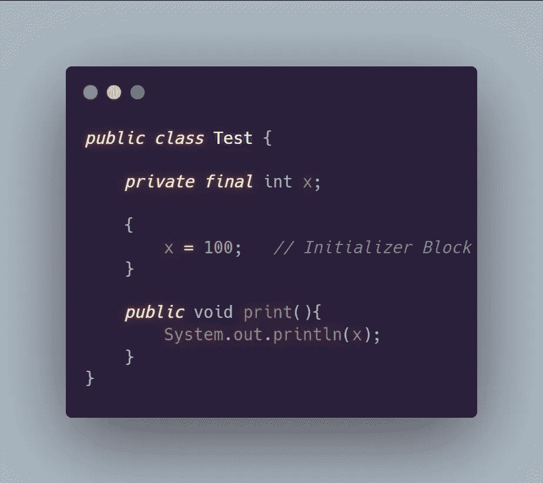
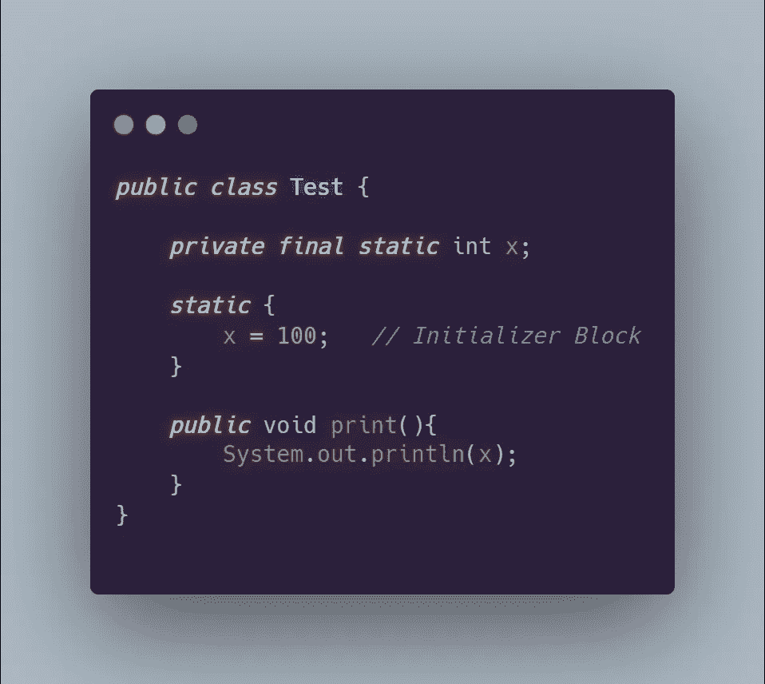

# 面向对象编程概念 JAVA-第 1 部分

> 原文：<https://medium.com/codex/object-oriented-programming-concepts-43eed85b7ea7?source=collection_archive---------8----------------------->

# 什么是课？

类是创建对象的蓝图。例如，有两只狗，一只是黑色的勒布拉犬，另一只是金毛猎犬。两者都可以被认为是从单个蓝图狗创建的真实世界对象。

# 什么是对象？

编程中的对象类似于现实世界中的对象。对象具有以变量形式存储的状态和以方法形式与状态交互的行为。隐藏内部状态并通过对象方法执行所有交互被称为数据封装。借助对象构建代码的好处:

*   模块化→ 一个对象的源代码可以独立于其他对象的源代码来编写和维护。
*   *信息隐藏* →通过只与一个对象的方法交互，它的内部实现细节对外界保持隐藏。
*   *代码重用* →如果一个对象已经存在，你可以在你的程序中使用那个对象。

# JAVA 中的访问说明符

JAVA 中有四种访问说明符，按照严格程度降序排列，它们是:

1.  ***私有:*** 声明为私有的方法和数据成员只能在类内部访问。
2.  ***默认:*** 如果我们没有用我们的方法或数据变量指定任何访问说明符，它们被认为是默认的访问修饰符。只能在同一个包中访问默认成员。
3.  ***受保护:*** 受保护的数据成员和方法只能在同一个包内访问，并且只能在使用受保护的成员和方法继承该类的类内访问。
4.  ***public:*** 它们可以用在任何类的任何地方，任何包里。

按照惯例，我们应该使用最严格的访问修饰符来对我们的变量执行健全性检查，并控制谁可以修改它。

# ***本关键词***

当我们使用同一个类的不同对象调用一个类的方法时，这些方法如何知道调用来自哪个对象呢？在后台，对对象的引用在内部传递给这个关键字中的函数。

# 最终关键字

final 关键字类似于其他语言中的 const 关键字。这个关键字可以与类、方法和变量一起使用，为每一个提供不同的用例。

***带变量的最终关键字***

有三种类型的变量:局部变量、类变量和实例变量。让我们看看他们每个人的最终用例。

*   *局部变量→* 最终局部变量不能重新初始化；否则，编译器将抛出错误。
*   *实例变量→* 最终的实例变量将不得不通过使用初始化器块、构造函数或在声明时进行初始化，然后它就不能被重新初始化了。如果第一次没有使用上述三种方法中的任何一种进行初始化，编译器将显示一个错误。对于该类的每个实例，都有一个最终的实例变量。
*   *类变量→* 在类内部用关键字 final 和 static 声明的变量是一个类变量。它对于该类的每个实例都保持不变。它就像其他语言(如 C++和 C)中的全局变量。最终的类变量值对于每个类实例都保持不变，并且不能重新初始化。作为最后一个实例变量，需要在其声明或类内初始化器块中初始化。

***如何在实例变量的情况下初始化初始化器块中的最终变量，在类变量的情况下初始化类初始化器块？***

这个概念可能很多读者都知道，但是由于它对我来说是一个新概念，我将为不了解它的读者提供一个示例代码。

每当初始化类时，在调用构造函数之前，都会执行初始化块。

初始化程序块

类初始化器块是静态初始化器块。

类初始值设定项块