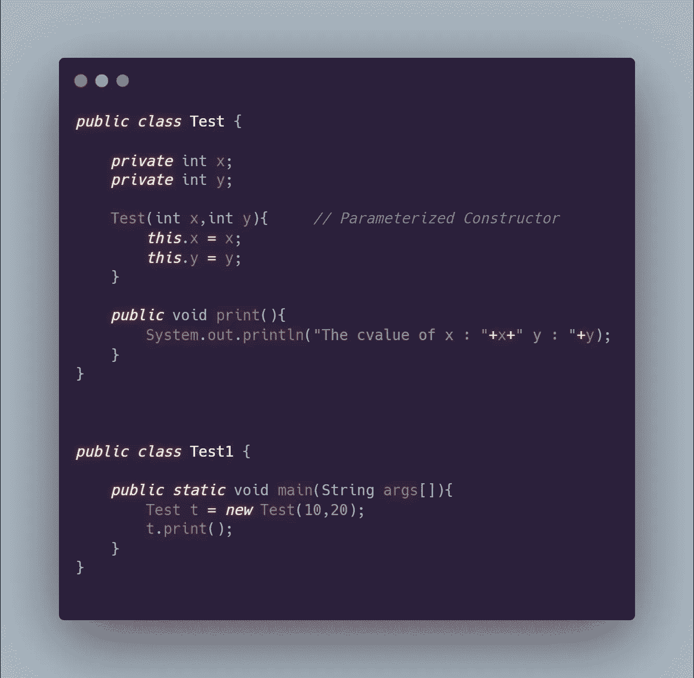
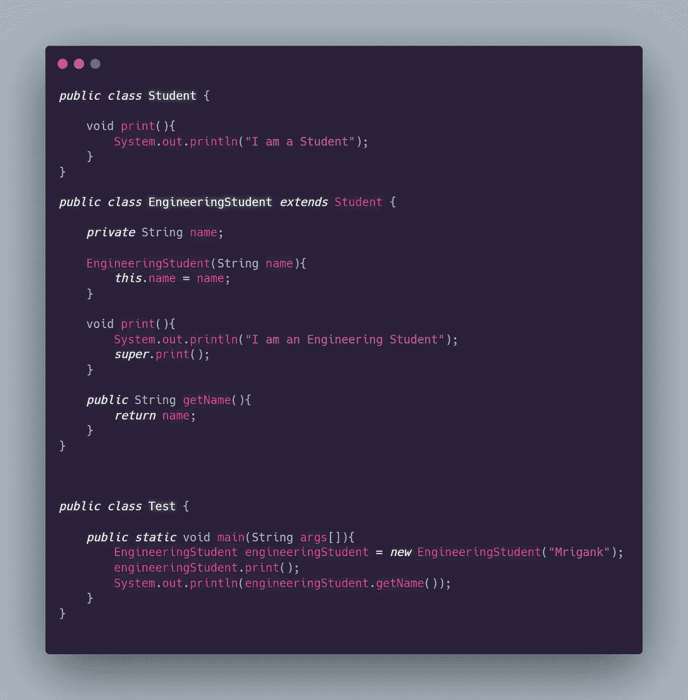
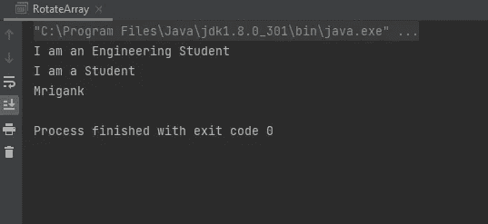
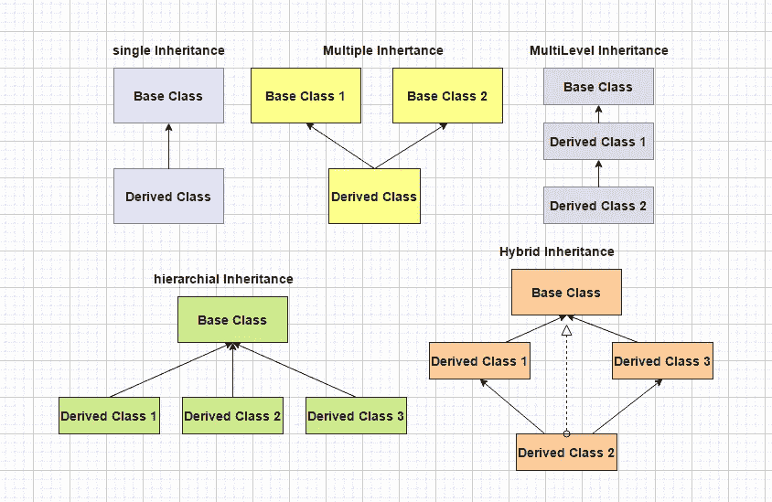
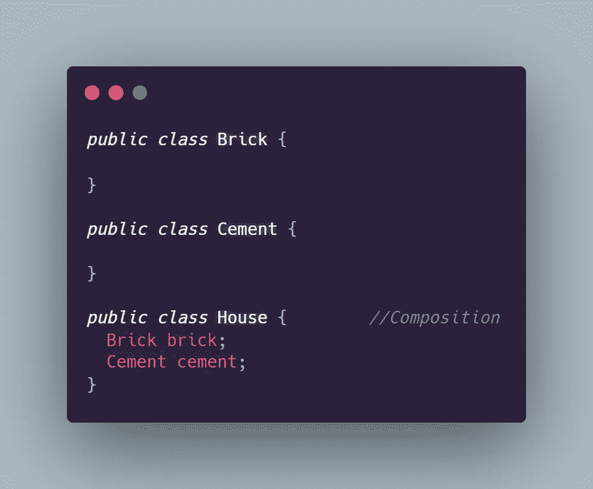

# JAVA 中面向对象的编程概念——第 2 部分

> 原文：<https://medium.com/codex/object-oriented-programming-concepts-in-java-part-2-825c017b612a?source=collection_archive---------27----------------------->

# 静态成员

您希望与所有类对象共享的数据成员是静态的。静态成员可以通过使用类名调用它们来访问，并且不需要创建对象来调用它们，尽管静态成员也可以用对象来调用。静态方法主要用于修改或返回私有静态成员。关于静态方法的一些要点是:

*   静态方法不能访问非静态方法和数据成员，而另一方面，非静态方法可以访问静态成员和方法。
*   因为不需要创建对象来访问静态成员，所以这个引用不会传递给静态方法；这个引用只传递给程序中的非静态方法。

# 构造器

每当创建一个类的对象时，就会调用构造函数。构造函数类似于没有返回类型和类名的方法。有两种类型的构造函数参数化构造函数和默认构造函数。

参数化构造函数

如果类内没有创建构造函数，则创建一个默认构造函数，将所有基元类型的成员初始化为默认值，非基元类型的成员初始化为 ***null*** 。

***注意:*** 如果我们在类内部创建任何构造函数，JAVA 都不会创建默认构造函数*。*

# 包装

在 JAVA 中，文档封装被定义为**对象对外界隐藏其数据和方法的能力。这是面向对象编程的基本原则之一。在 Java 中，类封装了保存对象状态的字段和定义对象动作的方法。封装是借助访问修饰符 public、private、default 和 protected 实现的。例如，在用 JAVA 开发应用程序时，通常的做法是将数据成员访问修饰符设置为 private，然后在 getters 和 setters 的帮助下访问它。**

# 遗产

当一个类继承了一个类的公共方法和数据成员时，就叫做继承。继承方法和成员的类称为子类，继承方法和成员的类称为超类、基类或父类。关键字 ***super*** 是指子类内部的超类。在 super 的帮助下，我们可以调用基类的所有方法和成员。关键字 ***扩展*** 用于子类继承基类。子类可以有只属于子类的方法和成员。让我们用一段代码来看看我们上面讨论的所有理论。

继承程序

输出

**JAVA 中的继承类型**

***注意:*** *在 JAVA 中，一个子类不能有多个父类。所以上图中，* ***多重继承*** *和* ***混合继承*** *在 JAVA 中是不允许的。然而，通过使用 JAVA 中的接口，多重继承和混合继承是可能的。*

无论子类是否与父类在同一个包中，子类都继承父类的所有公共和受保护成员。如果父类和子类都在同一个包中，则子类还会继承所有的包私有或默认父类成员。

*继承的一些特征是:*

*   子类可以直接使用继承的字段和方法。
*   我们可以在子类中声明一个与父类同名的变量。这被称为数据隐藏。这也可以用父类的静态成员来完成。
*   我们可以在子类中声明一个与父类具有相同签名的方法。这被称为方法覆盖。这也可以用静态成员来完成。
*   我们可以在子类中声明不属于超类的新字段和方法。
*   我们可以编写一个子类构造函数，隐式地或者通过使用 super 关键字来调用超类构造函数。
*   我们可以用子类对象初始化超类。

***传承 vs .***

**继承是一种*是一种*和**的关系。比如工科生，医学生，学生。工科生就是学生。

构图是一个 ***和一个*** 的关系。例如，房子是由砖和水泥组成的。

每当继承和组合发生冲突时，使用组合总是明智的。在组合中，我们不使用 extends 关键字，而是在子类中使用基类的对象。让我们以房子、水泥和砖块为例，借助代码来演示合成。

作文