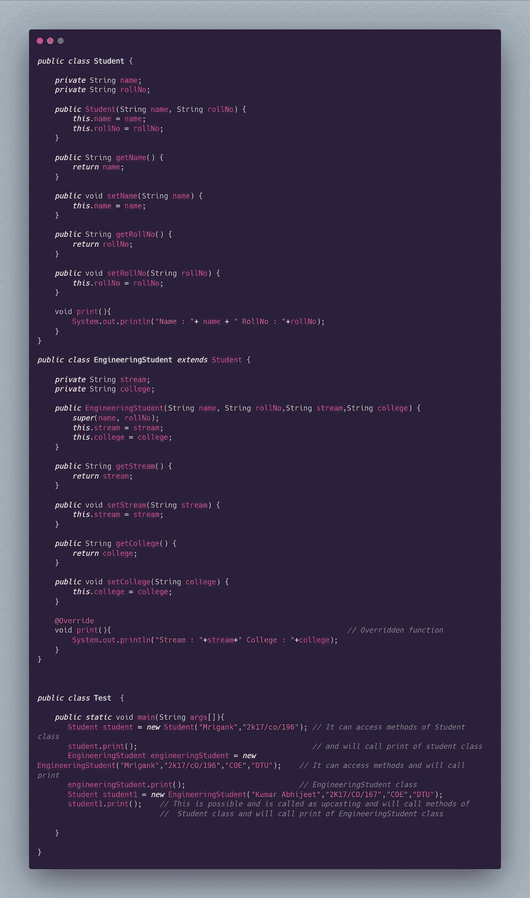

# JAVA 中面向对象的编程概念——第 3 部分

> 原文：<https://medium.com/codex/object-oriented-programming-concepts-in-java-part-3-bfb0557cf504?source=collection_archive---------42----------------------->

# 接口

接口定义了一个类必须做什么，但没有定义它如何做。这意味着类接口只定义方法定义。如果一个类实现一个接口，它必须保证使用它的所有方法并实现它们。如果一个类实现了一个接口，并且没有承诺发布它的所有方法，那么它必须被声明为抽象的。接口可以有多个继承。默认情况下，接口内的所有方法定义都是公共访问修饰符。

一个类只能扩展一个类，但可以实现一个或多个接口。例如:

*公共类 A 扩展 B 实现接口 1，接口 2 {}*

一个接口可以扩展多个接口。例如:

*公共接口 A 扩展接口 1，接口 2 {}*

从 JAVA 8 开始，允许在一个接口中实现方法。

***为什么班级不允许多重继承？***

背后的原因是**防止歧义**。考虑一种情况，B 类扩展了 A 类和 C 类，A 类和 C 类都有相同的显示方法()。现在 java 编译器不能决定它应该继承哪个显示方法。为了防止这种情况，java 中不允许多重继承。

# 多态性

## **方法覆盖**

当父类和子类中定义的方法具有相同的方法签名时，这称为方法重写。如果我们改变方法定义，该方法将被视为一个全新的方法。允许更改访问修饰符。

## 方法重载

在同一个类中用相同的名字但不同的签名定义的方法称为方法重载。

## 方法覆盖的示例:

## 动态绑定或后期绑定

当程序在运行时决定调用哪个函数时，这个特性就叫做动态绑定。在上面的例子中，在运行时确定将调用哪个打印函数。JVM 为每个变量中引用的对象调用适当的方法。这种行为也称为虚拟方法调用。