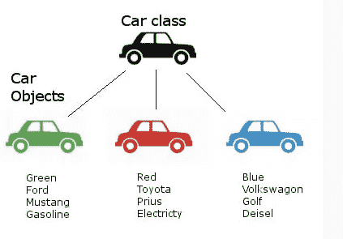
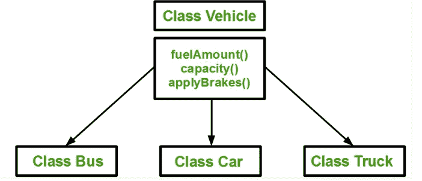
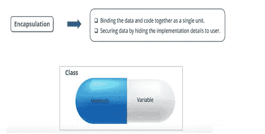
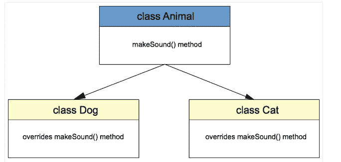
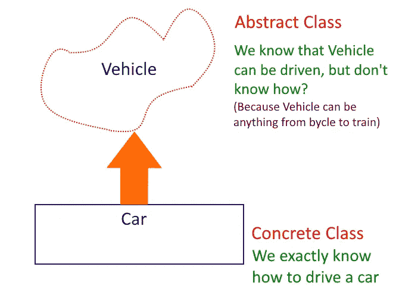

# 对 Python 中面向对象编程的掌握

> 原文：<https://medium.com/codex/object-oriented-programming-concepts-in-python-45df4ceca037?source=collection_archive---------17----------------------->

## [法典](http://medium.com/codex)


**面向对象编程(OOP)** 就是创建**对象**，可以包含变量和函数:字段形式的**变量**(称为**属性**或特性)和过程形式的**函数**(称为**方法**)。

简而言之，这些变量通常被称为对象的属性，而函数被称为对象的行为。

另一个例子——如果我们把一只狗看作一个物体，那么它的属性将是——它的颜色、品种、名字、体重等等。并且他的行为/功能将是行走、吠叫、玩耍等。

例如，一个对象可以代表一个具有**属性**的人，如姓名、年龄、地址和行为，如走路、说话、呼吸和跑步。或者它可以表示一封电子邮件，具有像收件人列表、主题和正文这样的属性，以及像添加附件和发送这样的**行为(或方法)**。

换句话说，面向对象编程是一种对具体的、真实世界的事物建模的方法，如汽车，以及事物之间的关系，如公司和雇员、学生和教师等等。OOP 将现实世界中的实体建模为软件对象，这些对象有一些与之相关的数据，并且可以执行某些功能。

**OOP 的构建模块**:

*   >**类**->-**对象**->-**方法** - >属性

# 快速导航

## [1。类别和对象](https://www.kaggle.com/hiteshtripathi/demystifying-object-oriented-programming-concepts#1)

## [2。初始化方法](https://www.kaggle.com/hiteshtripathi/demystifying-object-oriented-programming-concepts#2)

## [3。构造者，自身](https://www.kaggle.com/hiteshtripathi/demystifying-object-oriented-programming-concepts#2)

## [4。方法的类型](https://www.kaggle.com/hiteshtripathi/demystifying-object-oriented-programming-concepts#5)

## [5。继承](https://www.kaggle.com/hiteshtripathi/demystifying-object-oriented-programming-concepts#6)

## [6。封装](https://www.kaggle.com/hiteshtripathi/demystifying-object-oriented-programming-concepts#7)

## 7 .[。多态现象](https://www.kaggle.com/hiteshtripathi/demystifying-object-oriented-programming-concepts#8)

## [8。抽象类](https://www.kaggle.com/hiteshtripathi/demystifying-object-oriented-programming-concepts#9)

# 1.类别和对象

# 关于类和对象的简单术语— —

类是对象的集合。

**类与对象:** - >类用于创建用户自定义的数据结构。类定义了名为**方法**的函数，这些方法标识了从类创建的对象可以用其变量执行的行为和动作。

类是对象的蓝图或设计。从类构建的包含真实数据的实例(对象)。

汽车类的对象不再是一个蓝图。这是一辆真正的汽车，型号名称像“奥迪 R8”，颜色是“红色”。



[类和对象为汽车](http://www.danamuise.net/blog/2016/1/12/v12kquly0pw63trxg7bg1kvr8qwguj)

```
*'''* 
 *Creating a Class named "Car"*

 *Class Variables = 'feul_type' --Same across all car class object* 
 *Object Variable = 'model','color','mileage'-- Different for      different car objects*
 *Object Methods/Attributes = 'description','max_speed'**'''*
class **Car**:

    'Common for all the objects of Car Class'
    fuel_type = 'Petrol'       *## Class Attribute*

    def __init__(self, model,color,mileage): *## the default method* 
    ## called *automatically when the object of this calls is called.*

        self.model_name = model *## object attribute*
        self.color = color     *## object attribute*
        self.mileage = mileage *## object attribute*
        print("In init method")

    def description(self):
        print("The **{}** gives the mileage of **{}**      kmpl".format(self.model_name,self.mileage))

    def max_speed(self,speed):
        return("The **{}** runs at the maximum speed of **{}**kmphr".format(self.model_name,speed))
```

# 如何创建类对象，如何调用类的方法和变量。

```
*## Create an object of Class Car*
obj1 = Car("Audi A6","Red",17.01)*## Call the methods and variables defined for this object from Car class.*
obj1.description()
print(obj1.max_speed(233))
print(obj1.color)*## Call the Car Class variable.*
print(Car.fuel_type)*## Create another object of Class car.*
obj2 = Car("Audi A8","Black",19)
obj2.max_speed(800)
```

## 注意:对象/实例存储在具有不同内存地址的堆内存中。每次创建一个对象，它都会被分配到堆内存中的新空间。

# 类构造函数

类别建构函式的工作是在建立类别的物件时，将值指派给类别的资料成员。汽车可以有各种属性，如名称、颜色、型号、品牌名称、发动机功率、重量、价格等。

汽车或任何其他对象的属性必须在我们称为 **init** ()的方法中。这个 **init** ()方法也称为构造函数方法。每当构造一个类的对象时，我们就调用一个构造函数方法。

现在我们来谈谈 **init** ()方法的参数。所以这个方法的第一个参数必须是 self。那么只有剩下的参数才会出现。

构造函数方法中的两条语句是–

**self.model_name = model**

**self.color = color**

**self.mileage = milegage**

这将创建新的属性，即车型名称、颜色和里程，然后为它们分配相应的参数值。

“self”关键字表示该类的实例。通过使用“self”关键字，我们可以访问该类的属性和方法。它在方法定义和变量初始化中很有用。每当我们定义一个方法的时候,“自我”就会被明确地使用。

注意:您也可以在这个 **init** ()方法之外创建属性。但是这些属性对整个类都是通用的，你必须给它们赋值。

假设您展厅中的所有汽车都有 fuel_type“汽油”，您可以通过在 **init** ()之外创建一个属性，将 fuel_type 的值固定为“汽油”，而不是反复指定它。

# 理解“自我”关键词

**类方法**与普通函数只有一个特殊的区别——它们必须有一个额外的名字，这个名字必须添加到参数列表的开头，但是在调用方法时不要给这个参数赋值，Python 会提供它。这个特殊的变量指的是物体本身，按照惯例，它被命名为**自我**。

假设您有一个名为 **Car** 的**类**和一个名为 **obj1** 的该类实例。当你调用这个对象的一个方法为 **obj1.method(arg1，arg2)** 时，这被 Python 自动转换为 **Car.method(obj1，arg1，arg 2)**——这就是特殊自我的全部。

这也意味着，如果你有一个不带参数的方法，那么你仍然需要一个参数——自我。

# 方法的类型

**1。实例方法**

a)访问器方法 b)赋值器方法

**2。类方法**

**3。静态法**

**实例方法**:以对象为参数的方法称为实例方法。简而言之，使用实例变量的方法称为实例方法。

实例方法进一步分为访问器和赋值器方法。

**访问器方法:**如果我们只使用该方法来获取实例变量的值，那么它被称为访问器方法。

**Mutator 方法:**如果我们使用该方法来修改实例变量的现有值，那么它被称为 Mutator 方法。

**类方法:**使用类变量的方法称为类方法。

**静态方法:**那些与类变量或者实例变量无关的方法我们就可以使用这个静态方法。

```
class **Car**:

    'Common for all the objects of Car Class'
    fuel_type = 'Petrol'*## Class Attribute*

    def __init__(self, model,color,mileage): *## the default method which will be called automatically* 
                                             *## when the object of this calls is called.*

        self.model_name = model *## object attribute*
        self.color = color     *## object attribute*
        self.mileage = mileage *## object attribute* def get_mileage(self): *### ------> The Accessor Method as it is fetching the values*
        return(self.mileage)

    def set_mileage(self,value): *### -----> The Mutators method as it is modifying the existing Value*
        self.mileage = value
        return(self.mileage)

    @classmethod  *## ---> We must indicate the "decorator" here which is indicating it is a Class method*
    def info(cls): *## ---> This is a Class Method example*

        return(cls.fuel_type)

    @staticmethod   *## ----> We must use the decorator to define that it is a "static method"*
    def about_car():
        print("This is all about Audi Cars")

car1 = Car("Audi A6","Red",18)print(car1.get_mileage())
print(car1.set_mileage(19))Car.about_car() *## ---> This is how we call the "Static methods" using the class names*print(Car.info()) *## --> This is how we call the "Call methods"*
```

# 2.遗产

**继承**是一个类继承另一个类的属性和方法的过程。其属性和方法被继承的类称为父类。从父类继承属性的类是子类。



[继承](https://www.geeksforgeeks.org/inheritance-in-c/)

## 句法

类 parent_class:

父类的主体

类 child_class( parent_class):

子类的主体

```
class **Car**:  *## Parent class* def __init__(self, name, mileage):
        self.name = name 
        self.mileage = mileage    def description(self):                
        return f"The **{**self.name**}** car gives the mileage of **{**self.mileage**}**km/l"class **BMW**(Car): *## Child Class*
    passclass **Audi**(Car):     *## Child class*
    def audi_desc(self):
        return "This is the description method of class Audi."obj1 = BMW("BMW 7-series",39.53)
print(obj1.description())obj2 = Audi("Audi A8 L",14)
print(obj2.description())
print(obj2.audi_desc())
```

## 需要记住的要点:

我们创建了两个子类，即“BMW”和“Audi ”,它们继承了父类“Car”的方法和属性。我们没有在 BMW 类中提供额外的功能和方法。而 Audi 类中的另一个方法。

注意父类的实例方法描述()是如何被子类的对象在 obj1.description()和 obj2.description()的帮助下访问的。另外，使用 obj2.audi_desc()也可以访问类 Audi 的单独方法。

# 3.包装

封装是面向对象编程(OOP)的基本概念之一。它描述了包装数据的思想和在一个单元中处理数据的方法。这限制了直接访问变量和方法，并且可以防止数据的意外修改。为了防止意外更改，对象的变量只能由对象的方法来更改。这些类型的变量被称为**私有变量**。



[封装](http://online.infomatics.info/Course/Core-Python/Encapsulation)

## 类是封装的一个例子，因为它封装了所有的数据，如成员函数、变量等。

基本上，它将数据隐藏起来，不让外人访问。例如，如果一个组织想要保护一个对象/信息不被客户或任何未经授权的人访问，那么封装就是确保这一点的方法。

您可以通过在名称前使用单个下划线(_)来声明受保护的方法或属性。比如——自我。_name 或 def _ method()；这两行告诉我们属性和方法是受保护的，不应该在类和子类的访问之外使用，但是可以由类方法和对象访问。

虽然 Python 使用' _ '只是作为一种编码约定，但它告诉我们应该在类的范围内使用这些属性/方法。但是您仍然可以像往常一样访问被定义为受保护的变量和方法。

现在，为了防止从类的范围之外访问属性/方法，可以使用“私有成员”。为了将属性/方法声明为私有成员，请在前缀中使用双下划线(**)。比如——自我。** name 或 def _ _ method()；这两行都表明属性和方法是私有的，不能从类外部访问。

```
class **car**: def __init__(self, name, mileage):
        self._name = name  *#protected variable*
        self.mileage = mileage    def description(self):                
        return f"The **{**self._name**}** car gives the mileage of **{**self.mileage**}**km/l"
obj = car("BMW 7-series",39.53)*#accessing protected variable via class method* 
print(obj.description())*#accessing protected variable directly from outside*
print(obj._name)
print(obj.mileage)
```

## 请注意我们是如何正确无误地访问受保护变量的。很明显，对变量的访问仍然是公开的。让我们看看封装是如何工作的

```
class **Car**: def __init__(self, name, mileage):
        self.__name = name              *#private variable* 
        self.mileage = mileage    def description(self):                
        return f"The **{**self.__name**}** car gives the mileage of **{**self.mileage**}**km/l"obj = Car("BMW 7-series",39.53)*#accessing private variable via class method* 
print(obj.description())*#accessing private variable directly from outside*
print(obj.mileage)
print(obj.__name)
```

# 注意:

当我们尝试使用 description()方法访问私有变量时，没有遇到错误。但是当我们试图直接在类外访问私有变量时，Python 给出了一个错误:car 对象没有属性' __name '。

您仍然可以使用其损坏的名称直接访问该属性。名称管理是我们用来从外部访问类成员的一种机制。Python 解释器将任何带有“ **var”的标识符重写为“_ClassName** var”。使用它你也可以从外部访问类成员。

```
class **Car**: def __init__(self, name, mileage):
        self.__name = name  *#private variable* 
        self.mileage = mileage    def description(self):                
        return f"The **{**self.__name**}** car gives the mileage of **{**self.mileage**}**km/l"obj = Car("BMW 7-series",39.53)*#accessing private variable via class method* 
print(obj.description())*#accessing private variable directly from outside*
print(obj.mileage)
print(obj._Car__name)      *#mangled name*
```

## 请注意，mangling 规则的设计主要是为了避免事故。但是仍然可以访问或修改被认为是私有的变量。这在特殊情况下甚至很有用，比如在调试器中。

# 4.多态性

这是一个希腊单词。如果我们打破术语多态性，我们得到“多”-许多和“变体”-形式。所以多态性意味着有许多形式。在面向对象程序设计中，它指的是具有相同名称但具有不同功能的函数。



[多态性](https://javatutorial.net/java-polymorphism-example)

```
class **Audi**:
    def description(self):
        print("This the description function of class AUDI.")class **BMW**:
    def description(self):
        print("This the description function of class BMW.")audi = Audi()
bmw = BMW()
for car **in** (audi,bmw):
    car.description()
```

## 注意:

当使用对象 audi 调用该函数时，则调用类 Audi 的函数，当使用对象 bmw 调用该函数时，则调用类 BMW 的函数。

# 5.Python 中的抽象类

一个**抽象**类可以被认为是其他类的蓝图。它允许您创建一组方法，这些方法必须在从抽象类构建的任何子类中创建。包含一个或多个抽象方法的类称为抽象类。抽象方法是有声明但没有实现的方法。当我们设计大型功能单元时，我们使用一个抽象类。当我们想为一个组件的不同实现提供一个公共接口时，我们使用一个抽象类。



[抽象类](https://www.programminghunk.com/2020/02/abstract-classes-in-python.html)

## 为什么使用抽象基类:

通过定义一个抽象基类，可以为一组子类定义一个公共应用程序接口(API)。这种能力在第三方提供实现的情况下特别有用，比如插件，但是在大型团队或大型代码库中工作，很难或不可能记住所有的类时，这种能力也会对您有所帮助。

## 抽象基类如何工作:

默认情况下，Python 不提供抽象类。Python 附带了一个模块，该模块为定义**抽象基类(ABC)** 提供了基础，该模块名为 ABC。ABC 的工作方式是将基类的方法修饰为抽象，然后将具体的类注册为抽象基类的实现。当用关键字@abstractmethod 修饰一个方法时，它就变成了抽象的。

```
from abc import ABC, abstractmethod 

class **Polygon**(ABC): 

    *# abstract method* 
    def noofsides(self): 
        passclass **Triangle**(Polygon): 

    *# overriding abstract method* 
    def noofsides(self): 
        print("I have 3 sides")         
class **Pentagon**(Polygon): 

    *# overriding abstract method* 
    def noofsides(self): 
        print("I have 5 sides") 

class **Hexagon**(Polygon): 

    *# overriding abstract method* 
    def noofsides(self): 
        print("I have 6 sides") 

class **Quadrilateral**(Polygon): 

    *# overriding abstract method* 
    def noofsides(self): 
        print("I have 4 sides") 

*# Driver code* 
R = Triangle() 
R.noofsides() 

K = Quadrilateral() 
K.noofsides() 

R = Pentagon() 
R.noofsides() 

K = Hexagon() 
K.noofsides()
```


如果你喜欢我的文章，给它一些掌声，或者更好地与你的朋友或同事分享。

你可以在 LinkedIn 上找到我:[https://www.linkedin.com/in/hiteshtripathi/](https://www.linkedin.com/in/hiteshtripathi/)

# 参考资料:

## [1 . https://youtu . be/qiscmnbip 2g](https://www.kaggle.com/hiteshtripathi/demystifying-object-oriented-programming-concepts#1)

## [2 . https://python . swaroopch . com/OOP . html](https://www.kaggle.com/hiteshtripathi/demystifying-object-oriented-programming-concepts#2)

## [3。https://www . analyticsvidhya . com/blog/2020/09/面向对象编程/](https://www.kaggle.com/hiteshtripathi/demystifying-object-oriented-programming-concepts#2)

## [4。https://medium . com/@ manjuladube/encapsulation-abstraction-35999 b0a 3911](https://www.kaggle.com/hiteshtripathi/demystifying-object-oriented-programming-concepts#4)

## [5。https://www.geeksforgeeks.org/polymorphism-in-python/](https://www.kaggle.com/hiteshtripathi/demystifying-object-oriented-programming-concepts#5)

## [6。https://www.faceprep.in/python/abstraction-in-python/](https://www.kaggle.com/hiteshtripathi/demystifying-object-oriented-programming-concepts#6)

## [7。https://www.geeksforgeeks.org/abstract-classes-in-python/](https://www.kaggle.com/hiteshtripathi/demystifying-object-oriented-programming-concepts#7)