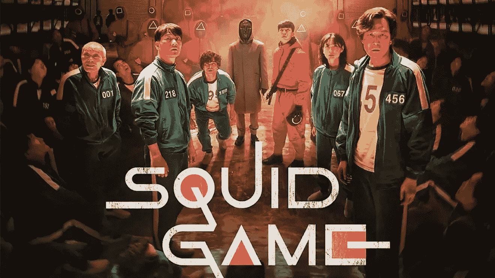

# 五分钟面向对象编程

> 原文：<https://medium.com/codex/object-oriented-programming-in-five-minutes-d54b96c906d?source=collection_archive---------6----------------------->

## 面向对象的程序设计(Object Oriented Programming)

## 面向编程新手的 oop

# 嗨，伙计们😃,

祝大家愉快。在这篇文章中，我将解释面向对象编程的基础。这很可能是任何大学本科阶段计算机科学相关课程的第一堂课。我写这篇文章是因为当我在 Moratuwa 大学开始作为 CSE 本科生时，我在第二学期(计算机科学与工程的第一学期)被教授了 oop 模块。我很晚才理解 oop 的概念。所以我想尽早帮助那些正在努力理解 oop 概念的人。

乌斯曼·尤萨夫在 [Unsplash](https://unsplash.com?utm_source=medium&utm_medium=referral) 上的照片

这篇文章不是特定于语言的。这篇文章只包含基本的概念和简单的解释。所以无论你知道什么编程语言，这篇文章都非常适合你尝试 oop 概念。至少如果你懂一门编程语言，那么你很容易理解那些概念。

## 这里包括什么？

*   什么是类和对象？
*   包装
*   抽象
*   遗产
*   多态性

## OOP 是什么？

如果你想知道什么是 OOP？你需要了解对象。如果你理解了对象，那么你需要理解什么是原始数据类型。

我们在编程语言中使用许多数据类型来定义变量。如 int、float、double、char、boolean 等。这些类型已经由编程语言作为内置特性给出。这些是原始数据类型。这种类型不是用户创建的。我们可以在编写代码时直接使用这种原始数据类型。这些都是简单的数据。简单数据意味着它只能保存或存储一种类型的数据。例如，如果 int 只能存储数字。Like char 只能存储一个字符。这样我们就知道什么类型的数据可以存储在特定类型的数据类型中。我们不能用原始数据类型存储复杂数据。

复杂数据意味着，这是一组原始数据的集合。当我们计划保存一组数据时，原始数据是不合适的。所以在这种情况下，我们使用对象和类。我们在面向对象的编程中使用这些对象和类。

好的，现在我们来看看，为什么是 OOP？我想解释一下这个思维例子。我用乌贼游戏电视剧来解释。

[https://www . Marca . com/en/life style/TV-shows/2021/10/01/6157178546163 f 62728 b45 AE . html](https://www.marca.com/en/lifestyle/tv-shows/2021/10/01/6157178546163f62728b45ae.html)

在这个游戏中，有许多不同的角色。

*   运动员
*   主唱
*   主持
*   肠血管活性肽
*   金钱

因此，如果我们想对整个游戏进行编码，我们需要对每个角色分别进行编码。我们一次选择一个字符，里面有很多属性/数据。

玩家-ID、姓名、性别、年龄、地址、健康状况、是否活着

[https://www . ft . com/content/2775 f7dc-5cd 1-4a0f-83e 9-2da 6765058 A0](https://www.ft.com/content/2775f7dc-5cd1-4a0f-83e9-2da6765058a0)

每个玩家都有一个唯一的 id，名字，年龄，地址，健康信息。想象一下，我们在没有 OOP 概念的情况下存储这些数据，我们创建了许多原始数据变量。那就很难处理了。并且花费更多的时间和错误。我们使用 OOP 来避免这些问题。所以我们可以在 Object 下存储 ID、姓名、年龄、地址和健康状况。我们可以很容易地处理每一个数据。我们可以减少时间和错误。

对象是类的实例。类是对象的模板。这是类和对象的实际定义。我觉得这个定义可能对类和对象的理解不够。所以我举例说明。如果我们计划建造一个家，有一个蓝图和一个实际的家。所以在这种情况下，蓝图是类，实际的家是对象。我们可以用一张蓝图建造许多家园。同样，我们可以使用一个类创建许多对象。

[https://tz-mag-media . S3 . AP-southeast-1 . amazonaws . com/WP-content/uploads/2021/09/27182848/Screen-Shot-2021-09-27-at-6 . 15 . 55-pm . png](https://tz-mag-media.s3.ap-southeast-1.amazonaws.com/wp-content/uploads/2021/09/27182848/Screen-Shot-2021-09-27-at-6.15.55-PM.png)

让我们再玩一次乌贼游戏，我们创建一个玩家作为一个类。所以现在我们为玩家创建一个基本模板。在这个类中，我们可以创建一个 ID，姓名，年龄，地址，活着。此外，我们可以在类中创建方法。比如吃()、走()、睡()。我们需要这些数据来编码游戏。之后，我们使用这个类创建许多对象。每个对象都有唯一的数据。这是类和对象的基础。可以使用一个类创建多个对象。

[https://kdramadiar . com/WP-content/uploads/2021/09/Squid-Game-characters-650 x433 . jpg](https://kdramadiary.com/wp-content/uploads/2021/09/Squid-Game-characters-650x433.jpg)

接下来，我们将一个接一个地研究 OOP 的原理。主要概念如下。

*   包装
*   抽象
*   遗产
*   多态性

## 什么是封装？

封装是用类中的方法将数据分组。我们使用这个封装概念来隐藏数据(防止外部直接访问)。外部用户不能直接使用数据。他们使用方法来处理这些数据(通过方法访问)。通常，我们使用 getter 和 setter 方法来使用这些数据。我们需要为每个数据编写 getter 和 setter 方法。检索数据的 Getter 方法。用于修改数据的 Setter 方法。

再次去 Squid game 解释封装的用法。squid 游戏本身是一个很大的封装组合，由 Frontman、VIP、Host、玩家、金钱(视为变量)、任务(视为函数)组成。所以我们只用这些方法来访问变量。

[https://economic times . India times . com/tech/technology/netflixs-squid-game-success-sparks-debate-in-Korea-over-IP-rights/articleshow/87452562 . CMS](https://economictimes.indiatimes.com/tech/technology/netflixs-squid-game-success-sparks-debate-in-south-korea-over-ip-rights/articleshow/87452562.cms)

## 什么是抽象？

通常，任何人都可以查看类中的所有数据和方法。抽象之后，我们只向外界展示必要的细节。并隐藏所有其他细节。如果一个团队从事一个项目，开发人员 1 只需要开发人员 2 的特定输出。所以在这种情况下，开发者 2 使用抽象来只显示开发者 1 需要的输出。他不需要展示过程就能得到输出。

[https://www . LinkedIn . com/in/an ushan-s/detail/recent-activity/shares/](https://www.linkedin.com/in/anushan-s/detail/recent-activity/shares/)

鱿鱼游戏，虽然每个人都执行任务，但没有人知道他们背后的过程。来自士兵，moto 在幕后为任务准备一切，这些都是隐藏的。

## 什么是继承？

继承允许使用另一个类的数据和方法。在继承之前，我们需要创建一个类来使用该类中的方法。有时，我们可能需要在一个父类下创建更多的子类。在这种情况下，子类可以使用父类的方法和数据。子类继承自超类。它可以继承所有数据和方法。

鱿鱼游戏，所有玩家都继承了相同的父属性，如着装，食物，任务。这样，我们就可以有不同的球员有不同的战术方法。

[https://www . LinkedIn . com/in/an ushan-s/detail/recent-activity/shares/](https://www.linkedin.com/in/anushan-s/detail/recent-activity/shares/)

## 什么是多态性？

多态性是指方法采取多种形式的能力。两种类型的多态性。

*   动态的
*   静态

## 动态多态性

它将在运行时发生。这就是为什么我们称之为动态。当超类和子类有相同的方法时，这是可能的。

## 静态多态性

它将在编译时发生。这就是为什么我们称之为静态。当许多具有相同名称和不同参数的方法在同一个类中时，这是可能的。这被称为方法重载。

[https://www . LinkedIn . com/in/an ushan-s/detail/recent-activity/shares/](https://www.linkedin.com/in/anushan-s/detail/recent-activity/shares/)

鱿鱼游戏，老人以多种形式扮演着游戏的创造者、支付者、主持人的角色。一个人扮演许多角色。这是多态性的一个例子。

这就是基本的 OOP 概念。

我相信你已经理解了今天讨论的主题。如果您有任何问题或任何澄清，不要犹豫，通过回复部分与我联系。感谢您花费宝贵的时间阅读本博客，我相信这将激励您继续学习任何期望的编程语言中的面向对象编程。

***欣赏文章？成为*** [***中等会员***](https://sthenusan.medium.com/membership) ***继续无限制学习。如果你使用上面的链接，我会收到你的一部分会员费，不需要你额外付费。提前感谢。***

照片由 [Alexas_Fotos](https://unsplash.com/@alexas_fotos?utm_source=medium&utm_medium=referral) 在 [Unsplash](https://unsplash.com?utm_source=medium&utm_medium=referral) 上拍摄