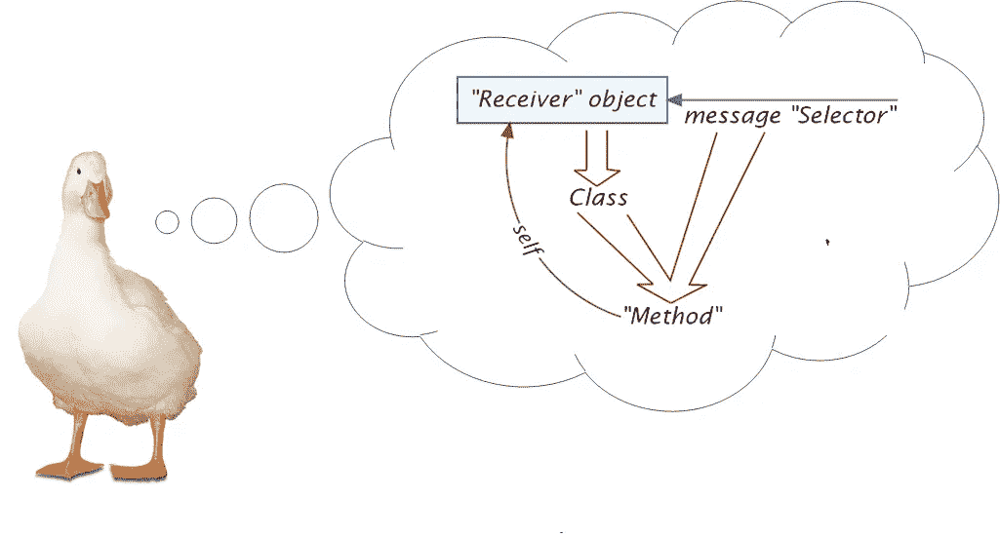

# Python 中的面向对象编程—第 2 课。“复合”模式

> 原文：<https://medium.com/codex/object-oriented-programming-in-python-chapter-2-the-composite-pattern-4b7da542d5b0?source=collection_archive---------3----------------------->



这是一系列五课中的第二课，总结了面向对象编程的实际需要，以及面向对象语言提供的常用工具，并附有 Python 示例，强调了 Python 的实现和方法。在第一课中，我们认为面向对象的范例是在特定的(并且非常频繁的)应用环境中对*功能可替代性*需求的响应。然后，我们看到了为什么*继承*经常被用来为它构建基础设施(以及为什么它确实有用——但是*在 Python 中不是必需的*)。这提供了基础。但是，经验表明，面向对象编程的好处与*训练有素的*应用程序密切相关:遵循通用的设计习惯、模式和架构。因此，本课程的其余部分将致力于展示这一常识中的一些更重要的实践，在本课中，从展示面向对象编程的强大威力的一些重量级设计模式开始。

## 本课中的部分:

1.  关于设计模式
2.  递归对象模型—单节点类型。
3.  “装饰者”模式—两种节点类型
4.  “复合模式”——三种(或更多)节点类型+遍历
5.  练习步骤 1 / 3。部分“轮廓”复合
6.  练习步骤 2 / 3。部分“轮廓”合成(自渲染)
7.  练习步骤 3 / 3。完整的“轮廓”合成(从外部渲染)

## 1.关于设计模式

面向对象编程新手的一个常见错误是，它只是将*功能集中在*类*中。最终你得到的是这么多的类，其中每个类*封装了*所有需要*访问*一个对象的*信息隐藏*的功能(与其他对象的关联、代表对象当前处理状态的数据、缓存数据和内部逻辑)。不幸的是，仅此一项从未奏效，也没有理由认为它会奏效。商业强度的面向对象设计是关于对象之间的团队合作，其中每个对象(实际上)都有其类的特征。但是团队合作——在面向对象设计中以及在我们世界的任何地方——需要团队成员为了共同的目标放弃一些隐私。因此，面向对象设计的真正挑战是*在如此多的类(对象)中分配*公共*功能，找到最佳的*折衷*，对每个类的信息隐藏造成最小的伤害。但是在现实世界的设计中，一些对象结构将被复制，一些内部对象逻辑将被暴露。这就是坏消息！**

好消息是，通过多年的面向对象编程范例的密集商业应用(至少从 1980 年开始——small talk ),已经积累了许多关于其有用应用的集体理解——即对象类之间的团队合作模式。获得这种知识的推荐策略是通过以下一种(或全部)方法:

1.  将您的代码集成到广泛使用的*应用程序框架*中，并遵循它所指示的实践。
2.  要用完全面向对象的语言编写代码，坚持使用语言结构和标准库，并遵循通用的语言实践。
3.  仔细研究*设计模式*和*习惯用法*，并努力效仿他们的例子(无论如何，它们将包含在前两项中)。特别是在 20 世纪 90 年代早期引入面向对象社区的*设计模式*，已经对当前广泛的*结构化*面向对象实践负责。

设计模式既是重复出现的代码结构(“模式”)，也是最初引发它的问题。(只考虑第一个是错误的，就像一些未来的面向对象程序员所做的那样)！但首先，一些历史。(我使用术语*“设计习惯用法”*来描述类似于经典*模式，但是*还没有被正式认可的实践)。

最初有*建筑*的设计模式，由 Christopher Alexander 于 1978 年提出(在*建筑*建筑的背景下)。亚历山大引入了这一概念，并提供了一个他称为*“设计模式”*的详细目录，包括名称、描述和例子，建筑可以用这些来组装，以满足人类居民或游客的功能需求。(比如:谷仓、阳台、大堂、客厅等。).虽然(建筑)建筑的设计模式最终被视觉形状记住，但由于它满足的*功能*而被选择(并整合到建筑中)。总的来说，设计模式是一种在空间中对对象进行排序的方式，暗示了功能性。亚历山大认为，建造良好的建筑，其底层模式构成了一种*“生活模式语言】*，以显而易见的方式引导参观者到达有用的区域。(与摆出“死亡模式语言”的建筑相反——即无用)。

此外，Alexander 在他的目录中给出的规范遵循一种*文学*形式，由通常描述以下内容的段落组成:(1)一个共同的上下文，(2)该上下文中一个重复出现的问题(该模式要解决的问题)，以及(3)解决方案的核心，通常以(4)一个具体的例子结束。事实上，Alexander 之后的设计模式(软件)的作者们保留了*设计模式形式*的思想，尽管遵循了他们自己的私有形式。最后，需要强调的是，设计模式既不是*公式*也不是*模板。*重复一百万次——答案永远不会相同！

然后是软件的*设计模式，*在 20 世纪 90 年代早期，不管语言如何(主要是 Smalltalk 和 C++)，借用 Alexander 的术语，在面向对象编程中建立通用实践的一些尝试达到了高潮。其中最著名的是所谓的“四人帮”的书(由四位作者署名:Gamma、Vlissides、Helm 和 Johnson)，但也有 Coplien、Schmidt、Buchman 和其他人的作品。一旦引入，这些软件的设计模式(以及它们设置的结构化示例)很快成为公认的自动化顶层设计和(面向对象的)编程(超越通用容器和算法等语言同化资产)之间的差距的方式。).

依我拙见(承认其他观点的存在)，设计模式的位置是*在*设计和实现之间。没有软件*分析*的设计模式(据我所知)；设计模式方面的专业知识不会帮助你理解软件产品的功能需求，也不会帮助你对其问题领域建模。但是一旦知道了需求，面向对象设计的新手可能会失望地意识到，仅仅将它们安排到一个对象模型中，并使用消息范例来实现过程部分，会留下许多空白，还没有解决。原因是面向对象的设计不是(也从来不是)仅仅通过*封装*和*信息隐藏*来保护每个单独对象的单个类的责任。这是徒劳的！面向对象的设计是关于*在*对等*对象类之间分配*一般责任，找到*折衷*对每个对象的信息隐藏造成最小可能的损害。(但总会有一些“损害”——看看你周围现实世界中的协作和互动吧！).在这里，已建立的设计习惯用法、模式和体系结构很方便，展示了责任分配的有效和高效的用例，可以复制或学习。

经验表明，由*任意的*解决方案领域实体和功能“创造性地”填补空白(由简单的面向对象设计留下的)通常会导致维护灾难，尤其是当涉及到不止一个开发人员时。(推理如下)。相反，当精通设计模式时，面向对象的设计人员开始以一种相当标准的方式解决技术问题，其他开发人员可以理解和维护这种方式。

因为面向对象的工作方式强调功能的*封装*(在类中，而不是在函数中)，*用设计模式完成*解决方案模型通常会导致添加*解决方案领域实体*——以类、基类和接口的形式——以可识别的方式解决常见的技术问题，在代码中创建可见的模式。由于类(数据结构*集合*函数)比单个函数对代码结构有更大的影响，因此好的*面向对象设计比过程化设计(更少受设计者的青睐)有可能交付更好的软件产品(因为它的效果更深刻和结构化)。但是基于同样的前提，一个*糟糕的*面向对象设计将会破坏软件产品，无法修复。(好处和坏处都和技术的强弱成正比)。因此，遵守既定的应用程序(模式、习惯用法和架构)是非常重要的！*

作为对我的观察的证明，设计模式属于设计和实现之间的间隙，考虑软件的一些设计模式(最显著的是“访问者”，在下一课中详细讨论)，*可能——相反地，*需要改变我们对*问题*领域的理解。这个转折可能是一个祝福(一个*启示*引导我们“回到绘图板”)或者一个诅咒(被解决方案“绑架”的问题)。无论如何——为了证明我的观点——这对于许多面向对象的设计者来说是一个惊喜，因为，在这种情况下，模式似乎脱离了它的自然位置(确实是在设计和实现之间，或者最多是在顶层设计和详细设计之间)。

*总结:(假设(1)程序必须反映(在它的控制和数据结构中)问题域(并且尽可能接近)，以及(2)，在此之上的所有其他编程结构必须避免扭曲建模问题的主体)，*精通设计模式和习惯用法允许面向对象的设计者保护以下内容:

1.  将熟悉的*问题*与熟悉的*解决方案*相匹配(而不是浪费时间在——有效但——花哨的解决方案上，这些解决方案会使维护复杂化，并且毫无理由地禁止第三方 API 的使用)。
2.  使用熟悉的*命名惯例*。
3.  将可识别的*“模式”*添加到代码结构中(循环控制结构、数据结构和名称)，向精通的读者建议通常需要的功能。

这里有一些有趣(也有用)的设计模式，我们将在本课程中详细研究:

1.  “装饰者”模式。递归对象结构(1: 1)，效仿“变质”。
2.  “复合”模式。递归对象结构(1: N)，允许从外部遍历。
3.  “访客”模式。面向对象响应“非对称多重多态性”。
4.  “分级访问者”变体。结合“复合”模式。

我们还将讨论一些由于 Python 的弱类型和容易访问对象元数据而变得多余的设计模式:

1.  “单例”模式。
2.  “动态可插拔工厂”模式
3.  使用“工厂方法”的变体
4.  使用“原型”的变体
5.  多态设计模式的强类型实现，比如 Visitor 和 Decorator。

至此，介绍完毕。现在开始工作…

## 2.递归对象模型—单节点类型

递归对象模型(“树”)以一个类的对象和该类的(相同或另一个)对象之间的关联为特征(直接或通过中间关联)。一些复杂的树结构(比如我们接下来将要讨论的*装饰*和*复合*设计模式)需要专门的节点类型和一个过渡关联。但是，首先，让我们考虑最简单的树形式，它可以处理具有单一关联的单一节点类型。例如二叉树。


*读作:*“节点包含零个或两个节点(其中每个包含的节点，正如我们已经知道的，包含零个或两个节点，这…)。一个节点要么包含一个父节点，要么不包含(在树根的情况下)”。

在这个简单的架构中，只有一种节点类型,“包含”表示它的*状态*(而不是一个专门的类)。在其存在的任何时刻，一个节点可能*包含*两个子节点或者*无*(可能会改变)。包含是可选的—“0，2”(例如由空值实现)—零数量停止递归！

*比如:*


“A”包含“B”和“C”。“B”包含“D”和“E”。“C”、“D”、“E”不含任何东西(是树的“叶子”)。“A”是树根。

*样本代码:*

*输出:*

```
A
 B
  D
  E
 C
```

## 3.装饰者”模式—两种节点类型

“装饰者”模式使用递归结构习语来实现穷人的变质(对象“超越其类型”的能力)。假设有一个我的字符串类型家族，它们都存储一个字符串，但是有各种装饰:引号、括号等等。此外，假设我们希望这个字符串分类是动态的。例如，给定一个简单的 My 字符串，我们可能希望它的*变成*引号(并保持这种状态)。进一步假设，我们需要这种能力是*累积的*(和*可替换的)*。考虑到引号增加了我的字符串(无论如何，它仍然是我的字符串)，我们可能希望将它进一步放在括号中(并保持这种状态)。等等。

由于一个对象不能在运行时改变它的类(实际上，没有人阻止你将一个 Python 对象的内部类型指针重定向到另一个类，但是，由于在对象构造期间做了大量的准备工作，这对你不起作用)，我们*用一个*代理*包装它*，它增强了它的行为并且可能取代它的位置，用替换*(因为它的类也是从* its 派生的*)。“代理”模式(通过转发引用)和可替换性(从同一个基类派生)的结合产生了……*

1.  “动态”分类。一个对象在其生命周期内似乎(对其客户端)会“改变其类型”。
2.  “多重”分类。一个对象具有几种类型的累积行为。

这些烟火都不能用正常的继承来实现，因为这涉及到内部字符串的*复制*，并且违背了对象到类型的*永久*关联。

下面的例子使用“装饰者”模式将一个字符串从简单的无装饰提升到各种字符串装饰，累积，同时保持可替换为字符串。

*输出:*

```
[“TEST”]
```

*脚注:*

1.  “我的弦”是内置弦的包装器，目的是装饰。(直接从内置类型继承不是一个聪明的想法)。
2.  静默转换为内置字符串。注意，由于继承在 Python 中实现的方式，这是装饰者继承的(而不是覆盖的)。(下面将详细介绍)。
3.  抽象类“String Decorator”继承了 ABC(使其成为一个*抽象类*)和“My String”。
4.  *继承*和*包装*我的字符串的“技巧”是“装饰者”模式的核心。
5.  *“数据覆盖”* —这一招是 Python 特有的。由于对象只有一个属性*字典*，它的字符串成员*替换了*从我的字符串继承的字符串(同名键)！这种对继承的使用是正确的还是不正确的可能会有争论，但是它确实节省了多余的代码！(相反，在数据成员是类的一部分的语言中，如 C++、C#、Java 等。，装饰器原来包含两个字符串，其中一个*是冗余的*。并且进一步需要扩散吸气剂！)
6.  默认的内置字符串转换是一个*模板方法*(另一种设计模式)，需要一个抽象方法，该方法将由具体的字符串装饰器实现(在该方法上真正被调用)。
7.  具体的字符串装饰器不需要显式的初始化器。(它们继承了已经完成这项工作的基本初始化器。接收到的字符串被传递给它)。
8.  “带引号的字符串”是一个添加双引号的字符串修饰器。
9.  “括号字符串”是一个添加方括号的字符串修饰器。
10.  “大写字符串”是一个转换成大写字母的字符串装饰器。
11.  字符串大写引用的括号。
12.  内置的 print 悄悄地将 decorator 转换成内置的 string，后者悄悄地*展开装饰层。*

## 4.“复合模式”——三种(或更多)节点类型，用于遍历

1: 1 的双节点架构不足以作为通用的递归数据结构解决方案。“复合”模式将(1: N)递归对象模型概括为一个三节点拓扑，这是——在大多数情况下——完整的解决方案。


*阅读:*组件可以是叶组件，也可以是复合组件(但不是抽象组件)。复合包含零个或多个组件(正如我们已经知道的，每个组件可能是叶组件或复合组件。而如果是复合的……)。

从这个对象模型中得到的一个有趣的教训是，继承层次结构也可以被看作是*选择*控制结构。(准确地说:指导遍历算法进行选择)。这是一个*“异或”*构造:“一个组件要么是叶组件，要么是复合组件(但不是真正的*组件)”。(“Xor”，而不是*或*，因为一个组件不能同时是叶组件和复合组件)。后一个异议——“但不是真正的*组件”——指的是组件的*抽象基*状态。您不能*创建*抽象组件(但是您可以*引用*响应其接口的对象)。注意，当继承层次的基础是*而不是抽象的*时，选择变成三重的:“组件可以是叶组件、复合组件或普通组件”(这里不是这种情况)。**

*一些面向对象的程序员犯了一个天真的错误，把上面的三节点拓扑结构的任何实现都当成了“复合模式”。回想一下,“设计模式”不仅是在空间中排列对象的模式，也是对功能需求的第一反应。相反，*“在树中排列一些对象”*不是解决*问题*的功能需求，而是一种数据结构，便于*解决。*(又为了什么？)*

*“复合”模式中的三节点数据拓扑的目的是支持功能:从外部促进复合结构*的遍历*(和操作】。这个特性解决了哪个问题？为什么从外面穿越，而不是从里面？***

*递归对象结构及其遍历，在*函数式*编程中最为重要，对面向对象设计提出了根本性的挑战。(即将解决！)*信息隐藏*在递归算法内部很难观察到(需要遍历递归结构)。我们不能在*整棵树上实现封装和信息隐藏观察*方法*！*(因为它不是一个离散的对象，我们可以向它传递一个离散的消息并完成它。相反，我们必须以某种方式将许多离散的信息分散到我们还看不见的许多离散的物体上。每个组件中的方法都不行，因为在复合的情况下，就像在树根中一样，可能还有许多附加的组件隐藏在其中。在*过程化*设计中，我们只能直接控制显式调用来处理根节点的函数。但是一旦它开始在内部反复出现，我们必须耐心地坐着，等待整个过程的展开，对这期间发生的事情没有任何控制。(允许这么多无辜无防备的对象在里面被掠夺，这不是面向对象的方式！)*

*虽然程序设计的挑战似乎是如何将如此多的功能集中在一个功能中(将操作的对象作为参数)，但面向对象的设计挑战是如何在参与者对象之间分配责任。并且在复合上下文中:每个节点*应该做什么*和*不应该做什么？*根据组件*类型，是否有不同的*功能*职责？**

*有，有！这就是最初三重节点结构的原因。显然，复合者必须负责*遍历*内部，而叶子必须负责做*工作*！尽管如此，将(1)遍历组合和(2)决定工作或遍历组合内部(如果适用)的责任委托给手边的组合仍然是一个糟糕的设计决策，因为(1)后者(工作)是*而不是*组合的*业务*；以及(2)这将需要显式的*类型查询*(这不是一个好主意，如果可以避免的话，我们将看到它是可以避免的)，以及(3) *哪一个有更多的人在里面等着，我们也尊重他们隐藏的信息。**

*这仅仅是关于遍历和触发离散工作。*复合*作为一个结构(算上它的复合和叶子)应该做什么实际工作，不应该做什么工作？面向对象的答案是决定性的:只需要*遍历*和尽可能少的*工作*来定义组合的业务。其他工作(可以基于此)应该留给专门的助手和操纵器(无论是函数还是对象)。例如:*渲染*树，涉及整棵树的计算等。复合元素必须以 bare 协议为特色，以便能够使用 getter 和 setter 从外部进行操作和检查，而不必求助于显式类型查询(因为有更好的方法，正如我们将看到的)！*

*考虑这个丰富的*形状*复合拓扑，它具有几个叶子类型和一个复合子层次结构。(这在对象建模中很常见。相反，简单的单叶/单复合拓扑似乎是个例外)。双尖括号内的描述符(“guillemets”)——也称为“原型”——在这里用于指定模式中节点的*角色*。*

**

*线、圆和正方形是树叶。多线条和多形状是复合的(多线条专门用于线条)，从抽象的 Compo-shape 继承了复合行为。关联的奇数*限制性继承*(【多行】同意只容纳*的*行，尽管它是*构建的*来包含任何形状。关联名称前的斜线表示它没有被物理实现)在对象建模中很常见，并且——尽管有*限制*，但不损害可替换性原则(待讨论)！正确的可替换性并不意味着列表*必须*包含所有可用形状子类的实例。这只意味着列表中的所有对象都必须响应 Shape 接口，事实上它们确实响应了！*

*这种设计的特点是*真正的*复合:除了*包含形状*之外，复合形状几乎没有附加价值，因此有利于无类型渲染。在干净的设计中，渲染一个复合形状被简化为只渲染内部的每个形状，并且按照正确的*覆盖顺序，*不多也不少！此外，一些 Compo-shape 可能会在此之前添加一些*准备*工作，以及之后的一些*清理*工作，但仍然不需要在中间*插入*功能(除了已经封装在包含对象中的功能)！*

*这就是过渡抽象复合形的原因。因为迭代协议是复合通用的，所以它可以被分解为一个基类并被继承。(“对于内部的每个形状……”)。除非有一些特殊的效果来绘制线条或形状冲突的地方，否则只要涉及到合成，就有可能在不知道我们在画什么的情况下画出整棵树！(即使指定了这样的线粘合特效，包括*增强*，我也有过这样的设计，我宁愿把这些定义为*【夹具】*一类的形状，像其他形状一样，按照正确的覆盖顺序渲染，提前准备好。事实上，在土木工程的世界里，“夹具”是一个*问题域*实体——而不是渲染效果:夹具占据昂贵的空间，必须承受压力，生产成本高，带有目录 id，等等。).并且夹具需要支持其他形状的知识不受对象模型的影响。对象模型评估我们将需要的对象种类，以及将它们组合在一起所需的机制。为什么所有这些对象首先在那里是初始化过程的秘密。*

*但是*在叶子内部迭代呢？*什么？等一下，这一定是个误会！我们在*复合*中迭代。我们用树叶做工作。这是真的，但是在复合体内迭代时，我们很可能同时遇到叶子和复合体，我们最不想做的事情就是询问它们各自的类型(并且只有当它标识为复合体时才迭代到其中)。要么有一个来自外部的迭代的智能替代(我们将在后面考虑)，要么我们在*迭代方面*匹配*叶和复合行为！*在干净的组合设计中，就“内部迭代”而言，一个叶应该与一个空的组合相同。这符合 Python 风格的“鸭子打字”的精神。在这两种情况下——空的复合或者叶子——我们在里面没有什么要找的,所以空的组件是复合的还是别的什么并不重要！至于做叶子的工作——正如已经说过的，那是*叶子*的工作；复合材料可能*悄无声息地越过*！*

*但是，当*呈现叶子*形状(线条、圆形或正方形)时，这种通用性就结束了。在这里，因为渲染是依赖于类型的，所以类型查询迫在眉睫；渲染直线、圆和正方形是由不同的公式驱动的。请求叶子形状让*自己渲染*可能在*脚本*范围内有效，但对于商业软件来说并不是一个实用的解决方案:有许多渲染技术、媒体和风格，很可能是运行时可配置的。无论如何，渲染(更不用说为调试或持久化而转储)从一开始就绝对不在 Shape 的*职责*之内！*

*有几种方法可以解决这个设计问题(并确保一个*开放*设计)。我们将在下一课讨论一个面向对象的解决方案。为了简单起见，也为了证明这一点，在这一课中，我们将把自己限制在一个简单(但实用)的复合材料上，与形状相反，它具有一个“强类型”的叶子。在这个组合中，只有一个叶子类型——*字符串*——它定义了组合内容，是官方已知的，并且不会改变。*

**遵循本练习的三个步骤。**

## *5.练习步骤 1 / 3。部分“轮廓”复合结构(自我操纵)*

*练习程序读取一个“大纲”文件(见下面的例子)并分析其内容，给出对象模型。这种“大纲”格式是一种简单的文本行层次结构，Python 和伪代码风格，非常适合“复合”模式。*

**以下是本练习的示例大纲文件:**

```
*to develop software 
    to analyze the requirements 
        to understand the needs 
        to model the problem domain 
    to design the solution 
        to select architecture
            to make design decisions
        to model the solution domain
            to apply design patterns
        to confirm fidelity
    to implement the solution
        to code the solution
        to test the solution
        to package the solution*
```

*每条*线*都是大纲树中的一个(叶)节点，其中*缩进*表示嵌套的*块*结构——大纲树的组合。(在下图中，块用黄色矩形突出显示)。除了行之外，块不包含进一步的信息。每缩进*打开*一个新块(在当前块中，并在其中提供*第一行*)。*最外面的*线(树根——只有*一根*)位于其自身的块中(图中未示出)。*

**

**这里是对象模型:**

**

*大纲文档包含一个块(递归文档结构的根)。块是一种包含一个或多个轮廓元素的轮廓元素。每个 Outline 元素(扮演这个“复合”模式的“组件”的角色)可以是一条线(“叶子”)或一个块(“复合”)。*

**分配:*对于第一个原型，实现这个“大纲文档”的设计，暂时只是解析文件。(我们将在下一个原型中添加遍历功能——渲染)。*

**完成作业后回到这里，将你的答案与“教科书答案”进行比较:**

**脚注:**

1.  *轮廓块(复合体)包含轮廓线(叶子)。*
2.  *每个块都指向它的父块(出于解析的临时目的。之后就不用了)。*
3.  *默认情况下，最外面的块是打开的。*
4.  *空行被忽略。*
5.  *缩进的行也会打开一个块。*
6.  *一个缩进的行试图展开块堆栈，参考保存在展开的块中的原始缩进。(相同缩进行不做任何事情)。*
7.  *内容被剥离的当前行被追加到当前块中。*
8.  *演示程序创建磁盘文件，如果没有找到，就用正确的内容填充它。*

## *6.练习步骤 2 / 3。部分“轮廓”合成(自渲染)*

*接下来，我们将添加渲染逻辑。为了这个原型的缘故，我们将允许轮廓呈现它自己。(我们将在下一个——也是最后一个——版本中重构这个功能)。将适当的*渲染*功能添加到大纲文档和相应的组件类型中。*

*a 到*渲染:*对于这个原型，我们将使用一个简单的文本样式，称为“军事编号”。每一行前面都有一个用点分隔的数字列表，指定它的“等级”——枚举的层次位置(从等级 1 开始)。*

**此输入的示例“军事编号”列表:**

```
*1\. to develop software 
    1.1\. to analyze the requirements 
        1.1.1\. to understand the needs 
        1.1.2\. to model the problem domain 
    1.2\. to design the solution 
        1.2.1\. to select architecture
            1.2.1.1\. to make design decisions
        1.2.2\. to model the solution domain
            1.2.2.1\. to apply design patterns
        1.2.3\. to confirm fidelity
    1.3\. to implement the solution
        1.3.1\. to code the solution
        1.3.2\. to test the solution
        1.3.3\. to package the solution*
```

**完成作业后回到这里，将你的答案与“教科书答案”进行比较:**

**脚注:**

1.  *“Render”是组件的抽象方法，由具体的组件来实现。所有渲染器都获得等级(数字列表)。*
2.  *线条渲染提升当前等级(在其父级中——等级是“通过引用”传递的)！*
3.  *行渲染显示行，完整的军事编号前缀，使用收到的军衔，在前进。*
4.  *块渲染打开了一个子等级(暂时编号为 0——由该行推进)。*
5.  *块，在它的合成角色中，不主动显示任何东西。相反，它将实际的呈现一个接一个地委托给内部的组件。*
6.  *大纲文档呈现将实际呈现委托给根块。*
7.  *在这个临时原型中，大纲文档*呈现其自身*，并呈现给*标准输出*。*

**输出:**

```
*1\. build software
 1.1\. analyze requirements
  1.1.1\. understand needs
  1.1.2\. model problem domain
 1.2\. design solution
  1.2.1\. select architecture
   1.2.1.1\. make design decisions
  1.2.2\. model solution domain
   1.2.2.1\. apply design patterns
  1.2.3\. confirm fidelity
 1.3\. implement solution
  1.3.1\. code solution
  1.3.2\. test solution
  1.3.3\. package solution*
```

## *7.练习步骤 3/3。完整的复合轮廓(从外部渲染)*

*随着所有底层逻辑(包括文本呈现)的解决，让我们最终总结出正确的“复合”模式，通过*重构*呈现给第三方的能力，当然，在复合中提供适当的基础设施。目前，我们保持简单的“军事编号”渲染风格。(我们将在下一课中解决促进任何渲染风格的问题)。*

**任务:*使用当前原型，重构大纲文档组合的呈现功能*出*，并使用大纲文档转化为*呈现*功能。设计一个智能组合接口，允许呈现器*遍历*大纲文档组合，并*提取*信息以呈现*，而无需显式类型查询*(即，无需基于当前节点类型的显式选择:叶或组合)！*

*对于“教科书解决方案”，[按此链接](https://gist.github.com/AvnerBen/b1c8019f662c7a98c421db2a83a811fc)。*

## *接下来呢？*

*在第一课中，我们学到了面向对象编程的基本词汇:使用*消息*范例，对*对象*的功能*可替代性*，这些对象的行为和数据封装在*类*中。在这一课中，我认为在实践中应用面向对象的设计必须*遵守*规则，遵循既定的习惯用法、模式和体系结构，并继续将本课的剩余部分致力于面向对象的递归数据结构方法——“装饰”和“组合”模式。在下一课中，我们将继续探索消息范式的局限性以及如何克服它们，使用其他多态设计模式和习惯用法，集中于“访问者”模式，并将后者与“复合”模式相结合，给出“层次访问者”变体。*

## *参考*

1.  *克里斯托弗·亚历山大:“永恒的建筑方式”，牛津大学出版社，1979 年。*
2.  *Gamma，Vlissides，Helm & Johnson:“设计模式:可重用面向对象软件的元素”，Addison-Wesely，1994 年。*

# *本课程的课程:*

1.  *[可替代性和继承性](/codex/object-oriented-programming-in-python-lesson-1-substitutability-and-inheritance-e5c6661dfca5)*
2.  ***OO 可替代性荣耀:“复合”模式**↓*你来了！**
3.  *面向对象可替代性的限制:“访问者”模式*
4.  *一些无聊的设计模式*
5.  *继承的限制*