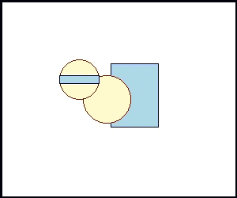
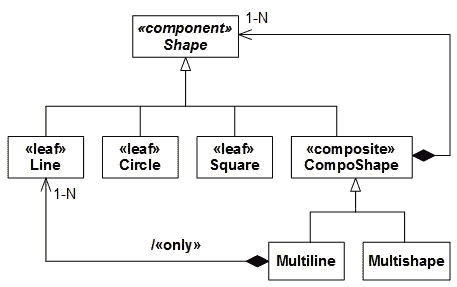

# Python 中的面向对象编程。第 3 课——“访问者”模式

> 原文：<https://medium.com/codex/object-oriented-programming-in-python-chapter-3-the-visitor-pattern-d0b176d4807d?source=collection_archive---------3----------------------->


这是五课系列中的第三课，总结了面向对象编程的实际需要，并介绍了面向对象语言提供的常用工具。这些例子是用 Python 编写的，强调了 Python 的实现和方法。在前面的章节中，我们学到了面向对象编程的基本词汇:使用*消息*范例，对行为和数据封装在*类*中的*对象*的功能*可替代性*。在本课中，基于在实践中应用面向对象的设计必须遵守*规则*的观察，遵循已建立的习惯用法、模式和架构，我们继续讨论一个面向对象方法的详细示例*递归数据结构* —“装饰”和“组合”模式。最后，我们将用这种智慧来总结上一课的例子。

## 本课中的部分:

1.  面向对象可替代性的常见情况——“左撇子”多态
2.  “双”多态性的挑战
3.  简单的方法:“多种方法”
4.  面向对象的出路——“双重调度”
5.  “访问者”模式
6.  “分级访问者”变体
7.  锻炼身体。具有多个渲染器的“轮廓”文件

## 1.面向对象可替代性的常见情况——“左撇子”多态

正如本课程第一课所介绍的，要求*可替换*功能的面向对象解决方案(我们知道必须做什么，但有许多方法可以做到)是*左手多态，*依靠一个(显式或隐式)的类层次结构来满足这个所需的*接口*。给定一个匿名但符合接口的对象作为*消息*的*接收者*(位于点运算符的左侧)，我们*向其传递消息选择器*和参数(在点运算符的右侧)。*动态绑定*负责剩下的事情。


简单地说，*的面向对象解释“我们知道必须做什么，但是有许多方法去做……”*继续“*”……并且它(如何做)取决于对象的类型(动作的接收者)——所以让对象，不管它是什么，为我们做吧！”。*准确地说:面向对象的范例用更简单的挑战*处理*一个可替代的*对象*来代替*激活*一个可替代的*能力*的挑战。左手多态是简单的，不言自明的，并且编程实现起来非常有效。(不要问令人尴尬的问题，比如显式的 switch/case 结构)。但是有一个明显的限制(遗憾的是被一些人忽略了):一个一致的问题域！为了使左手多态适用，在*左侧*必须有一个*对象*，并且恰好有一个这样的对象*！*

首先，让我们考虑一个*符合*的情况— *“形状/点碰撞测试”*。图形编辑器在屏幕上显示一个画布，在画布上呈现几个形状。用户点击鼠标。程序唤醒到*事件*，接收鼠标点击*坐标* (x: y 点)。对于*与点*碰撞的(第一个)形状，显示的形状列表被*扫描*。面向对象的执行方式是将布尔*消息*“正在碰撞”传递给每个形状，并选择第一个积极响应的形状。当然，所有的具体形状(圆形和矩形)都实现了这个*方法*。

*面向对象的*问题解决方案——“形状，你和这个点碰撞吗？”—是正确的设计决策。形状知道点(例如，它有一个中心点)，并且在该几何图形中只有一种点类型。作为对比，对面的面向对象解决方案——*“点，你发生在这个形状内部吗？”*不好；点不知道复杂的形状(即使它们知道，涉及的具体形状也没有指定)。以及*全局*解— *“这个形状(不管是什么)和这个点有没有碰撞？”*——同样不好，也是出于同样的原因。


*示例代码:*

*脚注:*

1.  “碰撞”是抽象形态中的一种抽象方法。
2.  “正在碰撞”的圆法。
3.  “正在碰撞”的矩形法。

*输出:*

```
Testing collision with 110:110
1\. Circle at 100:100\. r=50: True
2\. Circle at 200:100\. r=10: False
3\. Rectangle at 100:200\. 100x100: False
4\. Rectangle at 100:105\. 20x30: True
```

## 2.“双”多态性的挑战

“左撇子”——或“单数”——多态似乎可以满足——自然地或经过一些调整——大多数功能可替代性的设计挑战(这是它受欢迎的原因)。然而——*惊喜，惊喜！*——它不是万灵药(正如一些面向对象的狂热者所说的那样)。像任何工具一样，它有其*适用范围*和*限制*，专业人士必须牢记。一个众所周知的此类限制是*多多态性，*众所周知，这比单一品种要罕见得多，但尽管如此，它仍然存在，不容忽视。*(还是因为我们习惯性的回避所以很少？)*

例如，我们*能够*轻松地解决*“形状与点碰撞”*的挑战，通过将布尔*“正在碰撞”*消息传递给一个匿名形状，并将点作为参数，因为(1)，形状*类型*是*可替换的*，但是(2)，点*类型*是*常量*。(也就是说，消息接收者是可替换的，但是消息是强类型的— *Point* expected。其他的都是不可接受的！)

现在，考虑“形状与形状冲突”的用例。(例如，我们可能希望用两种颜色的混合来绘制共享区域)。在这个问题上强迫一个左手解决方案是没有意义的(正如我们将看到的，无论如何都不会起作用)，因为没有理由更喜欢*“圆，你会与这个矩形碰撞吗”*而不是*“矩形，你会与这个圆碰撞吗”——准确地说，考虑到可替代性:“左形状，无论你是什么，你会与右形状碰撞吗，无论它是什么？”反之亦然——*除了狭隘的面向对象正统！

这里，*涉及到两个*可替代对象，两者都有*对*的标题【消息接收者】的同等索取权*！所以，他们谁也赢不了！这是*的*程序*挑战“这些圆和矩形会碰撞吗？”*(准确的说，占可替代性:*“这两个形状，不管是什么，会不会碰撞？”)*。因为这个挑战不容易传递信息— *到单个对象—* 范例，人们可以自由地得出结论，这个用例不建议严格的面向对象设计，如果有的话。(显然，这样的事情确实存在！)*


这个问题的函数式解决方案将建议一个(全局的)*“正在碰撞的”*函数具有两个*可替代的* —参数。这样的函数也被称为*多方法:*(好像)两个(或更多)类的“方法”。这里的设计挑战是两种形状的每种组合— (1)圆形/圆形，(2)圆形/矩形，和(3)矩形/矩形—需要不同的方法。(除非您打算使用形状/点碰撞来计算像素，这无论如何都是依赖于实现的。否则，请记住所需的几何公式是不同的)。

首先，我们需要我们的编程语言支持"*函数重载"*——通过*相同的名称*定义多个函数(在相同的名称空间中)的能力，但是具有不同的*参数类型列表*。(我们需要用同一个名字调用所有这些不同的函数，因为——在调用时——我们不知道需要哪个实现！)而鸭式 Python 不会把下面的识别为两个截然不同的函数:(1)*“is colliding(Left:Circle，right:Circle)”*(2)*“is colliding(Left:Circle，right:Rectangle)”*。为了增加设计挑战，必须将所需方法的解析推迟到*运行时*！(在编译时，我们会遇到匿名形状与匿名形状的冲突，这并不会让我们变得更聪明)。这种编程能力现在被称为*“多任务分派”*，目前只有极少数编程语言支持(最臭名昭著的是*茱莉亚*)。

Python 甚至不支持*函数重载、*的简单要求，原因很简单:基于*字典的*架构。因为函数名——一个字符串——被用作对象(或模块)字典的*键*,所以可能只有一个这样的函数！出于同样的原因，我们可能不会为*每个*形状类提供与*每个*形状进行碰撞检测的方法；object-namespace 也不支持函数重载(原因相同——属性字典)。尝试这样做，Python 会毫不留情地用*替换*每个方法定义，最后指向最后一个，这不是我们想要的)。然后，*在方法名中嵌入*参数类型名——如“正在碰撞*圆*”、“正在碰撞*矩形*”等。—也不起作用；我们会搬起石头砸自己的脚！虽然这些不同的方法——带有不同的名字—*—*将被保留，但是它们将是不可访问的！(鉴于*的另一个*方法名和一些匿名形状，Python 将无法分派到正确的类型相关方法)。

最后，出于同样的原因，只提供一个“碰撞形状”方法也是行不通的！除非我们使用元数据在内部进行我们自己的显式类型相关的分派——至少可以说这很麻烦，而且远远不是一个通用的方法——在需要的地方进行复制/粘贴。(然而，请注意，损害*打开/关闭*原理——稍后讨论——是*而不是*这里的一个问题；在这个问题领域中，所有形状类型都是预先已知的，并且它们的存储库将不被增加)。

## 3.简单的方法:“多种方法”

双多态性的挑战传统上是通过以下两种方式解决的:( 1)函数式方式——*多重*分派(使用“多方法”)——或者(2)面向对象方式(是的，有一种方式！)——“*双*分派”。

首先，让我们回顾一下多方法解决方案，因为它很简单(至少对于这个简单的问题)。*需求如下:*我们需要一个*多重分派*的 Python 实现(运行时解决*函数重载*)。*这意味着，在我们的例子中:*对于两个形状的每个组合，我们必须能够定义一个单独的*全局*和*强类型(！)*函数(取这些显式类型的两个对象)。而且这些函数都要响应同一个名字！

尽管 Python 不支持开箱即用的多重分派，但使用三重机制来扩展这种语言并不困难，正如许多作者概述的那样，包括 Bjarne Stroustroup(对于 C++)和 BDFL 本人(对于 Python): (1)，多重方法的*字典*(每个可替换的*函数名*，由*参数类型*的有序列表作为键)，(2)，注册*机制*当然，我们会欢迎一个*智能*解决方案，它设法在普通 Python 语法的掩盖下隐藏所有这些机制(字典、注册和运行时调度)的存在。

幸运的是，Python 足够丰富，能够经得起挑战！而且更幸运的是，不需要我们自己编写这个机制；有几个现成的第三方贡献。在这一课中，我们将使用 *"multipledispatch"* 包(可通过标准的 *pip* 实用程序获得)，尽管它被定义为“进行中的工作”，但它足够稳定和全面，足以应对我们的简单挑战。最重要的是——这个包确实是*用户透明的*,将整个非平凡的机制隐藏在一个 Julia 风格的直观接口后面——对于每个多方法——function*decorator*使用适当的类型列表！

这里有一个例子:

*脚注:*

1.  导入“多重派送”包。
2.  利用圆和圆实现“碰撞”的多种方法。
3.  使用圆形和矩形的多种“碰撞”方法。
4.  使用矩形和矩形进行“碰撞”的多种方法。
5.  使用矩形和圆形的多种“碰撞”方法。既然组合是对称的，那就简单的倒过来，用相反的方法。没有理由照搬逻辑！

*输出:*

```
Circle at 100:100\. r=50 / Circle at 150:200\. r=60: False
Circle at 100:100\. r=50 / Rectangle at 100:100\. 10x10: True
Circle at 100:100\. r=50 / Rectangle at 140:190\. 20x30: False
Circle at 150:200\. r=60 / Circle at 100:100\. r=50: False
Circle at 150:200\. r=60 / Rectangle at 100:100\. 10x10: False
Circle at 150:200\. r=60 / Rectangle at 140:190\. 20x30: True
Rectangle at 100:100\. 10x10 / Circle at 100:100\. r=50: True
Rectangle at 100:100\. 10x10 / Circle at 150:200\. r=60: False
Rectangle at 100:100\. 10x10 / Rectangle at 140:190\. 20x30: False
Rectangle at 140:190\. 20x30 / Circle at 100:100\. r=50: False
Rectangle at 140:190\. 20x30 / Circle at 150:200\. r=60: True
Rectangle at 140:190\. 20x30 / Rectangle at 100:100\. 10x10: False
```

## 4.面向对象的出路——“双重调度”

“双重调度”习语(一个比“多重调度”更古老的术语，不要和它混淆)把多重方法一分为二。*深呼吸:*左*侧*带着右侧*然后将*自身*送到*右*侧。这个特技包括两次求解一个多态的左边(恰好是面向对象的专长！)恒定性能*(与多方法选择中*字典查找*的不可预测的成本相比，精确的两个消息)是在“稳定的层次结构”(所有候选形状必须预先知道)的前提条件下实现的，幸运的是，对我们来说，这确实是当前的情况。**

**“形状与形状碰撞”*功能需求降低，在*“圆形与矩形碰撞”*的情况下为两条消息:(1)*“圆形，你与这个形状碰撞吗”*(我们知道，恰好是矩形)和(2)*“某个形状*(我们知道，恰好是步骤 1 中的矩形)，*你与我碰撞吗。我是圆的！”**

**例如:**

**脚注:**

1.  *“正在碰撞”(与另一个形状)*的公共形状方法构造*互补的“正在碰撞”方法的名称(一个字符串)适合它自己的类型(它是另一边方法名称的一部分)，在*其他*形状的属性字典中查找该方法，并调用找到的方法(在 Python 中，该方法已经*绑定*到它的对象)，使用它自己。*
2.  *圆与圆碰撞的方法。*
3.  *圆与矩形的碰撞方法。*
4.  *矩形与圆的碰撞方法。由于这种双多态性恰好是*功能对称的*——圆形/矩形和矩形/圆形给出相同的结果——所以没有必要复制逻辑。*
5.  *矩形与矩形的碰撞方法。*

**(输出保持不变)**

*Python 解决方案包含一些*元数据*魔法，这使得它比强类型语言(如 C++、Java 或 C#)中的传统解决方案更简单。假设右边的对象，不管它是什么，*确实有一个名称由“is colliding”组成的*方法，后跟左边对象的类的*名称*(我们在这里)，左边的方法构造所需方法的名称(一个字符串)，从另一个对象的属性字典中检索它(如果确实实现了，否则出错),并通过另一个对象调用它，使用它自己。*

## *5.“访问者”模式*

*假设我们不仅需要使用我们的形状库进行几何计算，还需要*渲染由形状组成的*设计。虽然可能存在默认媒介(比如，“。png”文件，用 Python 图像库渲染)，我们希望设计允许*打开/关闭*扩展到其他渲染技术和输出媒体。*

*显然，我们的主要设计挑战是*多重可替代性！*有(1) *多个*形状类型要渲染，(2) *多个*输出媒体要渲染，(3) *多个*渲染引擎要依赖等等。*

*多重分派在这里似乎并不合适(至少不像现在这样)，因为它涉及如此多的*全局*函数，这些函数(显然)彼此不了解，也不*管理状态*。但是这个用例需要*封装:*我们需要一个对象(一个“渲染器”)来管理状态(到目前为止它已经渲染了什么，以及它附带的设备:画布、字体、画笔等等)。).此外，在任何时候都可能有*多个*渲染器，忙着在不同的画布上渲染*不同的*形状集，彼此都浑然不觉。因此，全球性的解决方案是不可能的。(尽管如此，不知何故，封装的多重调度听起来像是一个有趣的设计挑战，我将感谢具体的建议！)*

*然后，这里我们遇到了不同种类的双多态性。首先，这种功能上的可替代性是不对称的。另一方面，这里只有一个参与者是真正可以替代的。*

*1.在用例*“Shape may collide with Shape”*中，分担的责任是*对称的*，在两个参与者之间平均分配。每个人都有平等的权利成为*的接收者*。我们没有理由偏向*“圆，你和这个矩形碰撞吗？”*过*“长方形，你和这个圆碰撞吗？”*。但是在用例*“形状渲染器显示形状”*中，责任的*分配*是*不对称的*:重要的功能倾向于渲染器！*“渲染器，请渲染这个形状”*听起来很自然。但是*“一个形状，请让你自己被这个渲染器渲染”*，虽然可能(并且实践过)却是一个弱得多的设计，它所暗示的可见性循环是多余的。虽然形状提供了有价值的信息，但是如果没有渲染器，就不会有*图像*(这是我们的合同交付内容)。但是没有形状，仍然会有一个图像——一个空的图像。(人们可能会争论这种输出的有用性，但是，人们不能否认它的存在)。回想一下，函数是由它们的*输出*正确定义的(而不是隐藏在内部产生它的工作)！*

*2.渲染器的身份和类型是*常量*。在整个渲染操作过程中，我们需要(同一个)渲染器(不管是谁)。但是它呈现的形状被替换了！那么，我们为什么不从渲染器的脸上撕开面纱，揭示它的真实类型呢？因为我们需要它是*可配置的*，并且在运行期间(*精确地说:*在(1)程序初始化期间，然后(2)，由用户重新配置)。因此，当渲染开始时，当前上下文中只有一个渲染器(不会改变)，渲染如此多的形状(任何形状类型)。*

*“访问者”模式通过双重分派(这是一个面向对象的解决方案)来解决这个*非对称双重多态*挑战。*深呼吸:*给定当前形状，渲染器要求它接受它(渲染器)，它使形状(知道自己类型的)要求渲染器(无论是谁)渲染它，指定它(形状的)类型。*

*然后，在面向对象的世界里，习惯上超越*明确要求的*能力(这里:*渲染)和*实现一个*通用*“访问者”超类。这种进一步的抽象让我们有可能在形状上引入任何种类的*，其中*渲染*是一个特例。做这件事不需要花钱，谁知道呢？**

***例如:***

***脚注:***

1.  **导入 Python 图像库**
2.  **“接受”(该访问者)的公共形状方法构造适合其(形状的)类型的访问者方法的名称，在访问者的属性字典中查找消息选择器，并使用其自身调用该方法。(在 Python 中，该方法已经被*绑定*到访问者。)**
3.  **形状的“获取边界框”方法(Python 图像库需要，但在图形中很常见)是抽象的，必须在每个具体形状中(以不同方式)实现。**
4.  **颜色名称是 Python 图像库所期望的，但却是通用的。**
5.  **“获取边界框”的圆形实现。**
6.  **“获取边界框”的矩形实现。**
7.  **界面为一般形状的“访问者”。**
8.  **用于呈现“png”图像的具体形状访问者。**
9.  **需要绘制一系列形状的形状访问者转发每个形状以“访问”它(访问者)。**
10.  **圆圈渲染法，携带通用的“*参观*圆圈”名称(在形状访问者中)。**
11.  **矩形渲染方法，携带通用的“ *visit* Circle”名称(在 Shape Visitor 中)。**

***输出:***

****

**“访问者”模式是一个非平凡*问题的非平凡*解决方案*！*像所有重量级的机制一样，它不是免费的。*因此，请注意它的用法所带来的以下约束:***

1.  *所有*可访问的*实体必须提前知道！因为访问者为每个特定的实体指定了一个独立的“访问”功能，而且没有办法绕过它。至少可以说，在要求所有方法都在类中定义的 OO 语言中，这是不舒服的！(我没有询问这对于允许——或者要求——从外部向类中添加方法的语言意味着什么，比如 C#、Rust 和 Go——欢迎评论！)这种布置确实适合于图形应用，在这种应用中，基于几何形状和多年的实际使用，形状的储备通常是明确定义的，并且预计不会改变。相反,“访问者”模式先验地不适合——例如——一个*消息传递*系统，在该系统中，消息类型的存储库自然会在不通知的情况下进行*扩展*!(在那里，一些回调*注册*机制迫在眉睫。)*
2.  *访问者模式所涉及的*数据声明*在强类型语言中创建了一个*循环命名空间依赖*，引发了一些可疑的解决方法，比如*前向声明*。人们可能认为这个问题在 duck-type Python 中不会出现。但是如果你使用*类型提示*来编写文档化的 Python，那么你必须处理循环的名称空间依赖(甚至在鸭子类型的 Python 中)，例如通过*引用*前向声明的类型！*
3.  **最重要的是:*访问者模式来自*解决方案*领域，但可能*适得其反*对*问题*领域的重新理解！这听起来可能有问题，但是很自然，必须考虑！人类的方式是通过自由联想进行设计，在问题和解决方案领域之间来回曲折——必须做什么以及如何实现。(相反，从问题到解决方案的严格理解，永不回头——例如，“瀑布模型”——是一种天真的工程教条，对任何人都不起作用。)通常，我们需要充分考虑我们可以利用的手段，来决定我们实际需要什么——这是众多原因之一。例如，考虑引入一个词，不知何故*改变了句子的含义*，只是为了让它*押韵*，顺便说一句，我们一直都在准确地意识到我们想要说的是什么。(其中*押韵*是诗人的*实现*装置)。考虑向一位客户销售一部功能齐全的智能手机，这位客户需要一部手机只是为了打电话给她的阿姨。你可能是在帮她(客户，而不是阿姨)的忙，发现这些年来她多么需要一部智能手机，或者是一种耻辱——不得不穿过多个菜单和选项，只是为了输出或回答一个电话，被她从未邀请也不真正需要的应用程序和设置功能打断。*总之:*来自下面的关于重新思考问题域的建议(例如，一些应用侵入式设计模式的例子，比如“访问者”)可能会被证明是一个启示，也可能是一个麻烦，这取决于场合。*警惕！**

*由于其侵入性，“访问者”模式将是一个可接受的(并且有效的)解决方案，其中*每个人都同意*关于*扩展的*问题域。“这一系列的*业务*实体是从外部被*操纵(和功能扩展)*的*，这里是用例！”起初看起来像是一个技术问题的技术解决方案已经变成了一个*启示。***

*但是当情况不是这样的时候 Visitor 实例只是一个强加给问题的设计工件(*—*——开发进入了一个糟糕的阶段，我把它定义为*“技术失调”。*开发人员正忙于解决一个问题，而这个问题*并不是他们签约要解决的*(因此他们正生活在*认知失调*)中，这带来了所有的*维护惩罚*。扩展/修改请求将来自*一个*对象模型，并且必须映射到另一个对象模型。*祝好运！**

## *6.“层次化”访问者模式变体*

*“访问者”模式非常适合上一课介绍的“复合”模式。提醒一下，“复合”模式提出了一个非平凡的对象模型，结合接口，允许从外部操纵递归结构*。“访问者”模式就是这样:从外部操纵对象(在内部*的帮助下*)。因此，访问者超过复合者的组合——被称为“层次访问者”模式——是一种相当自然的选择。(事实上，这太自然了，以至于我曾经偶然发现了一个名为“访问者模式”的教程，它实际上描述了层次变体，却没有提到它的非层次起源！)**

*考虑这种全面的形状拓扑，包括复合形状类型，自然遵循“复合”模式。*

**

*这个对象模型有几个叶子类型和一个复合子层次结构。线、圆和正方形是树叶。多线条和多形状是复合的(其中多线条专门用于线条)，两者都从抽象的 Compo-shape 继承了复合行为。*

**关联的限制性继承—*“多行只对行开放”*(尽管它被构建为包含任何形状)—可能看起来不直观，但在对象建模中很常见(分解为继承层次的重用)。它*不*妥协可替代性原则(待定)！关联的继承决不要求多行包含所有可用的*形状类型的*实例。它只要求内部发生的任何事情都必须符合形状接口，而它——即线——确实符合！**

*尽管如此，一些改进迫在眉睫！事实证明，允许访问者访问复合的*层次结构*需要一个比仅仅接受/访问(在这里，只适用于 Leaves)更加雄心勃勃的接口。在设计简洁的复合图案中，复合图案没有自己要呈现的东西。呈现一个组合意味着迭代呈现内部的每个组件(如果是组合的，会进一步递归，等等)。).当然，我们需要一个更通用的(并且可适当替换的)界面，而不是期望访问者询问当前的形状是复合的还是叶子的，并据此采取行动。“访问者”模式的整体思想是，主题引导访问者访问它(主题)——接受/访问——没有令人尴尬的问题被问到！*

*解决方法是将层次访问者的接口扩展为三种方法:(1)为树叶保留“访问”。(2)“访问开始”和(3)“访问结束”，仅从组合的接受中发出。每个组件(在组合内部)的迭代是由*组合*(而不是访问者)完成的，以保留这个接口。通常，“visit begin”不会*呈现*任何有意义的东西(除了可能是文本形式的开始定界符之外)，而是为迭代到一个子级别准备状态，同样的情况也适用于“visit end”(它可能会在退出该级别之前进行清理)。回想一下“visit begin”*并没有*前进到*内部迭代*。这是访客的*主体负责的！**

## *7.锻炼身体。具有多个渲染器的轮廓*

*我们将基于第二课的大纲文档渲染函数练习的教科书解决方案构建一个重要的“层次访问者”，如下所列*:**

**脚注:**

1.  *“大纲组件”不是抽象的，因为它*实现了*的默认行为。*
2.  *这个“生成器”默认循环 0 次，这是叶子行为，代表*空*。(我们不需要区分叶子和空复合物)！该方法将由复合实现通过适当的迭代来覆盖。无意义的测试(“if False”)是让 Python 将该函数识别为生成器的一种变通方法(以“yield”为特色，不要介意它从未被使用)。*
3.  *默认情况下，“getter”不返回任何内容，这是复合行为。它将被叶实现覆盖。*
4.  *叶 getter 重写返回隐藏在内部的字符串。*
5.  *复合迭代器覆盖诚实地迭代内部内容。*
6.  *渲染器查询当前组件的“头”。这是一种更“礼貌”(且可扩展)的方式，而不是试图揭示它是叶还是复合的。只有叶子有一个“头”(为下面的块，如果有的话)——隐藏在里面的*串*。*

**挑战:*在当前的“程序性”实现中，大纲文档呈现器是一个*功能*，它调用复合结构，发出“军事编号”文本输出。*重构*这个设计以支持*任何*渲染风格，使用“层次访问者”模式，提供给用户(至少是这些)三种*风格*以供选择:(1)军事编号(当前的渲染器逻辑)，(2) XML，(3)依赖图，使用“graphviz”(或另一个)包。*

**这里是对象模型，突出显示了接受/访问对话框。**

**

**程序输入:**

```
*to develop software 
    to analyze the requirements 
        to understand the needs 
        to model the problem domain 
    to design the solution 
        to select architecture
            to make design decisions
        to model the solution domain
            to apply design patterns
        to confirm fidelity
    to implement the solution
        to code the solution
        to test the solution
        to package the solution*
```

**输出#1。军事编号输出:**

```
*1\. to develop software 
    1.1\. to analyze the requirements 
        1.1.1\. to understand the needs 
        1.1.2\. to model the problem domain 
    1.2\. to design the solution 
        1.2.1\. to select architecture
            1.2.1.1\. to make design decisions
        1.2.2\. to model the solution domain
            1.2.2.1\. to apply design patterns
        1.2.3\. to confirm fidelity
    1.3\. to implement the solution
        1.3.1\. to code the solution
        1.3.2\. to test the solution
        1.3.3\. to package the solution*
```

**输出#2。XML 输出:**

```
*<outline>
    <block>
        <line s="to develop software" />
            <block>
                <line s="to analyze the requirements" />
                    <block>
                        <line s="to understand the needs" />
                        <line s="to model the problem domain" />
                    </block>
                <line s="to design the solution" />
                    <block>
                        <line s="to select architecture" />
                            <block>
                                <line s="to make design decisions" />
                            </block>
                        <line s="to model the solution domain" />
                            <block>
                                <line s="to apply design patterns" />
                            </block>
                        <line s="to confirm fidelity" />
                    </block>
                <line s="to implement the solution" />
                    <block>
                        <line s="to code the solution" />
                        <line s="to test the solution" />
                        <line s="to package the solution" />
                    </block>
            </block>
    </block>
</outline>*
```

**输出#3。图形输出:**

**

**图形风格渲染说明:**

1.  *从[http://www.graphviz.org/Download/](http://www.graphviz.org/Download/)安装 *GraphViz* 应用程序(Python 库不使用 C API，而是调用*程序*并指示其生成*文件*)。*
2.  *确保该程序位于操作系统可执行文件搜索路径中。(出于某种原因，这不是默认设置，至少在 Windows installer 中是这样)。*
3.  *使用标准的 *pip* 实用程序，将 *Python 接口*安装到 graphviz(例如“graphviz”——但是还有更多)*

**使用 graphviz 接口的示例:**

**输出(文件“my drawing . png”):**

**

**仅供参考，graphviz 接口生成(并静默运行)这个 graphviz 源文件:**

```
*digraph {
 root
 A
 root -> A
 B
 root -> B
}*
```

*对于教科书的解决方案，[按此链接](https://gist.github.com/AvnerBen/f8b56b3e5cc9fb4ae5afe0429d430383)。*

**在离开之前，这里有一个关于注入设计模式(或订阅其他侵入式编程设备，如第三方服务器/客户端/GUI 框架等)的最后说明*。)的副作用是*扩展了*问题域。下面的争论经常被忽视，带来灾难性的结果:即使每个人(包括客户)都同意*所需的*功能确实必须被*扩展*(不管是来自实现反馈还是其他来源)，问问自己:我们强加于*问题*领域的这种现成的*灵丹妙药*真的是做这件事的*正确方式*吗？如前所述，它真的响应了重要的业务需求，而不是技术需求吗？*

*“访问者”模式的作者在头脑中有一个特定的问题域，他们指定了详尽的例子来演示它。但是，这是(问题领域的)正确扩展，以满足您正在构建的应用程序的需求吗？可能会也可能不会！除非你仔细检查了真正的*——而不是强加的—* 需求，并且用原型或任何需要的东西进行了尝试，否则你无法判断。作为一个清醒的练习，试着向客户解释你的矛盾(如果你足够幸运的话)。作为响应，客户可能会提出各种以扩展功能和(隐含的)对象模型为特征的用例。但是*不太可能*一个(非程序员)用户会在没有帮助的情况下想出“访问者”模式。因为这是反直觉的，在*问题*域！客户关心的是对如此多的*离散*用例的响应，当被推动时，可能会提出如此多的离散*备选方案*。相反，一刀切的能力*“以任何方式处理任何选择”*(设计模式魔术)是一种编程设备，它使实现者和维护者的生活舒适，*降低了构建成本*。(对比土木工程中的预制建筑构件)。但是— *除非确实需要【*——只有在保持*用户透明的情况下才是可接受的。**

*在我们示例的“大纲”应用程序的情况下，返回给客户的启示是合理的:“尽管*原始需求*要求军事编号输出样式，我们认为您*可能需要*附加样式，例如在这些附带的示例中。幸运的是，我们知道如何简单地扩展代码来做到这一点。事实上，那样对我们来说会更容易些！”客户可能——也可能不——同意额外的风格即将到来，以及为什么会这样(从而扩展了问题域)。然而，在采用开箱即用的“访问者”模式之前，做一些分析(或原型)以确保其作者构想的问题域确实符合您的需求！否则，当扩展的时间终于到来时，你可能会失望地意识到，你昂贵的基础设施可能确实是为扩展而智能构建的，但不是这个特定的扩展！*

*最后，也可能证明“军事编号”确实是我们需要的唯一样式——例如，对于一个微不足道的脚本——你不应该把我们的时间和资源浪费在无用的实验上。(除非你能在不到 60 秒的时间内剪切/粘贴一个现成的解决方案——无声无息地完成)。*

## *7.接下来呢？*

*在前三课中，我们介绍了面向对象的解决方案来应对功能可替代性的设计挑战:消息范式，涉及将一条*消息*传递给一个*未知*类型的对象，在运行时由它的*类*中的*方法*(以那个名字命名)解析。我们已经看到 Python 的“duck typing”是如何在任何非正式但语义上与*相关的*类型中实现可替换性的。我们还了解了*继承*对象结构，并发现它是一个有用的基础设施——尽管在 Python 中不是必须的——以确保可替代性和因素*通用性*(接口、数据和实现)并促进*差异*(实现)。我们考虑了一些多态设计模式(主要是“复合”和“访问者”)作为适当的面向对象设计的例子，它们使用可替代性和继承性来解决常见的设计问题。*迄今为止，面向对象编程的“辉煌”！*在下一课中，我们将讨论一些常用的设计模式，它们在 Python 中的实现是如此的琐碎(由于 duck typing 和对象元数据的现成可用性),以至于使它们变得多余，或者几乎多余。*

# *本课程的课程:*

1.  *[可替代性和继承性](/codex/object-oriented-programming-in-python-lesson-1-substitutability-and-inheritance-e5c6661dfca5)*
2.  *面向对象可替代性的荣耀:“复合”模式*
3.  ***OO 可替代性的极限:“访客”模式** *(你在这里！)**
4.  *一些无聊的设计模式*
5.  *继承的限制*