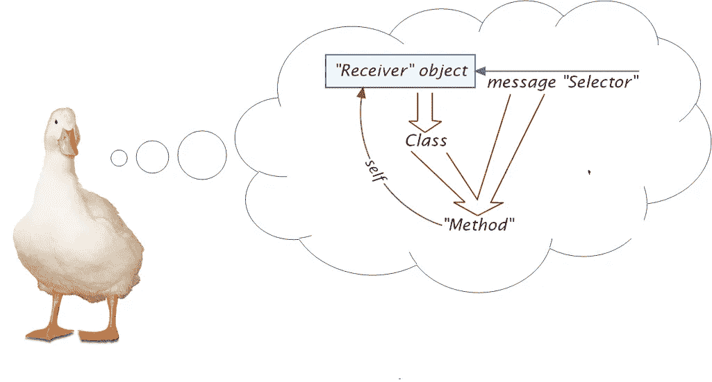
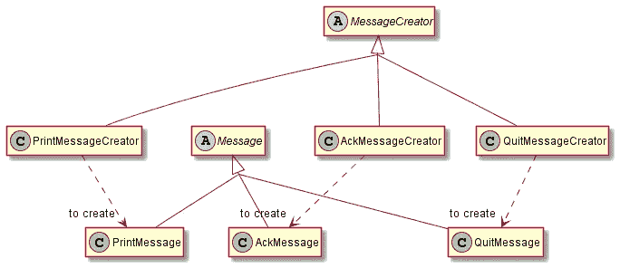
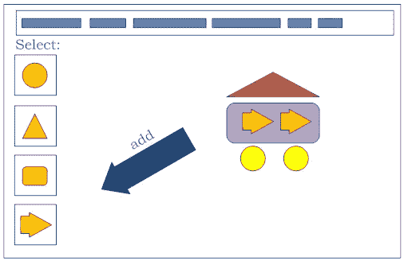

# Python 中的面向对象编程——第 4 课。一些无聊的设计模式

> 原文：<https://medium.com/codex/object-oriented-programming-in-python-lesson-4-some-boring-design-patterns-ee01a81030c3?source=collection_archive---------11----------------------->

这是五课系列中的第四课，总结了面向对象编程的实际需要，并介绍了面向对象语言提供的常用工具。这些例子是用 Python 编写的，强调了 Python 的实现和方法。在前面的章节中，我们学到了面向对象编程的基本词汇:功能*可替代性*——使用*消息*范例——的*对象*，其行为和数据封装在*类*中。然后，基于在实践中应用面向对象的设计必须*遵守*的观察，遵循已建立的习惯用法、模式和架构，我们深入研究了一些“重量级”多态设计模式应用的详细示例，集中在递归数据结构上。相比之下，第四课以低调的方式进行，考虑一些几乎每天都需要的次要设计模式，它们的实现在 Python 这样的动态“鸭式”语言中得到了简化。

## 本课中的部分:

1.  “动态可插入工厂”模式语言，按类型(基于“工厂方法”)
2.  “动态可插拔工厂”模式语言，举例来说(“基于原型”)
3.  “访问者”模式，重新审视。

## 1.“动态可插拔工厂”，按类型

一个完整的设计模式融合了两个视角。(1)从需求角度来看，设计模式是在*上下文*中对*问题*的*响应*。(2)从实现的角度来看，它是一种*模式*(顾名思义)，用于在空间中排列项目，向(潜在用户)建议功能。(我使用术语“项目”和“空间”，而不是“代码构造”和“程序”，以尊重建筑架构的原始设计模式，它启发了我们的软件设计模式)。除此之外，还有一个至关重要的约束:“重复一百万次，它(设计模式实现)将永远不会相同！”也就是说，一个诚实的设计模式可能永远不会被简化为一个通用的可重用工件，比如函数、类模板、基类等等。

然而，可悲的事实是，尽管后一种约束对于一些软件设计的结构化和多态模式(例如第 2 章中讨论的“复合”模式)来说确实是真实的，但是一些软件的规范设计模式却很难做到这一点。一些次要的设计模式可能——并且已经——被自动化了。软件的一些设计模式所应对的一些问题是依赖于平台的，是自己造成的。

“动态可插拔工厂”是一种*模式语言*，涉及三种模式——*工厂*、*单例、*和*工厂方法*——以及*注册*和*映射关键字到功能*的习惯用法。

例如，考虑一个*消息工厂*，它使应用程序能够以多种形式接收消息*(也就是说，不需要明确地知道具体接收了什么，并且有多种和无限的选择)。这个问题的复杂性的关键在于，在*面向对象的*范例中，“接收”这样的消息必须涉及*创建*一个自治的、封装的消息*对象*，这进一步要求预定义一个消息*类*，以及它的不止一个具体子类(考虑到消息类型的结构——以及可能的功能——多样性)。这个重要的架构并没有指出面向对象范例的不足。复杂性是问题领域固有的。面向对象的解释通过阐明和形式化其复杂性，促进精确处理，公正地对待问题。(相比之下，另一种选择是忽略复杂性，并且不可避免地浪费大量时间通过试错来找到它)。因此，给定消息 id 和原始消息块，消息工厂能够安静地创建正确消息类型的消息。*

*进入“注册”习语！*(只是“习语”——还没酷到配得上“设计模式”的称号)。

消息工厂的设计是 *open* (用于扩展)。使用每个消息 id 的消息创建者的*注册*从工厂中删除了所有可用的具体消息类型的知识。相反，将这种解决方案与“开关/案例”机制的原型替代方案进行比较，在该方案中，所有消息类型——以及原始消息布局和从块中序列化它们的能力——都必须预先知道，并且在使用上下文中显式。虽然这种替代方法对于小而有限的消息类型仍然有效，例如在 message-id *枚举中，*但它在现实世界的消息传递系统中没有用，在现实世界中，消息类型(及其处理)通常是由第三方动态添加的。因此，这里我们可能需要做的最后一件事就是硬编码消息类型、它们的布局和它们的创建过程！

术语“动态可插拔工厂”是由 John Vlissides(以“四人帮”闻名)在《面向对象编程杂志》的一篇文章中提出的，他详细阐述了规范的*抽象工厂*模式，引入了两个额外的特性:(1)它是*动态的*(特点是能够通过*添加*主题类型来创建)和(2) *可插拔的*(要创建的类型，以及它们的创建过程，是从之外的*中积累而来的)。*

*以下是动态可插拔工厂功能的总结:*

消息工厂将 *message-id* 映射到*“创建消息(给定原始消息块)的能力”*。特别是:

1.  消息工厂能够“创建消息”，使用消息 id 和消息块，给出消息对象。
2.  消息工厂能够“注册消息创建者”，使用 message-id 和一个(匿名)消息创建者。消息工厂不知道消息创建者和消息(后者创建的)的类型。

*输入“独生子女”！*

在哪里可以找到这个信息工厂？显然，我们的消息工厂必须是*Singleton*——另一种设计模式。作为单例意味着(1)只有一个，以及(2)它总是可访问的和准备好的(当需要的时候)。考虑一下允许多个消息工厂(每个工厂中有不同数量的消息创建者)的实现会导致什么样的混乱。显然，在一个健全的宇宙中，肯定只有一个消息工厂，而且它必须是全球性的 T21，对所有人都可用。

一个“单例”实体封装了一个全局可用的*资源*。在严格的(Pythonic 之前的)*面向对象的*解释中，它曾经被实现为一个*类*，该类保证有一个*实例*。为什么要达到这个长度——类、实例——而不是仅仅分配一个全局字典对象呢？虽然全局变量确实是全局可用的，但我们不能保证(在许多编程语言中)它将被完全初始化并在需要时可用(例如，在初始化时被另一个全局对象使用)。

与一些人的直觉相反，是第二个品质(需要时做好准备)——而不是第一个品质(只有一个这样的品质)造就了独生子女！例如，在基于应用程序框架的设计中，考虑应用程序。只有一个应用程序。但是应用程序的单一性(只有一个这样的)仍然不能使它成为单一的！这里不需要有保证的就绪机制，因为没有人从外部处理应用程序。相反，是应用程序从内部解决其他所有人的问题。并且不需要按需创建。应用程序是在程序入口点静态创建的，这已经足够好了。

*下面是单例功能的总结:*

1.  “Singleton”被实现为一个被限制(程序上)为单个实例的类。
2.  Singleton *类*能够显示 Singleton 实例。(是的，类本身就是一个对象，有自己的方法！)
3.  singleton 实例——类的隐藏成员(而不是任何对象)——由第一个访问请求初始化(通常，如果它不存在，通过测试)。
4.  此外，在必要的情况下，Singleton 实例可以是线程安全的(避免并发初始化，这可能导致多个“Singleton”实例的意外增长，其中只有一个实例是全局可用的)。

*进入“工厂法”！*

然后，一个*在消息工厂注册*到底是为了什么？在*消息创建器的必需功能背后隐藏着什么魔力？*完成模式语言的最后一个模式是“工厂方法”。一个*工厂方法*能够创建一个某种类型的对象，并且只能创建该类型的对象(并且该类型对于客户端来说是未知的)。拥有工厂方法使客户能够创建适当类型的对象，同时不必知道该类型是什么。(这可能很难解释，但在许多编程环境中是一个合理的要求)。显然，工厂方法自然适合动态可插拔工厂中“创建者”的角色。

非常不方便的是，在规范的工厂方法解决方案中，为了迎合强类型语言，所需的工厂方法必须形成与主题(例如，消息)层次结构平行的类层次结构。虽然在面向对象的解释中，每个消息必须作为一个类来实现，并且所有这些类必须从抽象类 message 中派生，但是我们必须在此之上添加一个*并行*消息创建者层次结构，每个创建者一个。

如前所述，这很麻烦！然而，在支持泛型的地方(例如，在 C++中)，使用适当的类模板基础结构，定义特定的消息创建者可以简化为一个宏调用。因此，这消除了(API 用户的)复杂性。

下面是一个用 Python“按常规”呈现动态可插拔消息工厂的(相当强迫的)尝试:

*脚注:*

1.  所有消息都以相同的标题开始。
2.  将从所有者消息中接收消息 id 和大小。
3.  数据大小供第三方使用(本例中未使用)。
4.  为了简单起见，消息被编码为具有固定大小字段的纯文本。
5.  抽象基础*消息*只负责报头。数据是特定于子类的。
6.  首先对报头进行序列化，然后是数据。缓冲区(在本例中)是由消息创建的。
7.  首先是头被反序列化，然后是数据。
8.  数据序列化是特定于子类的。
9.  数据反序列化是子类特定的。
10.  消息创建者可以创建一些消息。
11.  Get-id 用于注册。
12.  单例实例隐藏在类中。
13.  工厂方法创建者通过消息 id 注册。
14.  消息的创建会以静默方式委托给注册的创建者。
15.  单一实例是按需创建的。该实现不期望并发。
16.  消息队列存储消息缓冲区(而不是对象！)
17.  要存储的消息被反序列化。
18.  从存储的报头中提取消息 id。
19.  单体消息工厂使用 message-id 创建适当的消息。
20.  空消息从缓冲区序列化。

人们不必是 Python 专家，也能明显看出这种设计需要简化，去掉一些多余的细节。这又让我们看到，这种模式语言最初要解决的一些*小问题*是平台依赖的，是自己造成的！(不否认整个动态可插拔工厂问题本身的有效性和有用性！)

特别是，以下 Python 特性在这里可能会很有用:

1.  *模块*的可用性。Python 模块很容易满足单例的这两个要求。(1)只有一个这样的请求(不执行两次`import`请求)。以及(2)当从另一个模块寻址时，保证该模块被完全初始化(在此之前必须已经有一个`import`请求)，(递归导入循环除外，它无论如何都是无效的)。
2.  你可以把整个模块看作是单例的模块，或者是存在于模块内部的对象——两种方法都可以。在任何情况下，都不需要请求任何人*揭示*(并创建)实例！
3.  Python 中的*类*对象的可用性。当对象创建只是简单的初始化(使用提供的特定消息构造函数)时，类对象就足够了。实际上很少有必要去定义一个并行的创建者层次结构。

*这里是动态可插拔工厂的“本地”Python 渲染:*

*脚注:*

1.  邮件及其标题不受更改的影响。
2.  (单例)消息工厂被简化为一个字典对象。
3.  传入消息按其类型初始化，并在工厂对象中注册。
4.  消息创建者注册基于本机类型。未使用用户定义的创建者。

## 3.例如“动态可插拔工厂”

基于工厂方法的动态可插拔工厂解决了将消息 id 映射到消息对象的需要。因此，当输入(类型提示)和输出(该类型的某个对象)之间存在这种一对一的关联时，以及当默认情况下创建对象*时，这是很有用的。但是它没有解决创建对象的需要，尽管这些对象由输入提示决定，但不一定是不同的类型！我们可能需要使用一个工厂来通过示例填充我们的世界*:使用由*内容*以及*类型确定的对象！***

*后一种需求的一个例子是 GUI 工厂(动态的和可插拔的)，用于可视化地创建形状*，这意味着不(必须)按类型，但也按内容。这里的创建提示将是一个*图标*——一个可见的例子。图形编辑器的用户从工具箱拖动(复制)对象到画布。此外，用户还可以从画布中选择一个形状，并将其拖到工具箱中，从而添加另一个图标供选择。**

****

**在面向对象的解释中，这个例子必须由适当类型*和内容的对象支持！没有必要为这项工作开发工厂方法。操作对象已经装备了所有需要的东西。***

**在这个解决方案中，工厂注册对象(与要创建的对象类型相同)，通常响应`clone`，返回对象的副本(“克隆”)。**

## **4.“访问者”模式再探**

**其他可以用 Python 这样的鸭式语言简化的设计模式是高度多态的模式，如“访问者”模式，其中可替换性依赖于密集的继承层次。例如，这里是“访问者”模式的简化版本(在本系列的第 3 章中详细讨论)，集中在*接受/访问*循环上。**

**但首先，简单提醒一下。对形状的许多操作是可能的，由于某种原因，必须从外部进行。虽然这些功能涉及形状数据和可能的内在形状逻辑，但它们可能不是形状的方法，因为它们同样依赖于其他机器和基础设施，而这些机器和基础设施不是特定于形状的，并且是可配置的。例如，*显示形状*。虽然这种能力当然依赖于获得形状的尺寸并知道如何处理它们(例如，圆的半径)，但它还涉及显示技术的类型(矢量或像素图形)、屏幕分辨率、放大倍数、纵横比、字体的使用等等，这些都与形状无关，可以随意重新配置。**

**这个问题域的特点是*双多态*——形状的类型和它的操纵器的类型都是可替换的。但却是*不对称*。操纵者需要形状。事实上，所有的操纵器类型都需要预先知道所有的形状类型(以操纵它们中的每一个)。但是这些形状与操纵器指令无关，就他们所知，这些指令是不确定的。他们只是授予操纵器(这里称为“访问者”)访问权限，不管它是什么。**

**这个问题有不止一个既定的解决方案。这里我们应用传统的*面向对象*“访问者”模式，它使用了*双分派*的习语。访问者对形状的每个操作请求都包含两个多态消息:从访问者到形状和从形状到访问者。**

**首先，这是一个“按常规”的(相当强迫的)解决方案，其特点是一个`accept` 方法的*多态*实现。**

1.  **一个形状(它是任何形状的接口)能够接受一个“形状访问者”，无论后者能够进行什么操作。注意“Shape Visitor”是正向声明！(稍后将定义该类)。**
2.  **`accept`的具体 *Circle* 实现引导访问者访问该对象，揭示其作为一个圆的真实性质。**
3.  **“形状访问者”是任何形状操纵器的接口，能够*访问*每个已知的形状类型。(因此，所有形状类型都必须事先知道！)该方法是特定于子类的。**
4.  **“形状画家”是一个具体的形状访问者，以所有已知形状类型的具体`visit`方法为特色。**
5.  **要求形状绘制者绘制一个匿名形状(例如，一行中的一个)。它不需要知道形状的真实类型来完成这项工作(或者是吗？).它请求这个形状，不管它是什么，去*接受*它，这将最终以形状画家请求*访问*特定形状而结束。(因为形状知道自己的类型！)**
6.  **一个即时创建的形状绘制者被要求绘制一个形状——实际上是一个圆形，也是即时创建的。**

**这个*接受*方法的等级制度显然是多余的。所有的`accept` 方法都是相同的，唯一的区别是名称的形状类型部分。利用 Python 对元数据的轻松访问，我们可以将访问者方法选择功能集中在基本形状中，*如下:***

***脚注:***

1.  **虽然 Shape 只是一个接口，但是它没有抽象方法*,因此，在这里子类化 ABC 是没有意义的。***
2.  ***`accept`是基础形状的一个具体方法，它不意味着被子类形状覆盖。***
3.  ***在公共的 *accept* 中，构造了所需的访问者方法名(根据前缀“visit”和实际的类名)。尽管该方法在基本形状中是“硬编码”的，但在运行时，它将检索响应消息的实际形状的类，例如， *Circle* 。我们可以肯定它永远不会是*形状，因为*我们不打算创造这样的物体。***
4.  **这个解决方案不需要预先知道所有的形状类型，冒着尝试访问不支持的形状的风险！**
5.  **通用的 *accept* 方法从这个对象的字典中检索适当的函数(通过构造的名字)并使用这个对象激活它。**
6.  **在这个解决方案中，具体的形状不覆盖`accpet`！**
7.  **形状访问者及其实现不受更改的影响。**

**最后，给定这个简单的基于名称的运行时调度，整个双重调度策略就变得多余了！如果我们将分派机制从 Shape 中移除，并将其放入基本访问者中，我们最终会得到一个不关心访问者存在的 Shape 层次结构和一个关心发现其自身方法的 Shape 访问者层次结构。这是一个简单实用的面向对象的解决方案，其中每个对象都被限制在自己的职责范围内，从问题域中消除了跨层次的双重分派噪音。我们仍然有双重分派(我们在两次调用中到达所需的方法)，但是它隐藏在访问者层次结构中。**

***脚注:***

1.  **形状是无辜的所有知识的游客层次。**
2.  **调度现在位于抽象的基本访问者。**

## **5.接下来呢？**

**在前四课中，我们介绍了针对功能可替代性设计挑战的面向对象解决方案:消息范式，涉及将一条*消息*传递给一个*未知*类型的对象，在运行时由它的*类*中的*方法*(同名)解析。我们已经看到 Python 的“duck typing”是如何在任何非正式但语义上与*相关的*类型中实现可替换性的。为了强调根据既定实践进行面向对象设计和编程的重要性，我们经历了一些主要的设计模式，比如复合和访问者。然后，我们考虑了一些次要的设计模式，如动态可插拔工厂、单例模式和原型模式，利用 Python 对元数据的方便访问来简化它们的实现。在剩下的课程中，我们将考虑继承层次结构中不为人所知的过程方面，总结 Python 面向对象基础设施所带来的设计机会，并以我们开始的主题——也是整个系列的支柱——结束，讨论可替代性原则。**

## **本课程的课程:**

1.  **[可替代性和继承性](/codex/object-oriented-programming-in-python-lesson-1-substitutability-and-inheritance-e5c6661dfca5)**
2.  **[面向对象可替代性的荣耀:“复合”模式](/codex/object-oriented-programming-in-python-chapter-2-the-composite-pattern-4b7da542d5b0)**
3.  **[面向对象可替代性的限制:“访问者”模式](/codex/object-oriented-programming-in-python-chapter-3-the-visitor-pattern-d0b176d4807d)**
4.  ****一些无聊的设计图案** *←(你来了！)***
5.  **继承的限制**