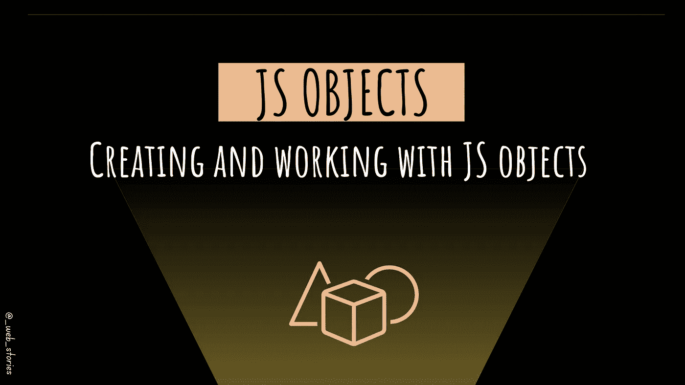

# JavaScript 中的对象

> 原文：<https://medium.com/codex/objects-in-javascript-64fa3e82765f?source=collection_archive---------14----------------------->

## 创建和使用 JS 对象

作者:FAM

## 你好👋

是时候学习 JavaScript 中的对象和方法了。

# JS 中的对象

在 JavaScript 中，对象是键值对的无序集合。每个键值对称为一个属性。