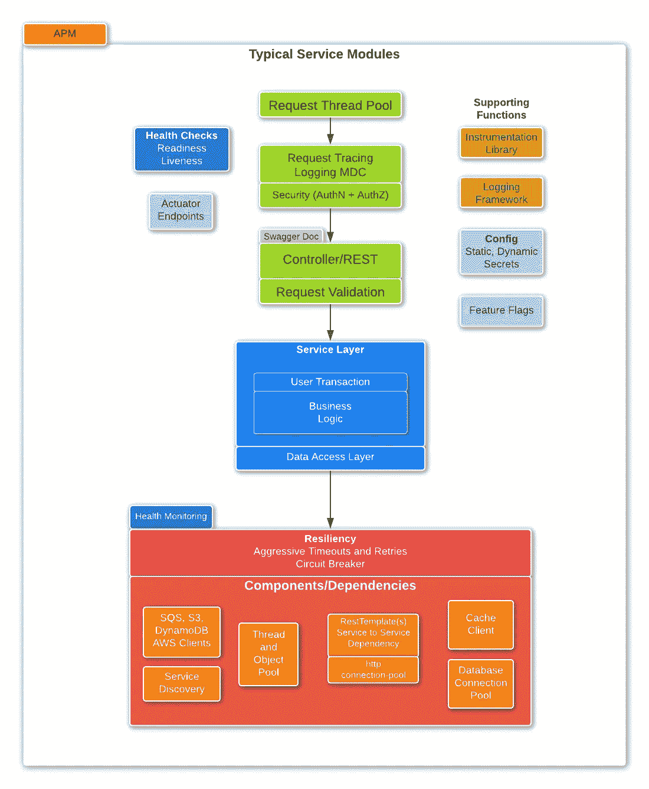
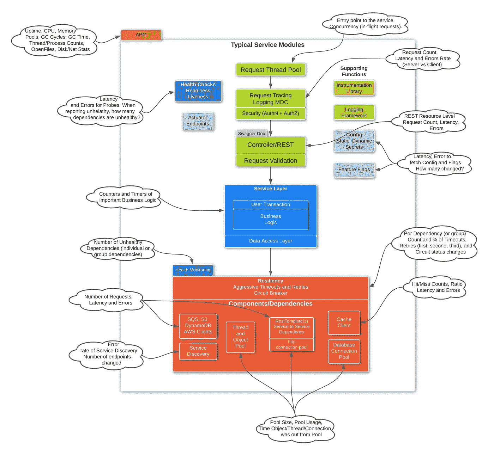

# 可观察的微服务

> 原文：<https://medium.com/codex/observable-microservice-59b6903acb49?source=collection_archive---------11----------------------->

通过在 APM、日志记录、指标报告和分布式跟踪之间使用正确的监控机制，使服务可观察需要适当的代码工具，覆盖服务内部工作的重要领域，以便快速识别和解决问题。在介绍各种监控机制的高级别时，我将特别关注指标测量，以了解服务的特定领域，从等式中排除猜测，并尽可能依赖数据点(指标)。

## 可观察的服务可以在以下方面提供帮助

*   减少检测问题的平均时间——对于许多微服务和对多个组件的依赖，事情会失败，我们需要能够快速识别问题。这里的目标应该是主动发现问题。
*   一旦您有了适当的工具，下一步将是定义正常情况是什么样子，并提出警告和错误阈值以及相应的警报，将它们与升级系统/流程集成，以获得采取任何纠正措施(自动或手动)的通知。
*   减少修复问题的平均时间，因为您有所有可用的数据点来查看和确定问题，这些数据点是构建和/或证明根本原因假设的重要数据点
*   构建控制面板，揭示有关使用、吞吐量、错误和延迟的重要指标，并根据服务的功能和相关组件对它们进行逻辑分组。

当您开始使服务(以及整个基础设施和软件系统)可观察之旅时，您最初的目标将是改善修复问题的平均时间，但是在您很好地处理这个问题之后，目标应该转移到改善检测的平均时间，并考虑实现这些目标需要什么工具。

# 典型服务有以下模块

我熟悉 Java，有使用 spring 框架进行 web 应用和服务开发的经验。下面的描述是针对基于 Java/Spring Framework(Spring boot，最近)的服务的，没有考虑非阻塞的实现模型，因此您需要根据您的情况相应地调整这里概述的要点。

典型服务模块

首先，让我们介绍一下每种检测机制的用法。我提到了 APM(应用程序性能管理)、度量和日志记录是使服务可观察的三种机制。

## 应用性能管理

APM 是一个通常基于代理的工具，它可以连接到主机/服务器，也可以连接到 java 进程，它为您提供了一个很好的监控起点。默认情况下，它将提供主机和 jvm 级别的指标，为您提供一个良好的开端。但是，单靠 APM 还不足以达到我们在提供可观察服务时所需要的可见性水平。正如您在上面的图表中所看到的，虽然获得 JVM“外壳”的细节是很好的，但是现在 APM 也让您可以看到请求级别的度量，如吞吐量、错误和延迟(红速率、错误、持续时间)。在这篇文章中，我的重点是介绍如何使用自定义指标添加工具。

## 记录

**系统日志:**分为不同类型的日志你的服务器和服务会产生，可以包括 Linux 系统日志(syslog，auth/secure，cron)，容器编排系统(Kubernetes，AWS ECS，AWS EKS)日志，数据库服务器日志。这些是服务器和您使用的其他软件生成的日志，是您的服务所必需的。确保您启用了正确的日志级别，通常是信息级别，至少是警告级别。

**访问日志:**假设我们在谈论一个通过 http、REST API 或 Web 应用程序公开的服务，服务将产生请求级访问日志。像 Tomcat、Jetty 这样的嵌入式或独立 Java 服务器会生成访问日志，但是要确保这些日志是启用的，它们会提供足够的细节来帮助您解决问题，并且它们还提供了很好的机制来理解负载/请求模式，以便更好地理解服务使用情况。

**应用程序日志:**应用程序日志是由服务产生的日志，由您在服务中使用的库产生的日志，更重要的是，是您编写的代码产生的日志。确保在生成日志时使用正确的日志级别，如跟踪、调试、信息、警告、错误、致命等，并由您使用的日志框架支持。在 Java 中，Java Util 日志、Log4J、Logback 和 slf4j(允许透明地切换底层日志框架的日志外观/抽象)是一个不错的选择。此外，选择支持映射诊断上下文(MDC)的日志记录框架，因为将 correlation-id 或 trace-id 传递给每个日志消息(通过日志模式配置自动传递)会变得非常有用，因为请求处理会经过服务实现中的各个层(如果处理正确，会跨多个服务)，从而为您提供所需的微服务、同步请求和异步工作流中的分布式系统的可见性。如果是基于 JVM 的应用程序，还应该考虑*垃圾收集*日志。

**分布式跟踪:**分布式跟踪是行业标准的跟踪(用户)请求的方式，因为它流经多个微服务来完成单个用户请求。分布式跟踪库有助于在服务内和跨服务传递跟踪上下文(如跟踪 Id 和 Span Ids ),以减轻常用框架显式传递这些上下文的负担。有一些工具建立在标准化的分布式跟踪机制之上，进一步提供跨许多微服务的世界视图，并有助于观察。当启用分布式跟踪时，我们可以包括分布式跟踪上下文中的跟踪 Id 和 Span Id，并将它们添加到您使用的日志记录框架的 MDC 中，以便在每个日志消息中都可以使用它们，然后通过利用用于分布式跟踪的相同跟踪 Id 以及您的应用程序日志来帮助连接这些点。

## 带有代码检测的自定义指标

除了在应用程序中添加适当级别的日志记录之外，为传入的请求捕获或生成 correlation-id 或 trace-id，并将其传递给服务内的下一层以及跨服务依赖项，这是有效地解决分布式系统设置中的问题所必需的。

虽然应用程序日志有助于连接各个点，并跟踪服务内和跨服务的请求执行流，但它应该*而不是*用于聚合(由于我们最终生成的日志的大小)日志并基于日志消息生成统计信息。我甚至认为，使用应用程序日志作为定制指标的替代来生成各种使用情况、吞吐量、错误、延迟统计数据是一种反模式，必须避免这种情况，并且生成具有适当级别(信息、警告、错误)的日志，并保持日志量可管理。这就是我们需要通过显式检测代码来创建自定义指标的地方。鉴于这些指标的重要性，成熟的库现在会自动生成这些指标，但我们需要捕获这些指标，并将其传递给从整个基础架构中收集指标(Prometheus、Graphite、Collectd、AWS CloudWatch)的系统，以便我们可以在仪表板中查询和可视化相关指标，使仪表板成为监控服务运行状况和进行故障排除的地方。

# 每个服务模块的自定义指标

在这一节中，我将分享我的观点，即一个可观察的服务应该获取哪些重要的指标，从服务器、JVM 开始，并讨论组成服务的重要模块。

## 计算机网络服务器

捕获服务器/主机指标和统计数据，以查看服务器是否正常。除了标准的正常运行时间、CPU、内存、磁盘和网络统计数据之外，请确保捕获数据包丢弃、TCP 连接打开/重置计数、进程计数和打开文件计数，以便这两项中的任何峰值可以帮助识别该服务器上运行的服务之外的问题。如果您已经正确安装和配置了 APM，那么这些指标中的一些或大部分应该是默认可用的。

*   **正常运行时间**
*   **CPU** :负载平均，利用率(用户，系统)
*   **内存**:已用，可用，交换使用
*   **磁盘统计数据** : I/O 请求、延迟、磁盘空间使用情况
*   **网络统计** : TCP/UDP 连接打开和重置计数、数据包丢弃计数、带宽使用
*   **流程**:计数
*   **打开文件**:计数

## 虚拟机（Java Virtual Machine 的缩写）

JVM(替换为其他运行时，如。NET)级别的指标有助于了解与服务器级别类似的一组指标，但更多的是从应用程序/服务的单个流程的角度。除了标准的正常运行时间、CPU、内存、线程(不是进程)之外，确保捕获 JVM 的单个内存池的详细信息(至少分为堆内存和非堆内存)，以及垃圾收集统计信息。您还可以通过查看某些 JMX mbean 的属性来扩展 JVM 指标(以前使用的机制，用于公开要用 JConsole 或 JVM 监控的重要指标)。

*   **正常运行时间**
*   **CPU** :利用率(用户，系统)
*   **内存**:按池(堆、非堆、其他)-已用、可用
*   **垃圾收集统计**:完全垃圾收集、并行垃圾收集计数和时间
*   **线程**:总数、活动、守护进程
*   **其他** : JMX 控制台 MBeans

## HTTP/请求

主要有两(或三)种类型的服务，RESTful (HTTP)服务、异步/事件消费者和第三批(一些基于频率)处理。在本节中，我们指的是为网络/移动/设备应用程序或生态系统中的其他微服务提供资源/端点的服务。在本节中，重点是捕获传入请求的高级细节、服务提供的延迟，以及查看错误分解。

*   **最小、空闲和最大请求线程**:计数
*   **进行中的请求**:忙请求线程计数-请求线程使用率%
*   **排队请求**:当请求线程池耗尽时，一些请求可能会排队(取决于 Web 服务器配置)
*   **吞吐量**:每分钟或每秒接收的请求数
*   **延迟:**平均值、百分位数、标准偏差
*   **误差** : *计数和速率*。更一般地说，响应计数按响应状态(2xx、3xx、4xx、5xx)划分为*成功*、*客户端错误*和*服务器错误*

*其他注意事项:*假设您使用正确的 http 状态代码，您可能希望将 401、403 与 404 分开，并将 502 和 504(相关系统的错误)与服务器的内部 500 错误分开。根据您的特定场景和成熟度，可能没有必要对单个 http 状态代码进行单独计数。

**如果您使用应用程序性能监控(APM)工具/代理，服务器、JVM 和 HTTP/Request** 级别的指标应该是现成可用的。

## 剩余资源

按照服务支持的每个“REST 资源”,遵循三个标准。例如，URL 中的第一级 API 路由或上下文路径。您可以通过请求 HTTP 方法进一步划分吞吐量、延迟和错误，GET、put、POST、PATCH、delete 基本上与资源的 get/search、create、update、DELETE 一致。

*   **吞吐量**:每分钟或每秒的请求数
*   **延迟**:平均值、百分位数、标准偏差
*   **错误** : *计数和评级* -按响应代码、成功、客户端错误和服务器错误

*其他考虑事项:* 如果您有**批处理 API** 调用，您可能想要分别捕获批处理请求的吞吐量、延迟和*部分成功/错误*。此外，还要获取额外的统计数据/指标，以了解批次的**大小(发送或接收)。这对于更好地理解批处理 API 的使用以及与延迟影响相对应的批处理大小的突然变化非常重要。对于批量大小，您可能希望使用有意义的直方图/桶或平均值和百分点值，以获得适当的可见性。**

## 健康检查

Container orchestration systems 希望有两种不同类型的探测器，一种用于检查服务的可用性，另一种用于检查服务的准备情况。活性探测指的是服务是否启动和运行，准备就绪探测指的是服务(及其所需的依赖性)是否处于健康状态以服务于流量。当观察到下游所需的依赖性问题时，适当地实现这些探测是避免容器不必要地重启(由于被标记为不健康)的关键。

*   **活性探针**:该探针的延迟、成功和错误
*   **就绪探针**:该探针的延迟、成功和错误

对于失败的案例，附加指标。例如，有问题的必需依赖项的数量，有问题的可选依赖项的数量

## 动态配置

总的来说，动态配置就像任何其他依赖项一样，但是还捕获了多少配置发生了变化。这样，您就可以将数据点放入仪表板，这在您试图关联事件时会很方便。

## 跳回

使用弹性框架来包装对依赖系统的下游调用，对于处理故障和偶尔出现的依赖导致的较慢响应时间非常重要。按照依赖关系或逻辑*依赖关系组*捕获以下统计信息*。*

*   **吞吐量**:每分钟或每秒钟的请求数
*   **延迟**:平均值、百分位数、标准偏差
*   **错误** : *计数和速率*，客户端或服务器错误，是否可重试错误。

**超时和重试次数**

*   **超时** : *超时请求的计数和比率/百分比*。
*   **重试次数** : 1 次重试，2 次重试，3 次重试。*经历不同重试次数的请求的计数和百分比*。(您必须设置一些最大尝试/重试次数限制，因此要相应地捕捉这些限制)

*其他考虑:*此外，划分重试次数，并在“可重试错误”的情况下获取“重试原因”(取决于依赖项的响应代码和您自己的错误场景)

**断路器**

*   **断路** : *统计每分钟断路事件的*
*   **电路闭合** : *统计每分钟电路闭合事件的*

*附加考虑:*您想要捕捉电路断开和闭合之间经过的时间。断路器状态也应该反映在您的运行状况检查中(特别是就绪状态探测)，这样，如果您所需的依赖关系不正常，电路已经跳闸，您就不希望回收容器/服务器，因为重新启动服务节点不会有助于恢复，相反，如果在这种情况下，由于配置错误的就绪状态探测而导致服务节点重新启动，服务节点重新启动的影响将损害下游依赖关系的整体恢复。

## 对象池-线程、Http/数据库连接或对象

线程、连接和对象池是重用创建成本高对象/资源的优化技术。因此，我们不需要创建新的线程、连接和对象，我们只需要创建池并从池中使用它们，完成后返回。密切关注这些池的使用情况，看它们是否达到了最大容量，或者是否不必要地设置了较高的值，这为优化提供了机会。

*   **池大小**:最小计数、最大计数、空闲计数、当前计数
*   **池使用情况**:池已用百分比，池外对象的百分比。
*   **使用时间**:对象、连接留在池外的时间——捕获平均值、百分位数、标准偏差

## 隐藏物

向服务添加缓存层以减少数据库负载并提高性能是常见的做法。了解和设计您的应用程序是否可以在没有缓存的情况下工作，或者是否需要缓存，并确保其可用性(例如断路器状态)正确反映在服务的就绪性检查中，这一点非常重要。

*   **缓存使用**:命中和未命中计数
*   **缓存命中-未命中比率:** %以上命中和未命中计数
*   **延迟**:平均值、百分位数、标准偏差
*   **错误**:计数和速率

## 异步/事件消费

微服务之间的异步交互(使用像 SQS 这样的排队系统，或者像 Kafka 这样的消息系统)是分布式系统中的最佳实践，以将组件彼此解耦，并且仍然实现期望的最终一致性，或者处理长时间运行或批处理过程。应该获取以下指标，以便了解需要异步完成的工作的状态。

*   **积压大小**:队列或卡夫卡主题的积压大小
*   **正在使用的消息年龄**:始终在消息中保留事件时间戳，并计算消息年龄的平均值、百分位数和标准偏差(当前/使用时间减去事件时间)
*   **吞吐量**:每分钟消耗消息的速率
*   **延迟** : *消费系统收到*消息后处理该消息所需的时间。平均值、百分位数、标准偏差。不要与信息时代相混淆。
*   **错误**:处理报文的*计数和速率*

如果您配置了死信队列，您应该通过获取上述 DLQ 指标来扩展对其完整性的可见性。在您使用的队列和消息传递系统中，默认情况下应该可以使用上述一些指标，但是获取消息处理的年龄、吞吐量、错误率和延迟是了解消费系统运行状况的关键。

在延迟、年龄和其他类似指标的情况下，您可能希望捕获最小值、最大值以及其他百分点，如 p50(中值)、p80、p95、p99，以便进一步了解性能特征。

# 仪器，仪器，仪器

在缺乏良好的代码工具来将应用程序内部工作/健康的重要方面作为度量标准进行测量的情况下，我看到一些团队试图利用应用程序/访问日志作为一种方式来找出一些细节，而这些细节本来可以使用度量标准轻松(快速)地获得。

平衡度量和日志使用，两者都有特定的用途，在某些情况下会有模糊的界限。如果您正在捕获错误，将它们分成逻辑组(例如，客户端或服务器错误)，您不需要为您可能抛出的每个异常添加度量，从度量的角度来看，这可能是多余的，我会依靠应用程序错误日志来获得该级别的详细信息。另一方面，转储每分钟的日志条目(例如，请求、延迟和错误(以及其他领域的类似统计信息/数据点))也不是日志的好用途。我们的目标是在仪表板中提供“足够多的细节”,让您了解服务的健康状况，如果不健康，是哪个区域或依赖项导致了问题。

一开始，来自服务所有模块的度量可能看起来势不可挡，但是当在一个中心位置(在框架级别)正确完成时，检测您的代码以产生这些度量应该不会太困难或太耗时。收集这些指标不会增加任何明显的处理或内存开销，因为其中大多数是计数器、平均值和百分位数计算，这些计算在应用指标测量库中有效完成(例如，[微米](https://micrometer.io/))。一旦您使用工具并与第三方库集成来捕获这些指标，如果您的服务级别目标和协议仅基于 p95 或 p99，您可能最终会决定放弃 p50、p80 等特定度量。成为监控基础架构的好公民非常重要，确保您只报告您的每个环境中绝对必要的内容，以帮助监控基础架构的可持续性和成本。在性能测试环境中，当您正在调整服务的特定方面并试图评估(和证明)其影响时，详细级别的度量可能是有用的。然而，对于生产环境，您可以决定放弃某些度量。如果您能够动态地打开/关闭详细的指标报告*，对于您需要更多详细信息来解决问题的情况，这可能就足够了。*

*总体目标是确保软件系统的构建块(一个服务)具有适当的可观察性级别，涵盖服务器、JVM、传入请求、其自身内部以及依赖性的指标，这有助于实现减少检测服务本身的平均时间和解决服务本身问题的平均时间的目标。单独对一个服务或组件的健康和内部有良好的可见性是好的，但这绝不足以使您的整个软件系统更容易被观察到。对软件系统的其他组件和相关组件(缓存服务器、数据库服务器、负载平衡器、网络、安全、存储层)重复此操作，这将使您的整个系统变得可观察，从而缩短检测和修复整个基础架构和系统的平均时间，提高稳定性，从而提高整体可用性/正常运行时间，使您的客户(因此，公司中的每个人)都感到满意。*

*根据您的具体架构——整体架构、微服务或事件驱动架构——部署设置——基于服务器、容器、无服务器/功能部署，以及阻塞或非阻塞流量服务方式的使用，您测量的方式和内容会有所不同，但关键是要仔细考虑每个领域，通过公开指标获得正确的可见性级别，在正确的仪表板上提供正确的指标，设置符合 SLO 承诺的警报，并将其与上报流程集成，以便进一步发展。*

*请在评论中让我知道你的想法。我很乐意学习其他人在这方面的观点和经验。*