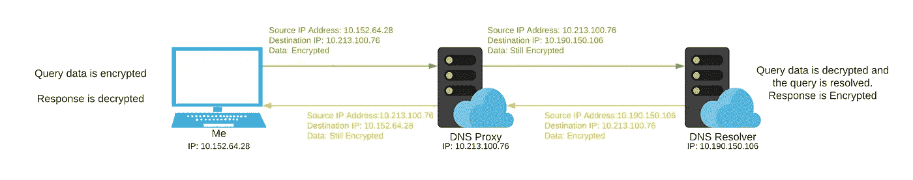

# 被遗忘的 DNS 提高了隐私并与中情局保持一致

> 原文：<https://medium.com/codex/odoh-boosting-privacy-and-aligning-with-cia-ec6f19ca8cb9?source=collection_archive---------5----------------------->

## [法典](http://medium.com/codex)

## 私有 DNS 的未来就在这里！

更改您的 DNS 提供商是升级您在互联网上的隐私和安全设置的一个非常简单的步骤。自从互联网诞生以来，DNS 一直是我们网络安全的最大弱点。DNS 一直是通过明文测试进行通信的，这意味着任何观看网络的人都可以读取这个流量。最近在 2020 年底，Cloudflare 发布了对 ODOH(HTTPS 上的遗忘 DNS)的支持，这是保护我们的 DNS 流量的最新尝试。

标准 DNS 协议中增加了许多内容来提高其安全性。其中包括 DoH(HTTPS 域名系统)、DoT(顶级域名系统域名系统)和 DNSSEC。每一种都有其优点和缺点。例如，卫生部在 HTTPS 推行 DNS 查询。这意味着查询都是加密的，并通过端口 443 流动。这是伟大的，直到你想能够监测您的网络中的 DNS 查询。系统管理员遇到过这个问题。因此，DoT 是一个很好的解决方案，因为您将能够更改 DNS TLS 流量流经的端口，并且您可以监控此流量。

这些都是很好的解决方案，因为它们为您的数据提供了加密。唯一的问题是我们从 VPN 中得到的一个类似的问题。当您向 DNS 提供商发送数据时，该提供商可以看到信息来自谁。DNS 提供商需要这些信息，因为他们需要知道将响应发送到哪里。然而，大多数 DNS 服务器不一定像 VPN 提供商那样有零日志记录的压力。

当你购买一个设备，一个路由器，一部电话，任何直接连接到互联网的东西。它将默认使用网络提供商的 DNS。这当然是一个问题，因为这些公司是为了赚钱而建立的，而不是为了保护个人数据隐私。

然后，您进行的所有查询都可以被记录、出售或被要求查询日志的政府获取。DNS 提供商大部分时间都在提供免费服务，所以他们需要在某个地方赚钱，服务器和服务的运营成本很高。

这就是奥多的用武之地。到目前为止，使用以前的技术，他们已经加密了传输中的数据，但是 DNS 提供商已经能够看到数据和请求数据的设备。ODoH 的目标是分割这两个元素，这样 DNS 解析器只能看到数据，但不知道它来自谁。

这就是它的工作原理，

假设我想去 google.com 的 T2。在 ODoH 之前，我的电脑会直接向 DNS 解析器发送请求。DNS 解析器将接收该查询，并以服务器位置的回答作为响应。如您所见，DNS 解析器现在既有我的查询信息，也有设备信息。

标准 DNS 查询

现在对于奥多，我们在中间引入了一个代理服务器。

我仍然发送一个查询包，它是加密的，这样外界就看不到这个查询。一旦它到达代理服务器，它就将仍然加密的查询转发给 DNS 解析器。注意代理服务器无法查看加密的数据。

查询到达 DNS 解析器，解析器解密数据，加密查询响应，并将其发送回代理服务器。然后，查询响应从代理服务器转发给我，我可以在这里解密数据。

奥多，下一代域名系统

这是执行 DNS 查询的更安全的方式，因为它将数据和设备信息分开。代理服务器只能在解析器看不到的地方看到我们的设备，而解析器只能在代理服务器看不到的地方看到数据。

我期待这成为 DNS 解析的一个标准。这一过程提供了中情局三位一体的核心要素:

**保密性**:只有 DNS 解析器可以打开数据，但不知道它最初来自哪里

**完整性**:数据已经加密，在传输过程中不会改变。

**可用性**:查询将能够被解析，DNS 解析器将无法阻止特定的人/设备，因为他们不知道请求来自哪里。